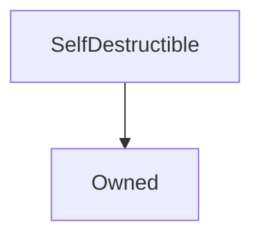

# SelfDestructible

## Description

SelfDestructible allows an inheriting contract to be destroyed by its owner, who must [announce an intention to destroy it](#initiateselfdestruct), and then wait for a four week cooling-off period before it can be [destroyed](#selfdestruct). Any ether remaining in the contract at this time is forwarded to [a nominated beneficiary](#selfdestructbeneficiary).

**Source:** [contracts/SelfDestructible.sol](https://github.com/Synthetixio/synthetix/tree/develop/contracts/SelfDestructible.sol)

## Architecture

---
### Inheritance Graph

## Constants

---
### `SELFDESTRUCT_DELAY`

[Source](https://github.com/Synthetixio/synthetix/tree/develop/contracts/SelfDestructible.sol#L9)

**Type:** `uint256`

## Events

---
### `SelfDestructBeneficiaryUpdated`

[Source](https://github.com/Synthetixio/synthetix/tree/develop/contracts/SelfDestructible.sol#L70)

The self destruct beneficiary was changed to the indicated new address.

**Signature:** `SelfDestructBeneficiaryUpdated(address newBeneficiary)`

- `(address newBeneficiary)`

---
### `SelfDestructed`

[Source](https://github.com/Synthetixio/synthetix/tree/develop/contracts/SelfDestructible.sol#L68)

The contract was destroyed, forwarding the ether on to the [beneficiary](#selfdestructbeneficiary).

**Signature:** `SelfDestructed(address beneficiary)`

- `(address beneficiary)`

---
### `SelfDestructInitiated`

[Source](https://github.com/Synthetixio/synthetix/tree/develop/contracts/SelfDestructible.sol#L69)

Self destruction was initiated with the indicated delay time.

**Signature:** `SelfDestructInitiated(uint selfDestructDelay)`

- `(uint256 selfDestructDelay)`

---
### `SelfDestructTerminated`

[Source](https://github.com/Synthetixio/synthetix/tree/develop/contracts/SelfDestructible.sol#L67)

Self destruction was terminated by the contract owner.

**Signature:** `SelfDestructTerminated()`

- `()`

## Function (Constructor)

---
### `constructor`

[Source](https://github.com/Synthetixio/synthetix/tree/develop/contracts/SelfDestructible.sol#L16)

??? example "Details"

    **Signature**

    `()`

    **State Mutability**

    `nonpayable`

    **Requires**

    * [require(..., Owner must be set)](https://github.com/Synthetixio/synthetix/tree/develop/contracts/SelfDestructible.sol#L18)

    **Emits**

    * [SelfDestructBeneficiaryUpdated](#selfdestructbeneficiaryupdated)

## Functions (Internal)

---
### `constructor`

[Source](https://github.com/Synthetixio/synthetix/tree/develop/contracts/SelfDestructible.sol#L16)

??? example "Details"

    **Signature**

    `()`

    **State Mutability**

    `nonpayable`

    **Requires**

    * [require(..., Owner must be set)](https://github.com/Synthetixio/synthetix/tree/develop/contracts/SelfDestructible.sol#L18)

    **Emits**

    * [SelfDestructBeneficiaryUpdated](#selfdestructbeneficiaryupdated)

## Functions (onlyOwner)

---
### `initiateSelfDestruct`

[Source](https://github.com/Synthetixio/synthetix/tree/develop/contracts/SelfDestructible.sol#L39)

??? example "Details"

    **Signature**

    `initiateSelfDestruct()`

    **State Mutability**

    `nonpayable`

    **Modifiers**

    * [onlyOwner](#onlyowner)

    **Emits**

    * [SelfDestructInitiated](#selfdestructinitiated)

---
### `selfDestruct`

[Source](https://github.com/Synthetixio/synthetix/tree/develop/contracts/SelfDestructible.sol#L60)

??? example "Details"

    **Signature**

    `selfDestruct()`

    **State Mutability**

    `nonpayable`

    **Requires**

    * [require(..., Self Destruct not yet initiated)](https://github.com/Synthetixio/synthetix/tree/develop/contracts/SelfDestructible.sol#L61)

    * [require(..., Self destruct delay not met)](https://github.com/Synthetixio/synthetix/tree/develop/contracts/SelfDestructible.sol#L62)

    **Modifiers**

    * [onlyOwner](#onlyowner)

    **Emits**

    * [SelfDestructed](#selfdestructed)

---
### `setSelfDestructBeneficiary`

[Source](https://github.com/Synthetixio/synthetix/tree/develop/contracts/SelfDestructible.sol#L28)

??? example "Details"

    **Signature**

    `setSelfDestructBeneficiary(address payable _beneficiary)`

    **State Mutability**

    `nonpayable`

    **Requires**

    * [require(..., Beneficiary must not be zero)](https://github.com/Synthetixio/synthetix/tree/develop/contracts/SelfDestructible.sol#L29)

    **Modifiers**

    * [onlyOwner](#onlyowner)

    **Emits**

    * [SelfDestructBeneficiaryUpdated](#selfdestructbeneficiaryupdated)

---
### `terminateSelfDestruct`

[Source](https://github.com/Synthetixio/synthetix/tree/develop/contracts/SelfDestructible.sol#L49)

??? example "Details"

    **Signature**

    `terminateSelfDestruct()`

    **State Mutability**

    `nonpayable`

    **Modifiers**

    * [onlyOwner](#onlyowner)

    **Emits**

    * [SelfDestructTerminated](#selfdestructterminated)

## Variables

---
### `initiationTime`

[Source](https://github.com/Synthetixio/synthetix/tree/develop/contracts/SelfDestructible.sol#L11)

The timestamp at which the self destruction was begun.

**Type:** `uint256`

---
### `selfDestructBeneficiary`

[Source](https://github.com/Synthetixio/synthetix/tree/develop/contracts/SelfDestructible.sol#L14)

The address where any lingering eth in this contract will be sent.

**Type:** `address`

---
### `selfDestructInitiated`

[Source](https://github.com/Synthetixio/synthetix/tree/develop/contracts/SelfDestructible.sol#L12)

True iff the contract is currently undergoing self destruction.

**Type:** `bool`

