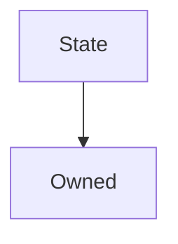

# State

## Description

An external state contract whose functions can only be called by an [associated controller](#associatedcontract) if modified with [`onlyAssociatedContract`](#onlyassociatedcontract).

This is designed to allow behaviour to be decoupled from storage so that upgrades can be made without losing data.

**Source:** [contracts/State.sol](https://github.com/Synthetixio/synthetix/tree/v2.21.15contracts/State.sol)

## Architecture

---
### Inheritance Graph

## Variables

---
### `associatedContract`

[Source](https://github.com/Synthetixio/synthetix/tree/v2.21.15contracts/State.sol#L11)

The address (presumably a contract) which is permitted to use functions on this contract which have the [`onlyAssociatedContract`](#onlyassociatedcontract) modifier.

**Type:** `address`

## Modifiers

---
### `onlyAssociatedContract`

[Source](https://github.com/Synthetixio/synthetix/tree/v2.21.15contracts/State.sol#L31)

Reverts the transaction if the `msg.sender` is not the [associated contract](#associatedcontract). Provided for use by inheriting contracts.

## Function (Constructor)

---
### `constructor`

[Source](https://github.com/Synthetixio/synthetix/tree/v2.21.15contracts/State.sol#L13)

??? example "Details"

    **Signature**

    `(address _associatedContract)`

    **State Mutability**

    `nonpayable`

    **Requires**

    * [require(..., Owner must be set)](https://github.com/Synthetixio/synthetix/tree/v2.21.15contracts/State.sol#L15)

    **Emits**

    * [AssociatedContractUpdated](#associatedcontractupdated)

## Functions (Internal)

---
### `constructor`

[Source](https://github.com/Synthetixio/synthetix/tree/v2.21.15contracts/State.sol#L13)

??? example "Details"

    **Signature**

    `(address _associatedContract)`

    **State Mutability**

    `nonpayable`

    **Requires**

    * [require(..., Owner must be set)](https://github.com/Synthetixio/synthetix/tree/v2.21.15contracts/State.sol#L15)

    **Emits**

    * [AssociatedContractUpdated](#associatedcontractupdated)

## Functions (onlyOwner)

---
### `setAssociatedContract`

[Source](https://github.com/Synthetixio/synthetix/tree/v2.21.15contracts/State.sol#L24)

??? example "Details"

    **Signature**

    `setAssociatedContract(address _associatedContract)`

    **State Mutability**

    `nonpayable`

    **Modifiers**

    * [onlyOwner](#onlyowner)

    **Emits**

    * [AssociatedContractUpdated](#associatedcontractupdated)

## Events

---
### `AssociatedContractUpdated`

[Source](https://github.com/Synthetixio/synthetix/tree/v2.21.15contracts/State.sol#L38)

The associated contract was updated by the owner. This event reports the new associated contract.

**Signature:** `AssociatedContractUpdated(address associatedContract)`

- `(address associatedContract)`

