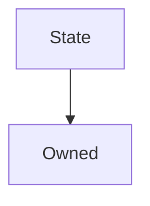

# State

**Source:** [contracts/State.sol](https://github.com/Synthetixio/synthetix/tree/develop/contracts/State.sol)

## Architecture

### Inheritance Graph

---

## Variables

---

### `associatedContract`
[Source](https://github.com/Synthetixio/synthetix/tree/develop/contracts/State.sol#L11)

**Type:** `address`

## Functions

---

### `setAssociatedContract`
[Source](https://github.com/Synthetixio/synthetix/tree/develop/contracts/State.sol#L24)

??? example "Details"

    **Signature**

    `setAssociatedContract(address _associatedContract) external`

    **Modifiers**

    * [onlyOwner](#onlyowner)

    **Emits**

    * [AssociatedContractUpdated](#associatedcontractupdated)

---

## Modifiers

---

### `onlyAssociatedContract`
[Source](https://github.com/Synthetixio/synthetix/tree/develop/contracts/State.sol#L31)

---

## Events

---

### `AssociatedContractUpdated`
[Source](https://github.com/Synthetixio/synthetix/tree/develop/contracts/State.sol#L38)

- `(address associatedContract)`

---

