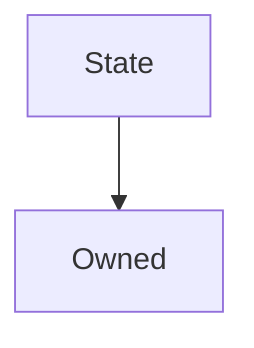

# State

## Description

An external state contract whose functions can only be called by an [associated controller](#associatedcontract) if modified with [`onlyAssociatedContract`](#onlyassociatedcontract).


This is designed to allow behaviour to be decoupled from storage so that upgrades can be made without losing data.


**Source:** [contracts/State.sol](https://github.com/Synthetixio/synthetix/tree/develop/contracts/State.sol)

## Architecture


---
### Inheritance Graph



## Variables


---
### `associatedContract`

<sub>[Source](https://github.com/Synthetixio/synthetix/tree/develop/contracts/State.sol#L11)</sub>


The address (presumably a contract) which is permitted to use functions on this contract which have the [`onlyAssociatedContract`](#onlyassociatedcontract) modifier.


**Type:** `address`

## Functions


---
### `constructor`

Initialises the associated contract and the owner, who has the exclusive right to switch the associated contract.


??? example "Details"


```
**Signature**

`constructor(address _owner, address _associatedContract)`

**Superconstructors**

* [`Owned(_owner)`](Owned.md#constructor)

**Emits**

* [`AssociatedContractUpdated(_associatedContract)`](#associatedcontractupdated)
```


---
### `setAssociatedContract`

<sub>[Source](https://github.com/Synthetixio/synthetix/tree/develop/contracts/State.sol#L24)</sub>


Allows the contract's owner to update the [associated contract](#associatedContract).


??? example "Details"

    **Signature**

    `setAssociatedContract(address _associatedContract) external`

    **Modifiers**

    * [onlyOwner](#onlyowner)

    **Emits**

    * [AssociatedContractUpdated](#associatedcontractupdated)

## Modifiers


---
### `onlyAssociatedContract`

<sub>[Source](https://github.com/Synthetixio/synthetix/tree/develop/contracts/State.sol#L31)</sub>


Reverts the transaction if the `msg.sender` is not the [associated contract](#associatedcontract). Provided for use by inheriting contracts.


## Events


---
### `AssociatedContractUpdated`

<sub>[Source](https://github.com/Synthetixio/synthetix/tree/develop/contracts/State.sol#L38)</sub>


The associated contract was updated by the owner. This event reports the new associated contract.


**Signature:** `AssociatedContractUpdated(address associatedContract)`


- `(address associatedContract)`

