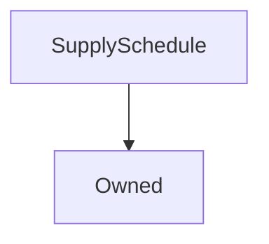

# SupplySchedule

**Source:** [contracts/SupplySchedule.sol](https://github.com/Synthetixio/synthetix/tree/develop/contracts/SupplySchedule.sol)

## Architecture

### Inheritance Graph

---

## Variables

---

### `lastMintEvent`
[Source](https://github.com/Synthetixio/synthetix/tree/develop/contracts/SupplySchedule.sol#L23)

**Type:** `uint256`

---

### `weekCounter`
[Source](https://github.com/Synthetixio/synthetix/tree/develop/contracts/SupplySchedule.sol#L26)

**Type:** `uint256`

---

### `minterReward`
[Source](https://github.com/Synthetixio/synthetix/tree/develop/contracts/SupplySchedule.sol#L29)

**Type:** `uint256`

---

### `INITIAL_WEEKLY_SUPPLY`
[Source](https://github.com/Synthetixio/synthetix/tree/develop/contracts/SupplySchedule.sol#L33)

**Type:** `uint256`

---

### `synthetixProxy`
[Source](https://github.com/Synthetixio/synthetix/tree/develop/contracts/SupplySchedule.sol#L36)

**Type:** `address payable`

---

### `MAX_MINTER_REWARD`
[Source](https://github.com/Synthetixio/synthetix/tree/develop/contracts/SupplySchedule.sol#L39)

**Type:** `uint256`

---

### `MINT_PERIOD_DURATION`
[Source](https://github.com/Synthetixio/synthetix/tree/develop/contracts/SupplySchedule.sol#L42)

**Type:** `uint256`

---

### `INFLATION_START_DATE`
[Source](https://github.com/Synthetixio/synthetix/tree/develop/contracts/SupplySchedule.sol#L44)

**Type:** `uint256`

---

### `MINT_BUFFER`
[Source](https://github.com/Synthetixio/synthetix/tree/develop/contracts/SupplySchedule.sol#L45)

**Type:** `uint256`

---

### `SUPPLY_DECAY_START`
[Source](https://github.com/Synthetixio/synthetix/tree/develop/contracts/SupplySchedule.sol#L46)

**Type:** `uint8`

---

### `SUPPLY_DECAY_END`
[Source](https://github.com/Synthetixio/synthetix/tree/develop/contracts/SupplySchedule.sol#L47)

**Type:** `uint8`

---

### `DECAY_RATE`
[Source](https://github.com/Synthetixio/synthetix/tree/develop/contracts/SupplySchedule.sol#L50)

**Type:** `uint256`

---

### `TERMINAL_SUPPLY_RATE_ANNUAL`
[Source](https://github.com/Synthetixio/synthetix/tree/develop/contracts/SupplySchedule.sol#L53)

**Type:** `uint256`

## Functions

---

### `constructor`
[Source](https://github.com/Synthetixio/synthetix/tree/develop/contracts/SupplySchedule.sol#L55)

??? example "Details"

    **Signature**

    `(address _owner, uint256 _lastMintEvent, uint256 _currentWeek) public`

    **Modifiers**

    * [Owned](#owned)

---

### `mintableSupply`
[Source](https://github.com/Synthetixio/synthetix/tree/develop/contracts/SupplySchedule.sol#L69)

??? example "Details"

    **Signature**

    `mintableSupply() external`

---

### `tokenDecaySupplyForWeek`
[Source](https://github.com/Synthetixio/synthetix/tree/develop/contracts/SupplySchedule.sol#L114)

??? example "Details"

    **Signature**

    `tokenDecaySupplyForWeek(uint256 counter) public`

---

### `terminalInflationSupply`
[Source](https://github.com/Synthetixio/synthetix/tree/develop/contracts/SupplySchedule.sol#L127)

??? example "Details"

    **Signature**

    `terminalInflationSupply(uint256 totalSupply, uint256 numOfWeeks) public`

---

### `weeksSinceLastIssuance`
[Source](https://github.com/Synthetixio/synthetix/tree/develop/contracts/SupplySchedule.sol#L139)

??? example "Details"

    **Signature**

    `weeksSinceLastIssuance() public`

---

### `isMintable`
[Source](https://github.com/Synthetixio/synthetix/tree/develop/contracts/SupplySchedule.sol#L150)

??? example "Details"

    **Signature**

    `isMintable() public`

---

### `recordMintEvent`
[Source](https://github.com/Synthetixio/synthetix/tree/develop/contracts/SupplySchedule.sol#L165)

??? example "Details"

    **Signature**

    `recordMintEvent(uint256 supplyMinted) external`

    **Modifiers**

    * [onlySynthetix](#onlysynthetix)

    **Emits**

    * [SupplyMinted](#supplyminted)

---

### `setMinterReward`
[Source](https://github.com/Synthetixio/synthetix/tree/develop/contracts/SupplySchedule.sol#L186)

??? example "Details"

    **Signature**

    `setMinterReward(uint256 amount) external`

    **Requires**

    * [require(..., Reward cannot exceed max minter reward)](https://github.com/Synthetixio/synthetix/tree/develop/contracts/SupplySchedule.sol#L187)

    **Modifiers**

    * [onlyOwner](#onlyowner)

    **Emits**

    * [MinterRewardUpdated](#minterrewardupdated)

---

### `setSynthetixProxy`
[Source](https://github.com/Synthetixio/synthetix/tree/develop/contracts/SupplySchedule.sol#L199)

??? example "Details"

    **Signature**

    `setSynthetixProxy(contract ISynthetix _synthetixProxy) external`

    **Requires**

    * [require(..., Address cannot be 0)](https://github.com/Synthetixio/synthetix/tree/develop/contracts/SupplySchedule.sol#L200)

    **Modifiers**

    * [onlyOwner](#onlyowner)

    **Emits**

    * [SynthetixProxyUpdated](#synthetixproxyupdated)

---

## Modifiers

---

### `onlySynthetix`
[Source](https://github.com/Synthetixio/synthetix/tree/develop/contracts/SupplySchedule.sol#L210)

---

## Events

---

### `SupplyMinted`
[Source](https://github.com/Synthetixio/synthetix/tree/develop/contracts/SupplySchedule.sol#L222)

- `(uint256 supplyMinted, uint256 numberOfWeeksIssued, uint256 lastMintEvent, uint256 timestamp)`

---

### `MinterRewardUpdated`
[Source](https://github.com/Synthetixio/synthetix/tree/develop/contracts/SupplySchedule.sol#L227)

- `(uint256 newRewardAmount)`

---

### `SynthetixProxyUpdated`
[Source](https://github.com/Synthetixio/synthetix/tree/develop/contracts/SupplySchedule.sol#L232)

- `(address newAddress)`

---

