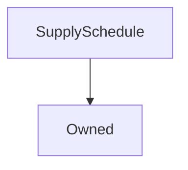

# SupplySchedule

## Description

Defines the Synthetix inflationary supply schedule, according to which the synthetix inflationary supply is released.

Minting is performed in increments of a week whenever [`recordMintEvent`](#recordMintEvent) is called from [`Synthetix.mint`](Synthetix.md#mint). Minting can be called weekly after the time elapses for more than 7 days. These accrue so that no tokens are lost even if minting is not performed for several periods; the accrued total is minted at the next invocation. These computations are covered in more detail in the [`mintableSupply`](#mintablesupply) description.

The supply decay follows an exponential decay formula calculated for each week.

supplyForWeek = Initial Weekly Supply \* (1 - rate of decay) ^ number of weeks

**Source:** [contracts/SupplySchedule.sol](https://github.com/Synthetixio/synthetix/tree/develop/contracts/SupplySchedule.sol)

---
### Schedule

To the initial 100 million tokens, 75 million / 52 weeks tokens were added for 39 weeks in 2019. Supply decay was implemented in week 40 whereby the weekly inflationary supply follows an exponential decay of 1.25% per week for a total of 195 weeks at Week 234.

After Week 235 the SNX supply will grow at 2.5% APR based on the total Supply of SNX each week. Compounded weekly the supply growth APY is 2.53% for the terminal supply growth.

**Source:** [SupplySchedule.sol](https://github.com/Synthetixio/synthetix/blob/master/contracts/SupplySchedule.sol)

## Architecture

---
### Inheritance Graph

---
### Related Contracts

- <>[Synthetix](Synthetix.md)

---
### Libraries

- [`SafeMath`](SafeMath.md) for `uint`
- [`SafeDecimalMath`](SafeDecimalMath.md) for `uint`
- [`Math`](Math.md) for `uint`

## Variables

---
### `MINT_PERIOD_DURATION`

[Source](https://github.com/Synthetixio/synthetix/tree/develop/contracts/SupplySchedule.sol#L42)

The duration of each minting period. This is constant at one week.

**Value:** `1 weeks`

**Type:** `uint256`

---
### `lastMintEvent`

[Source](https://github.com/Synthetixio/synthetix/tree/develop/contracts/SupplySchedule.sol#L23)

The timestamp when new supply was last minted - Is set to the number of weeks since inflation start date plus a minting buffer to allow feePeriod to close first.

**Type:** `uint256`

---
### `synthetixProxy`

[Source](https://github.com/Synthetixio/synthetix/tree/develop/contracts/SupplySchedule.sol#L36)

The address of the main [`SynthetixProxy`](Proxy.md) contract.

**Type:** `address payable`

---
### `INFLATION_START_DATE`

[Source](https://github.com/Synthetixio/synthetix/tree/develop/contracts/SupplySchedule.sol#L44)

The timestamp at which the inflationary SNX supply began to be minted.

**Value:** `1551830400 (2019-03-06T00:00:00+00:00)`

**Type:** `uint256`

---
### `INITIAL_WEEKLY_SUPPLY`

[Source](https://github.com/Synthetixio/synthetix/tree/develop/contracts/SupplySchedule.sol#L33)

The amount of tokens being issued weekly before exponential decay started. Used to calculate the supply each week once decay starts.

**Value:** `1442307692307692307692307 - 75e6 / 52`

**Type:** `uint256`

---
### `MINT_BUFFER`

[Source](https://github.com/Synthetixio/synthetix/tree/develop/contracts/SupplySchedule.sol#L45)

A buffer added to the lastMintEvent to ensure that synthetix rewards are issued after a feePeriod closes.

**Value:** `1 days`

**Type:** `uint256`

---
### `minterReward`

[Source](https://github.com/Synthetixio/synthetix/tree/develop/contracts/SupplySchedule.sol#L29)

Used as the quantity of SNX to reward the caller of [`Synthetix.mint`](Synthetix.md#mint), which incentivises users to continue minting the inflationary supply over time. Initialised to 200 SNX.

**Type:** `uint256`

---
### `SUPPLY_DECAY_START`

[Source](https://github.com/Synthetixio/synthetix/tree/develop/contracts/SupplySchedule.sol#L46)

Week number when supply decay starts. Used along with weekCounter to determine when decay supply starts.

**Value:** `40`

**Type:** `uint8`

---
### `SUPPLY_DECAY_END`

[Source](https://github.com/Synthetixio/synthetix/tree/develop/contracts/SupplySchedule.sol#L47)

Week number when supply decay ends. Used along with weekCounter to determine when decay supply should end.

Inflation after this week would become be on the terminal inflation schedule.

**Value:** `234`

**Type:** `uint8`

---
### `weekCounter`

[Source](https://github.com/Synthetixio/synthetix/tree/develop/contracts/SupplySchedule.sol#L26)

Counter to record the number of weeks inflation has been issued and calculate the applicable supply to add based on the current weekCounter.

**Type:** `uint256`

---
### `MAX_MINTER_REWARD`

[Source](https://github.com/Synthetixio/synthetix/tree/develop/contracts/SupplySchedule.sol#L39)

**Type:** `uint256`

---
### `DECAY_RATE`

[Source](https://github.com/Synthetixio/synthetix/tree/develop/contracts/SupplySchedule.sol#L50)

**Type:** `uint256`

---
### `TERMINAL_SUPPLY_RATE_ANNUAL`

[Source](https://github.com/Synthetixio/synthetix/tree/develop/contracts/SupplySchedule.sol#L53)

**Type:** `uint256`

## Functions

---
### `constructor`

[Source](https://github.com/Synthetixio/synthetix/tree/develop/contracts/SupplySchedule.sol#L55)

Sets up the minting schedule and the inherited [`Owned`](Owned.md) instance.

??? example "Details"

    **Signature**

    `(address _owner, uint256 _lastMintEvent, uint256 _currentWeek) public`

    **Modifiers**

    * [Owned](#owned)

---
### `setSynthetixProxy`

[Source](https://github.com/Synthetixio/synthetix/tree/develop/contracts/SupplySchedule.sol#L199)

Allows the owner to set the [`synthetix`](#synthetix) address.

??? example "Details"

    **Signature**

    `setSynthetixProxy(contract ISynthetix _synthetixProxy) external`

    **Requires**

    * [require(..., Address cannot be 0)](https://github.com/Synthetixio/synthetix/tree/develop/contracts/SupplySchedule.sol#L200)

    **Modifiers**

    * [onlyOwner](#onlyowner)

    **Emits**

    * [SynthetixProxyUpdated](#synthetixproxyupdated)

---
### `mintableSupply`

[Source](https://github.com/Synthetixio/synthetix/tree/develop/contracts/SupplySchedule.sol#L69)

Returns the number of tokens currently mintable from the inflationary supply.

If [`isMintable`](#ismintable) returns false, this is $0$. Otherwise, it is the number of tokens accruing per week in the current year, multiplied by the number of whole weeks since the last mint event.

??? example "Details"

    **Signature**

    `mintableSupply() external`

---
### `weeksSinceLastIssuance`

[Source](https://github.com/Synthetixio/synthetix/tree/develop/contracts/SupplySchedule.sol#L139)

This just returns its argument floor divided by [`MINT_PERIOD_DURATION`](#MINT_PERIOD_DURATION). Since this is only used in `mintableSupply()` it seems as if a variable would have done better than a public function.

??? example "Details"

    **Signature**

    `weeksSinceLastIssuance() public`

---
### `isMintable`

[Source](https://github.com/Synthetixio/synthetix/tree/develop/contracts/SupplySchedule.sol#L150)

Returns true if minting from the inflationary supply is permitted at the present time.

This means that tokens are only mintable once a week.

??? example "Details"

    **Signature**

    `isMintable() public`

---
### `recordMintEvent`

[Source](https://github.com/Synthetixio/synthetix/tree/develop/contracts/SupplySchedule.sol#L165)

This is called within [`Synthetix.mint`](Synthetix.md#mint) to declare that the outstanding inflationary supply of tokens has been minted before they are actually distributed.

When called, this function adds a quantity of [`mintableSupply()`](#mintablesupply) tokens to the current [`schedule.totalSupplyMinted`](#schedule) entry, and updates the [`lastMintEvent`](#lastmintevent) timestamp.

Although this function has no check that any tokens actually are mintable when it is called, the [`Synthetix`](Synthetix.md) contract requires it to be the case, so double calls should not occur. Similarly, the function does not itself enforce that the actual token supply has been increased by [`Synthetix`](Synthetix.md) in a manner consistent with the defined schedule and must simply trust that this compact is observed.

The function always returns `true` if the transaction was not reverted.

??? example "Details"

    **Signature**

    `recordMintEvent(uint256 supplyMinted) external`

    **Modifiers**

    * [onlySynthetix](#onlysynthetix)

    **Emits**

    * [SupplyMinted](#supplyminted)

---
### `setMinterReward`

[Source](https://github.com/Synthetixio/synthetix/tree/develop/contracts/SupplySchedule.sol#L186)

Allows the owner to set the current [minter reward](#minterreward).

??? example "Details"

    **Signature**

    `setMinterReward(uint256 amount) external`

    **Requires**

    * [require(..., Reward cannot exceed max minter reward)](https://github.com/Synthetixio/synthetix/tree/develop/contracts/SupplySchedule.sol#L187)

    **Modifiers**

    * [onlyOwner](#onlyowner)

    **Emits**

    * [MinterRewardUpdated](#minterrewardupdated)

---
### `tokenDecaySupplyForWeek`

[Source](https://github.com/Synthetixio/synthetix/tree/develop/contracts/SupplySchedule.sol#L114)

??? example "Details"

    **Signature**

    `tokenDecaySupplyForWeek(uint256 counter) public`

---
### `terminalInflationSupply`

[Source](https://github.com/Synthetixio/synthetix/tree/develop/contracts/SupplySchedule.sol#L127)

??? example "Details"

    **Signature**

    `terminalInflationSupply(uint256 totalSupply, uint256 numOfWeeks) public`

## Modifiers

---
### `onlySynthetix`

[Source](https://github.com/Synthetixio/synthetix/tree/develop/contracts/SupplySchedule.sol#L210)

Reverts the transaction if `msg.sender` is not the [`synthetix`](#synthetix) address. Synthetix address is found by lookup to the proxy.target().

## Events

---
### `SupplyMinted`

[Source](https://github.com/Synthetixio/synthetix/tree/develop/contracts/SupplySchedule.sol#L222)

Records that a quantity of new tokens was [minted](#updatemintvalues).

**Signature:** `SupplyMinted(uint supplyMinted, uint numberOfWeeksIssued, uint lastMintEvent, uint timestamp)`

- `(uint256 supplyMinted, uint256 numberOfWeeksIssued, uint256 lastMintEvent, uint256 timestamp)`

---
### `MinterRewardUpdated`

[Source](https://github.com/Synthetixio/synthetix/tree/develop/contracts/SupplySchedule.sol#L227)

Records that the [minter reward was updated](#setminterreward).

**Signature:** `MinterRewardUpdated(uint newRewardAmount)`

- `(uint256 newRewardAmount)`

---
### `SynthetixProxyUpdated`

[Source](https://github.com/Synthetixio/synthetix/tree/develop/contracts/SupplySchedule.sol#L232)

- `(address newAddress)`

