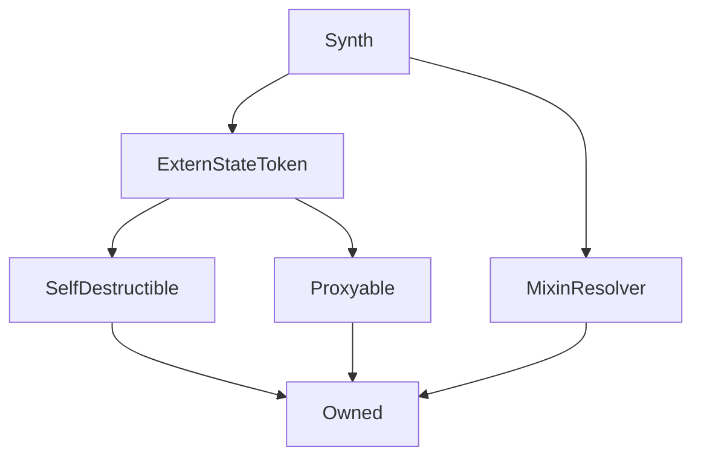

# Synth

This contract is the basis of all Synth flavours.
It exposes sufficient functionality for the [`Synthetix`](Synthetix.md) and [`FeePool`](FeePool.md) contracts to manage its supply. Otherwise Synths are fairly vanilla ERC20 tokens; the [`PurgeableSynth`](PurgeableSynth.md) contract extends this basic functionality to allow the owner to liquidate a Synth if its total value is low enough.

See the [main synth notes](../../synths) for more information about how Synths function in practice.

???+ note "A Note on Conversion Fees"

    Since transfer conversion is not operating, the following is recorded only to be kept in mind in case it is ever reactivated. At present there is no way for users to set a preferred currency.
    
    The Synthetix system has implements both [exchange](FeePool.md#exchangefeerate) and [transfer](FeePool.md#transferfeerate) fees on Synths. Although they should be distinct, the preferred currency auto conversion on transfer only charges the transfer fee, and not the exchange fee.
    As a result, it is possible to convert Synths more cheaply whenever the transfer fee is less than the conversion fee.
    
    Given that the transfer fee is currently nil, if a user was able to set a preferred currency for themselves, it would be possible by this means to perform free Synth conversions. This would
    undercut fee revenue for the system to incentivise participants with. If markets had priced in the conversion fee, but were unaware of the exploit, then there would be a profit cycle available for someone exploiting this.
    
    In particular:
    
    Let $\phi_\kappa, \ \phi_\tau \in [0,1]$ be the conversion and transfer fee rates, respectively.
    Let $\pi_A, \ \pi_B$ be the prices of synths $A$ and $B$ in terms of some implicit common currency.
    $Q_A$ will be the starting quantity of synth $A$.
    
    Then to convert from $A$ to $B$, quantities
    
    $$
    Q^\kappa_B = Q_A\frac{\pi_A}{\pi_B}(1 - \phi_\kappa) \\
    Q^\tau_B = Q_A\frac{\pi_A}{\pi_B}(1 - \phi_\tau)
    $$
    
    are received if the user performs a standard conversion or a transfer conversion, respectively.
    The profit of performing a transfer conversion relative to a standard one is then:
    
    $$
    Q^\tau_B - Q^\kappa_B = Q_A\frac{\pi_A}{\pi_B}(\phi_\kappa - \phi_\tau)
    $$
    
    That is, the relative profit is simply $(\phi_\kappa - \phi_\tau)$. With no transfer fee, this is $\phi_\kappa$, as expected.

**Source:** [Synth.sol](https://github.com/Synthetixio/synthetix/blob/master/contracts/Synth.sol)

## Architecture

---
### Inheritance Graph

## Description

**Source:** [contracts/Synth.sol](https://github.com/Synthetixio/synthetix/tree/develop/contracts/Synth.sol)

## Constants

---
### `BURNED_SIG`

[Source](https://github.com/Synthetixio/synthetix/tree/develop/contracts/Synth.sol#L273)

**Type:** `bytes32`

---
### `CONTRACT_EXCHANGER`

[Source](https://github.com/Synthetixio/synthetix/tree/develop/contracts/Synth.sol#L33)

**Type:** `bytes32`

---
### `CONTRACT_FEEPOOL`

[Source](https://github.com/Synthetixio/synthetix/tree/develop/contracts/Synth.sol#L35)

**Type:** `bytes32`

---
### `CONTRACT_ISSUER`

[Source](https://github.com/Synthetixio/synthetix/tree/develop/contracts/Synth.sol#L34)

**Type:** `bytes32`

---
### `CONTRACT_SYNTHETIX`

[Source](https://github.com/Synthetixio/synthetix/tree/develop/contracts/Synth.sol#L32)

**Type:** `bytes32`

---
### `CONTRACT_SYSTEMSTATUS`

[Source](https://github.com/Synthetixio/synthetix/tree/develop/contracts/Synth.sol#L31)

**Type:** `bytes32`

---
### `DECIMALS`

[Source](https://github.com/Synthetixio/synthetix/tree/develop/contracts/Synth.sol#L24)

**Type:** `uint8`

---
### `FEE_ADDRESS`

[Source](https://github.com/Synthetixio/synthetix/tree/develop/contracts/Synth.sol#L27)

**Type:** `address`

---
### `ISSUED_SIG`

[Source](https://github.com/Synthetixio/synthetix/tree/develop/contracts/Synth.sol#L266)

**Type:** `bytes32`

## Events

---
### `Burned`

[Source](https://github.com/Synthetixio/synthetix/tree/develop/contracts/Synth.sol#L272)

Records that a quantity of this Synth was [burned](#burn).

This event is emitted from the Synths's [proxy](Proxy.md#_emit) with the `emitBurned` function.

**Signature:** `Burned(address indexed account, uint value)`

- `(address account, uint256 value)`

---
### `FeePoolUpdated`

Records that the [`feePool`](#feepool) address was [updated](#setfeepool).

This event is emitted from the Synths's [proxy](Proxy.md#_emit) with the `emitFeePoolUpdated` function.

**Signature:** `FeePoolUpdated(address newFeePool)`

---
### `Issued`

[Source](https://github.com/Synthetixio/synthetix/tree/develop/contracts/Synth.sol#L265)

Records that a quantity of this Synth was newly [issued](#issue).

This event is emitted from the Synths's [proxy](Proxy.md#_emit) with the `emitIssued` function.

**Signature:** `Issued(address indexed account, uint value)`

- `(address account, uint256 value)`

---
### `SynthetixUpdated`

Records that the [`synthetix`](#synthetix) address was [updated](#setsynthetix).

This event is emitted from the Synths's [proxy](Proxy.md#_emit) with the `emitSynthetixUpdated` function.

**Signature:** `SynthetixUpdated(address newSynthetix)`

## Function (Constructor)

---
### `constructor`

[Source](https://github.com/Synthetixio/synthetix/tree/develop/contracts/Synth.sol#L47)

??? example "Details"

    **Signature**

    `(address payable _proxy, contract TokenState _tokenState, string _tokenName, string _tokenSymbol, address _owner, bytes32 _currencyKey, uint256 _totalSupply, address _resolver)`

    **State Mutability**

    `nonpayable`

    **Requires**

    * [require(..., _proxy cannot be 0)](https://github.com/Synthetixio/synthetix/tree/develop/contracts/Synth.sol#L61)

    * [require(..., _owner cannot be 0)](https://github.com/Synthetixio/synthetix/tree/develop/contracts/Synth.sol#L62)

    **Modifiers**

    * [ExternStateToken](#externstatetoken)

    * [MixinResolver](#mixinresolver)

## Functions

---
### `burn`

[Source](https://github.com/Synthetixio/synthetix/tree/develop/contracts/Synth.sol#L165)

Allows the [`Synthetix`](Synthetix.md) contract to burn existing Synths of this flavour. This is used whenever Synths are [exchanged](Synthetix.md#_internalexchange) or [burnt directly](Synthetix.md#burnSynths). This is also used to burn Synths involved in oracle frontrunning as part of the [protection circuit](Synthetix.md#protectioncircuit). This is also used by the [`FeePool`](FeePool.md) to [burn sUSD when fees are paid out](FeePool.md#_payfees).

??? example "Details"

    **Signature**

    `burn(address account, uint256 amount)`

    **State Mutability**

    `nonpayable`

    **Modifiers**

    * [onlyInternalContracts](#onlyinternalcontracts)

---
### `issue`

[Source](https://github.com/Synthetixio/synthetix/tree/develop/contracts/Synth.sol#L159)

Allows the [`Synthetix`](Synthetix.md) contract to issue new Synths of this flavour. This is used whenever Synths are [exchanged](Synthetix.md#_internalexchange) or [issued directly](Synthetix.md#issuesynths). This is also used by the [`FeePool`](FeePool.md) to [pay fees out](FeePool.md#_payfees).

??? example "Details"

    **Signature**

    `issue(address account, uint256 amount)`

    **State Mutability**

    `nonpayable`

    **Modifiers**

    * [onlyInternalContracts](#onlyinternalcontracts)

---
### `setTotalSupply`

[Source](https://github.com/Synthetixio/synthetix/tree/develop/contracts/Synth.sol#L186)

This allows the owner to set the total supply directly for upgrades, where the [`tokenState`](ExternStateToken.md#tokenstate) is retained, but the total supply figure must be migrated.

For example, just such a migration is performed by [this script](https://github.com/Synthetixio/synthetix/blob/master/publish/src/commands/replace-synths.js).

??? example "Details"

    **Signature**

    `setTotalSupply(uint256 amount)`

    **State Mutability**

    `nonpayable`

    **Modifiers**

    * [optionalProxy_onlyOwner](#optionalproxy_onlyowner)

---
### `transfer`

[Source](https://github.com/Synthetixio/synthetix/tree/develop/contracts/Synth.sol#L69)

This is a pair of ERC20 transfer function.

Implemented based on [`ExternStateToken._transfer_byProxy`](ExternStateToken#_transfer_byproxy).

!!! Warning "Warning"

    Due to [SIP-37 Fee Reclamation](https://sips.synthetix.io/sips/sip-37), this will always fail if there are any exchanges awaiting settlement for this synth. To prevent failues, please use [`transferAndSettle()`](#transferandsettle) below or invoke [`Exchanger.settle()`](/contracts/exchanger/#settle) prior to `transfer()`.

??? example "Details"

    **Signature**

    `transfer(address to, uint256 value)`

    **State Mutability**

    `nonpayable`

    **Modifiers**

    * [optionalProxy](#optionalproxy)

---
### `transferableSynths`

[Source](https://github.com/Synthetixio/synthetix/tree/develop/contracts/Synth.sol#L217)

??? example "Details"

    **Signature**

    `transferableSynths(address account)`

    **State Mutability**

    `view`

---
### `transferAndSettle`

[Source](https://github.com/Synthetixio/synthetix/tree/develop/contracts/Synth.sol#L85)

Settles any outstanding fee reclaims and rebates from [SIP-37](https://sips.synthetix.io/sips/sip-37) and then performs the `transfer` functionality. If there is insufficient balance to transfer `value` after any reclaims, the `amount` will be reduced to the remaining balance of the sender.

Implemented based on [`ExternStateToken._transfer_byProxy`](ExternStateToken#_transfer_byproxy).

??? example "Details"

    **Signature**

    `transferAndSettle(address to, uint256 value)`

    **State Mutability**

    `nonpayable`

    **Modifiers**

    * [optionalProxy](#optionalproxy)

---
### `transferFrom`

[Source](https://github.com/Synthetixio/synthetix/tree/develop/contracts/Synth.sol#L103)

This is a ERC20 transferFrom function.

Implemented based on [`ExternStateToken._transferFrom_byProxy`](ExternStateToken#_transferfrom_byproxy).

!!! Warning "Warning"

    Due to [SIP-37 Fee Reclamation](https://sips.synthetix.io/sips/sip-37), this will always fail if there are any exchanges awaiting settlement for this synth. To prevent failues, please use [`transferFromAndSettle()`](#transferfromandsettle) below or invoke [`Exchanger.settle()`](/contracts/exchanger/#settle) prior to `transferFrom()`.

??? example "Details"

    **Signature**

    `transferFrom(address from, address to, uint256 value)`

    **State Mutability**

    `nonpayable`

    **Modifiers**

    * [optionalProxy](#optionalproxy)

---
### `transferFromAndSettle`

[Source](https://github.com/Synthetixio/synthetix/tree/develop/contracts/Synth.sol#L113)

Settles any outstanding fee reclaims and rebates from [SIP-37](https://sips.synthetix.io/sips/sip-37) and then performs the `transferFrom` functionality. If there is insufficient balance to transfer `value` after any reclaims, the `amount` will be reduced to the remaining balance of the `from` address.

Implemented based on [`ExternStateToken._transferFrom_byProxy`](ExternStateToken#_transferfrom_byproxy).

!!! Warning "Warning"

    Due to [SIP-37 Fee Reclamation](https://sips.synthetix.io/sips/sip-37), this will always fail if there are any exchanges awaiting settlement for this synth. To prevent failues, please use [`transferFromAndSettle()`](#transferfromandsettle) below or invoke [`Exchanger.settle()`](/contracts/exchanger/#settle) prior to `transferFrom()`.

??? example "Details"

    **Signature**

    `transferFromAndSettle(address from, address to, uint256 value)`

    **State Mutability**

    `nonpayable`

    **Modifiers**

    * [optionalProxy](#optionalproxy)

## Functions (Internal)

---
### `_ensureCanTransfer`

[Source](https://github.com/Synthetixio/synthetix/tree/develop/contracts/Synth.sol#L211)

??? example "Details"

    **Signature**

    `_ensureCanTransfer(address from, uint256 value)`

    **State Mutability**

    `view`

    **Requires**

    * [require(..., Cannot transfer during waiting period)](https://github.com/Synthetixio/synthetix/tree/develop/contracts/Synth.sol#L212)

    * [require(..., Insufficient balance after any settlement owing)](https://github.com/Synthetixio/synthetix/tree/develop/contracts/Synth.sol#L213)

---
### `_internalBurn`

[Source](https://github.com/Synthetixio/synthetix/tree/develop/contracts/Synth.sol#L176)

??? example "Details"

    **Signature**

    `_internalBurn(address account, uint256 amount)`

    **State Mutability**

    `nonpayable`

---
### `_internalIssue`

[Source](https://github.com/Synthetixio/synthetix/tree/develop/contracts/Synth.sol#L169)

??? example "Details"

    **Signature**

    `_internalIssue(address account, uint256 amount)`

    **State Mutability**

    `nonpayable`

---
### `_internalTransferFrom`

[Source](https://github.com/Synthetixio/synthetix/tree/develop/contracts/Synth.sol#L234)

??? example "Details"

    **Signature**

    `_internalTransferFrom(address from, address to, uint256 value)`

    **State Mutability**

    `nonpayable`

---
### `_transferToFeeAddress`

[Source](https://github.com/Synthetixio/synthetix/tree/develop/contracts/Synth.sol#L139)

??? example "Details"

    **Signature**

    `_transferToFeeAddress(address to, uint256 value)`

    **State Mutability**

    `nonpayable`

---
### `emitBurned`

[Source](https://github.com/Synthetixio/synthetix/tree/develop/contracts/Synth.sol#L275)

??? example "Details"

    **Signature**

    `emitBurned(address account, uint256 value)`

    **State Mutability**

    `nonpayable`

---
### `emitIssued`

[Source](https://github.com/Synthetixio/synthetix/tree/develop/contracts/Synth.sol#L268)

??? example "Details"

    **Signature**

    `emitIssued(address account, uint256 value)`

    **State Mutability**

    `nonpayable`

---
### `exchanger`

[Source](https://github.com/Synthetixio/synthetix/tree/develop/contracts/Synth.sol#L203)

??? example "Details"

    **Signature**

    `exchanger()`

    **State Mutability**

    `view`

---
### `feePool`

[Source](https://github.com/Synthetixio/synthetix/tree/develop/contracts/Synth.sol#L199)

??? example "Details"

    **Signature**

    `feePool()`

    **State Mutability**

    `view`

---
### `issuer`

[Source](https://github.com/Synthetixio/synthetix/tree/develop/contracts/Synth.sol#L207)

??? example "Details"

    **Signature**

    `issuer()`

    **State Mutability**

    `view`

---
### `synthetix`

[Source](https://github.com/Synthetixio/synthetix/tree/develop/contracts/Synth.sol#L195)

??? example "Details"

    **Signature**

    `synthetix()`

    **State Mutability**

    `view`

---
### `systemStatus`

[Source](https://github.com/Synthetixio/synthetix/tree/develop/contracts/Synth.sol#L191)

??? example "Details"

    **Signature**

    `systemStatus()`

    **State Mutability**

    `view`

## Modifiers

---
### `onlyInternalContracts`

[Source](https://github.com/Synthetixio/synthetix/tree/develop/contracts/Synth.sol#L251)

---
### `onlySynthetixOrFeePool`

Reverts the transaction if the `msg.sender` is neither [`synthetix`](#synthetix) nor [`feePool`](#feepool).

**Signature:** `notFeeAddress(address account)`

## Variables

---
### `addressesToCache`

[Source](https://github.com/Synthetixio/synthetix/tree/develop/contracts/Synth.sol#L37)

**Type:** `bytes32[24]`

---
### `currencyKey`

[Source](https://github.com/Synthetixio/synthetix/tree/develop/contracts/Synth.sol#L22)

The [identifier](Synthetix.md#synths) of this Synth within the Synthetix ecosystem. The currency key could in principle be distinct from this token's [ERC20 symbol](ExternStateToken.md#symbol).

**Type:** `bytes32`

