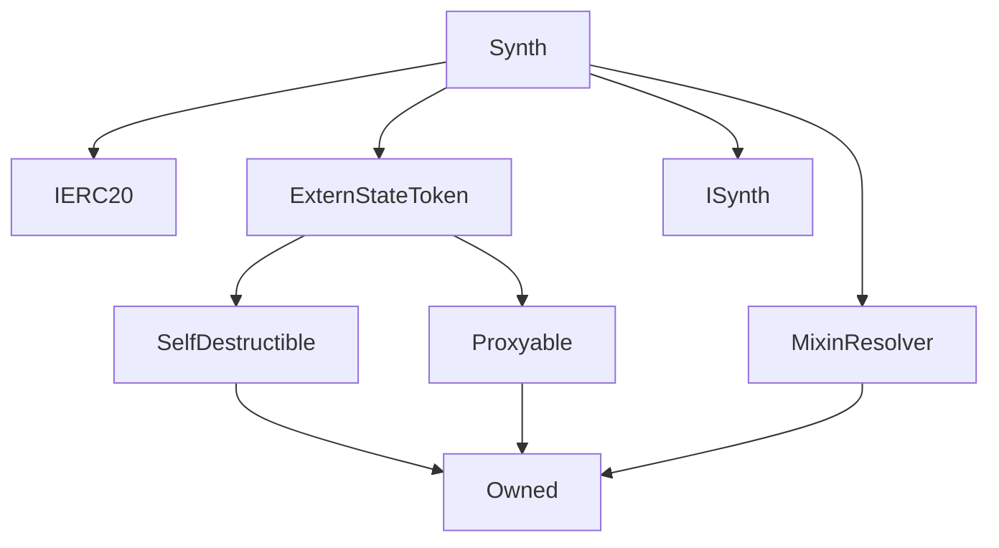

# Synth

**Source:** [contracts/Synth.sol](https://github.com/Synthetixio/synthetix/tree/develop/contracts/Synth.sol)

## Architecture

### Inheritance Graph

---

## Structs

## Variables

---

### `currencyKey`
[Source](https://github.com/Synthetixio/synthetix/tree/develop/contracts/Synth.sol#L22)

**Type:** `bytes32`

---

### `DECIMALS`
[Source](https://github.com/Synthetixio/synthetix/tree/develop/contracts/Synth.sol#L24)

**Type:** `uint8`

---

### `FEE_ADDRESS`
[Source](https://github.com/Synthetixio/synthetix/tree/develop/contracts/Synth.sol#L27)

**Type:** `address`

---

### `addressesToCache`
[Source](https://github.com/Synthetixio/synthetix/tree/develop/contracts/Synth.sol#L37)

**Type:** `bytes32[24]`

## Functions

---

### `constructor`
[Source](https://github.com/Synthetixio/synthetix/tree/develop/contracts/Synth.sol#L47)

??? example "Details"

    **Signature**

    `(address payable _proxy, contract TokenState _tokenState, string _tokenName, string _tokenSymbol, address _owner, bytes32 _currencyKey, uint256 _totalSupply, address _resolver) public`

    **Modifiers**

    * [ExternStateToken](#externstatetoken)

    * [MixinResolver](#mixinresolver)

---

### `transfer`
[Source](https://github.com/Synthetixio/synthetix/tree/develop/contracts/Synth.sol#L69)

??? example "Details"

    **Signature**

    `transfer(address to, uint256 value) public`

    **Modifiers**

    * [optionalProxy](#optionalproxy)

---

### `transferAndSettle`
[Source](https://github.com/Synthetixio/synthetix/tree/develop/contracts/Synth.sol#L85)

??? example "Details"

    **Signature**

    `transferAndSettle(address to, uint256 value) public`

    **Modifiers**

    * [optionalProxy](#optionalproxy)

---

### `transferFrom`
[Source](https://github.com/Synthetixio/synthetix/tree/develop/contracts/Synth.sol#L103)

??? example "Details"

    **Signature**

    `transferFrom(address from, address to, uint256 value) public`

    **Modifiers**

    * [optionalProxy](#optionalproxy)

---

### `transferFromAndSettle`
[Source](https://github.com/Synthetixio/synthetix/tree/develop/contracts/Synth.sol#L113)

??? example "Details"

    **Signature**

    `transferFromAndSettle(address from, address to, uint256 value) public`

    **Modifiers**

    * [optionalProxy](#optionalproxy)

---

### `issue`
[Source](https://github.com/Synthetixio/synthetix/tree/develop/contracts/Synth.sol#L159)

??? example "Details"

    **Signature**

    `issue(address account, uint256 amount) external`

    **Modifiers**

    * [onlyInternalContracts](#onlyinternalcontracts)

---

### `burn`
[Source](https://github.com/Synthetixio/synthetix/tree/develop/contracts/Synth.sol#L165)

??? example "Details"

    **Signature**

    `burn(address account, uint256 amount) external`

    **Modifiers**

    * [onlyInternalContracts](#onlyinternalcontracts)

---

### `setTotalSupply`
[Source](https://github.com/Synthetixio/synthetix/tree/develop/contracts/Synth.sol#L186)

??? example "Details"

    **Signature**

    `setTotalSupply(uint256 amount) external`

    **Modifiers**

    * [optionalProxy_onlyOwner](#optionalproxy_onlyowner)

---

### `transferableSynths`
[Source](https://github.com/Synthetixio/synthetix/tree/develop/contracts/Synth.sol#L217)

??? example "Details"

    **Signature**

    `transferableSynths(address account) public`

---

## Modifiers

---

### `onlyInternalContracts`
[Source](https://github.com/Synthetixio/synthetix/tree/develop/contracts/Synth.sol#L251)

---

## Events

---

### `Issued`
[Source](https://github.com/Synthetixio/synthetix/tree/develop/contracts/Synth.sol#L265)

- `(address account, uint256 value)`

---

### `Burned`
[Source](https://github.com/Synthetixio/synthetix/tree/develop/contracts/Synth.sol#L272)

- `(address account, uint256 value)`

---

