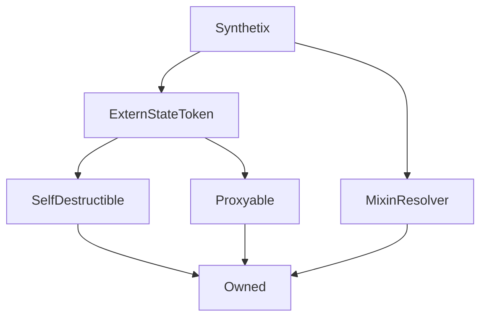

# Synthetix

**Source:** [contracts/Synthetix.sol](https://github.com/Synthetixio/synthetix/tree/develop/contracts/Synthetix.sol)

## Architecture

### Inheritance Graph

---

## Variables

---

### `availableSynths`
[Source](https://github.com/Synthetixio/synthetix/tree/develop/contracts/Synthetix.sol#L29)

**Type:** `contract ISynth[]`

---

### `synths`
[Source](https://github.com/Synthetixio/synthetix/tree/develop/contracts/Synthetix.sol#L30)

**Type:** `mapping(bytes32 => contract ISynth)`

---

### `synthsByAddress`
[Source](https://github.com/Synthetixio/synthetix/tree/develop/contracts/Synthetix.sol#L31)

**Type:** `mapping(address => bytes32)`

---

### `TOKEN_NAME`
[Source](https://github.com/Synthetixio/synthetix/tree/develop/contracts/Synthetix.sol#L33)

**Type:** `string`

---

### `TOKEN_SYMBOL`
[Source](https://github.com/Synthetixio/synthetix/tree/develop/contracts/Synthetix.sol#L34)

**Type:** `string`

---

### `DECIMALS`
[Source](https://github.com/Synthetixio/synthetix/tree/develop/contracts/Synthetix.sol#L35)

**Type:** `uint8`

---

### `sUSD`
[Source](https://github.com/Synthetixio/synthetix/tree/develop/contracts/Synthetix.sol#L36)

**Type:** `bytes32`

---

### `SYNTHEXCHANGE_SIG`
[Source](https://github.com/Synthetixio/synthetix/tree/develop/contracts/Synthetix.sol#L606)

**Type:** `bytes32`

---

### `EXCHANGERECLAIM_SIG`
[Source](https://github.com/Synthetixio/synthetix/tree/develop/contracts/Synthetix.sol#L629)

**Type:** `bytes32`

---

### `EXCHANGEREBATE_SIG`
[Source](https://github.com/Synthetixio/synthetix/tree/develop/contracts/Synthetix.sol#L640)

**Type:** `bytes32`

## Functions

---

### `constructor`
[Source](https://github.com/Synthetixio/synthetix/tree/develop/contracts/Synthetix.sol#L66)

??? example "Details"

    **Signature**

    `(address payable _proxy, contract TokenState _tokenState, address _owner, uint256 _totalSupply, address _resolver) public`

    **Modifiers**

    * [ExternStateToken](#externstatetoken)

    * [MixinResolver](#mixinresolver)

---

### `totalIssuedSynths`
[Source](https://github.com/Synthetixio/synthetix/tree/develop/contracts/Synthetix.sol#L156)

??? example "Details"

    **Signature**

    `totalIssuedSynths(bytes32 currencyKey) public`

---

### `totalIssuedSynthsExcludeEtherCollateral`
[Source](https://github.com/Synthetixio/synthetix/tree/develop/contracts/Synthetix.sol#L164)

??? example "Details"

    **Signature**

    `totalIssuedSynthsExcludeEtherCollateral(bytes32 currencyKey) public`

---

### `availableCurrencyKeys`
[Source](https://github.com/Synthetixio/synthetix/tree/develop/contracts/Synthetix.sol#L168)

??? example "Details"

    **Signature**

    `availableCurrencyKeys() public`

---

### `availableSynthCount`
[Source](https://github.com/Synthetixio/synthetix/tree/develop/contracts/Synthetix.sol#L178)

??? example "Details"

    **Signature**

    `availableSynthCount() external`

---

### `isWaitingPeriod`
[Source](https://github.com/Synthetixio/synthetix/tree/develop/contracts/Synthetix.sol#L182)

??? example "Details"

    **Signature**

    `isWaitingPeriod(bytes32 currencyKey) external`

---

### `addSynth`
[Source](https://github.com/Synthetixio/synthetix/tree/develop/contracts/Synthetix.sol#L192)

??? example "Details"

    **Signature**

    `addSynth(contract ISynth synth) external`

    **Requires**

    * [require(..., Synth already exists)](https://github.com/Synthetixio/synthetix/tree/develop/contracts/Synthetix.sol#L195)

    * [require(..., Synth address already exists)](https://github.com/Synthetixio/synthetix/tree/develop/contracts/Synthetix.sol#L196)

    **Modifiers**

    * [optionalProxy_onlyOwner](#optionalproxy_onlyowner)

---

### `removeSynth`
[Source](https://github.com/Synthetixio/synthetix/tree/develop/contracts/Synthetix.sol#L207)

??? example "Details"

    **Signature**

    `removeSynth(bytes32 currencyKey) external`

    **Requires**

    * [require(..., Synth does not exist)](https://github.com/Synthetixio/synthetix/tree/develop/contracts/Synthetix.sol#L208)

    * [require(..., Synth supply exists)](https://github.com/Synthetixio/synthetix/tree/develop/contracts/Synthetix.sol#L209)

    * [require(..., Cannot remove synth)](https://github.com/Synthetixio/synthetix/tree/develop/contracts/Synthetix.sol#L210)

    **Modifiers**

    * [optionalProxy_onlyOwner](#optionalproxy_onlyowner)

---

### `transfer`
[Source](https://github.com/Synthetixio/synthetix/tree/develop/contracts/Synthetix.sol#L244)

??? example "Details"

    **Signature**

    `transfer(address to, uint256 value) public`

    **Requires**

    * [require(..., Cannot transfer staked or escrowed SNX)](https://github.com/Synthetixio/synthetix/tree/develop/contracts/Synthetix.sol#L248)

    **Modifiers**

    * [optionalProxy](#optionalproxy)

---

### `transferFrom`
[Source](https://github.com/Synthetixio/synthetix/tree/develop/contracts/Synthetix.sol#L259)

??? example "Details"

    **Signature**

    `transferFrom(address from, address to, uint256 value) public`

    **Requires**

    * [require(..., Cannot transfer staked or escrowed SNX)](https://github.com/Synthetixio/synthetix/tree/develop/contracts/Synthetix.sol#L267)

    **Modifiers**

    * [optionalProxy](#optionalproxy)

---

### `issueSynths`
[Source](https://github.com/Synthetixio/synthetix/tree/develop/contracts/Synthetix.sol#L274)

??? example "Details"

    **Signature**

    `issueSynths(uint256 amount) external`

    **Modifiers**

    * [optionalProxy](#optionalproxy)

---

### `issueSynthsOnBehalf`
[Source](https://github.com/Synthetixio/synthetix/tree/develop/contracts/Synthetix.sol#L280)

??? example "Details"

    **Signature**

    `issueSynthsOnBehalf(address issueForAddress, uint256 amount) external`

    **Modifiers**

    * [optionalProxy](#optionalproxy)

---

### `issueMaxSynths`
[Source](https://github.com/Synthetixio/synthetix/tree/develop/contracts/Synthetix.sol#L286)

??? example "Details"

    **Signature**

    `issueMaxSynths() external`

    **Modifiers**

    * [optionalProxy](#optionalproxy)

---

### `issueMaxSynthsOnBehalf`
[Source](https://github.com/Synthetixio/synthetix/tree/develop/contracts/Synthetix.sol#L292)

??? example "Details"

    **Signature**

    `issueMaxSynthsOnBehalf(address issueForAddress) external`

    **Modifiers**

    * [optionalProxy](#optionalproxy)

---

### `burnSynths`
[Source](https://github.com/Synthetixio/synthetix/tree/develop/contracts/Synthetix.sol#L298)

??? example "Details"

    **Signature**

    `burnSynths(uint256 amount) external`

    **Modifiers**

    * [optionalProxy](#optionalproxy)

---

### `burnSynthsOnBehalf`
[Source](https://github.com/Synthetixio/synthetix/tree/develop/contracts/Synthetix.sol#L304)

??? example "Details"

    **Signature**

    `burnSynthsOnBehalf(address burnForAddress, uint256 amount) external`

    **Modifiers**

    * [optionalProxy](#optionalproxy)

---

### `burnSynthsToTarget`
[Source](https://github.com/Synthetixio/synthetix/tree/develop/contracts/Synthetix.sol#L310)

??? example "Details"

    **Signature**

    `burnSynthsToTarget() external`

    **Modifiers**

    * [optionalProxy](#optionalproxy)

---

### `burnSynthsToTargetOnBehalf`
[Source](https://github.com/Synthetixio/synthetix/tree/develop/contracts/Synthetix.sol#L316)

??? example "Details"

    **Signature**

    `burnSynthsToTargetOnBehalf(address burnForAddress) external`

    **Modifiers**

    * [optionalProxy](#optionalproxy)

---

### `exchange`
[Source](https://github.com/Synthetixio/synthetix/tree/develop/contracts/Synthetix.sol#L322)

??? example "Details"

    **Signature**

    `exchange(bytes32 sourceCurrencyKey, uint256 sourceAmount, bytes32 destinationCurrencyKey) external`

    **Modifiers**

    * [optionalProxy](#optionalproxy)

---

### `exchangeOnBehalf`
[Source](https://github.com/Synthetixio/synthetix/tree/develop/contracts/Synthetix.sol#L334)

??? example "Details"

    **Signature**

    `exchangeOnBehalf(address exchangeForAddress, bytes32 sourceCurrencyKey, uint256 sourceAmount, bytes32 destinationCurrencyKey) external`

    **Modifiers**

    * [optionalProxy](#optionalproxy)

---

### `settle`
[Source](https://github.com/Synthetixio/synthetix/tree/develop/contracts/Synthetix.sol#L354)

??? example "Details"

    **Signature**

    `settle(bytes32 currencyKey) external`

    **Modifiers**

    * [optionalProxy](#optionalproxy)

---

### `maxIssuableSynths`
[Source](https://github.com/Synthetixio/synthetix/tree/develop/contracts/Synthetix.sol#L372)

??? example "Details"

    **Signature**

    `maxIssuableSynths(address _issuer) public`

---

### `collateralisationRatio`
[Source](https://github.com/Synthetixio/synthetix/tree/develop/contracts/Synthetix.sol#L396)

??? example "Details"

    **Signature**

    `collateralisationRatio(address _issuer) public`

---

### `debtBalanceOf`
[Source](https://github.com/Synthetixio/synthetix/tree/develop/contracts/Synthetix.sol#L410)

??? example "Details"

    **Signature**

    `debtBalanceOf(address _issuer, bytes32 currencyKey) public`

---

### `debtBalanceOfAndTotalDebt`
[Source](https://github.com/Synthetixio/synthetix/tree/develop/contracts/Synthetix.sol#L430)

??? example "Details"

    **Signature**

    `debtBalanceOfAndTotalDebt(address _issuer, bytes32 currencyKey) public`

---

### `remainingIssuableSynths`
[Source](https://github.com/Synthetixio/synthetix/tree/develop/contracts/Synthetix.sol#L468)

??? example "Details"

    **Signature**

    `remainingIssuableSynths(address _issuer) public`

---

### `collateral`
[Source](https://github.com/Synthetixio/synthetix/tree/develop/contracts/Synthetix.sol#L494)

??? example "Details"

    **Signature**

    `collateral(address account) public`

---

### `transferableSynthetix`
[Source](https://github.com/Synthetixio/synthetix/tree/develop/contracts/Synthetix.sol#L514)

??? example "Details"

    **Signature**

    `transferableSynthetix(address account) public`

    **Modifiers**

    * [rateNotStale](#ratenotstale)

---

### `mint`
[Source](https://github.com/Synthetixio/synthetix/tree/develop/contracts/Synthetix.sol#L545)

??? example "Details"

    **Signature**

    `mint() external`

    **Requires**

    * [require(..., RewardsDistribution not set)](https://github.com/Synthetixio/synthetix/tree/develop/contracts/Synthetix.sol#L546)

    * [require(..., No supply is mintable)](https://github.com/Synthetixio/synthetix/tree/develop/contracts/Synthetix.sol#L554)

---

### `emitSynthExchange`
[Source](https://github.com/Synthetixio/synthetix/tree/develop/contracts/Synthetix.sol#L610)

??? example "Details"

    **Signature**

    `emitSynthExchange(address account, bytes32 fromCurrencyKey, uint256 fromAmount, bytes32 toCurrencyKey, uint256 toAmount, address toAddress) external`

    **Modifiers**

    * [onlyExchanger](#onlyexchanger)

---

### `emitExchangeReclaim`
[Source](https://github.com/Synthetixio/synthetix/tree/develop/contracts/Synthetix.sol#L631)

??? example "Details"

    **Signature**

    `emitExchangeReclaim(address account, bytes32 currencyKey, uint256 amount) external`

    **Modifiers**

    * [onlyExchanger](#onlyexchanger)

---

### `emitExchangeRebate`
[Source](https://github.com/Synthetixio/synthetix/tree/develop/contracts/Synthetix.sol#L642)

??? example "Details"

    **Signature**

    `emitExchangeRebate(address account, bytes32 currencyKey, uint256 amount) external`

    **Modifiers**

    * [onlyExchanger](#onlyexchanger)

---

## Modifiers

---

### `rateNotStale`
[Source](https://github.com/Synthetixio/synthetix/tree/develop/contracts/Synthetix.sol#L586)

---

### `onlyExchanger`
[Source](https://github.com/Synthetixio/synthetix/tree/develop/contracts/Synthetix.sol#L591)

---

## Events

---

### `SynthExchange`
[Source](https://github.com/Synthetixio/synthetix/tree/develop/contracts/Synthetix.sol#L598)

- `(address account, bytes32 fromCurrencyKey, uint256 fromAmount, bytes32 toCurrencyKey, uint256 toAmount, address toAddress)`

---

### `ExchangeReclaim`
[Source](https://github.com/Synthetixio/synthetix/tree/develop/contracts/Synthetix.sol#L628)

- `(address account, bytes32 currencyKey, uint256 amount)`

---

### `ExchangeRebate`
[Source](https://github.com/Synthetixio/synthetix/tree/develop/contracts/Synthetix.sol#L639)

- `(address account, bytes32 currencyKey, uint256 amount)`

---

