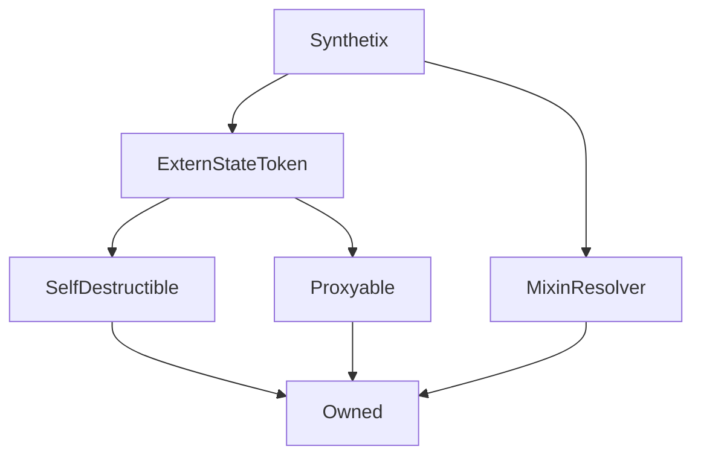

# Synthetix

## Description

**Source:** [contracts/Synthetix.sol](https://github.com/Synthetixio/synthetix/tree/develop/contracts/Synthetix.sol)

## Architecture

---
### Inheritance Graph

---
### Related Contracts

<centered-image>
    
</centered-image>

??? example "Details"

    - [`Depot`](Depot.md): The depot trades SNX and therefore knows the Synthetix address.
    - [`Exchanger`](Exchanger.md) The helper contract that performs the heavy lifting for `exchange()` and `settle()`.
    - [`ExchangeRates`](ExchangeRates.md): The Synthetix contract fetches prices from the exchange rates contract to facilitate synth exchange and to determine the value of various quantities of synths.
    - [`FeePool`](FeePool.md): The Synthetix contract remits exchange fees as sUSD to the fee pool, and also uses it to keep track of historical issuance records for each issuer.
    - [`Issuer`](Issuer.md) The helper contract that performs the heavy lifting for `issueSynths()`, `issueMaxSynths()` and `burnSynths()`.
    - [`Proxy`](Proxy.md): The Synthetix contract, which is [`Proxyable`](Proxyable.md), exists behind a `CALL`-style proxy for upgradeability.
    - [`RewardEscrow`](RewardEscrow.md): This is similar to the SynthetixEscrow contract, but it is where the SNX inflationary supply is kept before it is released to Synth issuers.
    - [`RewardsDistribution`](RewardsDistribution): This contract works closely with RewardEscrow to release portions of the inflationary supply to different recipients.
    - [`SupplySchedule`](SupplySchedule.md): The supply schedule determines the rate at which SNX are released from the inflationary supply.
    - [`Synth`](Synth.md): Synthetix manages the supply of synths. It keeps track of which ones exist, and they are all issued and burnt from the Synthetix contract. The Synthetix contract is also responsible for exchange between different synth flavours.
    - [`SynthetixEscrow`](SynthetixEscrow.md): The escrow contract keeps track of SNX owed to participants in the initial token sale, and releases them according to specified vesting schedules.
    - [`SynthetixState`](SynthetixState.md): This state contract stores the debt ledger and the current issuance information for synth issuers.

## Constructor

The constructor initialises the inherited [`ExternStateToken`](ExternStateToken.md) instance and [`MixinResolver`](MixinResolver.md).

??? example "Details"

    **Signature**
    
    `constructor(address _proxy, TokenState _tokenState, address _owner, uint _totalSupply, address _resolver) public`
    
    **Superconstructors**
    
    * [`ExternStateToken(_proxy, _tokenState, TOKEN_NAME, TOKEN_SYMBOL, _totalSupply, DECIMALS, _owner)`](ExternStateToken.md#constructor)
    * [`MixinResolver`](MixinResolver.md#constructor)

## Views

---
### `availableCurrencyKeys`

Returns the [currency key](Synth.md#currencykey) for each synth in [`availableSynths`](#availablesynths).

??? example "Details"

    **Signature**
    
    `availableCurrencyKeys() public view returns (bytes32[])`

---
### `availableSynthCount`

Returns the number of synths in the system, that is [`availableSynths.length`](#availablesynths).

??? example "Details"

    **Signature**
    
    `availableSynthCount() public view returns (uint)`

---
### `collateral`

Returns the total SNX owned by the given account, locked and unlocked, escrowed and unescrowed. This is the quantity of SNX synths can be issued against.

This is computed as the sum of [`Synthetix.balanceOf(account)`](TokenState.md#balanceof), [`SynthetixEscrow.balanceOf(account)`](SynthetixEscrow.md#balanceof), and [`RewardEscrow.balanceOf(account)`](RewardEscrow.md#balanceof); so an account may issue synths against both its active balance and its unclaimed escrow funds.

??? example "Details"

    **Signature**
    
    `collateral(address account) public view returns (uint)`

---
### `collateralisationRatio`

The ratio between value of synths that an account has issued and the value of the collateral they control. That is, this is just [`debtBalanceOf(issuer, "SNX") /`](#debtbalanceof) [`collateral(issuer)`](#collateral).

Ideally, issuers should maintain their collateralisation ratio at a level less than the [global issuance ratio](SynthetixState.md#issuanceratio), and they are incentivised to do this by the [fees they can claim](FeePool.md#claim) if they do so.

??? example "Details"

    **Signature**
    
    `collateralisationRatio(address issuer) public view returns (uint)`

---
### `debtBalanceOf`

Reports the quantity of a given currency required to free up all SNX locked in given account.

If $\mathrm{X}$ is the [total value of all issued synths](#totalissuedsynths), and $\check{\omega}$ is fraction of that value currently accounted for by this account's locked SNX, then the result is simply:

$$
\check{\omega} \ \mathrm{X}
$$

In order to account for fluctuations in synth prices and supply, the current ownership fraction is computed as the adjusted value:

$$
\check{\omega} = \omega \frac{\Delta_\text{last}}{\Delta_\text{entry}}
$$

Where $\omega$ is the account's debt ownership fraction at the time it [last issued or burnt](SynthetixState.md#issuancedata) synths, which produced the $\Delta_\text{entry}$ item in the [debt ledger](SynthetixState.md#debtledger). $\Delta_\text{last}$ is the latest value on the ledger. This logic is much the same as that found in [`FeePool._effectiveDebtRatioForPeriod`](FeePool.md#_effectivedebtratioforperiod). The actual value of $\omega$ is set in [`_addToDebtRegister`](#_addtodebtregister) and [`_removeFromDebtRegister`](#_removefromdebtregister).

??? example "Details"

    **Signature**
    
    `debtBalanceOf(address issuer, bytes32 currencyKey) public view returns (uint)`

---
### `effectiveValue`

Reports an equivalent value of a quantity of one synth in terms of another at current exchange rates. This is a simple wrapper for [`ExchangeRates.effectiveValue`](ExchangeRates.md#effectivevalue)

??? example "Details"

    **Signature**
    
    `effectiveValue(bytes32 sourceCurrencyKey, uint sourceAmount, bytes32 destinationCurrencyKey) public view returns (uint)`

---
### `isWaitingPeriod`

Whether or not the waiting period is ongoing for the given synth. If so, no exchanges into this synth will be allowed, nor will that synth be able to be transferred.

??? example "Details"

    **Signature**
    
    `isWaitingPeriod(bytes32 currencyKey) external view returns (bool)`

---
### `maxIssuableSynths`

The maximum number of a given synth that is issuable against the issuer's collateral. This is simply [`issuanceRatio *`](SynthetixState.md#issuanceratio) [`collateral(issuer)`](#collateral), priced in the requested currency.

??? example "Details"

    **Signature**
    
    `maxIssuableSynths(address issuer, bytes32 currencyKey) public view returns (uint)`

---
### `remainingIssuableSynths`

The remaining sUSD synths this account can issue.

If $\text{maxIssuable}$ is [`maxIssuableSynths(issuer)`](#maxissuablesynths) and $\text{debt}$ is [`debtBalanceOf(issuer, currencyKey)`](#debtbalanceof), then the result of this function is $max(0, \text{maxIssuable} - \text{debt})$.

If prices fluctuate then the account's issued synth debt may exceed its current maximum issuable synths, in which case it may not issue any more synths until more collateral is added.

??? example "Details"

    **Signature**
    
    `remainingIssuableSynths(address issuer) public view returns (uint)`

---
### `totalIssuedSynths`

Returns the total value of Synths in the system, priced in terms of a given currency.

This value is equivalent to:

$$
\frac{1}{\pi_d}\sum_{s \in \text{synths}}{\sigma_s \pi_s}
$$

Where $\sigma_s$ and $\pi_s$ are the total supply and price of synth $s$, and $\pi_d$ is the price of the denominating synth flavour.

??? example "Details"

    **Signature**
    
    `totalIssuedSynths(bytes32 currencyKey) public view returns (uint)`
    
    **Modifiers**
    
    * [`rateNotStale(currencyKey)`](#ratenotstale)
    
    **Preconditions**
    
    * No rate for any of the [currently available currencies](#availablesynths) [can be stale](ExchangeRates.md#anyrateisstale).

---
### `transferableSynthetix`

The quantity of SNX this account can transfer given that a portion of it may be locked due to issuance.

If $\text{balance}$ is [`balanceOf(account)`](TokenState.md#balanceof), and $\text{lockedSnx}$ is [`debtBalanceOf(account, "SNX") / SynthetixState.issuanceRatio`](#debtbalanceof), the function returns $max(0, \text{balance} - \text{lockedSnx})$. Escrowed tokens are not taken into account in this computation, so unescrowed tokens are locked immediately.

???+ info "A Note on Price Motion"

    The value of $\text{lockedSnx}$ depends on the current ($\pi$) and previous ($\pi'$) prices being reported by the oracle, and the issuance ratio ($\rho$).
    
    If we consider a situation where the synth supply has not changed in the time period under consideration, then ownership fractions do not change even if prices do. Further assuming that there is only a single synth circulating, debt balances correspond to the same number of synths, although perhaps not the same value.
    
    In such a situation, we can think of each user having issued a particular quantity of synths. This quantity depends on the prices of synths and SNX at the time of issuance.
    
    $$
    Q_s = \rho \ \frac{\pi'_c}{\pi'_s} \ Q_c
    $$
    
    Whose value at the present time priced [in terms of SNX](#effectivevalue), which is what [`debtBalanceOf(account, "SNX")`](#debtbalanceof) returns, is:
    
    $$
    {V_s}^{c} = \rho \ \frac{\pi'_c}{\pi'_s} \ \pi_c \ Q_c
    $$
    
    Note that this computation has a factor of $\rho$ in it, and this must be divided out in order to ascertain the quantity of SNX which are presently locked.
    
    $$
    \text{lockedSnx} = \frac{{V_s}^{c}}{\rho} = \frac{\pi'_c}{\pi'_s} \ \pi_c \ Q_c
    $$
    
    Which is to say that the quantity of SNX locked in this situation depends on the price.
    
    !!! todo "Extend this to the multicurrency case"
    
        Consider a two synth system, one primary synth and a secondary one which represents the price/supply of all other synths. Use the total issued value function to derive the behaviour for multiple currencies, and then examine a single currency as a special case.

??? example "Details"

    **Signature**
    
    `transferableSynthetix(address account) public view returns (uint)`
    
    **Modifiers**
    
    * [`rateNotStale("SNX")`](#ratenotstale)

## Constants

---
### `CONTRACT_ETHERCOLLATERAL`

[Source](https://github.com/Synthetixio/synthetix/tree/develop/contracts/Synthetix.sol#L42)

**Type:** `bytes32`

---
### `CONTRACT_EXCHANGER`

[Source](https://github.com/Synthetixio/synthetix/tree/develop/contracts/Synthetix.sol#L41)

**Type:** `bytes32`

---
### `CONTRACT_EXRATES`

[Source](https://github.com/Synthetixio/synthetix/tree/develop/contracts/Synthetix.sol#L45)

**Type:** `bytes32`

---
### `CONTRACT_ISSUER`

[Source](https://github.com/Synthetixio/synthetix/tree/develop/contracts/Synthetix.sol#L43)

**Type:** `bytes32`

---
### `CONTRACT_REWARDESCROW`

[Source](https://github.com/Synthetixio/synthetix/tree/develop/contracts/Synthetix.sol#L47)

**Type:** `bytes32`

---
### `CONTRACT_REWARDSDISTRIBUTION`

[Source](https://github.com/Synthetixio/synthetix/tree/develop/contracts/Synthetix.sol#L49)

**Type:** `bytes32`

---
### `CONTRACT_SUPPLYSCHEDULE`

[Source](https://github.com/Synthetixio/synthetix/tree/develop/contracts/Synthetix.sol#L46)

**Type:** `bytes32`

---
### `CONTRACT_SYNTHETIXESCROW`

[Source](https://github.com/Synthetixio/synthetix/tree/develop/contracts/Synthetix.sol#L48)

**Type:** `bytes32`

---
### `CONTRACT_SYNTHETIXSTATE`

[Source](https://github.com/Synthetixio/synthetix/tree/develop/contracts/Synthetix.sol#L44)

**Type:** `bytes32`

---
### `CONTRACT_SYSTEMSTATUS`

[Source](https://github.com/Synthetixio/synthetix/tree/develop/contracts/Synthetix.sol#L40)

**Type:** `bytes32`

---
### `DECIMALS`

[Source](https://github.com/Synthetixio/synthetix/tree/develop/contracts/Synthetix.sol#L35)

A constant used to initialise the ERC20 [`ExternStateToken.decimals`](ExternStateToken.md#decimals) field upon construction.

**Value:** `18`

**Type:** `uint8`

---
### `EXCHANGEREBATE_SIG`

[Source](https://github.com/Synthetixio/synthetix/tree/develop/contracts/Synthetix.sol#L640)

**Type:** `bytes32`

---
### `EXCHANGERECLAIM_SIG`

[Source](https://github.com/Synthetixio/synthetix/tree/develop/contracts/Synthetix.sol#L629)

**Type:** `bytes32`

---
### `sUSD`

[Source](https://github.com/Synthetixio/synthetix/tree/develop/contracts/Synthetix.sol#L36)

**Type:** `bytes32`

---
### `SYNTHEXCHANGE_SIG`

[Source](https://github.com/Synthetixio/synthetix/tree/develop/contracts/Synthetix.sol#L606)

**Type:** `bytes32`

---
### `TOKEN_NAME`

[Source](https://github.com/Synthetixio/synthetix/tree/develop/contracts/Synthetix.sol#L33)

A constant used to initialise the ERC20 [`ExternStateToken.name`](ExternStateToken.md#name) field upon construction.

**Value:** `"Synthetix Network Token"`

**Type:** `string`

---
### `TOKEN_SYMBOL`

[Source](https://github.com/Synthetixio/synthetix/tree/develop/contracts/Synthetix.sol#L34)

A constant used to initialise the ERC20 [`ExternStateToken.symbol`](ExternStateToken.md#symbol) field upon construction.

**Value:** `"SNX"`

**Type:** `string`

## Variables

---
### `addressesToCache`

[Source](https://github.com/Synthetixio/synthetix/tree/develop/contracts/Synthetix.sol#L51)

**Type:** `bytes32[24]`

---
### `availableSynths`

[Source](https://github.com/Synthetixio/synthetix/tree/develop/contracts/Synthetix.sol#L29)

List of the active [`Synths`](Synth.md). Used to compute the total value of issued synths.

**Type:** `contract ISynth[]`

---
### `synths`

[Source](https://github.com/Synthetixio/synthetix/tree/develop/contracts/Synthetix.sol#L30)

A mapping from currency keys (`bytes32`) to [`Synth`](Synth.md) token contract addresses.

**Type:** `mapping(bytes32 => contract ISynth)`

---
### `synthsByAddress`

[Source](https://github.com/Synthetixio/synthetix/tree/develop/contracts/Synthetix.sol#L31)

A reverse mapping from a synth's address to its `bytes32` currency key

**Type:** `mapping(address => bytes32)`

## Modifiers

---
### `notFeeAddress`

The transaction is reverted if the given account is the [fee address](FeePool.md#fee_address).

**Signature:** `notFeeAddress(address account)`

---
### `onlyExchanger`

[Source](https://github.com/Synthetixio/synthetix/tree/develop/contracts/Synthetix.sol#L591)

---
### `onlyOracle`

The transaction is reverted if `msg.sender` is not the [exchange rates oracle](ExchangeRates.md#oracle).

---
### `rateNotStale`

[Source](https://github.com/Synthetixio/synthetix/tree/develop/contracts/Synthetix.sol#L586)

The transaction is reverted if the given currency's latest exchange rate [is stale](ExchangeRates.md#rateisstale). This will also revert if the currency key is unknown to the exchange rates contract.

## Function (Constructor)

---
### `constructor`

[Source](https://github.com/Synthetixio/synthetix/tree/develop/contracts/Synthetix.sol#L66)

??? example "Details"

    **Signature**

    `(address payable _proxy, contract TokenState _tokenState, address _owner, uint256 _totalSupply, address _resolver)`

    **State Mutability**

    `nonpayable`

    **Modifiers**

    * [ExternStateToken](#externstatetoken)

    * [MixinResolver](#mixinresolver)

## Functions

---
### `addSynth`

[Source](https://github.com/Synthetixio/synthetix/tree/develop/contracts/Synthetix.sol#L192)

??? example "Details"

    **Signature**

    `addSynth(contract ISynth synth)`

    **State Mutability**

    `nonpayable`

    **Requires**

    * [require(..., Synth already exists)](https://github.com/Synthetixio/synthetix/tree/develop/contracts/Synthetix.sol#L195)

    * [require(..., Synth address already exists)](https://github.com/Synthetixio/synthetix/tree/develop/contracts/Synthetix.sol#L196)

    **Modifiers**

    * [optionalProxy_onlyOwner](#optionalproxy_onlyowner)

---
### `availableCurrencyKeys`

[Source](https://github.com/Synthetixio/synthetix/tree/develop/contracts/Synthetix.sol#L168)

??? example "Details"

    **Signature**

    `availableCurrencyKeys()`

    **State Mutability**

    `view`

---
### `availableSynthCount`

[Source](https://github.com/Synthetixio/synthetix/tree/develop/contracts/Synthetix.sol#L178)

??? example "Details"

    **Signature**

    `availableSynthCount()`

    **State Mutability**

    `view`

---
### `burnSynths`

[Source](https://github.com/Synthetixio/synthetix/tree/develop/contracts/Synthetix.sol#L298)

??? example "Details"

    **Signature**

    `burnSynths(uint256 amount)`

    **State Mutability**

    `nonpayable`

    **Modifiers**

    * [optionalProxy](#optionalproxy)

---
### `burnSynthsOnBehalf`

[Source](https://github.com/Synthetixio/synthetix/tree/develop/contracts/Synthetix.sol#L304)

??? example "Details"

    **Signature**

    `burnSynthsOnBehalf(address burnForAddress, uint256 amount)`

    **State Mutability**

    `nonpayable`

    **Modifiers**

    * [optionalProxy](#optionalproxy)

---
### `burnSynthsToTarget`

[Source](https://github.com/Synthetixio/synthetix/tree/develop/contracts/Synthetix.sol#L310)

??? example "Details"

    **Signature**

    `burnSynthsToTarget()`

    **State Mutability**

    `nonpayable`

    **Modifiers**

    * [optionalProxy](#optionalproxy)

---
### `burnSynthsToTargetOnBehalf`

[Source](https://github.com/Synthetixio/synthetix/tree/develop/contracts/Synthetix.sol#L316)

??? example "Details"

    **Signature**

    `burnSynthsToTargetOnBehalf(address burnForAddress)`

    **State Mutability**

    `nonpayable`

    **Modifiers**

    * [optionalProxy](#optionalproxy)

---
### `collateral`

[Source](https://github.com/Synthetixio/synthetix/tree/develop/contracts/Synthetix.sol#L494)

??? example "Details"

    **Signature**

    `collateral(address account)`

    **State Mutability**

    `view`

---
### `collateralisationRatio`

[Source](https://github.com/Synthetixio/synthetix/tree/develop/contracts/Synthetix.sol#L396)

??? example "Details"

    **Signature**

    `collateralisationRatio(address _issuer)`

    **State Mutability**

    `view`

---
### `debtBalanceOf`

[Source](https://github.com/Synthetixio/synthetix/tree/develop/contracts/Synthetix.sol#L410)

??? example "Details"

    **Signature**

    `debtBalanceOf(address _issuer, bytes32 currencyKey)`

    **State Mutability**

    `view`

---
### `debtBalanceOfAndTotalDebt`

[Source](https://github.com/Synthetixio/synthetix/tree/develop/contracts/Synthetix.sol#L430)

??? example "Details"

    **Signature**

    `debtBalanceOfAndTotalDebt(address _issuer, bytes32 currencyKey)`

    **State Mutability**

    `view`

---
### `emitExchangeRebate`

[Source](https://github.com/Synthetixio/synthetix/tree/develop/contracts/Synthetix.sol#L642)

??? example "Details"

    **Signature**

    `emitExchangeRebate(address account, bytes32 currencyKey, uint256 amount)`

    **State Mutability**

    `nonpayable`

    **Modifiers**

    * [onlyExchanger](#onlyexchanger)

---
### `emitExchangeReclaim`

[Source](https://github.com/Synthetixio/synthetix/tree/develop/contracts/Synthetix.sol#L631)

??? example "Details"

    **Signature**

    `emitExchangeReclaim(address account, bytes32 currencyKey, uint256 amount)`

    **State Mutability**

    `nonpayable`

    **Modifiers**

    * [onlyExchanger](#onlyexchanger)

---
### `emitSynthExchange`

[Source](https://github.com/Synthetixio/synthetix/tree/develop/contracts/Synthetix.sol#L610)

??? example "Details"

    **Signature**

    `emitSynthExchange(address account, bytes32 fromCurrencyKey, uint256 fromAmount, bytes32 toCurrencyKey, uint256 toAmount, address toAddress)`

    **State Mutability**

    `nonpayable`

    **Modifiers**

    * [onlyExchanger](#onlyexchanger)

---
### `exchange`

[Source](https://github.com/Synthetixio/synthetix/tree/develop/contracts/Synthetix.sol#L322)

??? example "Details"

    **Signature**

    `exchange(bytes32 sourceCurrencyKey, uint256 sourceAmount, bytes32 destinationCurrencyKey)`

    **State Mutability**

    `nonpayable`

    **Modifiers**

    * [optionalProxy](#optionalproxy)

---
### `exchangeOnBehalf`

[Source](https://github.com/Synthetixio/synthetix/tree/develop/contracts/Synthetix.sol#L334)

??? example "Details"

    **Signature**

    `exchangeOnBehalf(address exchangeForAddress, bytes32 sourceCurrencyKey, uint256 sourceAmount, bytes32 destinationCurrencyKey)`

    **State Mutability**

    `nonpayable`

    **Modifiers**

    * [optionalProxy](#optionalproxy)

---
### `issueMaxSynths`

[Source](https://github.com/Synthetixio/synthetix/tree/develop/contracts/Synthetix.sol#L286)

??? example "Details"

    **Signature**

    `issueMaxSynths()`

    **State Mutability**

    `nonpayable`

    **Modifiers**

    * [optionalProxy](#optionalproxy)

---
### `issueMaxSynthsOnBehalf`

[Source](https://github.com/Synthetixio/synthetix/tree/develop/contracts/Synthetix.sol#L292)

??? example "Details"

    **Signature**

    `issueMaxSynthsOnBehalf(address issueForAddress)`

    **State Mutability**

    `nonpayable`

    **Modifiers**

    * [optionalProxy](#optionalproxy)

---
### `issueSynths`

[Source](https://github.com/Synthetixio/synthetix/tree/develop/contracts/Synthetix.sol#L274)

??? example "Details"

    **Signature**

    `issueSynths(uint256 amount)`

    **State Mutability**

    `nonpayable`

    **Modifiers**

    * [optionalProxy](#optionalproxy)

---
### `issueSynthsOnBehalf`

[Source](https://github.com/Synthetixio/synthetix/tree/develop/contracts/Synthetix.sol#L280)

??? example "Details"

    **Signature**

    `issueSynthsOnBehalf(address issueForAddress, uint256 amount)`

    **State Mutability**

    `nonpayable`

    **Modifiers**

    * [optionalProxy](#optionalproxy)

---
### `isWaitingPeriod`

[Source](https://github.com/Synthetixio/synthetix/tree/develop/contracts/Synthetix.sol#L182)

??? example "Details"

    **Signature**

    `isWaitingPeriod(bytes32 currencyKey)`

    **State Mutability**

    `view`

---
### `maxIssuableSynths`

[Source](https://github.com/Synthetixio/synthetix/tree/develop/contracts/Synthetix.sol#L372)

??? example "Details"

    **Signature**

    `maxIssuableSynths(address _issuer)`

    **State Mutability**

    `view`

---
### `mint`

[Source](https://github.com/Synthetixio/synthetix/tree/develop/contracts/Synthetix.sol#L545)

??? example "Details"

    **Signature**

    `mint()`

    **State Mutability**

    `nonpayable`

    **Requires**

    * [require(..., RewardsDistribution not set)](https://github.com/Synthetixio/synthetix/tree/develop/contracts/Synthetix.sol#L546)

    * [require(..., No supply is mintable)](https://github.com/Synthetixio/synthetix/tree/develop/contracts/Synthetix.sol#L554)

---
### `remainingIssuableSynths`

[Source](https://github.com/Synthetixio/synthetix/tree/develop/contracts/Synthetix.sol#L468)

??? example "Details"

    **Signature**

    `remainingIssuableSynths(address _issuer)`

    **State Mutability**

    `view`

---
### `removeSynth`

[Source](https://github.com/Synthetixio/synthetix/tree/develop/contracts/Synthetix.sol#L207)

??? example "Details"

    **Signature**

    `removeSynth(bytes32 currencyKey)`

    **State Mutability**

    `nonpayable`

    **Requires**

    * [require(..., Synth does not exist)](https://github.com/Synthetixio/synthetix/tree/develop/contracts/Synthetix.sol#L208)

    * [require(..., Synth supply exists)](https://github.com/Synthetixio/synthetix/tree/develop/contracts/Synthetix.sol#L209)

    * [require(..., Cannot remove synth)](https://github.com/Synthetixio/synthetix/tree/develop/contracts/Synthetix.sol#L210)

    **Modifiers**

    * [optionalProxy_onlyOwner](#optionalproxy_onlyowner)

---
### `settle`

[Source](https://github.com/Synthetixio/synthetix/tree/develop/contracts/Synthetix.sol#L354)

??? example "Details"

    **Signature**

    `settle(bytes32 currencyKey)`

    **State Mutability**

    `nonpayable`

    **Modifiers**

    * [optionalProxy](#optionalproxy)

---
### `totalIssuedSynths`

[Source](https://github.com/Synthetixio/synthetix/tree/develop/contracts/Synthetix.sol#L156)

??? example "Details"

    **Signature**

    `totalIssuedSynths(bytes32 currencyKey)`

    **State Mutability**

    `view`

---
### `totalIssuedSynthsExcludeEtherCollateral`

[Source](https://github.com/Synthetixio/synthetix/tree/develop/contracts/Synthetix.sol#L164)

??? example "Details"

    **Signature**

    `totalIssuedSynthsExcludeEtherCollateral(bytes32 currencyKey)`

    **State Mutability**

    `view`

---
### `transfer`

[Source](https://github.com/Synthetixio/synthetix/tree/develop/contracts/Synthetix.sol#L244)

??? example "Details"

    **Signature**

    `transfer(address to, uint256 value)`

    **State Mutability**

    `nonpayable`

    **Requires**

    * [require(..., Cannot transfer staked or escrowed SNX)](https://github.com/Synthetixio/synthetix/tree/develop/contracts/Synthetix.sol#L248)

    **Modifiers**

    * [optionalProxy](#optionalproxy)

---
### `transferableSynthetix`

[Source](https://github.com/Synthetixio/synthetix/tree/develop/contracts/Synthetix.sol#L514)

??? example "Details"

    **Signature**

    `transferableSynthetix(address account)`

    **State Mutability**

    `view`

    **Modifiers**

    * [rateNotStale](#ratenotstale)

---
### `transferFrom`

[Source](https://github.com/Synthetixio/synthetix/tree/develop/contracts/Synthetix.sol#L259)

??? example "Details"

    **Signature**

    `transferFrom(address from, address to, uint256 value)`

    **State Mutability**

    `nonpayable`

    **Requires**

    * [require(..., Cannot transfer staked or escrowed SNX)](https://github.com/Synthetixio/synthetix/tree/develop/contracts/Synthetix.sol#L267)

    **Modifiers**

    * [optionalProxy](#optionalproxy)

## Functions (Internal)

---
### `_totalIssuedSynths`

[Source](https://github.com/Synthetixio/synthetix/tree/develop/contracts/Synthetix.sol#L125)

??? example "Details"

    **Signature**

    `_totalIssuedSynths(bytes32 currencyKey, bool excludeEtherCollateral)`

    **State Mutability**

    `view`

    **Requires**

    * [require(..., Rates are stale)](https://github.com/Synthetixio/synthetix/tree/develop/contracts/Synthetix.sol#L131)

---
### `etherCollateral`

[Source](https://github.com/Synthetixio/synthetix/tree/develop/contracts/Synthetix.sol#L88)

??? example "Details"

    **Signature**

    `etherCollateral()`

    **State Mutability**

    `view`

---
### `exchanger`

[Source](https://github.com/Synthetixio/synthetix/tree/develop/contracts/Synthetix.sol#L84)

??? example "Details"

    **Signature**

    `exchanger()`

    **State Mutability**

    `view`

---
### `exchangeRates`

[Source](https://github.com/Synthetixio/synthetix/tree/develop/contracts/Synthetix.sol#L100)

??? example "Details"

    **Signature**

    `exchangeRates()`

    **State Mutability**

    `view`

---
### `issuer`

[Source](https://github.com/Synthetixio/synthetix/tree/develop/contracts/Synthetix.sol#L92)

??? example "Details"

    **Signature**

    `issuer()`

    **State Mutability**

    `view`

---
### `rewardEscrow`

[Source](https://github.com/Synthetixio/synthetix/tree/develop/contracts/Synthetix.sol#L108)

??? example "Details"

    **Signature**

    `rewardEscrow()`

    **State Mutability**

    `view`

---
### `rewardsDistribution`

[Source](https://github.com/Synthetixio/synthetix/tree/develop/contracts/Synthetix.sol#L116)

??? example "Details"

    **Signature**

    `rewardsDistribution()`

    **State Mutability**

    `view`

---
### `supplySchedule`

[Source](https://github.com/Synthetixio/synthetix/tree/develop/contracts/Synthetix.sol#L104)

??? example "Details"

    **Signature**

    `supplySchedule()`

    **State Mutability**

    `view`

---
### `synthetixEscrow`

[Source](https://github.com/Synthetixio/synthetix/tree/develop/contracts/Synthetix.sol#L112)

??? example "Details"

    **Signature**

    `synthetixEscrow()`

    **State Mutability**

    `view`

---
### `synthetixState`

[Source](https://github.com/Synthetixio/synthetix/tree/develop/contracts/Synthetix.sol#L96)

??? example "Details"

    **Signature**

    `synthetixState()`

    **State Mutability**

    `view`

---
### `systemStatus`

[Source](https://github.com/Synthetixio/synthetix/tree/develop/contracts/Synthetix.sol#L80)

??? example "Details"

    **Signature**

    `systemStatus()`

    **State Mutability**

    `view`

## Internal & Restricted Functions

---
### `_addToDebtRegister`

Whenever synths are issued, this function is invoked to update the [debt ledger](SynthetixState.md#debtledger). It computes the factor the issuance changes the overall supply by and appends the resulting entry to the debt ledger. This entry is saved as a [27-decimal fixed point number](SafeDecimalMath.md).

In addition, the caller's [current issuance data](SynthetixState.md#setcurrentissuancedata) is updated and, if they haven't issued before, the [total issuer count is incremented](SynthetixState.md#incrementtotalissuercount).

This function performs the same operation as [`_removeFromDebtRegister`](#_removefromdebtregister), but a quantity of debt is added rather than removed from the total pool.

???+ info "Debt Ledger and Issuance Data"

    The following holds for both addition and [removal](#_removefromdebtregister) of debt; the logic of the latter is nearly identical to that of the former, but with a negative value of $\chi$.
    
    **Definitions**
    
    | Term             | Definition                                           | Description                                                                                                                                                                                                                                                                                                                                 |
    | ---------------- | ---------------------------------------------------- | ------------------------------------------------------------------------------------------------------------------------------------------------------------------------------------------------------------------------------------------------------------------------------------------------------------------------------------------- |
    | $\Delta$         | See the **Ledger Updates** section below.            | The [debt ledger](SynthetixState.md#debtledger): an array of debt movement factors, indicating the size of the issued system debt over time. $\Delta_n$ is the $n^{th}$ entry in the ledger.                                                                                                                                                |
    | $X$              | $\frac{1}{\pi_\text{sUSD}}\sum_{c}{\pi_c \sigma_c}$  | The sUSD value of all issued synths ([`totalIssuedSynths`](#totalissuedsynths)) at current prices.                                                                                                                                                                                                                                          |
    | $\widehat{\chi}$ | $\omega \frac{\Delta_\text{last}}{\Delta_{entry}} X$ | The XDR value of the account's existing issuance debt at current prices ([`debtBalanceOf`](#debtbalanceof)). $\omega$ is the calling account's last recorded owership fraction of the total system debt. We will also refer to the adjusted current ownership fraction $\check{\omega} = \omega \frac{\Delta_\text{last}}{\Delta_{entry}}$. |
    | $\chi$           |                                                      | The XDR value of the newly-issued synth debt; the new total debt will be $X + \chi$.                                                                                                                                                                                                                                                        |
    | $\omega'$        | $\frac{\chi}{X + \chi}$                              | The fraction of the new total debt accounted for by $\chi$.                                                                                                                                                                                                                                                                                 |
    | $\delta$         | $1 - \omega' \ = \ \frac{X}{X + \chi}$               | The factor to multiply existing debt ownership positions by to obtain their new fraction of the total after adding in $\chi$; that is, the ratio of the old total debt to the new total debt.                                                                                                                                               |
    
    **Ledger Updates**
    
    After this function is invoked, the user's ownership fraction $\omega$ and their debt entry index $\text{entry}$ are updated to new values as follows:
    
    $$
    \begin{equation}
    \begin{split}
    \omega \ &\leftarrow \ \frac{\widehat{\chi} + \chi}{X + \chi} \ = \  \check{\omega} \delta + \omega' \\
    entry \ &\leftarrow \ |\Delta|
    \end{split}
    \end{equation}
    $$
    
    That is, the updated ownership fraction includes both the old debt and the new debt, adjusted to current prices. The updated debt ledger entry index is the length of the debt ledger, because that will be the index of the new ledger entry that is about to be added.
    
    The new entry is appended to the debt ledger, growing it by one element. The new last element of the ledger takes the value:
    
    $$
    \Delta_\text{last} \times \delta
    $$
    
    Hence each element of the ledger incorporates the value of the previous entry, noting that $\Delta_0 = 1$.
    
    This gives us a recurrence defining the $n^{th}$ debt ledger entry $\Delta_n$, corresponding to the $n^{th}$ issuance or burning event.
    
    $$
    \begin{equation}
    \begin{split}
    \Delta_n &= \left\{
                \begin{array}{ll}
                    1 & \text{if} \ n = 0 \\
                    \Delta_{n-1} \ \delta_n & \text{otherwise} \\
                \end{array}
                \right. \\
    \text{ with } \\
    \delta_n &= \frac{X_n}{X_n + \chi_n} \\
    \end{split}
    \end{equation}
    $$
    
    As a result we can conclude that:
    
    $$
    \begin{equation}
    \begin{split}
    \Delta_n &= \prod_{k=1}^{n}\delta_k \\
    \Rightarrow \frac{\Delta_n}{\Delta_m} &= \prod_{k=m+1}^{n}\delta_k, \ m \lt n \\
    \end{split}
    \end{equation}
    $$
    
    So a given debt ledger entry is the cumulative debt movement up to that point, and the division of one entry by another is the debt movement between them.
    
    Note that, due to price movements in the tokens the system tracks, in general it is not the case that $X_n = X_{n-1} + \chi_{n-1}$. However, if it is assumed that this is the case, one obtains a telescoping series that yields $\Delta_n = \frac{X_1}{X_{n+1}}$. Consequently, the debt ledger measures the overall system growth, as the reciprocal of a particular debt ledger entry is the factor the total system debt had expanded by since the system's inception at the time it was generated.

??? example "Details"

    **Signature**
    
    `_addToDebtRegister(bytes32 currencyKey, uint amount) internal`
    
    **Modifiers**
    
    * [`Proxyable.optionalProxy`](Proxyable.md#optionalproxy)

---
### `_appendAccountIssuanceRecord`

Whenever synths are issued or burnt, the calling account's new [issuance data](FeePoolState.md#issuancedata) (debt ownership and ledger index) is appended to its [historical issuance ledger](FeePoolState.md#accountissuanceledger).

This operates by calling [`FeePool.appendAccountIssuanceRecord`](FeePool.md#appendaccountissuancerecord) thence [`FeePoolState.appendAccountIssuanceRecord`](FeePoolState.md#appendaccountissuancerecord).

??? example "Details"

    **Signature**
    
    `_appendAccountIssuanceRecord() internal`

---
### `_removeFromDebtRegister`

Whenever synths are burnt, this function is invoked to update the [debt ledger](SynthetixState.md#debtledger). It computes the factor the burning changes the overall supply by and appends the resulting entry to the debt ledger. This entry is saved as a [27-decimal fixed point number](SafeDecimalMath.md).

In addition, the caller's [current issuance data](SynthetixState.md#setcurrentissuancedata) is updated and, if they are burning all their tokens, the [total issuer count is decremented](SynthetixState.md#decrementtotalissuercount).

This function performs the same operation as [`_addToDebtRegister`](#_addtodebtregister), but a quantity of debt is removed rather than added to the total pool.

???+ info "Relationship With [`_addToDebtRegister`](#_addtodebtregister)"

    If debt removal is considered as the addition of a negative quantity of debt, then the functions perform a largely identical function (and could perhaps be merged). The only difference here is that the new total debt is expressed as $X - \chi$. In particular, we have, explicitly computed within this function:
    
    $$
    \begin{equation}
    \begin{split}
    \omega' \ &= \ \frac{\chi}{X - \chi} \\
    \delta \ &= \ 1 + \omega' \ = \ \frac{X}{X - \chi} \\
    \omega \ &\leftarrow \ \frac{\widehat{\chi} - \chi}{X - \chi} \ = \ \check{\omega} \delta - \omega'
    \end{split}
    \end{equation}
    $$
    
    Which are all the same as in [`_addToDebtRegister`](#_addtodebtregister) with $\chi$'s sign flipped. See that function's notes for further discussion and definitions.

??? example "Details"

    **Signature**
    
    `_removeFromDebtRegister(uint amount) internal`

---
### `synthInitiatedExchange`

Allows a synth to perform a free exchange into a different flavour.
This is only used by [`PurgeableSynth.purge`](#PurgeableSynth.md#purge) in order to convert outstanding synths into sUSD. No exchange fee is charged on such liquidations.

??? example "Details"

    **Signature**
    
    `synthInitiatedExchange(address from, bytes32 sourceCurrencyKey, sourceAmount, bytes32 destinationCurrencyKey, address destinationAddress) external returns (bool)`
    
    **Modifiers**
    
    * [`Proxyable.optionalProxy`](Proxyable.md#optionalproxy) through [`_onlySynth`](#_onlysynth)
    
    **Preconditions**
    
    * The message sender must be a synth ([`_onlySynth`](#_onlysynth)).
    * The source and destination currencies must be distinct.
    * The exchanged quantity must be nonzero.

## Mutative Functions

---
### `burnSynths`

[Burns](Synth.md#burn) a quantity of `sUSD` in the calling address, in order to free up its locked SNX supply.

If the caller attempts to burn more synths than their SNX debt is worth, this function will only burn sufficiently many tokens to cover the debt and leave the rest untouched.

The new debt position of the caller is recorded with [`_appendAccountIssuanceRecord`](#appendaccountissuancerecord), and the adjustment to global debt recorded with [`_removeFromDebtRegister`](#_removefromdebtregister).

See [`Issuer`](Issuer.md#issueSynths) for further details.

??? example "Details"

    **Signature**
    
    `burnSynths(uint amount) external`
    
    **Modifiers**
    
    * [`Proxyable.optionalProxy`](Proxyable.md#optionalproxy)
    
    **Preconditions**
    
    * The [existing debt](#debtbalanceof) the caller must be nonzero.

---
### `burnSynthsToTarget`

[Burns](Synth.md#burn) enough sUSD to get the user's [collaterisation ratio](#collateralisationratio) back to the target [issuance ratio](SynthetixState.md#issuanceratio).

??? example "Details"

    **Signature**
    
    `burnSynthsToTarget() external`
    
    **Modifiers**
    
    * [`Proxyable.optionalProxy`](Proxyable.md#optionalproxy)

---
### `exchange`

Exchanges one synth flavour for an equivalent value of another at current [exchange rates](ExchangeRates.md) and transfers the converted quantity to a destination address. An [exchange fee](FeePool.md#exchangefeerate) is charged on the way.

See [`Exchanger`](Exchanger.md#exchange) for further details.

??? example "Details"

    **Signature**
    
    `exchange(bytes32 sourceCurrencyKey, uint sourceAmount, bytes32 destinationCurrencyKey, address destinationAddress) external returns (bool)`
    
    **Modifiers**
    
    * [`Proxyable.optionalProxy`](Proxyable.md#optionalproxy)
    
    **Preconditions**
    
    * The source and destination currencies must be distinct.
    * The exchanged quantity must be nonzero.

---
### `issueMaxSynths`

Issues the [maximum quantity](#remainingissuablesynths) `sUSD` issuable by the caller of a particular synth flavour. Otherwise, this operates exactly as [`issueSynths`](#issuesynths) does.

See [`Issuer`](Issuer.md#issueSynths) for further details.

??? example "Details"

    **Signature**
    
    `issueMaxSynths() external`
    
    **Modifiers**
    
    * [`Proxyable.optionalProxy`](Proxyable.md#optionalproxy)

---
### `issueSynths`

[Issues](Synth.md#issue) a new quantity of `sUSD` into the calling address. The new debt issuance is recorded with [`_addToDebtRegister`](#_addtodebtregister), and the account's issuance records are updated with [`_appendAccountIssuanceRecord`](#_appendaccountissuancerecord).

See [`Issuer`](Issuer.md#issueSynths) for further details.

??? example "Details"

    **Signature**
    
    `issueSynths(uint amount) public`
    
    **Modifiers**
    
    * [`Proxyable.optionalProxy`](Proxyable.md#optionalproxy)
    
    **Preconditions**
    
    * The quantity of new synths to be minted must be no greater than the [remaining issuable](#remainingissuablesynths) for that account.

---
### `mint`

This function is responsible for creating the inflationary SNX supply. It is a public function, so any address can ensure new tokens are released on schedule. When a new quantity is minted, the calling address is rewarded with a small incentive of SNX tokens, defined by [`SupplySchedule.minterReward`](SupplySchedule.md#minterreward).

The supply is released according to the schedule defined in [`SupplySchedule.schedules`](SupplySchedule.md#schedules), being sent to the [`RewardsDistribution`](RewardsDistribution.md#distributerewards) contract for distribution and escrow. The total supply SNX supply is thus increased by the quantity specified by the schedule.

This function always returns true if the transaction did not revert.

??? example "Details"

    **Signature**
    
    `mint() external returns (bool)`
    
    **Preconditions**
    
    * The [`rewardsDistribution`](#rewardsdistribution) address must be initialised.
    * The supply to mint retrieved from [`SupplySchedule.mintableSupply`](SupplySchedule.md#mintablesupply) must be nonzero.
    
    **Emits**
    
    * [`Transfer(synthetix, rewardDistribution, newSupply - minterReward)`](ExternStateToken.md#transfer)
    * [`Transfer(synthetix, msg.sender, minterReward)`](ExternStateToken.md#transfer)

---
### `settle`

Settles any amounts oustanding for previous exchanges into the given synth.

See [`Exchanger`](Exchanger.md#exchange) for further details.

??? example "Details"

     **Signature**
    
    `settle(bytes32 currencyKey) external returns (uint reclaimed, uint refunded)`
    
    **Modifiers**
    
    * [`Proxyable.optionalProxy`](Proxyable.md#optionalproxy)
    
    **Preconditions**
    
    * That the waiting period (see [`Exchanger`](Exchanger.md#maxSesLeftInWaitingPeriod)) for this synth is `0`

---
### `transfer`

This is a ERC20 transfer functions.

A successful transfer requires the message sender to have sufficient balance, accounting for [locked SNX](#transferablesynthetix).

Implemented based on [`ExternStateToken._transfer_byProxy`](ExternStateToken#_transfer_byproxy).

??? example "Details"

    **Signatures**
    
    * `transfer(address to, uint value) public returns (bool)`
    
    **Modifiers**
    
    * [`Proxyable.optionalProxy`](Proxyable.md#optionalproxy)
    
    **Preconditions and Events**
    
    * `value` must not exceed [`transferableSynthetix(messageSender)`](#transferablesynthetix)
    
    Otherwise, function behaves as per [`ExternStateToken._internalTransfer`](ExternStateToken.md#_internaltransfer).

---
### `transferFrom`

This is a ERC20 transferFrom functions.

A successful transfer requires the token owner to have sufficient balance, accounting for [locked SNX](#transferablesynthetix).

Implemented based on [`ExternStateToken._transferFrom_byProxy`](ExternStateToken#_transferfrom_byproxy).

??? example "Details"

    **Signatures**
    
    * `transferFrom(address from, address to, uint value) public returns (bool)`
    * `transfer(address from, address to, uint value) public returns (bool)`
    
    **Modifiers**
    
    * [`Proxyable.optionalProxy`](Proxyable.md#optionalproxy)
    
    **Preconditions and Events**
    
    * `value` must not exceed [`transferableSynthetix(from)`](#transferablesynthetix)
    
    Otherwise, the these functions behave as per [`ExternStateToken._internalTransfer`](ExternStateToken.md#_internaltransfer).

## Owner Functions

---
### `addSynth`

Allows the owner to add a new [`Synth`](Synth.md) to the system, inserting it into [`availableSynths`](#availablesynths) and [`synths`](#synths). The new synth's [currency key](Synth.md#currencykey) must be unique.

??? example "Details"

    **Signature**
    
    `addSynth(Synth synth) external`
    
    **Modifiers**
    
    * [`Proxyable.optionalProxy_onlyOwner`](Proxyable.md#optionalproxy_onlyowner)
    
    **Preconditions**
    
    * The new synth's currency key must not be taken already in the [`synths`](#synths) address mapping.

---
### `removeSynth`

Allows the owner to remove a [`Synth`](Synth.md) from the system.
Upon removal it is also deleted from [`availableSynths`](#availablesynths) and [`synths`](#synths), which frees that currency key to be reused.

A Synth cannot be removed if it has outstanding issued tokens.

??? example "Details"

    **Signature**
    
    `removeSynth(bytes32 currencyKey) external`
    
    **Modifiers**
    
    * [`Proxyable.optionalProxy_onlyOwner`](Proxyable.md#optionalproxy_onlyowner)
    
    **Preconditions**
    
    * The synth's currency key must exist in the [`synths`](#synths) address mapping.
    * The synth's total supply must be zero.
    * The sUSD synth cannot be removed.

## Events

---
### `ExchangeRebate`

[Source](https://github.com/Synthetixio/synthetix/tree/develop/contracts/Synthetix.sol#L639)

!!! tip "Fee Rebates"

    See [SIP-37](https://sips.synthetix.io/sips/sip-37) on Fee Reclamation & Rebates.

Records that an `amount` of the synth denoted by `currencyKey` has been rebated (i.e. issued) by the system to the `account`.

The amount is the total net amount from all unsettled exchanges into the given synth - `(address account, bytes32 currencyKey, uint256 amount)`

---
### `ExchangeReclaim`

[Source](https://github.com/Synthetixio/synthetix/tree/develop/contracts/Synthetix.sol#L628)

!!! tip "Fee Reclaims"

    See [SIP-37](https://sips.synthetix.io/sips/sip-37) on Fee Reclamation & Rebates.

Records that an `amount` of the synth denoted by `currencyKey` has been reclaimed (i.e. burned) from the `account` to the system.

The amount is the total net amount from all unsettled exchanges into the given synth - `(address account, bytes32 currencyKey, uint256 amount)`

---
### `SynthExchange`

[Source](https://github.com/Synthetixio/synthetix/tree/develop/contracts/Synthetix.sol#L598)

Records that an [exchange](#exchange) between two flavours of synths occurred.

This event is emitted from the Synthetix [proxy](Proxy.md#_emit) with the `emitSynthExchange` function.

**Signature:** `SynthExchange(address indexed account, bytes32 fromCurrencyKey, uint256 fromAmount, bytes32 toCurrencyKey, uint256 toAmount, address toAddress)`

- `(address account, bytes32 fromCurrencyKey, uint256 fromAmount, bytes32 toCurrencyKey, uint256 toAmount, address toAddress)`

