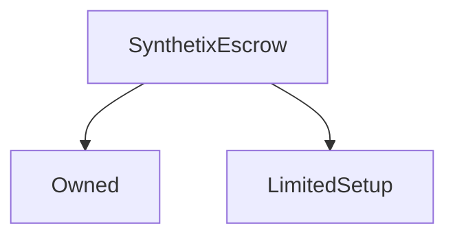

# SynthetixEscrow

**Source:** [contracts/SynthetixEscrow.sol](https://github.com/Synthetixio/synthetix/tree/develop/contracts/SynthetixEscrow.sol)

## Architecture

### Inheritance Graph

---

## Variables

---

### `synthetix`
[Source](https://github.com/Synthetixio/synthetix/tree/develop/contracts/SynthetixEscrow.sol#L21)

**Type:** `contract ISynthetix`

---

### `vestingSchedules`
[Source](https://github.com/Synthetixio/synthetix/tree/develop/contracts/SynthetixEscrow.sol#L25)

**Type:** `mapping(address => uint256[2][])`

---

### `totalVestedAccountBalance`
[Source](https://github.com/Synthetixio/synthetix/tree/develop/contracts/SynthetixEscrow.sol#L28)

**Type:** `mapping(address => uint256)`

---

### `totalVestedBalance`
[Source](https://github.com/Synthetixio/synthetix/tree/develop/contracts/SynthetixEscrow.sol#L31)

**Type:** `uint256`

---

### `TIME_INDEX`
[Source](https://github.com/Synthetixio/synthetix/tree/develop/contracts/SynthetixEscrow.sol#L33)

**Type:** `uint256`

---

### `QUANTITY_INDEX`
[Source](https://github.com/Synthetixio/synthetix/tree/develop/contracts/SynthetixEscrow.sol#L34)

**Type:** `uint256`

---

### `MAX_VESTING_ENTRIES`
[Source](https://github.com/Synthetixio/synthetix/tree/develop/contracts/SynthetixEscrow.sol#L37)

**Type:** `uint256`

## Functions

---

### `constructor`
[Source](https://github.com/Synthetixio/synthetix/tree/develop/contracts/SynthetixEscrow.sol#L41)

??? example "Details"

    **Signature**

    `(address _owner, contract ISynthetix _synthetix) public`

    **Modifiers**

    * [Owned](#owned)

---

### `setSynthetix`
[Source](https://github.com/Synthetixio/synthetix/tree/develop/contracts/SynthetixEscrow.sol#L47)

??? example "Details"

    **Signature**

    `setSynthetix(contract ISynthetix _synthetix) external`

    **Modifiers**

    * [onlyOwner](#onlyowner)

    **Emits**

    * [SynthetixUpdated](#synthetixupdated)

---

### `balanceOf`
[Source](https://github.com/Synthetixio/synthetix/tree/develop/contracts/SynthetixEscrow.sol#L57)

??? example "Details"

    **Signature**

    `balanceOf(address account) public`

---

### `numVestingEntries`
[Source](https://github.com/Synthetixio/synthetix/tree/develop/contracts/SynthetixEscrow.sol#L64)

??? example "Details"

    **Signature**

    `numVestingEntries(address account) public`

---

### `getVestingScheduleEntry`
[Source](https://github.com/Synthetixio/synthetix/tree/develop/contracts/SynthetixEscrow.sol#L72)

??? example "Details"

    **Signature**

    `getVestingScheduleEntry(address account, uint256 index) public`

---

### `getVestingTime`
[Source](https://github.com/Synthetixio/synthetix/tree/develop/contracts/SynthetixEscrow.sol#L79)

??? example "Details"

    **Signature**

    `getVestingTime(address account, uint256 index) public`

---

### `getVestingQuantity`
[Source](https://github.com/Synthetixio/synthetix/tree/develop/contracts/SynthetixEscrow.sol#L86)

??? example "Details"

    **Signature**

    `getVestingQuantity(address account, uint256 index) public`

---

### `getNextVestingIndex`
[Source](https://github.com/Synthetixio/synthetix/tree/develop/contracts/SynthetixEscrow.sol#L93)

??? example "Details"

    **Signature**

    `getNextVestingIndex(address account) public`

---

### `getNextVestingEntry`
[Source](https://github.com/Synthetixio/synthetix/tree/develop/contracts/SynthetixEscrow.sol#L106)

??? example "Details"

    **Signature**

    `getNextVestingEntry(address account) public`

---

### `getNextVestingTime`
[Source](https://github.com/Synthetixio/synthetix/tree/develop/contracts/SynthetixEscrow.sol#L117)

??? example "Details"

    **Signature**

    `getNextVestingTime(address account) external`

---

### `getNextVestingQuantity`
[Source](https://github.com/Synthetixio/synthetix/tree/develop/contracts/SynthetixEscrow.sol#L124)

??? example "Details"

    **Signature**

    `getNextVestingQuantity(address account) external`

---

### `withdrawSynthetix`
[Source](https://github.com/Synthetixio/synthetix/tree/develop/contracts/SynthetixEscrow.sol#L134)

??? example "Details"

    **Signature**

    `withdrawSynthetix(uint256 quantity) external`

    **Modifiers**

    * [onlyOwner](#onlyowner)

    * [onlyDuringSetup](#onlyduringsetup)

---

### `purgeAccount`
[Source](https://github.com/Synthetixio/synthetix/tree/develop/contracts/SynthetixEscrow.sol#L141)

??? example "Details"

    **Signature**

    `purgeAccount(address account) external`

    **Modifiers**

    * [onlyOwner](#onlyowner)

    * [onlyDuringSetup](#onlyduringsetup)

---

### `appendVestingEntry`
[Source](https://github.com/Synthetixio/synthetix/tree/develop/contracts/SynthetixEscrow.sol#L160)

??? example "Details"

    **Signature**

    `appendVestingEntry(address account, uint256 time, uint256 quantity) public`

    **Requires**

    * [require(..., Time must be in the future)](https://github.com/Synthetixio/synthetix/tree/develop/contracts/SynthetixEscrow.sol#L166)

    * [require(..., Quantity cannot be zero)](https://github.com/Synthetixio/synthetix/tree/develop/contracts/SynthetixEscrow.sol#L167)

    * [require(..., Must be enough balance in the contract to provide for the vesting entry)](https://github.com/Synthetixio/synthetix/tree/develop/contracts/SynthetixEscrow.sol#L171)

    * [require(..., Vesting schedule is too long)](https://github.com/Synthetixio/synthetix/tree/develop/contracts/SynthetixEscrow.sol#L178)

    **Modifiers**

    * [onlyOwner](#onlyowner)

    * [onlyDuringSetup](#onlyduringsetup)

---

### `addVestingSchedule`
[Source](https://github.com/Synthetixio/synthetix/tree/develop/contracts/SynthetixEscrow.sol#L202)

??? example "Details"

    **Signature**

    `addVestingSchedule(address account, uint256[] times, uint256[] quantities) external`

    **Modifiers**

    * [onlyOwner](#onlyowner)

    * [onlyDuringSetup](#onlyduringsetup)

---

### `vest`
[Source](https://github.com/Synthetixio/synthetix/tree/develop/contracts/SynthetixEscrow.sol#L215)

??? example "Details"

    **Signature**

    `vest() external`

---

## Events

---

### `SynthetixUpdated`
[Source](https://github.com/Synthetixio/synthetix/tree/develop/contracts/SynthetixEscrow.sol#L243)

- `(address newSynthetix)`

---

### `Vested`
[Source](https://github.com/Synthetixio/synthetix/tree/develop/contracts/SynthetixEscrow.sol#L245)

- `(address beneficiary, uint256 time, uint256 value)`

---

