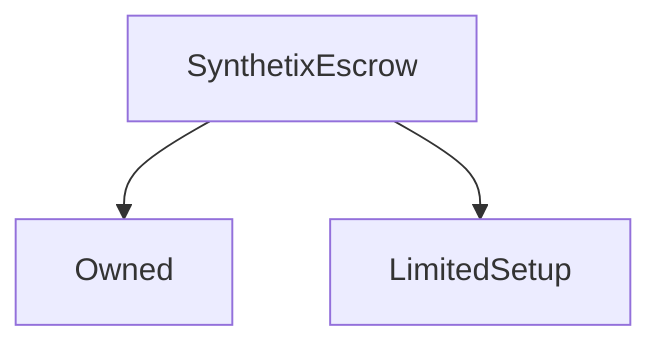

# SynthetixEscrow

## Description

This contract holds the SNX which were escrowed at the time of the original token sale, releasing them according to a defined schedule.

The contract was subject to an eight week setup period during which the vesting schedules were set up.

This contract is augmented by the [`EscrowChecker`](EscrowChecker.md) contract, which is able to return vesting schedules as an array rather than one at a time.

**Source:** [contracts/SynthetixEscrow.sol](https://github.com/Synthetixio/synthetix/tree/v2.21.15/contracts/SynthetixEscrow.sol)

## Architecture

---
### Inheritance Graph

---
### Libraries

- [SafeMath](/libraries/SafeMath) for `uint`

## Constants

---
### `MAX_VESTING_ENTRIES`

[Source](https://github.com/Synthetixio/synthetix/tree/v2.21.15/contracts/SynthetixEscrow.sol#L37)

**Type:** `uint256`

---
### `QUANTITY_INDEX`

[Source](https://github.com/Synthetixio/synthetix/tree/v2.21.15/contracts/SynthetixEscrow.sol#L34)

**Type:** `uint256`

---
### `TIME_INDEX`

[Source](https://github.com/Synthetixio/synthetix/tree/v2.21.15/contracts/SynthetixEscrow.sol#L33)

**Type:** `uint256`

## Variables

---
### `synthetix`

[Source](https://github.com/Synthetixio/synthetix/tree/v2.21.15/contracts/SynthetixEscrow.sol#L21)

The address of the main [`Synthetix`](Synthetix.md) contract.

**Type:** `contract ISynthetix`

---
### `totalVestedAccountBalance`

[Source](https://github.com/Synthetixio/synthetix/tree/v2.21.15/contracts/SynthetixEscrow.sol#L28)

The quantity of remaining tokens for a given account; it saves the recomputation involved in summing over [`vestingSchedules`](#vestingschedules) entries.

**Type:** `mapping(address => uint256)`

---
### `totalVestedBalance`

[Source](https://github.com/Synthetixio/synthetix/tree/v2.21.15/contracts/SynthetixEscrow.sol#L31)

The total remaining vested balance in this contract.

**Type:** `uint256`

---
### `vestingSchedules`

[Source](https://github.com/Synthetixio/synthetix/tree/v2.21.15/contracts/SynthetixEscrow.sol#L25)

Stores the vesting schedule for each for each account. Each schedule is a list of `(vesting timestamp, quantity)` pairs in ascending time order.

**Type:** `mapping(address => uint256[2][])`

## Function (Constructor)

---
### `constructor`

[Source](https://github.com/Synthetixio/synthetix/tree/v2.21.15/contracts/SynthetixEscrow.sol#L41)

??? example "Details"

    **Signature**

    `(address _owner, contract ISynthetix _synthetix)`

    **State Mutability**

    `nonpayable`

    **Modifiers**

    * [Owned](#owned)

## Functions

---
### `balanceOf`

[Source](https://github.com/Synthetixio/synthetix/tree/v2.21.15/contracts/SynthetixEscrow.sol#L57)

An alias to [`totalVestedAccountBalance[account]`](#totalvestedaccountbalance) for ERC20 integration.

??? example "Details"

    **Signature**

    `balanceOf(address account)`

    **State Mutability**

    `view`

---
### `getNextVestingEntry`

[Source](https://github.com/Synthetixio/synthetix/tree/v2.21.15/contracts/SynthetixEscrow.sol#L106)

Returns the next vesting entry in the same manner as [`getNextVestingIndex`](#getnextvestingindex). Returns `[0,0]` if there is no next vesting entry.

??? example "Details"

    **Signature**

    `getNextVestingEntry(address account)`

    **State Mutability**

    `view`

---
### `getNextVestingIndex`

[Source](https://github.com/Synthetixio/synthetix/tree/v2.21.15/contracts/SynthetixEscrow.sol#L93)

Returns the index of the next vesting entry that will vest for a given account. Returns one past the end if there are none remaining.

The function iterates until it finds the first nonzero vesting entry timestamp, so the gas cost increases slightly as more entries vest.

??? example "Details"

    **Signature**

    `getNextVestingIndex(address account)`

    **State Mutability**

    `view`

---
### `getNextVestingQuantity`

[Source](https://github.com/Synthetixio/synthetix/tree/v2.21.15/contracts/SynthetixEscrow.sol#L124)

Returns the SNX quantity of the next vesting entry. Returns `0` if there is no such entry.

??? example "Details"

    **Signature**

    `getNextVestingQuantity(address account)`

    **State Mutability**

    `view`

---
### `getNextVestingTime`

[Source](https://github.com/Synthetixio/synthetix/tree/v2.21.15/contracts/SynthetixEscrow.sol#L117)

Returns the timestamp of the next vesting entry. Returns `0` if there is no such entry.

??? example "Details"

    **Signature**

    `getNextVestingTime(address account)`

    **State Mutability**

    `view`

---
### `getVestingQuantity`

[Source](https://github.com/Synthetixio/synthetix/tree/v2.21.15/contracts/SynthetixEscrow.sol#L86)

Returns the quantity of SNX a given schedule entry will yield.

??? example "Details"

    **Signature**

    `getVestingQuantity(address account, uint256 index)`

    **State Mutability**

    `view`

---
### `getVestingScheduleEntry`

[Source](https://github.com/Synthetixio/synthetix/tree/v2.21.15/contracts/SynthetixEscrow.sol#L72)

Returns a particular schedule entry for an account, which is a pair of uints: `(vesting timestamp, SNX quantity)`.

This is here because the public function generated for [`vestingSchedules`](#vestingschedules) awkwardly requires the index into the pair as its third argument.

??? example "Details"

    **Signature**

    `getVestingScheduleEntry(address account, uint256 index)`

    **State Mutability**

    `view`

---
### `getVestingTime`

[Source](https://github.com/Synthetixio/synthetix/tree/v2.21.15/contracts/SynthetixEscrow.sol#L79)

Returns the time at which a given schedule entry will vest.

??? example "Details"

    **Signature**

    `getVestingTime(address account, uint256 index)`

    **State Mutability**

    `view`

---
### `numVestingEntries`

[Source](https://github.com/Synthetixio/synthetix/tree/v2.21.15/contracts/SynthetixEscrow.sol#L64)

The number of entries in an account's vesting schedule, including those already claimed.

??? example "Details"

    **Signature**

    `numVestingEntries(address account)`

    **State Mutability**

    `view`

---
### `vest`

[Source](https://github.com/Synthetixio/synthetix/tree/v2.21.15/contracts/SynthetixEscrow.sol#L215)

Finds all vesting schedule entries that have come due for the caller and transfers the total quantity of tokens to them. Vested entries are overwritten with `[0,0]`.

??? example "Details"

    **Signature**

    `vest()`

    **State Mutability**

    `nonpayable`

## Functions (onlyOwner)

---
### `addVestingSchedule`

[Source](https://github.com/Synthetixio/synthetix/tree/v2.21.15/contracts/SynthetixEscrow.sol#L202)

??? example "Details"

    **Signature**

    `addVestingSchedule(address account, uint256[] times, uint256[] quantities)`

    **State Mutability**

    `nonpayable`

    **Modifiers**

    * [onlyOwner](#onlyowner)

    * [onlyDuringSetup](#onlyduringsetup)

---
### `appendVestingEntry`

[Source](https://github.com/Synthetixio/synthetix/tree/v2.21.15/contracts/SynthetixEscrow.sol#L160)

??? example "Details"

    **Signature**

    `appendVestingEntry(address account, uint256 time, uint256 quantity)`

    **State Mutability**

    `nonpayable`

    **Requires**

    * [require(..., Time must be in the future)](https://github.com/Synthetixio/synthetix/tree/v2.21.15/contracts/SynthetixEscrow.sol#L166)

    * [require(..., Quantity cannot be zero)](https://github.com/Synthetixio/synthetix/tree/v2.21.15/contracts/SynthetixEscrow.sol#L167)

    * [require(..., Must be enough balance in the contract to provide for the vesting entry)](https://github.com/Synthetixio/synthetix/tree/v2.21.15/contracts/SynthetixEscrow.sol#L171)

    * [require(..., Vesting schedule is too long)](https://github.com/Synthetixio/synthetix/tree/v2.21.15/contracts/SynthetixEscrow.sol#L178)

    **Modifiers**

    * [onlyOwner](#onlyowner)

    * [onlyDuringSetup](#onlyduringsetup)

---
### `purgeAccount`

[Source](https://github.com/Synthetixio/synthetix/tree/v2.21.15/contracts/SynthetixEscrow.sol#L141)

??? example "Details"

    **Signature**

    `purgeAccount(address account)`

    **State Mutability**

    `nonpayable`

    **Modifiers**

    * [onlyOwner](#onlyowner)

    * [onlyDuringSetup](#onlyduringsetup)

---
### `setSynthetix`

[Source](https://github.com/Synthetixio/synthetix/tree/v2.21.15/contracts/SynthetixEscrow.sol#L47)

??? example "Details"

    **Signature**

    `setSynthetix(contract ISynthetix _synthetix)`

    **State Mutability**

    `nonpayable`

    **Modifiers**

    * [onlyOwner](#onlyowner)

    **Emits**

    * [SynthetixUpdated](#synthetixupdated)

---
### `withdrawSynthetix`

[Source](https://github.com/Synthetixio/synthetix/tree/v2.21.15/contracts/SynthetixEscrow.sol#L134)

??? example "Details"

    **Signature**

    `withdrawSynthetix(uint256 quantity)`

    **State Mutability**

    `nonpayable`

    **Modifiers**

    * [onlyOwner](#onlyowner)

    * [onlyDuringSetup](#onlyduringsetup)

## Events

---
### `SynthetixUpdated`

[Source](https://github.com/Synthetixio/synthetix/tree/v2.21.15/contracts/SynthetixEscrow.sol#L243)

Records that the SNX contract address was altered.

**Signature:** `SynthetixUpdated(address newSynthetix)`

- `(address newSynthetix)`

---
### `Vested`

[Source](https://github.com/Synthetixio/synthetix/tree/v2.21.15/contracts/SynthetixEscrow.sol#L245)

Records that an account vested a quantity of tokens.

**Signature:** `Vested(address indexed beneficiary, uint time, uint value)`

- `(address beneficiary, uint256 time, uint256 value)`

