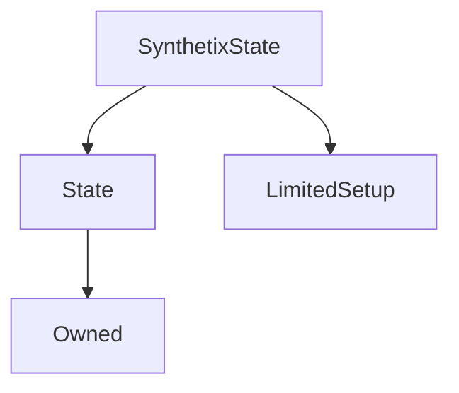

# SynthetixState

**Source:** [contracts/SynthetixState.sol](https://github.com/Synthetixio/synthetix/tree/develop/contracts/SynthetixState.sol)

## Architecture

### Inheritance Graph

---

## Structs

---

### IssuanceData
[Source](https://github.com/Synthetixio/synthetix/tree/develop/contracts/SynthetixState.sol#L19)

| Field | Type | Description |
| ------ | ------ | ------ |
| initialDebtOwnership | uint256 | TBA |
| debtEntryIndex | uint256 | TBA |

---

## Variables

---

### `issuanceData`
[Source](https://github.com/Synthetixio/synthetix/tree/develop/contracts/SynthetixState.sol#L33)

**Type:** `mapping(address => struct SynthetixState.IssuanceData)`

---

### `totalIssuerCount`
[Source](https://github.com/Synthetixio/synthetix/tree/develop/contracts/SynthetixState.sol#L36)

**Type:** `uint256`

---

### `debtLedger`
[Source](https://github.com/Synthetixio/synthetix/tree/develop/contracts/SynthetixState.sol#L39)

**Type:** `uint256[]`

---

### `issuanceRatio`
[Source](https://github.com/Synthetixio/synthetix/tree/develop/contracts/SynthetixState.sol#L43)

**Type:** `uint256`

---

### `MAX_ISSUANCE_RATIO`
[Source](https://github.com/Synthetixio/synthetix/tree/develop/contracts/SynthetixState.sol#L45)

**Type:** `uint256`

---

### `preferredCurrency`
[Source](https://github.com/Synthetixio/synthetix/tree/develop/contracts/SynthetixState.sol#L49)

**Type:** `mapping(address => bytes4)`

---

## Functions

---

### `constructor`
[Source](https://github.com/Synthetixio/synthetix/tree/develop/contracts/SynthetixState.sol#L51)

??? example "Details"

    **Signature**

    `(address _owner, address _associatedContract) public`

    **Modifiers**

    * [Owned](#owned)

    * [State](#state)

    * [LimitedSetup](#limitedsetup)

---

### `setCurrentIssuanceData`
[Source](https://github.com/Synthetixio/synthetix/tree/develop/contracts/SynthetixState.sol#L66)

??? example "Details"

    **Signature**

    `setCurrentIssuanceData(address account, uint256 initialDebtOwnership) external`

    **Modifiers**

    * [onlyAssociatedContract](#onlyassociatedcontract)

---

### `clearIssuanceData`
[Source](https://github.com/Synthetixio/synthetix/tree/develop/contracts/SynthetixState.sol#L76)

??? example "Details"

    **Signature**

    `clearIssuanceData(address account) external`

    **Modifiers**

    * [onlyAssociatedContract](#onlyassociatedcontract)

---

### `incrementTotalIssuerCount`
[Source](https://github.com/Synthetixio/synthetix/tree/develop/contracts/SynthetixState.sol#L84)

??? example "Details"

    **Signature**

    `incrementTotalIssuerCount() external`

    **Modifiers**

    * [onlyAssociatedContract](#onlyassociatedcontract)

---

### `decrementTotalIssuerCount`
[Source](https://github.com/Synthetixio/synthetix/tree/develop/contracts/SynthetixState.sol#L92)

??? example "Details"

    **Signature**

    `decrementTotalIssuerCount() external`

    **Modifiers**

    * [onlyAssociatedContract](#onlyassociatedcontract)

---

### `appendDebtLedgerValue`
[Source](https://github.com/Synthetixio/synthetix/tree/develop/contracts/SynthetixState.sol#L101)

??? example "Details"

    **Signature**

    `appendDebtLedgerValue(uint256 value) external`

    **Modifiers**

    * [onlyAssociatedContract](#onlyassociatedcontract)

---

### `setPreferredCurrency`
[Source](https://github.com/Synthetixio/synthetix/tree/develop/contracts/SynthetixState.sol#L111)

??? example "Details"

    **Signature**

    `setPreferredCurrency(address account, bytes4 currencyKey) external`

    **Modifiers**

    * [onlyAssociatedContract](#onlyassociatedcontract)

---

### `setIssuanceRatio`
[Source](https://github.com/Synthetixio/synthetix/tree/develop/contracts/SynthetixState.sol#L119)

??? example "Details"

    **Signature**

    `setIssuanceRatio(uint256 _issuanceRatio) external`

    **Requires**

    * [require(..., New issuance ratio cannot exceed MAX_ISSUANCE_RATIO)](https://github.com/Synthetixio/synthetix/tree/develop/contracts/SynthetixState.sol#L120)

    **Modifiers**

    * [onlyOwner](#onlyowner)

    **Emits**

    * [IssuanceRatioUpdated](#issuanceratioupdated)

---

### `debtLedgerLength`
[Source](https://github.com/Synthetixio/synthetix/tree/develop/contracts/SynthetixState.sol#L153)

??? example "Details"

    **Signature**

    `debtLedgerLength() external`

---

### `lastDebtLedgerEntry`
[Source](https://github.com/Synthetixio/synthetix/tree/develop/contracts/SynthetixState.sol#L160)

??? example "Details"

    **Signature**

    `lastDebtLedgerEntry() external`

---

### `hasIssued`
[Source](https://github.com/Synthetixio/synthetix/tree/develop/contracts/SynthetixState.sol#L168)

??? example "Details"

    **Signature**

    `hasIssued(address account) external`

---

## Events

---

### `IssuanceRatioUpdated`
[Source](https://github.com/Synthetixio/synthetix/tree/develop/contracts/SynthetixState.sol#L172)

- `(uint256 newRatio)`

---

