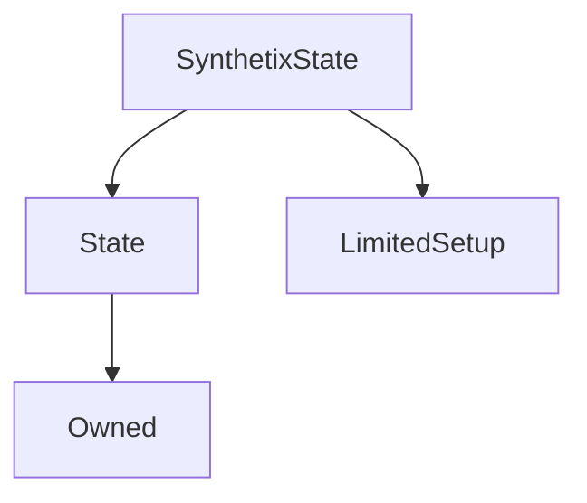

# SynthetixState

This is a state contract associated with the main [`Synthetix`](Synthetix.md) contract, which is the only address permitted to invoke most of its functionality.

This contract is responsible for recording issuance and debt information for the system and users within it, as well as the global [issuance ratio](#issuanceratio).

Upon system updates, this contract will continue to exist, while the Synthetix logic itself is swapped out.

!!! danger "Disabled: Preferred Currency Transfer Conversion"

    This contract also contains functionality enabling automatic [preferred currency](#preferredcurrency) conversion on Synth transfers, but it is currently disabled.

**Source:** [SynthetixState.sol](https://github.com/Synthetixio/synthetix/blob/master/contracts/SynthetixState.sol)

## Architecture

---
### Inheritance Graph

---
### Related Contracts

- Synthetix as this contract's `State.associatedContract`

---
### Libraries

- [SafeMath](/libraries/SafeMath) for `uint`
- [SafeDecimalMath](/libraries/SafeDecimalMath) for `uint`

## Description

**Source:** [contracts/SynthetixState.sol](https://github.com/Synthetixio/synthetix/tree/v2.21.15/contracts/SynthetixState.sol)

## Constants

---
### `MAX_ISSUANCE_RATIO`

[Source](https://github.com/Synthetixio/synthetix/tree/v2.21.15/contracts/SynthetixState.sol#L45)

**Type:** `uint256`

## Variables

---
### `debtLedger`

[Source](https://github.com/Synthetixio/synthetix/tree/v2.21.15/contracts/SynthetixState.sol#L39)

A list of factors indicating, for each [debt-modifying event](#appenddebtledgervalue), what effect it had on the percentage of debt of all other holders. Later debt ledger entries correspond to more recent issuance events.

**Type:** `uint256[]`

---
### `issuanceData`

[Source](https://github.com/Synthetixio/synthetix/tree/v2.21.15/contracts/SynthetixState.sol#L33)

The most recent issuance data for each address.

**Type:** `mapping(address => struct SynthetixState.IssuanceData)`

---
### `issuanceRatio`

[Source](https://github.com/Synthetixio/synthetix/tree/v2.21.15/contracts/SynthetixState.sol#L43)

The current global issuance ratio, which is the conversion factor between a value of SNX and the value of synths issued against them. As a result this determines the maximum ratio between the total value of Synths and SNX in the system.

It is also the target ratio for SNX stakers. As per the logic in [`FeePool.feesClaimable`](FeePool.md#feesclaimable), stakers can only claim any fee rewards if they are within ten percent of the issuance ratio. Therefore altering it will also alter the maximum total supply of Synths, as suppliers of Synths are strongly incentivised to track the issuance ratio closely.

If the issuance ratio is $\rho$, then the [maximum value](Synthetix.md#maxissuablesynths) $V_s$ of a synth $s$ [issuable](Synthetix.md#issuesynths) against a value $V_c$ of SNX collateral is just:

$$
V_s = \rho \ V_c
$$

Given that currency is worth its price times its quantity ($V_x = \pi_x \ Q_x$), we have:

$$
\pi_s \ Q_s = \rho \ \pi_c \ Q_c
$$

This implies that the quantity of synths received upon issuance is the quantity of collateral staked, multiplied by the issuance ratio and the ratio between the collateral and synth prices.

$$
Q_s = \rho \ \frac{\pi_c}{\pi_s} \ Q_c
$$

As a result of this calculation, the number of synths that can be issued increases as the SNX price increases, but decreases as the synth price increases. Since neither market prices nor synth supply can be controlled directly, the remaining parameter, the issuance ratio, is an important way of affecting these quantities.

???+ info "The Issuance Ratio as a Macro-Economic Lever"

    Tweaking the issuance ratio is an effective means of altering the total synth supply, and therefore its price.
    
    In cases where Synths are oversupplied, there is downward price pressure and decreased stability. Decreasing the issuance ratio both constrains the total supply of Synths circulating in the system, and transiently increases aggregate demand for Synths as every staker must rebuy a quantity of Synths and burn them.
    
    For precisely these reasons the issuance ratio was altered by [SCCP-2](https://sips.synthetix.io/sccp/sccp-2) from its initial value of $\frac{1}{5}$ to $\frac{2}{15}$.
    
    The related case of increasing the issuance ratio is similar.

**Type:** `uint256`

---
### `preferredCurrency`

[Source](https://github.com/Synthetixio/synthetix/tree/v2.21.15/contracts/SynthetixState.sol#L49)

!!! danger "Disabled"

    This feature is currently dormant. It can still operate, but the [`Synthetix`](Synthetix.md) contract does not expose any means for an account's preferred currency to actually be set, so it never operates.

If users nominate a preferred currency, all synths they receive will be converted to this currency. This mapping stores the nominated preferred currency for each account, if any. A null preferred currency means no conversion will be performed.

This is used within [`Synth._internalTransfer`](Synth.md#_internaltransfer).

!!! caution "Short Currency Keys"

    Note that as of [SIP-17](https://sips.synthetix.io/sips/sip-17) currency keys in other contracts are of the `bytes32` type. This means that if this preferred currency component is ever reused, it will only be able to support short-named synths unless new storage is provided.

**Type:** `mapping(address => bytes4)`

---
### `totalIssuerCount`

[Source](https://github.com/Synthetixio/synthetix/tree/v2.21.15/contracts/SynthetixState.sol#L36)

The number of people with outstanding synths.

**Type:** `uint256`

## Structs

---
### `IssuanceData`

[Source](https://github.com/Synthetixio/synthetix/tree/v2.21.15/contracts/SynthetixState.sol#L19)

| Field | Type | Description |
| ------ | ------ | ------ |
| initialDebtOwnership | uint256 | TBA |
| debtEntryIndex | uint256 | TBA |

## Function (Constructor)

---
### `constructor`

[Source](https://github.com/Synthetixio/synthetix/tree/v2.21.15/contracts/SynthetixState.sol#L51)

??? example "Details"

    **Signature**

    `(address _owner, address _associatedContract)`

    **State Mutability**

    `nonpayable`

    **Modifiers**

    * [Owned](#owned)

    * [State](#state)

    * [LimitedSetup](#limitedsetup)

## Functions

---
### `appendDebtLedgerValue`

[Source](https://github.com/Synthetixio/synthetix/tree/v2.21.15/contracts/SynthetixState.sol#L101)

Pushes a new value to the end of the [`debtLedger`](#debtledger).

This is used by [`Synthetix._addToDebtRegister`](Synthetix.md#addtodebtregister) contract whenever Synths are issued or burnt, which modifies the total outstanding system debt.

??? example "Details"

    **Signature**

    `appendDebtLedgerValue(uint256 value)`

    **State Mutability**

    `nonpayable`

    **Modifiers**

    * [onlyAssociatedContract](#onlyassociatedcontract)

---
### `clearIssuanceData`

[Source](https://github.com/Synthetixio/synthetix/tree/v2.21.15/contracts/SynthetixState.sol#L76)

Deletes the issuance data associated with a given account.

??? example "Details"

    **Signature**

    `clearIssuanceData(address account)`

    **State Mutability**

    `nonpayable`

    **Modifiers**

    * [onlyAssociatedContract](#onlyassociatedcontract)

---
### `debtLedgerLength`

[Source](https://github.com/Synthetixio/synthetix/tree/v2.21.15/contracts/SynthetixState.sol#L153)

Returns the number of entries currently in [`debtLedger`](#debtledger).

Primarily used in [`FeePool`](FeePool.md) for fee period computations.

??? example "Details"

    **Signature**

    `debtLedgerLength()`

    **State Mutability**

    `view`

---
### `decrementTotalIssuerCount`

[Source](https://github.com/Synthetixio/synthetix/tree/v2.21.15/contracts/SynthetixState.sol#L92)

Reduces [`totalIssuerCount`](#totalissuercount) by one. This is called within [`Synthetix._removeFromDebtRegister`](Synthetix.md#_removefromdebtregister) whenever an issuer burns enough Synths to pay down their entire outstanding debt.

??? example "Details"

    **Signature**

    `decrementTotalIssuerCount()`

    **State Mutability**

    `nonpayable`

    **Modifiers**

    * [onlyAssociatedContract](#onlyassociatedcontract)

---
### `hasIssued`

[Source](https://github.com/Synthetixio/synthetix/tree/v2.21.15/contracts/SynthetixState.sol#L168)

Returns true if a given account has any outstanding issuance debt resulting from Synth minting.

Used in [`Synthetix._addToDebtRegister`](Synthetix.md#_addtodebtregister) to determine whether an minting event requires incrementing the total issuer count.

??? example "Details"

    **Signature**

    `hasIssued(address account)`

    **State Mutability**

    `view`

---
### `incrementTotalIssuerCount`

[Source](https://github.com/Synthetixio/synthetix/tree/v2.21.15/contracts/SynthetixState.sol#L84)

Increases [`totalIssuerCount`](#totalissuercount) by one. This is called within [`Synthetix._addToDebtRegister`](Synthetix.md#_addtodebtregister) whenever an account with no outstanding issuance debt mints new Synths.

??? example "Details"

    **Signature**

    `incrementTotalIssuerCount()`

    **State Mutability**

    `nonpayable`

    **Modifiers**

    * [onlyAssociatedContract](#onlyassociatedcontract)

---
### `lastDebtLedgerEntry`

[Source](https://github.com/Synthetixio/synthetix/tree/v2.21.15/contracts/SynthetixState.sol#L160)

Returns the most recent [`debtLedger`](#debtledger) entry.

Primarily used in the [`Synthetix`](Synthetix.md) for debt computations.

??? example "Details"

    **Signature**

    `lastDebtLedgerEntry()`

    **State Mutability**

    `view`

---
### `setCurrentIssuanceData`

[Source](https://github.com/Synthetixio/synthetix/tree/v2.21.15/contracts/SynthetixState.sol#L66)

Allows the [`Synthetix`](Synthetix.md) contract to update the debt ownership entry for this account and sets their debt entry index to the current length of the [`debtLedger`](#debtledger).
The debt ledger itself is not modified.

??? example "Details"

    **Signature**

    `setCurrentIssuanceData(address account, uint256 initialDebtOwnership)`

    **State Mutability**

    `nonpayable`

    **Modifiers**

    * [onlyAssociatedContract](#onlyassociatedcontract)

---
### `setPreferredCurrency`

[Source](https://github.com/Synthetixio/synthetix/tree/v2.21.15/contracts/SynthetixState.sol#L111)

!!! danger "Disabled"

    This function is not used anywhere within the [`Synthetix`](Synthetix.md) contract, which is the only address with the privileges to call it. As a result the preferred currency feature is not operational.

Sets the preferred currency for a particular account. Pass in null to unset this value.

??? example "Details"

    **Signature**

    `setPreferredCurrency(address account, bytes4 currencyKey)`

    **State Mutability**

    `nonpayable`

    **Modifiers**

    * [onlyAssociatedContract](#onlyassociatedcontract)

## Functions (onlyOwner)

---
### `setIssuanceRatio`

[Source](https://github.com/Synthetixio/synthetix/tree/v2.21.15/contracts/SynthetixState.sol#L119)

??? example "Details"

    **Signature**

    `setIssuanceRatio(uint256 _issuanceRatio)`

    **State Mutability**

    `nonpayable`

    **Requires**

    * [require(..., New issuance ratio cannot exceed MAX_ISSUANCE_RATIO)](https://github.com/Synthetixio/synthetix/tree/v2.21.15/contracts/SynthetixState.sol#L120)

    **Modifiers**

    * [onlyOwner](#onlyowner)

    **Emits**

    * [IssuanceRatioUpdated](#issuanceratioupdated)

## Events

---
### `IssuanceRatioUpdated`

[Source](https://github.com/Synthetixio/synthetix/tree/v2.21.15/contracts/SynthetixState.sol#L172)

Records that the [issuance ratio](#issuanceratio) was modified.

**Signature:** `IssuanceRatioUpdated(uint newRatio)`

- `(uint256 newRatio)`

