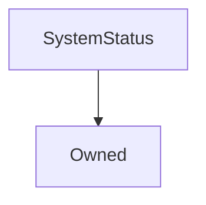

# SystemStatus

**Source:** [contracts/SystemStatus.sol](https://github.com/Synthetixio/synthetix/tree/develop/contracts/SystemStatus.sol)

## Architecture

### Inheritance Graph

---

## Structs

---

### Status
[Source](https://github.com/Synthetixio/synthetix/tree/develop/contracts/SystemStatus.sol#L10)

| Field | Type | Description |
| ------ | ------ | ------ |
| canSuspend | bool | TBA |
| canResume | bool | TBA |

---

### Suspension
[Source](https://github.com/Synthetixio/synthetix/tree/develop/contracts/SystemStatus.sol#L17)

| Field | Type | Description |
| ------ | ------ | ------ |
| suspended | bool | TBA |
| reason | uint248 | TBA |

---

## Variables

---

### `accessControl`
[Source](https://github.com/Synthetixio/synthetix/tree/develop/contracts/SystemStatus.sol#L15)

**Type:** `mapping(bytes32 => mapping(address => struct SystemStatus.Status))`

---

### `SUSPENSION_REASON_UPGRADE`
[Source](https://github.com/Synthetixio/synthetix/tree/develop/contracts/SystemStatus.sol#L24)

**Type:** `uint248`

---

### `SECTION_SYSTEM`
[Source](https://github.com/Synthetixio/synthetix/tree/develop/contracts/SystemStatus.sol#L26)

**Type:** `bytes32`

---

### `SECTION_ISSUANCE`
[Source](https://github.com/Synthetixio/synthetix/tree/develop/contracts/SystemStatus.sol#L27)

**Type:** `bytes32`

---

### `SECTION_EXCHANGE`
[Source](https://github.com/Synthetixio/synthetix/tree/develop/contracts/SystemStatus.sol#L28)

**Type:** `bytes32`

---

### `SECTION_SYNTH`
[Source](https://github.com/Synthetixio/synthetix/tree/develop/contracts/SystemStatus.sol#L29)

**Type:** `bytes32`

---

### `systemSuspension`
[Source](https://github.com/Synthetixio/synthetix/tree/develop/contracts/SystemStatus.sol#L31)

**Type:** `struct SystemStatus.Suspension`

---

### `issuanceSuspension`
[Source](https://github.com/Synthetixio/synthetix/tree/develop/contracts/SystemStatus.sol#L33)

**Type:** `struct SystemStatus.Suspension`

---

### `exchangeSuspension`
[Source](https://github.com/Synthetixio/synthetix/tree/develop/contracts/SystemStatus.sol#L35)

**Type:** `struct SystemStatus.Suspension`

---

### `synthSuspension`
[Source](https://github.com/Synthetixio/synthetix/tree/develop/contracts/SystemStatus.sol#L37)

**Type:** `mapping(bytes32 => struct SystemStatus.Suspension)`

---

## Functions

---

### `constructor`
[Source](https://github.com/Synthetixio/synthetix/tree/develop/contracts/SystemStatus.sol#L39)

??? example "Details"

    **Signature**

    `(address _owner) public`

    **Modifiers**

    * [Owned](#owned)

---

### `requireSystemActive`
[Source](https://github.com/Synthetixio/synthetix/tree/develop/contracts/SystemStatus.sol#L47)

??? example "Details"

    **Signature**

    `requireSystemActive() external`

    **Requires**

    * [_internalRequireSystemActive](https://github.com/Synthetixio/synthetix/tree/develop/contracts/SystemStatus.sol#L48)

---

### `requireIssuanceActive`
[Source](https://github.com/Synthetixio/synthetix/tree/develop/contracts/SystemStatus.sol#L51)

??? example "Details"

    **Signature**

    `requireIssuanceActive() external`

    **Requires**

    * [_internalRequireSystemActive](https://github.com/Synthetixio/synthetix/tree/develop/contracts/SystemStatus.sol#L53)

    * [require(..., Issuance is suspended. Operation prohibited)](https://github.com/Synthetixio/synthetix/tree/develop/contracts/SystemStatus.sol#L54)

---

### `requireExchangeActive`
[Source](https://github.com/Synthetixio/synthetix/tree/develop/contracts/SystemStatus.sol#L57)

??? example "Details"

    **Signature**

    `requireExchangeActive() external`

    **Requires**

    * [_internalRequireSystemActive](https://github.com/Synthetixio/synthetix/tree/develop/contracts/SystemStatus.sol#L59)

    * [require(..., Exchange is suspended. Operation prohibited)](https://github.com/Synthetixio/synthetix/tree/develop/contracts/SystemStatus.sol#L60)

---

### `requireSynthActive`
[Source](https://github.com/Synthetixio/synthetix/tree/develop/contracts/SystemStatus.sol#L63)

??? example "Details"

    **Signature**

    `requireSynthActive(bytes32 currencyKey) external`

    **Requires**

    * [_internalRequireSystemActive](https://github.com/Synthetixio/synthetix/tree/develop/contracts/SystemStatus.sol#L65)

    * [require(..., Synth is suspended. Operation prohibited)](https://github.com/Synthetixio/synthetix/tree/develop/contracts/SystemStatus.sol#L66)

---

### `requireSynthsActive`
[Source](https://github.com/Synthetixio/synthetix/tree/develop/contracts/SystemStatus.sol#L69)

??? example "Details"

    **Signature**

    `requireSynthsActive(bytes32 sourceCurrencyKey, bytes32 destinationCurrencyKey) external`

    **Requires**

    * [_internalRequireSystemActive](https://github.com/Synthetixio/synthetix/tree/develop/contracts/SystemStatus.sol#L71)

    * [require(..., One or more synths are suspended. Operation prohibited)](https://github.com/Synthetixio/synthetix/tree/develop/contracts/SystemStatus.sol#L73)

---

### `isSystemUpgrading`
[Source](https://github.com/Synthetixio/synthetix/tree/develop/contracts/SystemStatus.sol#L79)

??? example "Details"

    **Signature**

    `isSystemUpgrading() external`

---

### `getSynthSuspensions`
[Source](https://github.com/Synthetixio/synthetix/tree/develop/contracts/SystemStatus.sol#L83)

??? example "Details"

    **Signature**

    `getSynthSuspensions(bytes32[] synths) external`

---

### `updateAccessControl`
[Source](https://github.com/Synthetixio/synthetix/tree/develop/contracts/SystemStatus.sol#L98)

??? example "Details"

    **Signature**

    `updateAccessControl(bytes32 section, address account, bool canSuspend, bool canResume) external`

    **Modifiers**

    * [onlyOwner](#onlyowner)

---

### `suspendSystem`
[Source](https://github.com/Synthetixio/synthetix/tree/develop/contracts/SystemStatus.sol#L107)

??? example "Details"

    **Signature**

    `suspendSystem(uint256 reason) external`

    **Requires**

    * [_requireAccessToSuspend](https://github.com/Synthetixio/synthetix/tree/develop/contracts/SystemStatus.sol#L108)

    **Emits**

    * [SystemSuspended](#systemsuspended)

---

### `resumeSystem`
[Source](https://github.com/Synthetixio/synthetix/tree/develop/contracts/SystemStatus.sol#L114)

??? example "Details"

    **Signature**

    `resumeSystem() external`

    **Requires**

    * [_requireAccessToResume](https://github.com/Synthetixio/synthetix/tree/develop/contracts/SystemStatus.sol#L115)

    **Emits**

    * [SystemResumed](#systemresumed)

---

### `suspendIssuance`
[Source](https://github.com/Synthetixio/synthetix/tree/develop/contracts/SystemStatus.sol#L121)

??? example "Details"

    **Signature**

    `suspendIssuance(uint256 reason) external`

    **Requires**

    * [_requireAccessToSuspend](https://github.com/Synthetixio/synthetix/tree/develop/contracts/SystemStatus.sol#L122)

    **Emits**

    * [IssuanceSuspended](#issuancesuspended)

---

### `resumeIssuance`
[Source](https://github.com/Synthetixio/synthetix/tree/develop/contracts/SystemStatus.sol#L128)

??? example "Details"

    **Signature**

    `resumeIssuance() external`

    **Requires**

    * [_requireAccessToResume](https://github.com/Synthetixio/synthetix/tree/develop/contracts/SystemStatus.sol#L129)

    **Emits**

    * [IssuanceResumed](#issuanceresumed)

---

### `suspendExchange`
[Source](https://github.com/Synthetixio/synthetix/tree/develop/contracts/SystemStatus.sol#L135)

??? example "Details"

    **Signature**

    `suspendExchange(uint256 reason) external`

    **Requires**

    * [_requireAccessToSuspend](https://github.com/Synthetixio/synthetix/tree/develop/contracts/SystemStatus.sol#L136)

    **Emits**

    * [ExchangeSuspended](#exchangesuspended)

---

### `resumeExchange`
[Source](https://github.com/Synthetixio/synthetix/tree/develop/contracts/SystemStatus.sol#L142)

??? example "Details"

    **Signature**

    `resumeExchange() external`

    **Requires**

    * [_requireAccessToResume](https://github.com/Synthetixio/synthetix/tree/develop/contracts/SystemStatus.sol#L143)

    **Emits**

    * [ExchangeResumed](#exchangeresumed)

---

### `suspendSynth`
[Source](https://github.com/Synthetixio/synthetix/tree/develop/contracts/SystemStatus.sol#L149)

??? example "Details"

    **Signature**

    `suspendSynth(bytes32 currencyKey, uint256 reason) external`

    **Requires**

    * [_requireAccessToSuspend](https://github.com/Synthetixio/synthetix/tree/develop/contracts/SystemStatus.sol#L150)

    **Emits**

    * [SynthSuspended](#synthsuspended)

---

### `resumeSynth`
[Source](https://github.com/Synthetixio/synthetix/tree/develop/contracts/SystemStatus.sol#L156)

??? example "Details"

    **Signature**

    `resumeSynth(bytes32 currencyKey) external`

    **Requires**

    * [_requireAccessToResume](https://github.com/Synthetixio/synthetix/tree/develop/contracts/SystemStatus.sol#L157)

    **Emits**

    * [SynthResumed](#synthresumed)

---

## Events

---

### `SystemSuspended`
[Source](https://github.com/Synthetixio/synthetix/tree/develop/contracts/SystemStatus.sol#L201)

- `(uint256 reason)`

---

### `SystemResumed`
[Source](https://github.com/Synthetixio/synthetix/tree/develop/contracts/SystemStatus.sol#L202)

- `(uint256 reason)`

---

### `IssuanceSuspended`
[Source](https://github.com/Synthetixio/synthetix/tree/develop/contracts/SystemStatus.sol#L204)

- `(uint256 reason)`

---

### `IssuanceResumed`
[Source](https://github.com/Synthetixio/synthetix/tree/develop/contracts/SystemStatus.sol#L205)

- `(uint256 reason)`

---

### `ExchangeSuspended`
[Source](https://github.com/Synthetixio/synthetix/tree/develop/contracts/SystemStatus.sol#L207)

- `(uint256 reason)`

---

### `ExchangeResumed`
[Source](https://github.com/Synthetixio/synthetix/tree/develop/contracts/SystemStatus.sol#L208)

- `(uint256 reason)`

---

### `SynthSuspended`
[Source](https://github.com/Synthetixio/synthetix/tree/develop/contracts/SystemStatus.sol#L210)

- `(bytes32 currencyKey, uint256 reason)`

---

### `SynthResumed`
[Source](https://github.com/Synthetixio/synthetix/tree/develop/contracts/SystemStatus.sol#L211)

- `(bytes32 currencyKey, uint256 reason)`

---

### `AccessControlUpdated`
[Source](https://github.com/Synthetixio/synthetix/tree/develop/contracts/SystemStatus.sol#L213)

- `(bytes32 section, address account, bool canSuspend, bool canResume)`

---

