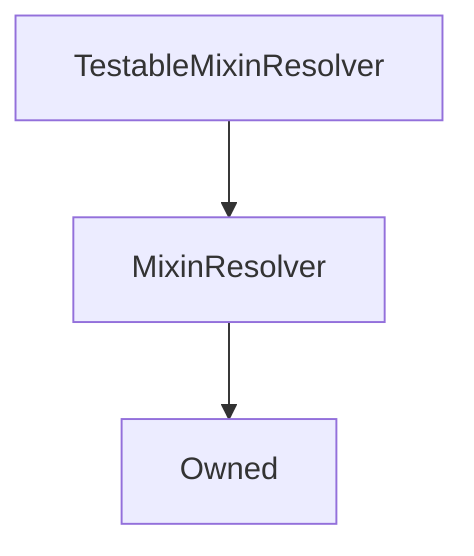

# TestableMixinResolver

## Description

**Source:** [contracts/test-helpers/TestableMixinResolver.sol](https://github.com/Synthetixio/synthetix/tree/develop/contracts/test-helpers/TestableMixinResolver.sol)

## Architecture

---
### Inheritance Graph

## Constants

---
### `CONTRACT_EXAMPLE_1`

[Source](https://github.com/Synthetixio/synthetix/tree/develop/contracts/test-helpers/TestableMixinResolver.sol#L8)

**Type:** `bytes32`

---
### `CONTRACT_EXAMPLE_2`

[Source](https://github.com/Synthetixio/synthetix/tree/develop/contracts/test-helpers/TestableMixinResolver.sol#L9)

**Type:** `bytes32`

---
### `CONTRACT_EXAMPLE_3`

[Source](https://github.com/Synthetixio/synthetix/tree/develop/contracts/test-helpers/TestableMixinResolver.sol#L10)

**Type:** `bytes32`

## Function (Constructor)

---
### `constructor`

[Source](https://github.com/Synthetixio/synthetix/tree/develop/contracts/test-helpers/TestableMixinResolver.sol#L14)

??? example "Details"

    **Signature**

    `(address _owner, address _resolver)`

    **State Mutability**

    `nonpayable`

    **Modifiers**

    * [Owned](#owned)

    * [MixinResolver](#mixinresolver)

## Variables

---
### `addressesToCache`

[Source](https://github.com/Synthetixio/synthetix/tree/develop/contracts/test-helpers/TestableMixinResolver.sol#L12)

**Type:** `bytes32[24]`

