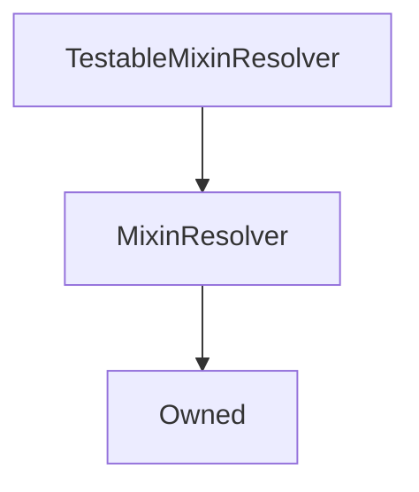

# TestableMixinResolver

## Description

**Source:** [contracts/test-helpers/TestableMixinResolver.sol](https://github.com/Synthetixio/synthetix/tree/develop/contracts/test-helpers/TestableMixinResolver.sol)

## Architecture

---
### Inheritance Graph

## Variables

## Functions

---
### `constructor`

[Source](https://github.com/Synthetixio/synthetix/tree/develop/contracts/test-helpers/TestableMixinResolver.sol#L14)

??? example "Details"

    **Signature**

    `(address _owner, address _resolver) public`

    **Modifiers**

    * [Owned](#owned)

    * [MixinResolver](#mixinresolver)

