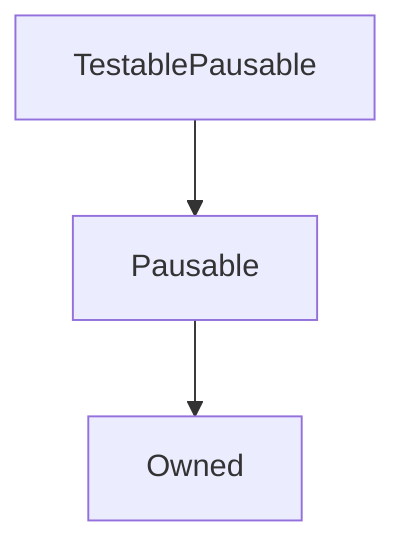

# TestablePausable

## Description

**Source:** [contracts/test-helpers/TestablePausable.sol](https://github.com/Synthetixio/synthetix/tree/develop/contracts/test-helpers/TestablePausable.sol)

## Architecture

---
### Inheritance Graph

## Function (Constructor)

---
### `constructor`

[Source](https://github.com/Synthetixio/synthetix/tree/develop/contracts/test-helpers/TestablePausable.sol#L13)

??? example "Details"

    **Signature**

    `(address _owner)`

    **State Mutability**

    `nonpayable`

    **Modifiers**

    * [Owned](#owned)

    * [Pausable](#pausable)

## Functions

---
### `setSomeValue`

[Source](https://github.com/Synthetixio/synthetix/tree/develop/contracts/test-helpers/TestablePausable.sol#L15)

??? example "Details"

    **Signature**

    `setSomeValue(uint256 _value)`

    **State Mutability**

    `nonpayable`

    **Modifiers**

    * [notPaused](#notpaused)

## Variables

---
### `someValue`

[Source](https://github.com/Synthetixio/synthetix/tree/develop/contracts/test-helpers/TestablePausable.sol#L11)

**Type:** `uint256`

