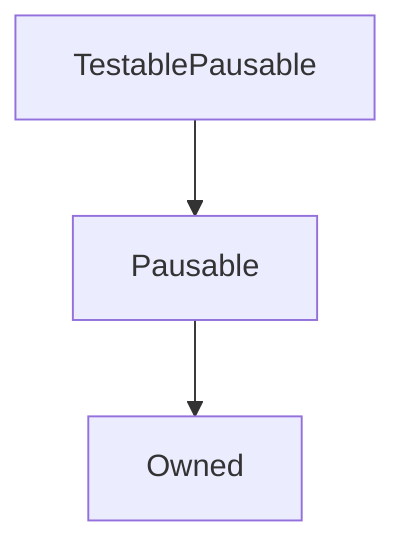

# TestablePausable

**Source:** [contracts/test-helpers/TestablePausable.sol](https://github.com/Synthetixio/synthetix/tree/develop/contracts/test-helpers/TestablePausable.sol)

## Architecture

### Inheritance Graph

---

## Structs

## Variables

---

### `someValue`
[Source](https://github.com/Synthetixio/synthetix/tree/develop/contracts/test-helpers/TestablePausable.sol#L11)

**Type:** `uint256`

## Functions

---

### `constructor`
[Source](https://github.com/Synthetixio/synthetix/tree/develop/contracts/test-helpers/TestablePausable.sol#L13)

??? example "Details"

    **Signature**

    `(address _owner) public`

    **Modifiers**

    * [Owned](#owned)

    * [Pausable](#pausable)

---

### `setSomeValue`
[Source](https://github.com/Synthetixio/synthetix/tree/develop/contracts/test-helpers/TestablePausable.sol#L15)

??? example "Details"

    **Signature**

    `setSomeValue(uint256 _value) external`

    **Modifiers**

    * [notPaused](#notpaused)

---

## Modifiers

## Events

