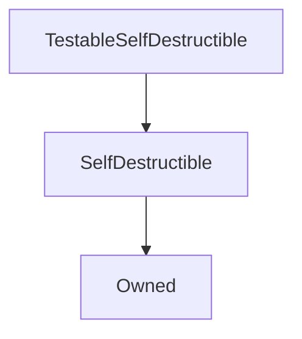

# TestableSelfDestructible

## Description

**Source:** [contracts/test-helpers/TestableSelfDestructible.sol](https://github.com/Synthetixio/synthetix/tree/develop/contracts/test-helpers/TestableSelfDestructible.sol)

## Architecture

---
### Inheritance Graph

## Constants

## Variables

## Function (Constructor)

---
### `constructor`

[Source](https://github.com/Synthetixio/synthetix/tree/develop/contracts/test-helpers/TestableSelfDestructible.sol#L8)

??? example "Details"

    **Signature**

    `(address _owner)`

    **State Mutability**

    `nonpayable`

    **Modifiers**

    * [Owned](#owned)

    * [SelfDestructible](#selfdestructible)

