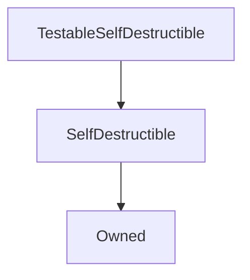

# TestableSelfDestructible

**Source:** [contracts/test-helpers/TestableSelfDestructible.sol](https://github.com/Synthetixio/synthetix/tree/develop/contracts/test-helpers/TestableSelfDestructible.sol)

## Architecture

### Inheritance Graph

---

## Structs

## Variables

## Functions

---

### `constructor`
[Source](https://github.com/Synthetixio/synthetix/tree/develop/contracts/test-helpers/TestableSelfDestructible.sol#L8)

??? example "Details"

    **Signature**

    `(address _owner) public`

    **Modifiers**

    * [Owned](#owned)

    * [SelfDestructible](#selfdestructible)

---

## Modifiers

## Events

