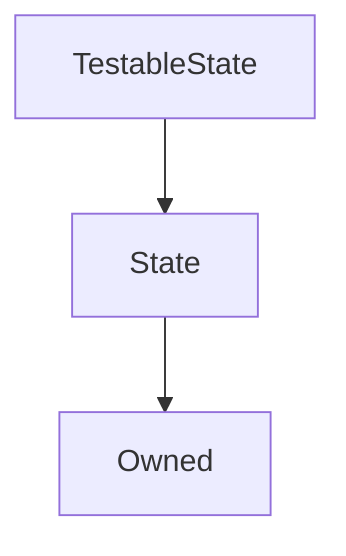

# TestableState

## Description

**Source:** [contracts/test-helpers/TestableState.sol](https://github.com/Synthetixio/synthetix/tree/develop/contracts/test-helpers/TestableState.sol)

## Architecture

---
### Inheritance Graph

## Constants

## Variables

## Function (Constructor)

---
### `constructor`

[Source](https://github.com/Synthetixio/synthetix/tree/develop/contracts/test-helpers/TestableState.sol#L8)

??? example "Details"

    **Signature**

    `(address _owner, address _associatedContract)`

    **State Mutability**

    `nonpayable`

    **Modifiers**

    * [Owned](#owned)

    * [State](#state)

## Functions

---
### `testModifier`

[Source](https://github.com/Synthetixio/synthetix/tree/develop/contracts/test-helpers/TestableState.sol#L10)

??? example "Details"

    **Signature**

    `testModifier()`

    **State Mutability**

    `nonpayable`

    **Modifiers**

    * [onlyAssociatedContract](#onlyassociatedcontract)

