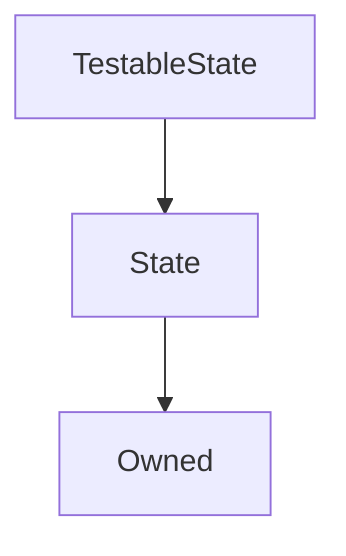

# TestableState

**Source:** [contracts/test-helpers/TestableState.sol](https://github.com/Synthetixio/synthetix/tree/develop/contracts/test-helpers/TestableState.sol)

## Architecture

### Inheritance Graph

---

## Functions

---

### `constructor`
[Source](https://github.com/Synthetixio/synthetix/tree/develop/contracts/test-helpers/TestableState.sol#L8)

??? example "Details"

    **Signature**

    `(address _owner, address _associatedContract) public`

    **Modifiers**

    * [Owned](#owned)

    * [State](#state)

---

### `testModifier`
[Source](https://github.com/Synthetixio/synthetix/tree/develop/contracts/test-helpers/TestableState.sol#L10)

??? example "Details"

    **Signature**

    `testModifier() external`

    **Modifiers**

    * [onlyAssociatedContract](#onlyassociatedcontract)

---

