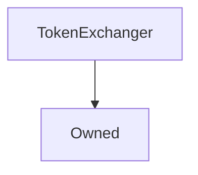

# TokenExchanger

## Description

**Source:** [contracts/test-helpers/TokenExchanger.sol](https://github.com/Synthetixio/synthetix/tree/develop/contracts/test-helpers/TokenExchanger.sol)

## Architecture

---
### Inheritance Graph

## Variables

---
### `integrationProxy`

[Source](https://github.com/Synthetixio/synthetix/tree/develop/contracts/test-helpers/TokenExchanger.sol#L13)

**Type:** `address`

---
### `synthetix`

[Source](https://github.com/Synthetixio/synthetix/tree/develop/contracts/test-helpers/TokenExchanger.sol#L14)

**Type:** `address`

## Modifiers

---
### `synthetixProxyIsSet`

[Source](https://github.com/Synthetixio/synthetix/tree/develop/contracts/test-helpers/TokenExchanger.sol#L62)

## Function (Constructor)

---
### `constructor`

[Source](https://github.com/Synthetixio/synthetix/tree/develop/contracts/test-helpers/TokenExchanger.sol#L16)

??? example "Details"

    **Signature**

    `(address _owner, address _integrationProxy)`

    **State Mutability**

    `nonpayable`

    **Modifiers**

    * [Owned](#owned)

## Functions

---
### `checkAllowance`

[Source](https://github.com/Synthetixio/synthetix/tree/develop/contracts/test-helpers/TokenExchanger.sol#L32)

??? example "Details"

    **Signature**

    `checkAllowance(address tokenOwner, address spender)`

    **State Mutability**

    `view`

    **Modifiers**

    * [synthetixProxyIsSet](#synthetixproxyisset)

---
### `checkBalance`

[Source](https://github.com/Synthetixio/synthetix/tree/develop/contracts/test-helpers/TokenExchanger.sol#L28)

??? example "Details"

    **Signature**

    `checkBalance(address account)`

    **State Mutability**

    `view`

    **Modifiers**

    * [synthetixProxyIsSet](#synthetixproxyisset)

---
### `checkBalanceSNXDirect`

[Source](https://github.com/Synthetixio/synthetix/tree/develop/contracts/test-helpers/TokenExchanger.sol#L36)

??? example "Details"

    **Signature**

    `checkBalanceSNXDirect(address account)`

    **State Mutability**

    `view`

    **Modifiers**

    * [synthetixProxyIsSet](#synthetixproxyisset)

---
### `doTokenSpend`

[Source](https://github.com/Synthetixio/synthetix/tree/develop/contracts/test-helpers/TokenExchanger.sol#L44)

??? example "Details"

    **Signature**

    `doTokenSpend(address fromAccount, address toAccount, uint256 amount)`

    **State Mutability**

    `nonpayable`

    **Requires**

    * [require(..., fromAccount does not have the required balance to spend)](https://github.com/Synthetixio/synthetix/tree/develop/contracts/test-helpers/TokenExchanger.sol#L50)

    * [require(..., I TokenExchanger, do not have approval to spend this guys tokens)](https://github.com/Synthetixio/synthetix/tree/develop/contracts/test-helpers/TokenExchanger.sol#L53)

    **Modifiers**

    * [synthetixProxyIsSet](#synthetixproxyisset)

---
### `getDecimals`

[Source](https://github.com/Synthetixio/synthetix/tree/develop/contracts/test-helpers/TokenExchanger.sol#L40)

??? example "Details"

    **Signature**

    `getDecimals(address tokenAddress)`

    **State Mutability**

    `view`

## Functions (onlyOwner)

---
### `setSynthetix`

[Source](https://github.com/Synthetixio/synthetix/tree/develop/contracts/test-helpers/TokenExchanger.sol#L24)

??? example "Details"

    **Signature**

    `setSynthetix(address _synthetix)`

    **State Mutability**

    `nonpayable`

    **Modifiers**

    * [onlyOwner](#onlyowner)

---
### `setSynthetixProxy`

[Source](https://github.com/Synthetixio/synthetix/tree/develop/contracts/test-helpers/TokenExchanger.sol#L20)

??? example "Details"

    **Signature**

    `setSynthetixProxy(address _integrationProxy)`

    **State Mutability**

    `nonpayable`

    **Modifiers**

    * [onlyOwner](#onlyowner)

## Events

---
### `LogAddress`

[Source](https://github.com/Synthetixio/synthetix/tree/develop/contracts/test-helpers/TokenExchanger.sol#L69)

- `(string name, address value)`

---
### `LogBytes`

[Source](https://github.com/Synthetixio/synthetix/tree/develop/contracts/test-helpers/TokenExchanger.sol#L70)

- `(string name, bytes4 value)`

---
### `LogInt`

[Source](https://github.com/Synthetixio/synthetix/tree/develop/contracts/test-helpers/TokenExchanger.sol#L68)

- `(string name, uint256 value)`

---
### `LogString`

[Source](https://github.com/Synthetixio/synthetix/tree/develop/contracts/test-helpers/TokenExchanger.sol#L67)

- `(string name, string value)`

