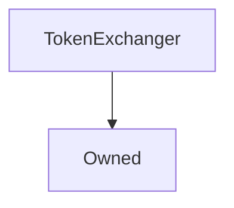

# TokenExchanger

**Source:** [contracts/test-helpers/TokenExchanger.sol](https://github.com/Synthetixio/synthetix/tree/develop/contracts/test-helpers/TokenExchanger.sol)

## Architecture

### Inheritance Graph

---

## Variables

---

### `integrationProxy`
[Source](https://github.com/Synthetixio/synthetix/tree/develop/contracts/test-helpers/TokenExchanger.sol#L13)

**Type:** `address`

---

### `synthetix`
[Source](https://github.com/Synthetixio/synthetix/tree/develop/contracts/test-helpers/TokenExchanger.sol#L14)

**Type:** `address`

## Functions

---

### `constructor`
[Source](https://github.com/Synthetixio/synthetix/tree/develop/contracts/test-helpers/TokenExchanger.sol#L16)

??? example "Details"

    **Signature**

    `(address _owner, address _integrationProxy) public`

    **Modifiers**

    * [Owned](#owned)

---

### `setSynthetixProxy`
[Source](https://github.com/Synthetixio/synthetix/tree/develop/contracts/test-helpers/TokenExchanger.sol#L20)

??? example "Details"

    **Signature**

    `setSynthetixProxy(address _integrationProxy) external`

    **Modifiers**

    * [onlyOwner](#onlyowner)

---

### `setSynthetix`
[Source](https://github.com/Synthetixio/synthetix/tree/develop/contracts/test-helpers/TokenExchanger.sol#L24)

??? example "Details"

    **Signature**

    `setSynthetix(address _synthetix) external`

    **Modifiers**

    * [onlyOwner](#onlyowner)

---

### `checkBalance`
[Source](https://github.com/Synthetixio/synthetix/tree/develop/contracts/test-helpers/TokenExchanger.sol#L28)

??? example "Details"

    **Signature**

    `checkBalance(address account) public`

    **Modifiers**

    * [synthetixProxyIsSet](#synthetixproxyisset)

---

### `checkAllowance`
[Source](https://github.com/Synthetixio/synthetix/tree/develop/contracts/test-helpers/TokenExchanger.sol#L32)

??? example "Details"

    **Signature**

    `checkAllowance(address tokenOwner, address spender) public`

    **Modifiers**

    * [synthetixProxyIsSet](#synthetixproxyisset)

---

### `checkBalanceSNXDirect`
[Source](https://github.com/Synthetixio/synthetix/tree/develop/contracts/test-helpers/TokenExchanger.sol#L36)

??? example "Details"

    **Signature**

    `checkBalanceSNXDirect(address account) public`

    **Modifiers**

    * [synthetixProxyIsSet](#synthetixproxyisset)

---

### `getDecimals`
[Source](https://github.com/Synthetixio/synthetix/tree/develop/contracts/test-helpers/TokenExchanger.sol#L40)

??? example "Details"

    **Signature**

    `getDecimals(address tokenAddress) public`

---

### `doTokenSpend`
[Source](https://github.com/Synthetixio/synthetix/tree/develop/contracts/test-helpers/TokenExchanger.sol#L44)

??? example "Details"

    **Signature**

    `doTokenSpend(address fromAccount, address toAccount, uint256 amount) public`

    **Modifiers**

    * [synthetixProxyIsSet](#synthetixproxyisset)

---

## Modifiers

---

### `synthetixProxyIsSet`
[Source](https://github.com/Synthetixio/synthetix/tree/develop/contracts/test-helpers/TokenExchanger.sol#L62)

---

## Events

---

### `LogString`
[Source](https://github.com/Synthetixio/synthetix/tree/develop/contracts/test-helpers/TokenExchanger.sol#L67)

- `(string name, string value)`

---

### `LogInt`
[Source](https://github.com/Synthetixio/synthetix/tree/develop/contracts/test-helpers/TokenExchanger.sol#L68)

- `(string name, uint256 value)`

---

### `LogAddress`
[Source](https://github.com/Synthetixio/synthetix/tree/develop/contracts/test-helpers/TokenExchanger.sol#L69)

- `(string name, address value)`

---

### `LogBytes`
[Source](https://github.com/Synthetixio/synthetix/tree/develop/contracts/test-helpers/TokenExchanger.sol#L70)

- `(string name, bytes4 value)`

---

