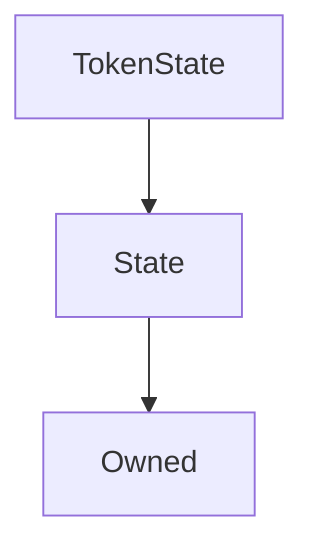

# TokenState

## Description

An external state contract to hold ERC20 balances and allowances. This operates as an adjunct to [`ExternStateToken`](ExternStateToken.md), so that important token information can persist while the token contract itself can be switched out to upgrade its functionality.

**Source:** [contracts/TokenState.sol](https://github.com/Synthetixio/synthetix/tree/develop/contracts/TokenState.sol)

## Architecture

---
### Inheritance Graph

## Function (Constructor)

---
### `constructor`

[Source](https://github.com/Synthetixio/synthetix/tree/develop/contracts/TokenState.sol#L14)

??? example "Details"

    **Signature**

    `(address _owner, address _associatedContract)`

    **State Mutability**

    `nonpayable`

    **Modifiers**

    * [Owned](#owned)

    * [State](#state)

## Functions

---
### `setAllowance`

[Source](https://github.com/Synthetixio/synthetix/tree/develop/contracts/TokenState.sol#L26)

Sets the token allowance granted to the `spender` by the `tokenOwner`.

??? example "Details"

    **Signature**

    `setAllowance(address tokenOwner, address spender, uint256 value)`

    **State Mutability**

    `nonpayable`

    **Modifiers**

    * [onlyAssociatedContract](#onlyassociatedcontract)

---
### `setBalanceOf`

[Source](https://github.com/Synthetixio/synthetix/tree/develop/contracts/TokenState.sol#L40)

Sets the balance of the specified account.

??? example "Details"

    **Signature**

    `setBalanceOf(address account, uint256 value)`

    **State Mutability**

    `nonpayable`

    **Modifiers**

    * [onlyAssociatedContract](#onlyassociatedcontract)

## Variables

---
### `allowance`

[Source](https://github.com/Synthetixio/synthetix/tree/develop/contracts/TokenState.sol#L12)

ERC20 allowances. Also generates an ERC20 accessor in the same way as the `balanceOf` member.

**Type:** `mapping(address => mapping(address => uint256))`

---
### `balanceOf`

[Source](https://github.com/Synthetixio/synthetix/tree/develop/contracts/TokenState.sol#L11)

ERC20 balances, note that as a public variable, this synthesises an accessor which is itself ERC20 compliant, so balances can be queried by dApps directly from the state contract.

**Type:** `mapping(address => uint256)`

