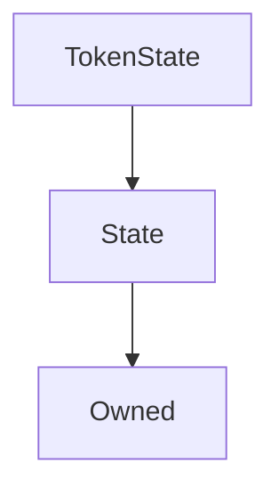

# TokenState

**Source:** [contracts/TokenState.sol](https://github.com/Synthetixio/synthetix/tree/develop/contracts/TokenState.sol)

## Architecture

### Inheritance Graph

---

## Variables

---

### `balanceOf`
[Source](https://github.com/Synthetixio/synthetix/tree/develop/contracts/TokenState.sol#L11)

**Type:** `mapping(address => uint256)`

---

### `allowance`
[Source](https://github.com/Synthetixio/synthetix/tree/develop/contracts/TokenState.sol#L12)

**Type:** `mapping(address => mapping(address => uint256))`

## Functions

---

### `constructor`
[Source](https://github.com/Synthetixio/synthetix/tree/develop/contracts/TokenState.sol#L14)

??? example "Details"

    **Signature**

    `(address _owner, address _associatedContract) public`

    **Modifiers**

    * [Owned](#owned)

    * [State](#state)

---

### `setAllowance`
[Source](https://github.com/Synthetixio/synthetix/tree/develop/contracts/TokenState.sol#L26)

??? example "Details"

    **Signature**

    `setAllowance(address tokenOwner, address spender, uint256 value) external`

    **Modifiers**

    * [onlyAssociatedContract](#onlyassociatedcontract)

---

### `setBalanceOf`
[Source](https://github.com/Synthetixio/synthetix/tree/develop/contracts/TokenState.sol#L40)

??? example "Details"

    **Signature**

    `setBalanceOf(address account, uint256 value) external`

    **Modifiers**

    * [onlyAssociatedContract](#onlyassociatedcontract)

---

