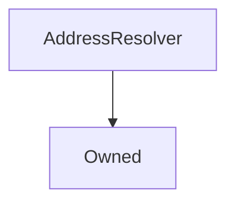

# AddressResolver

## Description

This contract is a type of Service Locator pattern that allows for easier interaction between multiple contracts. Instead of contract A needing references to contracts B and C (and updating every release), contract A can refer to an `AddressResolver` and query for B and C at transaction time. Then, during a release, the AddressResolver is updated with the latest B and C contract. Thus this ensures that contract A always has the latest B and C contracts.

**Source:** [contracts/AddressResolver.sol](https://github.com/Synthetixio/synthetix/tree/v2.27.2/contracts/AddressResolver.sol)

## Architecture

### Inheritance Graph

## Variables

### `repository`

[Source](https://github.com/Synthetixio/synthetix/tree/v2.27.2/contracts/AddressResolver.sol#L12)

The mapping of contract name to address

**Type:** `mapping(bytes32 => address)`

## Constructor

### `constructor`

[Source](https://github.com/Synthetixio/synthetix/tree/v2.27.2/contracts/AddressResolver.sol#L14)

??? example "Details"

    **Signature**

    `(address _owner)`

    **Visibility**

    `public`

    **State Mutability**

    `nonpayable`

## Views

### `getAddress`

[Source](https://github.com/Synthetixio/synthetix/tree/v2.27.2/contracts/AddressResolver.sol#L28)

Returns a single address by it's `bytes32` key.

??? example "Details"

    **Signature**

    `getAddress(bytes32 name) returns (address)`

    **Visibility**

    `external`

    **State Mutability**

    `view`

### `getSynth`

[Source](https://github.com/Synthetixio/synthetix/tree/v2.27.2/contracts/AddressResolver.sol#L38)

!!! Warning "Not yet on mainnet"

    This view, while in source, is not yet on mainnet. It is planned in the `v2.23` Acrux release. As a workaround you can use `IAddressResolver.getAddress("Synthetix").synths(key)`

??? example "Details"

    **Signature**

    `getSynth(bytes32 key) returns (address)`

    **Visibility**

    `external`

    **State Mutability**

    `view`

    **Requires**

    * [require(..., Cannot find Issuer address)](https://github.com/Synthetixio/synthetix/tree/v2.27.2/contracts/AddressResolver.sol#L40)

### `requireAndGetAddress`

[Source](https://github.com/Synthetixio/synthetix/tree/v2.27.2/contracts/AddressResolver.sol#L32)

??? example "Details"

    **Signature**

    `requireAndGetAddress(bytes32 name, string reason) returns (address)`

    **Visibility**

    `external`

    **State Mutability**

    `view`

    **Requires**

    * [require(..., calldata)](https://github.com/Synthetixio/synthetix/tree/v2.27.2/contracts/AddressResolver.sol#L34)

## Restricted Functions

### `importAddresses`

[Source](https://github.com/Synthetixio/synthetix/tree/v2.27.2/contracts/AddressResolver.sol#L18)

Import one or more addresses into the system for the given keys. Note: this function will overrwite any previous entries with the same key names, allowing for inline updates.

??? example "Details"

    **Signature**

    `importAddresses(bytes32[] names, address[] destinations)`

    **Visibility**

    `external`

    **State Mutability**

    `nonpayable`

    **Requires**

    * [require(..., Input lengths must match)](https://github.com/Synthetixio/synthetix/tree/v2.27.2/contracts/AddressResolver.sol#L19)

    **Modifiers**

    * [onlyOwner](#onlyowner)
