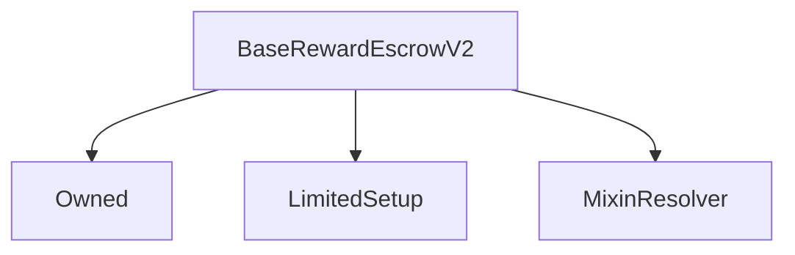

# BaseRewardEscrowV2

## Description

**Source:** [contracts/BaseRewardEscrowV2.sol](https://github.com/Synthetixio/synthetix/tree/v2.37.0/contracts/BaseRewardEscrowV2.sol)

## Architecture

### Libraries

- [SafeMath](/contracts/source/libraries/SafeMath) for `uint`
- [SafeDecimalMath](/contracts/source/libraries/SafeDecimalMath) for `uint`

### Inheritance Graph

## Variables

### `accountMergingDuration`

[Source](https://github.com/Synthetixio/synthetix/tree/v2.37.0/contracts/BaseRewardEscrowV2.sol#L52)

**Type:** `uint256`

### `accountMergingStartTime`

[Source](https://github.com/Synthetixio/synthetix/tree/v2.37.0/contracts/BaseRewardEscrowV2.sol#L54)

**Type:** `uint256`

### `accountVestingEntryIDs`

[Source](https://github.com/Synthetixio/synthetix/tree/v2.37.0/contracts/BaseRewardEscrowV2.sol#L27)

**Type:** `mapping(address => uint256[])`

### `maxAccountMergingDuration`

[Source](https://github.com/Synthetixio/synthetix/tree/v2.37.0/contracts/BaseRewardEscrowV2.sol#L48)

**Type:** `uint256`

### `max_duration`

[Source](https://github.com/Synthetixio/synthetix/tree/v2.37.0/contracts/BaseRewardEscrowV2.sol#L45)

**Type:** `uint256`

### `nextEntryId`

[Source](https://github.com/Synthetixio/synthetix/tree/v2.37.0/contracts/BaseRewardEscrowV2.sol#L30)

**Type:** `uint256`

### `nominatedReceiver`

[Source](https://github.com/Synthetixio/synthetix/tree/v2.37.0/contracts/BaseRewardEscrowV2.sol#L39)

**Type:** `mapping(address => address)`

### `totalEscrowedAccountBalance`

[Source](https://github.com/Synthetixio/synthetix/tree/v2.37.0/contracts/BaseRewardEscrowV2.sol#L33)

**Type:** `mapping(address => uint256)`

### `totalEscrowedBalance`

[Source](https://github.com/Synthetixio/synthetix/tree/v2.37.0/contracts/BaseRewardEscrowV2.sol#L42)

**Type:** `uint256`

### `totalVestedAccountBalance`

[Source](https://github.com/Synthetixio/synthetix/tree/v2.37.0/contracts/BaseRewardEscrowV2.sol#L36)

**Type:** `mapping(address => uint256)`

### `vestingSchedules`

[Source](https://github.com/Synthetixio/synthetix/tree/v2.37.0/contracts/BaseRewardEscrowV2.sol#L25)

**Type:** `mapping(address => mapping(uint256 => struct VestingEntries.VestingEntry))`

## Constructor

### `constructor`

[Source](https://github.com/Synthetixio/synthetix/tree/v2.37.0/contracts/BaseRewardEscrowV2.sol#L64)

??? example "Details"

    **Signature**

    `(address _owner, address _resolver)`

    **Visibility**

    `public`

    **State Mutability**

    `nonpayable`

## Views

### `accountMergingIsOpen`

[Source](https://github.com/Synthetixio/synthetix/tree/v2.37.0/contracts/BaseRewardEscrowV2.sol#L286)

??? example "Details"

    **Signature**

    `accountMergingIsOpen() returns (bool)`

    **Visibility**

    `public`

    **State Mutability**

    `view`

### `balanceOf`

[Source](https://github.com/Synthetixio/synthetix/tree/v2.37.0/contracts/BaseRewardEscrowV2.sol#L99)

??? example "Details"

    **Signature**

    `balanceOf(address account) returns (uint256)`

    **Visibility**

    `public`

    **State Mutability**

    `view`

### `getAccountVestingEntryIDs`

[Source](https://github.com/Synthetixio/synthetix/tree/v2.37.0/contracts/BaseRewardEscrowV2.sol#L152)

??? example "Details"

    **Signature**

    `getAccountVestingEntryIDs(address account, uint256 index, uint256 pageSize) returns (uint256[])`

    **Visibility**

    `external`

    **State Mutability**

    `view`

### `getVestingEntry`

[Source](https://github.com/Synthetixio/synthetix/tree/v2.37.0/contracts/BaseRewardEscrowV2.sol#L114)

??? example "Details"

    **Signature**

    `getVestingEntry(address account, uint256 entryID) returns (uint64, uint256)`

    **Visibility**

    `external`

    **State Mutability**

    `view`

### `getVestingEntryClaimable`

[Source](https://github.com/Synthetixio/synthetix/tree/v2.37.0/contracts/BaseRewardEscrowV2.sol#L189)

??? example "Details"

    **Signature**

    `getVestingEntryClaimable(address account, uint256 entryID) returns (uint256)`

    **Visibility**

    `external`

    **State Mutability**

    `view`

### `getVestingQuantity`

[Source](https://github.com/Synthetixio/synthetix/tree/v2.37.0/contracts/BaseRewardEscrowV2.sol#L175)

??? example "Details"

    **Signature**

    `getVestingQuantity(address account, uint256[] entryIDs) returns (uint256)`

    **Visibility**

    `external`

    **State Mutability**

    `view`

### `getVestingSchedules`

[Source](https://github.com/Synthetixio/synthetix/tree/v2.37.0/contracts/BaseRewardEscrowV2.sol#L119)

??? example "Details"

    **Signature**

    `getVestingSchedules(address account, uint256 index, uint256 pageSize) returns (struct VestingEntries.VestingEntryWithID[])`

    **Visibility**

    `external`

    **State Mutability**

    `view`

### `numVestingEntries`

[Source](https://github.com/Synthetixio/synthetix/tree/v2.37.0/contracts/BaseRewardEscrowV2.sol#L106)

??? example "Details"

    **Signature**

    `numVestingEntries(address account) returns (uint256)`

    **Visibility**

    `external`

    **State Mutability**

    `view`

### `resolverAddressesRequired`

[Source](https://github.com/Synthetixio/synthetix/tree/v2.37.0/contracts/BaseRewardEscrowV2.sol#L89)

??? example "Details"

    **Signature**

    `resolverAddressesRequired() returns (bytes32[])`

    **Visibility**

    `public`

    **State Mutability**

    `view`

## Restricted Functions

### `appendVestingEntry`

[Source](https://github.com/Synthetixio/synthetix/tree/v2.37.0/contracts/BaseRewardEscrowV2.sol#L262)

??? example "Details"

    **Signature**

    `appendVestingEntry(address account, uint256 quantity, uint256 duration)`

    **Visibility**

    `external`

    **State Mutability**

    `nonpayable`

    **Modifiers**

    * [onlyFeePool](#onlyfeepool)

### `setAccountMergingDuration`

[Source](https://github.com/Synthetixio/synthetix/tree/v2.37.0/contracts/BaseRewardEscrowV2.sol#L295)

??? example "Details"

    **Signature**

    `setAccountMergingDuration(uint256 duration)`

    **Visibility**

    `external`

    **State Mutability**

    `nonpayable`

    **Requires**

    * [require(..., exceeds max merging duration)](https://github.com/Synthetixio/synthetix/tree/v2.37.0/contracts/BaseRewardEscrowV2.sol#L296)

    **Modifiers**

    * [onlyOwner](#onlyowner)

    **Emits**

    * [AccountMergingDurationUpdated](#accountmergingdurationupdated)

### `setMaxAccountMergingWindow`

[Source](https://github.com/Synthetixio/synthetix/tree/v2.37.0/contracts/BaseRewardEscrowV2.sol#L301)

??? example "Details"

    **Signature**

    `setMaxAccountMergingWindow(uint256 duration)`

    **Visibility**

    `external`

    **State Mutability**

    `nonpayable`

    **Modifiers**

    * [onlyOwner](#onlyowner)

    **Emits**

    * [MaxAccountMergingDurationUpdated](#maxaccountmergingdurationupdated)

### `setMaxEscrowDuration`

[Source](https://github.com/Synthetixio/synthetix/tree/v2.37.0/contracts/BaseRewardEscrowV2.sol#L306)

??? example "Details"

    **Signature**

    `setMaxEscrowDuration(uint256 duration)`

    **Visibility**

    `external`

    **State Mutability**

    `nonpayable`

    **Modifiers**

    * [onlyOwner](#onlyowner)

    **Emits**

    * [MaxEscrowDurationUpdated](#maxescrowdurationupdated)

### `startMergingWindow`

[Source](https://github.com/Synthetixio/synthetix/tree/v2.37.0/contracts/BaseRewardEscrowV2.sol#L290)

??? example "Details"

    **Signature**

    `startMergingWindow()`

    **Visibility**

    `external`

    **State Mutability**

    `nonpayable`

    **Modifiers**

    * [onlyOwner](#onlyowner)

    **Emits**

    * [AccountMergingStarted](#accountmergingstarted)

## Internal Functions

### `_addVestingEntry`

[Source](https://github.com/Synthetixio/synthetix/tree/v2.37.0/contracts/BaseRewardEscrowV2.sol#L356)

??? example "Details"

    **Signature**

    `_addVestingEntry(address account, struct VestingEntries.VestingEntry entry) returns (uint256)`

    **Visibility**

    `internal`

    **State Mutability**

    `nonpayable`

### `_appendVestingEntry`

[Source](https://github.com/Synthetixio/synthetix/tree/v2.37.0/contracts/BaseRewardEscrowV2.sol#L399)

??? example "Details"

    **Signature**

    `_appendVestingEntry(address account, uint256 quantity, uint256 duration)`

    **Visibility**

    `internal`

    **State Mutability**

    `nonpayable`

    **Requires**

    * [require(..., Quantity cannot be zero)](https://github.com/Synthetixio/synthetix/tree/v2.37.0/contracts/BaseRewardEscrowV2.sol#L405)

    * [require(..., Cannot escrow with 0 duration OR above max_duration)](https://github.com/Synthetixio/synthetix/tree/v2.37.0/contracts/BaseRewardEscrowV2.sol#L406)

    * [require(..., Must be enough balance in the contract to provide for the vesting entry)](https://github.com/Synthetixio/synthetix/tree/v2.37.0/contracts/BaseRewardEscrowV2.sol#L411)

    **Emits**

    * [VestingEntryCreated](#vestingentrycreated)

### `_claimableAmount`

[Source](https://github.com/Synthetixio/synthetix/tree/v2.37.0/contracts/BaseRewardEscrowV2.sol#L194)

??? example "Details"

    **Signature**

    `_claimableAmount(struct VestingEntries.VestingEntry _entry) returns (uint256)`

    **Visibility**

    `internal`

    **State Mutability**

    `view`

### `_notImplemented`

[Source](https://github.com/Synthetixio/synthetix/tree/v2.37.0/contracts/BaseRewardEscrowV2.sol#L82)

??? example "Details"

    **Signature**

    `_notImplemented()`

    **Visibility**

    `internal`

    **State Mutability**

    `pure`

### `_reduceAccountEscrowBalances`

[Source](https://github.com/Synthetixio/synthetix/tree/v2.37.0/contracts/BaseRewardEscrowV2.sol#L278)

??? example "Details"

    **Signature**

    `_reduceAccountEscrowBalances(address _account, uint256 _amount)`

    **Visibility**

    `internal`

    **State Mutability**

    `nonpayable`

### `_transferVestedTokens`

[Source](https://github.com/Synthetixio/synthetix/tree/v2.37.0/contracts/BaseRewardEscrowV2.sol#L271)

??? example "Details"

    **Signature**

    `_transferVestedTokens(address _account, uint256 _amount)`

    **Visibility**

    `internal`

    **State Mutability**

    `nonpayable`

    **Emits**

    * [Vested](#vested)

### `feePool`

[Source](https://github.com/Synthetixio/synthetix/tree/v2.37.0/contracts/BaseRewardEscrowV2.sol#L70)

??? example "Details"

    **Signature**

    `feePool() returns (contract IFeePool)`

    **Visibility**

    `internal`

    **State Mutability**

    `view`

### `issuer`

[Source](https://github.com/Synthetixio/synthetix/tree/v2.37.0/contracts/BaseRewardEscrowV2.sol#L78)

??? example "Details"

    **Signature**

    `issuer() returns (contract IIssuer)`

    **Visibility**

    `internal`

    **State Mutability**

    `view`

### `synthetix`

[Source](https://github.com/Synthetixio/synthetix/tree/v2.37.0/contracts/BaseRewardEscrowV2.sol#L74)

??? example "Details"

    **Signature**

    `synthetix() returns (contract ISynthetix)`

    **Visibility**

    `internal`

    **State Mutability**

    `view`

## External Functions

### `burnForMigration`

[Source](https://github.com/Synthetixio/synthetix/tree/v2.37.0/contracts/BaseRewardEscrowV2.sol#L385)

??? example "Details"

    **Signature**

    `burnForMigration(address , uint256[] ) returns (uint256, struct VestingEntries.VestingEntry[])`

    **Visibility**

    `external`

    **State Mutability**

    `nonpayable`

### `createEscrowEntry`

[Source](https://github.com/Synthetixio/synthetix/tree/v2.37.0/contracts/BaseRewardEscrowV2.sol#L240)

??? example "Details"

    **Signature**

    `createEscrowEntry(address beneficiary, uint256 deposit, uint256 duration)`

    **Visibility**

    `external`

    **State Mutability**

    `nonpayable`

    **Requires**

    * [require(..., Cannot create escrow with address(0))](https://github.com/Synthetixio/synthetix/tree/v2.37.0/contracts/BaseRewardEscrowV2.sol#L245)

    * [require(..., token transfer failed)](https://github.com/Synthetixio/synthetix/tree/v2.37.0/contracts/BaseRewardEscrowV2.sol#L248)

### `importVestingEntries`

[Source](https://github.com/Synthetixio/synthetix/tree/v2.37.0/contracts/BaseRewardEscrowV2.sol#L389)

??? example "Details"

    **Signature**

    `importVestingEntries(address , uint256 , struct VestingEntries.VestingEntry[] )`

    **Visibility**

    `external`

    **State Mutability**

    `nonpayable`

### `mergeAccount`

[Source](https://github.com/Synthetixio/synthetix/tree/v2.37.0/contracts/BaseRewardEscrowV2.sol#L320)

??? example "Details"

    **Signature**

    `mergeAccount(address accountToMerge, uint256[] entryIDs)`

    **Visibility**

    `external`

    **State Mutability**

    `nonpayable`

    **Requires**

    * [require(..., Account merging has ended)](https://github.com/Synthetixio/synthetix/tree/v2.37.0/contracts/BaseRewardEscrowV2.sol#L321)

    * [require(..., Cannot merge accounts with debt)](https://github.com/Synthetixio/synthetix/tree/v2.37.0/contracts/BaseRewardEscrowV2.sol#L322)

    * [require(..., Address is not nominated to merge)](https://github.com/Synthetixio/synthetix/tree/v2.37.0/contracts/BaseRewardEscrowV2.sol#L323)

    **Emits**

    * [AccountMerged](#accountmerged)

### `migrateAccountEscrowBalances`

[Source](https://github.com/Synthetixio/synthetix/tree/v2.37.0/contracts/BaseRewardEscrowV2.sol#L375)

??? example "Details"

    **Signature**

    `migrateAccountEscrowBalances(address[] , uint256[] , uint256[] )`

    **Visibility**

    `external`

    **State Mutability**

    `nonpayable`

### `migrateVestingSchedule`

[Source](https://github.com/Synthetixio/synthetix/tree/v2.37.0/contracts/BaseRewardEscrowV2.sol#L371)

??? example "Details"

    **Signature**

    `migrateVestingSchedule(address )`

    **Visibility**

    `external`

    **State Mutability**

    `nonpayable`

### `nominateAccountToMerge`

[Source](https://github.com/Synthetixio/synthetix/tree/v2.37.0/contracts/BaseRewardEscrowV2.sol#L312)

??? example "Details"

    **Signature**

    `nominateAccountToMerge(address account)`

    **Visibility**

    `external`

    **State Mutability**

    `nonpayable`

    **Requires**

    * [require(..., Cannot nominate own account to merge)](https://github.com/Synthetixio/synthetix/tree/v2.37.0/contracts/BaseRewardEscrowV2.sol#L313)

    * [require(..., Account merging has ended)](https://github.com/Synthetixio/synthetix/tree/v2.37.0/contracts/BaseRewardEscrowV2.sol#L314)

    * [require(..., Cannot merge accounts with debt)](https://github.com/Synthetixio/synthetix/tree/v2.37.0/contracts/BaseRewardEscrowV2.sol#L315)

    **Emits**

    * [NominateAccountToMerge](#nominateaccounttomerge)

### `vest`

[Source](https://github.com/Synthetixio/synthetix/tree/v2.37.0/contracts/BaseRewardEscrowV2.sol#L210)

??? example "Details"

    **Signature**

    `vest(uint256[] entryIDs)`

    **Visibility**

    `external`

    **State Mutability**

    `nonpayable`

## Modifiers

### `onlyFeePool`

[Source](https://github.com/Synthetixio/synthetix/tree/v2.37.0/contracts/BaseRewardEscrowV2.sol#L434)

## Events

### `AccountMerged`

[Source](https://github.com/Synthetixio/synthetix/tree/v2.37.0/contracts/BaseRewardEscrowV2.sol#L446)

**Signature**: `AccountMerged(address accountToMerge, address destinationAddress, uint256 escrowAmountMerged, uint256[] entryIDs, uint256 time)`

### `AccountMergingDurationUpdated`

[Source](https://github.com/Synthetixio/synthetix/tree/v2.37.0/contracts/BaseRewardEscrowV2.sol#L444)

**Signature**: `AccountMergingDurationUpdated(uint256 newDuration)`

### `AccountMergingStarted`

[Source](https://github.com/Synthetixio/synthetix/tree/v2.37.0/contracts/BaseRewardEscrowV2.sol#L445)

**Signature**: `AccountMergingStarted(uint256 time, uint256 endTime)`

### `MaxAccountMergingDurationUpdated`

[Source](https://github.com/Synthetixio/synthetix/tree/v2.37.0/contracts/BaseRewardEscrowV2.sol#L443)

**Signature**: `MaxAccountMergingDurationUpdated(uint256 newDuration)`

### `MaxEscrowDurationUpdated`

[Source](https://github.com/Synthetixio/synthetix/tree/v2.37.0/contracts/BaseRewardEscrowV2.sol#L442)

**Signature**: `MaxEscrowDurationUpdated(uint256 newDuration)`

### `NominateAccountToMerge`

[Source](https://github.com/Synthetixio/synthetix/tree/v2.37.0/contracts/BaseRewardEscrowV2.sol#L453)

**Signature**: `NominateAccountToMerge(address account, address destination)`

### `Vested`

[Source](https://github.com/Synthetixio/synthetix/tree/v2.37.0/contracts/BaseRewardEscrowV2.sol#L440)

**Signature**: `Vested(address beneficiary, uint256 time, uint256 value)`

### `VestingEntryCreated`

[Source](https://github.com/Synthetixio/synthetix/tree/v2.37.0/contracts/BaseRewardEscrowV2.sol#L441)

**Signature**: `VestingEntryCreated(address beneficiary, uint256 time, uint256 value, uint256 duration, uint256 entryID)`
