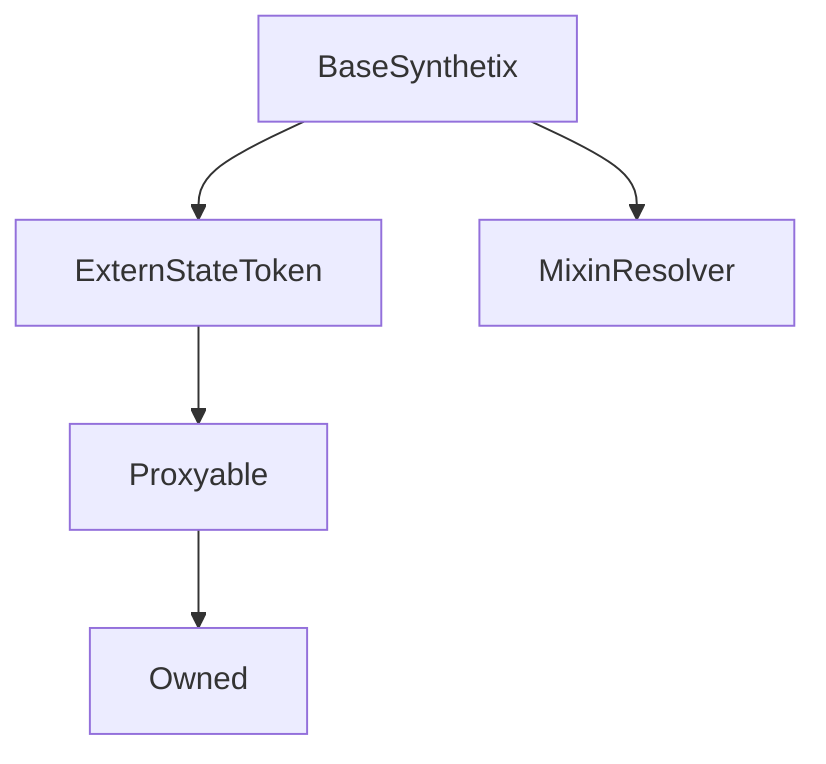

# BaseSynthetix

## Description

**Source:** [contracts/BaseSynthetix.sol](https://github.com/Synthetixio/synthetix/tree/v2.36.0/contracts/BaseSynthetix.sol)

## Architecture

### Inheritance Graph

## Constants

### `DECIMALS`

[Source](https://github.com/Synthetixio/synthetix/tree/v2.36.0/contracts/BaseSynthetix.sol#L26)

**Type:** `uint8`

### `TOKEN_NAME`

[Source](https://github.com/Synthetixio/synthetix/tree/v2.36.0/contracts/BaseSynthetix.sol#L24)

**Type:** `string`

### `TOKEN_SYMBOL`

[Source](https://github.com/Synthetixio/synthetix/tree/v2.36.0/contracts/BaseSynthetix.sol#L25)

**Type:** `string`

### `sUSD`

[Source](https://github.com/Synthetixio/synthetix/tree/v2.36.0/contracts/BaseSynthetix.sol#L27)

**Type:** `bytes32`

## Constructor

### `constructor`

[Source](https://github.com/Synthetixio/synthetix/tree/v2.36.0/contracts/BaseSynthetix.sol#L38)

??? example "Details"

    **Signature**

    `(address payable _proxy, contract TokenState _tokenState, address _owner, uint256 _totalSupply, address _resolver)`

    **Visibility**

    `public`

    **State Mutability**

    `nonpayable`

## Views

### `anySynthOrSNXRateIsInvalid`

[Source](https://github.com/Synthetixio/synthetix/tree/v2.36.0/contracts/BaseSynthetix.sol#L118)

??? example "Details"

    **Signature**

    `anySynthOrSNXRateIsInvalid() returns (bool)`

    **Visibility**

    `external`

    **State Mutability**

    `view`

### `availableCurrencyKeys`

[Source](https://github.com/Synthetixio/synthetix/tree/v2.36.0/contracts/BaseSynthetix.sol#L94)

??? example "Details"

    **Signature**

    `availableCurrencyKeys() returns (bytes32[])`

    **Visibility**

    `external`

    **State Mutability**

    `view`

### `availableSynthCount`

[Source](https://github.com/Synthetixio/synthetix/tree/v2.36.0/contracts/BaseSynthetix.sol#L98)

??? example "Details"

    **Signature**

    `availableSynthCount() returns (uint256)`

    **Visibility**

    `external`

    **State Mutability**

    `view`

### `availableSynths`

[Source](https://github.com/Synthetixio/synthetix/tree/v2.36.0/contracts/BaseSynthetix.sol#L102)

??? example "Details"

    **Signature**

    `availableSynths(uint256 index) returns (contract ISynth)`

    **Visibility**

    `external`

    **State Mutability**

    `view`

### `collateral`

[Source](https://github.com/Synthetixio/synthetix/tree/v2.36.0/contracts/BaseSynthetix.sol#L142)

??? example "Details"

    **Signature**

    `collateral(address account) returns (uint256)`

    **Visibility**

    `external`

    **State Mutability**

    `view`

### `collateralisationRatio`

[Source](https://github.com/Synthetixio/synthetix/tree/v2.36.0/contracts/BaseSynthetix.sol#L138)

??? example "Details"

    **Signature**

    `collateralisationRatio(address _issuer) returns (uint256)`

    **Visibility**

    `external`

    **State Mutability**

    `view`

### `debtBalanceOf`

[Source](https://github.com/Synthetixio/synthetix/tree/v2.36.0/contracts/BaseSynthetix.sol#L82)

??? example "Details"

    **Signature**

    `debtBalanceOf(address account, bytes32 currencyKey) returns (uint256)`

    **Visibility**

    `external`

    **State Mutability**

    `view`

### `isWaitingPeriod`

[Source](https://github.com/Synthetixio/synthetix/tree/v2.36.0/contracts/BaseSynthetix.sol#L114)

??? example "Details"

    **Signature**

    `isWaitingPeriod(bytes32 currencyKey) returns (bool)`

    **Visibility**

    `external`

    **State Mutability**

    `view`

### `maxIssuableSynths`

[Source](https://github.com/Synthetixio/synthetix/tree/v2.36.0/contracts/BaseSynthetix.sol#L122)

??? example "Details"

    **Signature**

    `maxIssuableSynths(address account) returns (uint256)`

    **Visibility**

    `external`

    **State Mutability**

    `view`

### `remainingIssuableSynths`

[Source](https://github.com/Synthetixio/synthetix/tree/v2.36.0/contracts/BaseSynthetix.sol#L126)

??? example "Details"

    **Signature**

    `remainingIssuableSynths(address account) returns (uint256, uint256, uint256)`

    **Visibility**

    `external`

    **State Mutability**

    `view`

### `resolverAddressesRequired`

[Source](https://github.com/Synthetixio/synthetix/tree/v2.36.0/contracts/BaseSynthetix.sol#L53)

??? example "Details"

    **Signature**

    `resolverAddressesRequired() returns (bytes32[])`

    **Visibility**

    `public`

    **State Mutability**

    `view`

### `synths`

[Source](https://github.com/Synthetixio/synthetix/tree/v2.36.0/contracts/BaseSynthetix.sol#L106)

??? example "Details"

    **Signature**

    `synths(bytes32 currencyKey) returns (contract ISynth)`

    **Visibility**

    `external`

    **State Mutability**

    `view`

### `synthsByAddress`

[Source](https://github.com/Synthetixio/synthetix/tree/v2.36.0/contracts/BaseSynthetix.sol#L110)

??? example "Details"

    **Signature**

    `synthsByAddress(address synthAddress) returns (bytes32)`

    **Visibility**

    `external`

    **State Mutability**

    `view`

### `totalIssuedSynths`

[Source](https://github.com/Synthetixio/synthetix/tree/v2.36.0/contracts/BaseSynthetix.sol#L86)

??? example "Details"

    **Signature**

    `totalIssuedSynths(bytes32 currencyKey) returns (uint256)`

    **Visibility**

    `external`

    **State Mutability**

    `view`

### `totalIssuedSynthsExcludeEtherCollateral`

[Source](https://github.com/Synthetixio/synthetix/tree/v2.36.0/contracts/BaseSynthetix.sol#L90)

??? example "Details"

    **Signature**

    `totalIssuedSynthsExcludeEtherCollateral(bytes32 currencyKey) returns (uint256)`

    **Visibility**

    `external`

    **State Mutability**

    `view`

### `transferableSynthetix`

[Source](https://github.com/Synthetixio/synthetix/tree/v2.36.0/contracts/BaseSynthetix.sol#L146)

??? example "Details"

    **Signature**

    `transferableSynthetix(address account) returns (uint256)`

    **Visibility**

    `external`

    **State Mutability**

    `view`

## Internal Functions

### `_canTransfer`

[Source](https://github.com/Synthetixio/synthetix/tree/v2.36.0/contracts/BaseSynthetix.sol#L150)

??? example "Details"

    **Signature**

    `_canTransfer(address account, uint256 value) returns (bool)`

    **Visibility**

    `internal`

    **State Mutability**

    `view`

### `_notImplemented`

[Source](https://github.com/Synthetixio/synthetix/tree/v2.36.0/contracts/BaseSynthetix.sol#L299)

??? example "Details"

    **Signature**

    `_notImplemented()`

    **Visibility**

    `internal`

    **State Mutability**

    `pure`

### `exchanger`

[Source](https://github.com/Synthetixio/synthetix/tree/v2.36.0/contracts/BaseSynthetix.sol#L70)

??? example "Details"

    **Signature**

    `exchanger() returns (contract IExchanger)`

    **Visibility**

    `internal`

    **State Mutability**

    `view`

### `issuer`

[Source](https://github.com/Synthetixio/synthetix/tree/v2.36.0/contracts/BaseSynthetix.sol#L74)

??? example "Details"

    **Signature**

    `issuer() returns (contract IIssuer)`

    **Visibility**

    `internal`

    **State Mutability**

    `view`

### `rewardsDistribution`

[Source](https://github.com/Synthetixio/synthetix/tree/v2.36.0/contracts/BaseSynthetix.sol#L78)

??? example "Details"

    **Signature**

    `rewardsDistribution() returns (contract IRewardsDistribution)`

    **Visibility**

    `internal`

    **State Mutability**

    `view`

### `synthetixState`

[Source](https://github.com/Synthetixio/synthetix/tree/v2.36.0/contracts/BaseSynthetix.sol#L62)

??? example "Details"

    **Signature**

    `synthetixState() returns (contract ISynthetixState)`

    **Visibility**

    `internal`

    **State Mutability**

    `view`

### `systemStatus`

[Source](https://github.com/Synthetixio/synthetix/tree/v2.36.0/contracts/BaseSynthetix.sol#L66)

??? example "Details"

    **Signature**

    `systemStatus() returns (contract ISystemStatus)`

    **Visibility**

    `internal`

    **State Mutability**

    `view`

## External Functions

### `burnSecondary`

[Source](https://github.com/Synthetixio/synthetix/tree/v2.36.0/contracts/BaseSynthetix.sol#L295)

??? example "Details"

    **Signature**

    `burnSecondary(address , uint256 )`

    **Visibility**

    `external`

    **State Mutability**

    `nonpayable`

### `burnSynths`

[Source](https://github.com/Synthetixio/synthetix/tree/v2.36.0/contracts/BaseSynthetix.sol#L205)

??? example "Details"

    **Signature**

    `burnSynths(uint256 amount)`

    **Visibility**

    `external`

    **State Mutability**

    `nonpayable`

    **Modifiers**

    * [issuanceActive](#issuanceactive)

    * [optionalProxy](#optionalproxy)

### `burnSynthsOnBehalf`

[Source](https://github.com/Synthetixio/synthetix/tree/v2.36.0/contracts/BaseSynthetix.sol#L209)

??? example "Details"

    **Signature**

    `burnSynthsOnBehalf(address burnForAddress, uint256 amount)`

    **Visibility**

    `external`

    **State Mutability**

    `nonpayable`

    **Modifiers**

    * [issuanceActive](#issuanceactive)

    * [optionalProxy](#optionalproxy)

### `burnSynthsToTarget`

[Source](https://github.com/Synthetixio/synthetix/tree/v2.36.0/contracts/BaseSynthetix.sol#L213)

??? example "Details"

    **Signature**

    `burnSynthsToTarget()`

    **Visibility**

    `external`

    **State Mutability**

    `nonpayable`

    **Modifiers**

    * [issuanceActive](#issuanceactive)

    * [optionalProxy](#optionalproxy)

### `burnSynthsToTargetOnBehalf`

[Source](https://github.com/Synthetixio/synthetix/tree/v2.36.0/contracts/BaseSynthetix.sol#L217)

??? example "Details"

    **Signature**

    `burnSynthsToTargetOnBehalf(address burnForAddress)`

    **Visibility**

    `external`

    **State Mutability**

    `nonpayable`

    **Modifiers**

    * [issuanceActive](#issuanceactive)

    * [optionalProxy](#optionalproxy)

### `exchange`

[Source](https://github.com/Synthetixio/synthetix/tree/v2.36.0/contracts/BaseSynthetix.sol#L221)

??? example "Details"

    **Signature**

    `exchange(bytes32 , uint256 , bytes32 ) returns (uint256)`

    **Visibility**

    `external`

    **State Mutability**

    `nonpayable`

### `exchangeOnBehalf`

[Source](https://github.com/Synthetixio/synthetix/tree/v2.36.0/contracts/BaseSynthetix.sol#L229)

??? example "Details"

    **Signature**

    `exchangeOnBehalf(address , bytes32 , uint256 , bytes32 ) returns (uint256)`

    **Visibility**

    `external`

    **State Mutability**

    `nonpayable`

### `exchangeOnBehalfWithTracking`

[Source](https://github.com/Synthetixio/synthetix/tree/v2.36.0/contracts/BaseSynthetix.sol#L248)

??? example "Details"

    **Signature**

    `exchangeOnBehalfWithTracking(address , bytes32 , uint256 , bytes32 , address , bytes32 ) returns (uint256)`

    **Visibility**

    `external`

    **State Mutability**

    `nonpayable`

### `exchangeWithTracking`

[Source](https://github.com/Synthetixio/synthetix/tree/v2.36.0/contracts/BaseSynthetix.sol#L238)

??? example "Details"

    **Signature**

    `exchangeWithTracking(bytes32 , uint256 , bytes32 , address , bytes32 ) returns (uint256)`

    **Visibility**

    `external`

    **State Mutability**

    `nonpayable`

### `exchangeWithVirtual`

[Source](https://github.com/Synthetixio/synthetix/tree/v2.36.0/contracts/BaseSynthetix.sol#L259)

??? example "Details"

    **Signature**

    `exchangeWithVirtual(bytes32 , uint256 , bytes32 , bytes32 ) returns (uint256, contract IVirtualSynth)`

    **Visibility**

    `external`

    **State Mutability**

    `nonpayable`

### `issueMaxSynths`

[Source](https://github.com/Synthetixio/synthetix/tree/v2.36.0/contracts/BaseSynthetix.sol#L197)

??? example "Details"

    **Signature**

    `issueMaxSynths()`

    **Visibility**

    `external`

    **State Mutability**

    `nonpayable`

    **Modifiers**

    * [issuanceActive](#issuanceactive)

    * [optionalProxy](#optionalproxy)

### `issueMaxSynthsOnBehalf`

[Source](https://github.com/Synthetixio/synthetix/tree/v2.36.0/contracts/BaseSynthetix.sol#L201)

??? example "Details"

    **Signature**

    `issueMaxSynthsOnBehalf(address issueForAddress)`

    **Visibility**

    `external`

    **State Mutability**

    `nonpayable`

    **Modifiers**

    * [issuanceActive](#issuanceactive)

    * [optionalProxy](#optionalproxy)

### `issueSynths`

[Source](https://github.com/Synthetixio/synthetix/tree/v2.36.0/contracts/BaseSynthetix.sol#L189)

??? example "Details"

    **Signature**

    `issueSynths(uint256 amount)`

    **Visibility**

    `external`

    **State Mutability**

    `nonpayable`

    **Modifiers**

    * [issuanceActive](#issuanceactive)

    * [optionalProxy](#optionalproxy)

### `issueSynthsOnBehalf`

[Source](https://github.com/Synthetixio/synthetix/tree/v2.36.0/contracts/BaseSynthetix.sol#L193)

??? example "Details"

    **Signature**

    `issueSynthsOnBehalf(address issueForAddress, uint256 amount)`

    **Visibility**

    `external`

    **State Mutability**

    `nonpayable`

    **Modifiers**

    * [issuanceActive](#issuanceactive)

    * [optionalProxy](#optionalproxy)

### `liquidateDelinquentAccount`

[Source](https://github.com/Synthetixio/synthetix/tree/v2.36.0/contracts/BaseSynthetix.sol#L283)

??? example "Details"

    **Signature**

    `liquidateDelinquentAccount(address , uint256 ) returns (bool)`

    **Visibility**

    `external`

    **State Mutability**

    `nonpayable`

### `mint`

[Source](https://github.com/Synthetixio/synthetix/tree/v2.36.0/contracts/BaseSynthetix.sol#L279)

??? example "Details"

    **Signature**

    `mint() returns (bool)`

    **Visibility**

    `external`

    **State Mutability**

    `nonpayable`

### `mintSecondary`

[Source](https://github.com/Synthetixio/synthetix/tree/v2.36.0/contracts/BaseSynthetix.sol#L287)

??? example "Details"

    **Signature**

    `mintSecondary(address , uint256 )`

    **Visibility**

    `external`

    **State Mutability**

    `nonpayable`

### `mintSecondaryRewards`

[Source](https://github.com/Synthetixio/synthetix/tree/v2.36.0/contracts/BaseSynthetix.sol#L291)

??? example "Details"

    **Signature**

    `mintSecondaryRewards(uint256 )`

    **Visibility**

    `external`

    **State Mutability**

    `nonpayable`

### `settle`

[Source](https://github.com/Synthetixio/synthetix/tree/v2.36.0/contracts/BaseSynthetix.sol#L268)

??? example "Details"

    **Signature**

    `settle(bytes32 ) returns (uint256, uint256, uint256)`

    **Visibility**

    `external`

    **State Mutability**

    `nonpayable`

### `transfer`

[Source](https://github.com/Synthetixio/synthetix/tree/v2.36.0/contracts/BaseSynthetix.sol#L166)

??? example "Details"

    **Signature**

    `transfer(address to, uint256 value) returns (bool)`

    **Visibility**

    `external`

    **State Mutability**

    `nonpayable`

    **Modifiers**

    * [optionalProxy](#optionalproxy)

    * [systemActive](#systemactive)

### `transferFrom`

[Source](https://github.com/Synthetixio/synthetix/tree/v2.36.0/contracts/BaseSynthetix.sol#L176)

??? example "Details"

    **Signature**

    `transferFrom(address from, address to, uint256 value) returns (bool)`

    **Visibility**

    `external`

    **State Mutability**

    `nonpayable`

    **Modifiers**

    * [optionalProxy](#optionalproxy)

    * [systemActive](#systemactive)

## Modifiers

### `issuanceActive`

[Source](https://github.com/Synthetixio/synthetix/tree/v2.36.0/contracts/BaseSynthetix.sol#L314)

### `systemActive`

[Source](https://github.com/Synthetixio/synthetix/tree/v2.36.0/contracts/BaseSynthetix.sol#L305)
