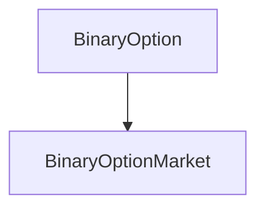

# BinaryOption

## Description

The BinaryOption contract provides ERC20 token functionality for the 
options in a [BinaryOptionMarket](BinaryOptionMarket.md). One `BinaryOption`
instance is created for each of the long and short sides of the market.
Once claimed, binary options can be transferred around like
any other ERC20 token until they are exercised from their parent market.

This contract tracks the value on a particular side of the market throughout
the entire lifecycle, handling both bid and option balances, and the basic operations of
converting between them. Whenever a bid is made or refunded, or an option
claimed or exercised, the values in this contract are updated by the market.

**Source:** [contracts/BinaryOption.sol](https://github.com/Synthetixio/synthetix/tree/v2.22.4/contracts/BinaryOption.sol)

## Architecture

### Libraries

- [SafeMath](/contracts/source/libraries/SafeMath) for `uint`
- [SafeDecimalMath](/contracts/source/libraries/SafeDecimalMath) for `uint`

### Related Contracts

??? example "Details"

    - [`BinaryOptionMarket`](BinaryOptionMarket.md): The parent contract of this binary option token.

## Constants

### `decimals`

The ERC20 number of decimals of this token.

[Source](https://github.com/Synthetixio/synthetix/tree/v2.22.4/contracts/BinaryOption.sol#L23)

**Type:** `uint8`

### `name`

The ERC20 name of this token.

[Source](https://github.com/Synthetixio/synthetix/tree/v2.22.4/contracts/BinaryOption.sol#L21)

**Type:** `string`

### `symbol`

The ERC20 symbol of this token.

[Source](https://github.com/Synthetixio/synthetix/tree/v2.22.4/contracts/BinaryOption.sol#L22)

**Type:** `string`

## Variables

### `allowance`

The ERC20 allowances of this option. `allowance[owner][spender]` is the value of options `spender` is approved to transfer on behalf of `owner`.

[Source](https://github.com/Synthetixio/synthetix/tree/v2.22.4/contracts/BinaryOption.sol#L34)

**Type:** `mapping(address => mapping(address => uint256))`

### `balanceOf`

The ERC20 balance of this option for each account.

[Source](https://github.com/Synthetixio/synthetix/tree/v2.22.4/contracts/BinaryOption.sol#L30)

**Type:** `mapping(address => uint256)`

### `bidOf`

The current bid on this option made by each address.

[Source](https://github.com/Synthetixio/synthetix/tree/v2.22.4/contracts/BinaryOption.sol#L27)

**Type:** `mapping(address => uint256)`

### `market`

The parent market of this option.

[Source](https://github.com/Synthetixio/synthetix/tree/v2.22.4/contracts/BinaryOption.sol#L25)

**Type:** `contract BinaryOptionMarket`

### `totalBids`

The total value of bids made by all addresses.

[Source](https://github.com/Synthetixio/synthetix/tree/v2.22.4/contracts/BinaryOption.sol#L28)

**Type:** `uint256`

### `totalSupply`

The ERC20 total supply of this option.

[Source](https://github.com/Synthetixio/synthetix/tree/v2.22.4/contracts/BinaryOption.sol#L31)

**Type:** `uint256`

## Constructor

### `constructor`

The constructor initialises the parent market address and sets the initial bid by the creator of the parent market
on this option.

[Source](https://github.com/Synthetixio/synthetix/tree/v2.22.4/contracts/BinaryOption.sol#L38)

??? example "Details"

    **Signature**

    `(address initialBidder, uint256 initialBid)`

    **Visibility**

    `public`

    **State Mutability**

    `nonpayable`

## Views

### `claimableBy`

Returns the quantity of options claimable by an account at the current price.

[Source](https://github.com/Synthetixio/synthetix/tree/v2.22.4/contracts/BinaryOption.sol#L58)

??? example "Details"

    **Signature**

    `claimableBy(address account)`

    **Visibility**

    `external`

    **State Mutability**

    `view`

### `price`

Returns the current price of this option from the parent market.

[Source](https://github.com/Synthetixio/synthetix/tree/v2.22.4/contracts/BinaryOption.sol#L50)

??? example "Details"

    **Signature**

    `price()`

    **Visibility**

    `external`

    **State Mutability**

    `view`

### `totalClaimable`

Returns the total supply of options claimable by all bidders.

[Source](https://github.com/Synthetixio/synthetix/tree/v2.22.4/contracts/BinaryOption.sol#L66)

??? example "Details"

    **Signature**

    `totalClaimable()`

    **Visibility**

    `external`

    **State Mutability**

    `view`

### `totalExercisable`

Returns the total supply of options that could potentially be exercised, including unclaimed options.

[Source](https://github.com/Synthetixio/synthetix/tree/v2.22.4/contracts/BinaryOption.sol#L70)

??? example "Details"

    **Signature**

    `totalExercisable()`

    **Visibility**

    `external`

    **State Mutability**

    `view`

## Restricted Functions

### `bid`

Allows the parent market to increase the bid for a particular address.

[Source](https://github.com/Synthetixio/synthetix/tree/v2.22.4/contracts/BinaryOption.sol#L77)

??? example "Details"

    **Signature**

    `bid(address bidder, uint256 newBid)`

    **Visibility**

    `external`

    **State Mutability**

    `nonpayable`

    **Modifiers**

    * [onlyMarket](#onlymarket)

### `claim`

Allows the market to converts the entire claimable quantity for a given account into options.
On invocation, the bid is set to zero, while [`claimableBy(account)`](#claimableby) tokens are issued into the account.
The `Issued` event emitted is accompanied by a `Transfer` event from the zero address.

[Source](https://github.com/Synthetixio/synthetix/tree/v2.22.4/contracts/BinaryOption.sol#L90)

??? example "Details"

    **Signature**

    `claim(address claimant)`

    **Visibility**

    `external`

    **State Mutability**

    `nonpayable`

    **Modifiers**

    * [onlyMarket](#onlymarket)

    **Emits**

    * [Transfer](#transfer)

    * [Issued](#issued)

### `exercise`

Allows the market to burn the entire token balance in a given account.
The `Burned` event emitted is accompanied by a `Transfer` event to the zero address.

[Source](https://github.com/Synthetixio/synthetix/tree/v2.22.4/contracts/BinaryOption.sol#L110)

??? example "Details"

    **Signature**

    `exercise(address claimant)`

    **Visibility**

    `external`

    **State Mutability**

    `nonpayable`

    **Modifiers**

    * [onlyMarket](#onlymarket)

    **Emits**

    * [Transfer](#transfer)

    * [Burned](#burned)

### `refund`

Allows the parent market to decrease the bid for a particular address.
The transaction is reverted if the desired refund exceeds the current bid of the account.

[Source](https://github.com/Synthetixio/synthetix/tree/v2.22.4/contracts/BinaryOption.sol#L83)

??? example "Details"

    **Signature**

    `refund(address bidder, uint256 newRefund)`

    **Visibility**

    `external`

    **State Mutability**

    `nonpayable`

    **Modifiers**

    * [onlyMarket](#onlymarket)

### `selfDestruct`

Allows the market to destroy this option contract.

[Source](https://github.com/Synthetixio/synthetix/tree/v2.22.4/contracts/BinaryOption.sol#L126)

??? example "Details"

    **Signature**

    `selfDestruct(address payable beneficiary)`

    **Visibility**

    `external`

    **State Mutability**

    `nonpayable`

    **Modifiers**

    * [onlyMarket](#onlymarket)

## Internal Functions

### `_claimableBy`

See [`claimableBy`](#claimableby).

[Source](https://github.com/Synthetixio/synthetix/tree/v2.22.4/contracts/BinaryOption.sol#L54)

??? example "Details"

    **Signature**

    `_claimableBy(address account)`

    **Visibility**

    `internal`

    **State Mutability**

    `view`

### `_price`

See [`price`](#price).

[Source](https://github.com/Synthetixio/synthetix/tree/v2.22.4/contracts/BinaryOption.sol#L46)

??? example "Details"

    **Signature**

    `_price()`

    **Visibility**

    `internal`

    **State Mutability**

    `view`

### `_totalClaimable`

See [`totalClaimable`](#totalclaimable).

[Source](https://github.com/Synthetixio/synthetix/tree/v2.22.4/contracts/BinaryOption.sol#L62)

??? example "Details"

    **Signature**

    `_totalClaimable()`

    **Visibility**

    `internal`

    **State Mutability**

    `view`

### `_transfer`

Implements the internal behaviour of the [`transfer`](#transfer) and [`transferFrom`](#transferfrom) functions.
Reverts if either sender or recipient is the zero account, or if the balance in the sending account is insufficient.

[Source](https://github.com/Synthetixio/synthetix/tree/v2.22.4/contracts/BinaryOption.sol#L135)

??? example "Details"

    **Signature**

    `_transfer(address _from, address _to, uint256 _value)`

    **Visibility**

    `internal`

    **State Mutability**

    `nonpayable`

    **Requires**

    * [require(..., Cannot transfer to this address.)](https://github.com/Synthetixio/synthetix/tree/v2.22.4/contracts/BinaryOption.sol#L136)

    * [require(..., Insufficient balance.)](https://github.com/Synthetixio/synthetix/tree/v2.22.4/contracts/BinaryOption.sol#L139)

    **Emits**

    * [Transfer](#transfer)

## External Functions

### `approve`

Allows an account to approve another account to transfer tokens on its behalf.
Reverts if the designated spender is the zero account.

[Source](https://github.com/Synthetixio/synthetix/tree/v2.22.4/contracts/BinaryOption.sol#L160)

??? example "Details"

    **Signature**

    `approve(address _spender, uint256 _value)`

    **Visibility**

    `external`

    **State Mutability**

    `nonpayable`

    **Requires**

    * [require(..., )](https://github.com/Synthetixio/synthetix/tree/v2.22.4/contracts/BinaryOption.sol#L161)

    **Emits**

    * [Approval](#approval)

### `transfer`

Transfers a quantity of options between accounts.
Reverts if the balance in the sending account is insufficient, or if the destination address is the zero address.
Implemented internally by the [`_transfer`](#_transfer) function.

[Source](https://github.com/Synthetixio/synthetix/tree/v2.22.4/contracts/BinaryOption.sol#L148)

??? example "Details"

    **Signature**

    `transfer(address _to, uint256 _value)`

    **Visibility**

    `external`

    **State Mutability**

    `nonpayable`

### `transferFrom`

Allows an account to transfer a quantity of options on behalf of another account.
Reverts if the either the balance or sender approval is insufficient, or if either the destination or 
sending addresses is the zero address.
Implemented internally by the [`_transfer`](#_transfer) function.

[Source](https://github.com/Synthetixio/synthetix/tree/v2.22.4/contracts/BinaryOption.sol#L152)

??? example "Details"

    **Signature**

    `transferFrom(address _from, address _to, uint256 _value)`

    **Visibility**

    `external`

    **State Mutability**

    `nonpayable`

    **Requires**

    * [require(..., Insufficient allowance.)](https://github.com/Synthetixio/synthetix/tree/v2.22.4/contracts/BinaryOption.sol#L154)

## Modifiers

### `onlyMarket`

Reverts the transaction if the message sender is not the [market](#market).

[Source](https://github.com/Synthetixio/synthetix/tree/v2.22.4/contracts/BinaryOption.sol#L169)

## Events

### `Approval`

A spending account was approved to transfer options by another account on its behalf.

[Source](https://github.com/Synthetixio/synthetix/tree/v2.22.4/contracts/BinaryOption.sol#L179)

**Signature**: `Approval(address owner, address spender, uint256 value)`

### `Burned`

A value of options was burned from the given account.

[Source](https://github.com/Synthetixio/synthetix/tree/v2.22.4/contracts/BinaryOption.sol#L177)

**Signature**: `Burned(address account, uint256 value)`

### `Issued`

A value of options was issued into the given account.

[Source](https://github.com/Synthetixio/synthetix/tree/v2.22.4/contracts/BinaryOption.sol#L176)

**Signature**: `Issued(address account, uint256 value)`

### `Transfer`

A value of options was transferred between accounts.

[Source](https://github.com/Synthetixio/synthetix/tree/v2.22.4/contracts/BinaryOption.sol#L178)

**Signature**: `Transfer(address from, address to, uint256 value)`
