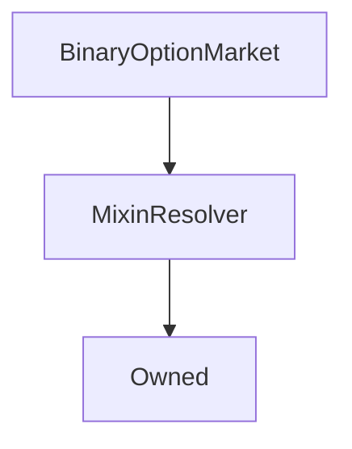

# BinaryOptionMarket

## Description

This contract manages a single binary option market, where users can speculate on the outcome of a future event
by buying options, each of which is an ERC20 token that pays out 1 sUSD if its corresponding outcome occurs.

Each binary option market has a specific underlying asset, and a strike price for that asset at a particular
maturity date. If the reported price of the asset is lower than the strike price at the maturity date, then
all the options on the short side of the market pay out 1 sUSD each, while if the price is higher than or equal
to the strike price, then the options on the long side pay out 1 sUSD each.

This contract was proposed as part of [SIP-53](https://sips.synthetix.io/sips/sip-53). Further information on the
mechanism and its motivation can be found in the SIP.

**Market Lifecycle**

A market goes through four major phases in its life. The phase a market is currently in
can be queried with the [`phase()`](#phase) function, and the time stamps at which it transitions
between these phases is held in the [`times`](#times) public variable.

**Market Creation**

A market can be created by anyone, as long as they can provide enough initial capital to [ensure
the market is liquid](#capitalrequirement). Upon creation, markets will be
[tracked in the manager contract](BinaryOptionMarketManager.md#_markets)
until they are eventually destroyed.

Market creators are incentivised to make markets by the collection of [fees](#fees),
which they share with the fee pool. These fees are released at the end of the market's life;
it is in the creator's interest, in order to maximise the fees they collect, to set
market parameters that attract the maximum demand over the lifetime of the market.

Binary option markets are created by calls to the [`BinaryOptionMarketManager.createMarket`](BinaryOptionMarketManager.md#createmarket)
function: see the documentation for that function for more details.

**Bidding**

During the bidding phase, the total supply of options and option prices are established.
During this period, users can bid on the long or short side of the market and refund those bids.
The option prices are determined during this phase according to the computations outlined in the
[`_updatePrices`](#_updateprices) function; the price on one side of the market is effectively the
fraction of bids on that side relative to all bids.

| Relevant Functions                                               | Description                                                                                          |
| ---------------------------------------------------------------- | ---------------------------------------------------------------------------------------------------- |
| [`bid`](#bid)                                                    | Places a bid.                                                                                        |
| [`refund`](#refund)                                              | Refunds an existing bid, minus a [fee](#fees).                                                       |
| [`bidsOf`](#bidsof) / [`totalBids`](#totalbids)                  | Queries current bid balances.                                                                        |
| [`claimableBy`](#claimableby) / [`totalClaimable`](#claimableby) | Queries the number of options that would be claimable if the market resolved at the current price.   |
| [`prices`](#prices)                                              | The current prices on the market.                                                                    |
| [`oracleDetails`](#oracledetails)                                | The basic parameters of the market, including the underlying asset, strike price, and maturity date. |

**Trading**

During the trading phase, bids and refunds are disabled and the final option prices are fixed, so options can be claimed and exchanged as ERC20 tokens.

| Relevant Functions                                               | Description                                                    |
| ---------------------------------------------------------------- | -------------------------------------------------------------- |
| [`claimableBy`](#claimableby) / [`totalClaimable`](#claimableby) | Queries the actual number of options a user can claim.         |
| [`claimOptions`](#claimoptions)                                  | Claims the options owed to a user.                             |
| [`balancesOf`](#balancesof) / [`totalSupplies`](#totalsupplies)  | Returns a user's actual option balances.                       |
| [`BinaryOption` ERC20 functions](BinaryOption.md)                | Users can freely transfer any claimed options as ERC20 tokens. |

**Maturity**

After the end of the trading period, the market's maturity condition is evaluated and options can be exercised
according to the result. The maturity condition is ultimately resolved depending on the result of the
[`oraclePriceAndTimestamp`](#oraclepriceandtimestamp) function.

| Relevant Functions                    | Description                                                                                                                          |
| ------------------------------------- | ------------------------------------------------------------------------------------------------------------------------------------ |
| [`canResolve`](#canresolve)           | Indicates whether the market can be resolved yet.                                                                                    |
| [`resolve`](#resolve)                 | Queries the current price of the underlying asset from the oracle, compares it against the strike price, and saves the final result. |
| [`resolved`](#resolved)               | True if the market has been resolved                                                                                                 |
| [`result`](#result)                   | Reports which side pays out, or which side would pay out if an unresolved market were resolved immediately.                          |
| [`exerciseOptions`](#exerciseoptions) | Transfers the payout owed to a user from the options they hold.                                                                      |

**Destruction**

After a period the market can be destroyed by a call to
[`BinaryOptionMarketManager.destroyMarket`](BinaryOptionMarketManager.md#destroymarket).
At this time the collected [fees](#fees) are transferred to the fee pool and to whoever called the function.
The market is then destroyed and removed from the list of active markets on the manager.

For an exclusive period determined by
[`BinaryOptionMarketManager.durations.creatorDestructionDuration`](BinaryOptionMarketManager.md#durations),
only the [creator](#creator) of a market can destroy it, but after this time elapses, the reward is available for
anyone to claim in exchange for cleaning up the market.

| Relevant Functions                                                                                            | Description                                                                                        |
| ------------------------------------------------------------------------------------------------------------- | -------------------------------------------------------------------------------------------------- |
| [`destructionReward`](#destructionreward)                                                                     | The value of sUSD transferred to the market destroyer.                                             |
| [`BinaryOptionMarketManager.destroyMarket`](BinaryOptionMarketManager.md#destroymarket)                       | Destroys a market and remits the destruction reward to the destroyer.                              |
| [`BinaryOptionMarketManager.publiclyDestructibleTime`](BinaryOptionMarketManager.md#publiclydestructibletime) | The timestamp after which a given market will be destructible by addresses other than its creator. |

**Enums**

**`Phase`**

The phases the market proceeds through.

| Value      | Description |
| ---------- | ----------- |
| `Bidding`  | Users can place and refund bids. |
| `Trading`  | Bidding is disabled, but options can be claimed and transferred as ERC20 tokens. |
| `Maturity` | The market has matured, and options can be exercised for a value of sUSD. |
| `Destruction` | The market is ready to be destroyed. |

**`Side`**

The two sides of the market, each of which represents a particular event occurring.

| Value   | Description |
| ------- | ----------- |
| `Long`  | The event ath the asset price is higher than or equal to the strike price at the maturity date. |
| `Short` | The event that the asset price is lower than the strike price at the maturity date. |

**Source:** [contracts/BinaryOptionMarket.sol](https://github.com/Synthetixio/synthetix/tree/v2.22.4/contracts/BinaryOptionMarket.sol)

## Architecture

### Libraries

- [SafeMath](/contracts/source/libraries/SafeMath) for `uint`
- [SafeDecimalMath](/contracts/source/libraries/SafeDecimalMath) for `uint`

### Inheritance Graph

### Related Contracts

    graph TD
        BinaryOptionMarket[BinaryOptionMarket] --> BinaryOptionMarketManager[BinaryOptionMarketManager]
        BinaryOptionMarketManager[BinaryOptionMarketManager] --> BinaryOptionMarket[BinaryOptionMarket]
        BinaryOptionMarketFactory[BinaryOptionMarketFactory] --> BinaryOptionMarket[BinaryOptionMarket]
        BinaryOptionMarket[BinaryOptionMarket] --> BinaryOption[BinaryOption]
        BinaryOption[BinaryOption] --> BinaryOptionMarket[BinaryOptionMarket]
        BinaryOptionMarket[BinaryOptionMarket] --> SystemStatus[SystemStatus]
        BinaryOptionMarket[BinaryOptionMarket] --> ExchangeRates[ExchangeRates]
        BinaryOptionMarket[BinaryOptionMarket] --> SynthsUSD[SynthsUSD]
        BinaryOptionMarket[BinaryOptionMarket] --> FeePool[FeePool]

??? example "Details"

    - [`BinaryOptionMarketFactory`](BinaryOptionMarketFactory.md): This factory contract instantiates `BinaryOptionMarket` instances.
    - [`BinaryOptionMarketManager`](BinaryOptionMarketManager.md): The manager that tracks `BinaryOptionMarket` instances.
    - [`BinaryOption`](BinaryOption.md): Option token instances, which track bids and balances of participants in this market. Each market has two associated `BinaryOption` instances; one for long options and one for short options.
    - [`ExchangeRates`](ExchangeRates.md): The contract that a market's underlying asset's price is queried from.
    - [`SynthsUSD`](Synth.md): Binary option markets are denominated in sUSD.
    - [`FeePool`](FeePool.md): Fees are remitted to the fee address.

## Structs

### `Fees`

[Source](https://github.com/Synthetixio/synthetix/tree/v2.22.4/contracts/BinaryOptionMarket.sol#L48)

The fee rates of this market. Note that the sum `poolFee + creatorFee` must be between 0 and 1 exclusive,
while `refundFee` must be no greater than 1.

`creatorFeesCollected` is a record of the actual fees collected, saved at the market's resolution time. The fees are
actually remitted upon the destruction of the market. Since this quantity are computed as a fraction of the sUSD
deposited in the market when it matures, it must be saved explicitly, since the deposited quantity decreases as options
are exercised.

| Field                  | Type      | Description                                                                                                                                                                                                                                                                                                                                                                                                                   |
| ---------------------- | --------- | ----------------------------------------------------------------------------------------------------------------------------------------------------------------------------------------------------------------------------------------------------------------------------------------------------------------------------------------------------------------------------------------------------------------------------- |
| `poolFee`              | `uint256` | The portion of the sUSD deposited in the market at resolution that is collected by the [fee pool](FeePool.md). This is an [18-decimal](/contracts/source/libraries/SafeDecimalMath.md) fixed point number.                                                                                                                                                                                                                    |
| `creatorFee`           | `uint256` | The portion collected by the market's [creator](#creator) as a fee. This is an [18-decimal](/contracts/source/libraries/SafeDecimalMath.md) fixed point number.                                                                                                                                                                                                                                                               |
| `refundFee`            | `uint256` | When a bid is refunded, this portion of its value is retained in the market to be paid out at maturity. This fee is intended to compensate the market for the toxic price signal that the bidder has sent, by increasing the payoff of the remaining bidders, and to discourage excessive price volatility at the end of bidding. This is an [18-decimal](/contracts/source/libraries/SafeDecimalMath.md) fixed point number. |
| `creatorFeesCollected` | `uint256` | The value of sUSD to be transferred to the market's [creator](#creator) at the market's destruction. This is an [18-decimal](/contracts/source/libraries/SafeDecimalMath.md) fixed point number.                                                                                                                                                                                                                              |

### `Options`

[Source](https://github.com/Synthetixio/synthetix/tree/v2.22.4/contracts/BinaryOptionMarket.sol#L26)

The addresses of the two [`BinaryOption`](BinaryOption.md) instances
for options on each side of the market.

| Field   | Type                    | Description                                          |
| ------- | ----------------------- | ---------------------------------------------------- |
| `long`  | `contract BinaryOption` | The address of the token contract for long options.  |
| `short` | `contract BinaryOption` | The address of the token contract for short options. |

### `OracleDetails`

[Source](https://github.com/Synthetixio/synthetix/tree/v2.22.4/contracts/BinaryOptionMarket.sol#L42)

Oracle-relevant details used at the resolution of the market.

| Field         | Type      | Description                                                                                                                                                         |
| ------------- | --------- | ------------------------------------------------------------------------------------------------------------------------------------------------------------------- |
| `key`         | `bytes32` | The key of the underlying asset of this market, as in the [`ExchangeRates`](ExchangeRates.md) contract.                                                             |
| `strikePrice` | `uint256` | The threshold price of the underlying asset. This is an [18-decimal](/contracts/source/libraries/SafeDecimalMath.md) fixed point number.                            |
| `finalPrice`  | `uint256` | The actual measured price of the underlying asset at the maturity date. This is an [18-decimal](/contracts/source/libraries/SafeDecimalMath.md) fixed point number. |

### `Prices`

[Source](https://github.com/Synthetixio/synthetix/tree/v2.22.4/contracts/BinaryOptionMarket.sol#L31)

The prices of the options on each side of the market.

| Field   | Type      | Description                                                                                                                     |
| ------- | --------- | ------------------------------------------------------------------------------------------------------------------------------- |
| `long`  | `uint256` | The current price of long options. This is an [18-decimal](/contracts/source/libraries/SafeDecimalMath.md) fixed point number.  |
| `short` | `uint256` | The current price of short options. This is an [18-decimal](/contracts/source/libraries/SafeDecimalMath.md) fixed point number. |

### `Times`

[Source](https://github.com/Synthetixio/synthetix/tree/v2.22.4/contracts/BinaryOptionMarket.sol#L36)

Timestamps of important dates. All times are given as unix timestamps in seconds.

| Field         | Type      | Description                                                                |
| ------------- | --------- | -------------------------------------------------------------------------- |
| `biddingEnd`  | `uint256` | The time at which the bidding phase transitions to the trading phase.      |
| `maturity`    | `uint256` | The time at which the trading phase transitions to the maturity phase.     |
| `destruction` | `uint256` | The time at which the maturity phase transitions to the destruction phase. |

## Variables

### `capitalRequirement`

[Source](https://github.com/Synthetixio/synthetix/tree/v2.22.4/contracts/BinaryOptionMarket.sol#L67)

The minimum capital that the market's [creator](#creator) must maintain in the market until the end of
bidding. The market's initial bids must be at least this value, and the creator may not submit refunds that
would reduce their open bids to a value less than this minimum.

**Type:** `uint256`

### `creator`

[Source](https://github.com/Synthetixio/synthetix/tree/v2.22.4/contracts/BinaryOptionMarket.sol#L66)

The initial creator of the market, who contributed the initial capital and market parameters, and is entitled
to the creator fee.

**Type:** `address`

### `deposited`

[Source](https://github.com/Synthetixio/synthetix/tree/v2.22.4/contracts/BinaryOptionMarket.sol#L65)

The sum of open bids on both sides of the market, plus any sUSD witheld for refund fees.
We store this explicitly in case any tokens are transferred to this contract directly, as in that
case querying the contract's sUSD token balance would throw off several calculations.

**Type:** `uint256`

### `fees`

[Source](https://github.com/Synthetixio/synthetix/tree/v2.22.4/contracts/BinaryOptionMarket.sol#L61)

The [fee rates](#fees) charged in this market and the fees collected on behalf of the creator.

**Type:** `struct BinaryOptionMarket.Fees`

### `options`

[Source](https://github.com/Synthetixio/synthetix/tree/v2.22.4/contracts/BinaryOptionMarket.sol#L57)

The [addresses](#options) of this market's `BinaryOption` instances.

**Type:** `struct BinaryOptionMarket.Options`

### `oracleDetails`

[Source](https://github.com/Synthetixio/synthetix/tree/v2.22.4/contracts/BinaryOptionMarket.sol#L60)

The [oracle parameters](#oracledetails) of this market, including the underlying asset and strike price.

**Type:** `struct BinaryOptionMarket.OracleDetails`

### `prices`

[Source](https://github.com/Synthetixio/synthetix/tree/v2.22.4/contracts/BinaryOptionMarket.sol#L58)

The long and short option [prices](#prices) of this market.

**Type:** `struct BinaryOptionMarket.Prices`

### `resolved`

[Source](https://github.com/Synthetixio/synthetix/tree/v2.22.4/contracts/BinaryOptionMarket.sol#L68)

True if the market has been [resolved](#resolve), and false otherwise.

**Type:** `bool`

### `times`

[Source](https://github.com/Synthetixio/synthetix/tree/v2.22.4/contracts/BinaryOptionMarket.sol#L59)

The [unix timestamps](#times) at which this market transitions between [phases](#phase).

**Type:** `struct BinaryOptionMarket.Times`

## Constructor

### `constructor`

[Source](https://github.com/Synthetixio/synthetix/tree/v2.22.4/contracts/BinaryOptionMarket.sol#L88)

The constructor sets up all the static values for [fees](#fees), [timestamps](#times), [asset and strike price](#oracledetails) among other parameters,
and checks that all of these settings are within acceptable ranges. The market's owner (the [manager](BinaryOptionMarketManager.md) contract),
and [creator](#creator) are also set at this time.

In addition, the market's [`BinaryOption`](BinaryOption.md) instances for each side of the market are instantiated,
and their initial prices are computed from the initial bids.

Note that the market's known [`AddressResolver`](AddressResolver.md) address will be incorrect at first,
being initially set to the provided owner address, but this will be remedied after the first sync.

Initial timestamps should be provided in the order `[biddingEnd, maturity, destruction]`, initial bids as
`[longBid, shortBid]`, and fees as `[poolFee, creatorFee, refundFee]`.

??? example "Details"

    **Signature**

    `(address _owner, address _creator, uint256 _capitalRequirement, bytes32 _oracleKey, uint256 _strikePrice, uint256[3] _times, uint256[2] _bids, uint256[3] _fees)`

    **Visibility**

    `public`

    **State Mutability**

    `nonpayable`

    **Requires**

    * [require(..., Insufficient capital)](https://github.com/Synthetixio/synthetix/tree/v2.22.4/contracts/BinaryOptionMarket.sol#L106)

    * [require(..., End of bidding has passed)](https://github.com/Synthetixio/synthetix/tree/v2.22.4/contracts/BinaryOptionMarket.sol#L111)

    * [require(..., Maturity predates end of bidding)](https://github.com/Synthetixio/synthetix/tree/v2.22.4/contracts/BinaryOptionMarket.sol#L112)

    * [require(..., Destruction predates maturity)](https://github.com/Synthetixio/synthetix/tree/v2.22.4/contracts/BinaryOptionMarket.sol#L113)

    * [require(..., Refund fee > 100%)](https://github.com/Synthetixio/synthetix/tree/v2.22.4/contracts/BinaryOptionMarket.sol#L117)

    * [require(..., Fee >= 100%)](https://github.com/Synthetixio/synthetix/tree/v2.22.4/contracts/BinaryOptionMarket.sol#L119)

    * [require(..., Fee is zero)](https://github.com/Synthetixio/synthetix/tree/v2.22.4/contracts/BinaryOptionMarket.sol#L120)

## Views

### `balancesOf`

[Source](https://github.com/Synthetixio/synthetix/tree/v2.22.4/contracts/BinaryOptionMarket.sol#L355)

Returns the [option balances](BinaryOption.md#balanceof) of the message sender on each side of the market.

??? example "Details"

    **Signature**

    `balancesOf(address account)`

    **Visibility**

    `external`

    **State Mutability**

    `view`

### `bidForPrice`

[Source](https://github.com/Synthetixio/synthetix/tree/v2.22.4/contracts/BinaryOptionMarket.sol#L288)

Produces the size of bid or refund necessary on a particular side of the market to move the price on one side
or the other to a desired level.

For example, to move the long price to $0.8$ by bidding on the long side, one would have to bid
`bidForPrice(Side.Long, Side.Long, 0.8 * UNIT, false)`. On the other hand, to move the short price
to $0.6$ by refunding on the long side, one would need to refund `bidForPrice(Side.Long, Side.Short, 0.6 * UNIT, true)`.

If the result would be negative, because the desired operation can only move the price in the opposite direction
from the target, the function returns 0.

??? info "Formula Derivation"
    For brevity, the following definitions will be used:
       
    $$
    \begin{equation}
        \begin{split}
        \psi &:= 1 - (\text{poolFee} + \text{creatorFee}) \\
        \xi  &:= 1 - \text{refundFee} \\
        D    &:= \text{deposited()} \\
        P_{this}, P_{that} &:= \text{prices()} \\
        Q_{this}, Q_{that} &:= \text{totalBids()} \\
        \end{split}
    \end{equation}
    $$
        
    The variables $\text{this}$ and $\text{that}$ refer to the opposite sides of the market. Since prices
    are symmetrical between the sides of the market, they can be interpreted in either order.

    If a bid with value $b$ is placed on $\text{this}$ side of the market, the resulting prices are as follows:

    $$
    \begin{equation}
        \begin{split}
        P_{this} & \leftarrow \frac{Q_{this} + b}{\psi (D + b)} \\
        P_{that} & \leftarrow \frac{Q_{that}}{\psi (D + b)}
        \end{split}
    \end{equation}
    $$

    The case of a refund of value $r$ must take the refund fee into account:

    $$
    \begin{equation}
        \begin{split}
        P_{this} &\leftarrow \frac{Q_{this} - r}{\psi (D - \xi r)} \\
        P_{that} &\leftarrow \frac{Q_{that}}{\psi (D - \xi r)}
        \end{split}
    \end{equation}
    $$

    So by bidding or refunding on $this$ side of the market, we alter the prices on both sides. Note that bids always
    increase prices on $this$ side and decrease prices on $that$ side, while refunds always decrease prices on $this$
    side and increase prices on $that$ side.
    
    **Same-Side Price Targeting**
    
    By changing our position on $this$ side of the market, we can change $P_{this}$ to a desired level $P^{*}_{this}$.
    If $P_{this} < P^{*}_{this}$, we must bid a value $b$ to increase the price, while if $P^{*}_{this} < P_{this}$,
    we must refund a value $r$ to decrease the price, as follows:
  
    $$
    \begin{equation}
        \begin{split}
        b &\leftarrow \frac{\psi D P_{this} - Q_{this}}{1 - \psi P_{this} } \\
        r &\leftarrow \frac{Q_{this} - \psi D P_{this}}{1 - \xi \psi P_{this}}
        \end{split}
    \end{equation}
    $$
       
    **Opposite-Side Price Targeting**
    
    Similarly, by changing our position on $this$ side, we can also change $P_{that}$ to a desired level $P^{*}_{that}$.
    The response of the market is the opposite to the same-side case, so if $P_{that} < P^{*}_{that}$, we must refund
    a value $r$ to increase the price, while if $P^{*}_{that} < P_{that}$, we must bid a value $b$ to decrease the
    price, as follows:
    
    $$
    \begin{equation}
        \begin{split}
        r &\leftarrow \frac{\psi D P_{that} - Q_{that}}{\xi \psi P_{that}} \\
        b &\leftarrow \frac{Q_{that} - \psi D P_{that}}{\psi P_{that}}
        \end{split}
    \end{equation}
    $$
    
    Note that all of these values can be negative if the desired price is in the wrong direction relative to the way
    it will move given the side of the market we're looking at and whether we're bidding or refunding. Since we
    cannot perform negative bids or refunds, the function returns 0 instead of throwing an exception or returning
    negative numbers. 

??? example "Details"

    **Signature**

    `bidForPrice(enum IBinaryOptionMarket.Side bidSide, enum IBinaryOptionMarket.Side priceSide, uint256 price, bool refund)`

    **Visibility**

    `external`

    **State Mutability**

    `view`

### `bidsOf`

[Source](https://github.com/Synthetixio/synthetix/tree/v2.22.4/contracts/BinaryOptionMarket.sol#L327)

Returns the current [bids](BinaryOption.md#bidof) on each side of the market of the message sender.

??? example "Details"

    **Signature**

    `bidsOf(address account)`

    **Visibility**

    `external`

    **State Mutability**

    `view`

### `canResolve`

[Source](https://github.com/Synthetixio/synthetix/tree/v2.22.4/contracts/BinaryOptionMarket.sol#L202)

Returns true if the market can currently be resolved, which is the case when:

- The market has not already resolved.
- The [maturity date](#times) is in the past;
- The [oracle price](#oraclepriceandtimestamp) is [fresh](#_isfreshpriceupdatetime).

??? example "Details"

    **Signature**

    `canResolve()`

    **Visibility**

    `external`

    **State Mutability**

    `view`

### `claimableBy`

[Source](https://github.com/Synthetixio/synthetix/tree/v2.22.4/contracts/BinaryOptionMarket.sol#L343)

Returns balance of options on each side of the market that [would be claimable](BinaryOption.md#claimableby)
by the message sender at the [current prices](#prices).

Note that this function still operates during bidding, and only reflects the actually-claimable quantities after the
market has transitioned to the [trading phase](#phase).

??? example "Details"

    **Signature**

    `claimableBy(address account)`

    **Visibility**

    `external`

    **State Mutability**

    `view`

### `destructionReward`

[Source](https://github.com/Synthetixio/synthetix/tree/v2.22.4/contracts/BinaryOptionMarket.sol#L243)

Returns the value of sUSD that will be paid to the caller if they successfully
[destroy](#selfdestruct) this market. If the market is not destructible, this function
returns 0. Otherwise the destruction reward is the [collected creator fees](#feescollected) plus
the value of any unexercised options.

Since there is [a creator-exclusive destruction period](BinaryOptionMarketManager.md#publiclydestructibletime),
this means that market creators can recover their initial bids here if they were never exercised.

Note that, due to rounding errors, if the [pool fee rate](#fees) is zero, under some circumstances the remaining
deposits in the pool may be a few wei less than the computed creator fees.
In most cases, any rounding error is simply deducted from the pool's fee take, which is simply the remaining
funds in the market after the destruction reward has been deducted.

??? example "Details"

    **Signature**

    `destructionReward()`

    **Visibility**

    `external`

    **State Mutability**

    `view`

### `oraclePriceAndTimestamp`

[Source](https://github.com/Synthetixio/synthetix/tree/v2.22.4/contracts/BinaryOptionMarket.sol#L193)

Returns the current price of this market's [underlying asset](#oracledetails) at the [`ExchangeRates`](ExchangeRates.md)
contract, along with the time it was updated.

??? example "Details"

    **Signature**

    `oraclePriceAndTimestamp()`

    **Visibility**

    `external`

    **State Mutability**

    `view`

### `phase`

[Source](https://github.com/Synthetixio/synthetix/tree/v2.22.4/contracts/BinaryOptionMarket.sol#L172)

Returns the current [phase](#phase) the market is in.

??? example "Details"

    **Signature**

    `phase()`

    **Visibility**

    `external`

    **State Mutability**

    `view`

### `pricesAfterBid`

[Source](https://github.com/Synthetixio/synthetix/tree/v2.22.4/contracts/BinaryOptionMarket.sol#L271)

Computes the resulting market prices if a given bid or refund is made. If a refund greater than or equal to the total
bids on that side of the market is requested, the transaction will revert. See [`bidForPrice`](#bidforprice)
for details of this computation.

??? example "Details"

    **Signature**

    `pricesAfterBid(enum IBinaryOptionMarket.Side side, uint256 value, bool refund)`

    **Visibility**

    `external`

    **State Mutability**

    `view`

### `result`

[Source](https://github.com/Synthetixio/synthetix/tree/v2.22.4/contracts/BinaryOptionMarket.sol#L218)

If the market has not resolved, returns the side of the market that would pay out if it was resolved
at the current price.
Otherwise, if the market has resolved, the function returns the value that the market resolved to when
[`resolve()`](#resolve) was successfully called.

Note that no check is performed that the underlying asset price [is fresh](#_isfreshpriceupdatetime).

??? example "Details"

    **Signature**

    `result()`

    **Visibility**

    `external`

    **State Mutability**

    `view`

### `senderPrice`

[Source](https://github.com/Synthetixio/synthetix/tree/v2.22.4/contracts/BinaryOptionMarket.sol#L261)

Used by this market's [`BinaryOption` instances](#options) to retrieve their own prices.
If called by the long option, this function returns the long price; if by the short option, the short price;
if it is called by any other address, the transaction is reverted.

??? example "Details"

    **Signature**

    `senderPrice()`

    **Visibility**

    `external`

    **State Mutability**

    `view`

### `totalBids`

[Source](https://github.com/Synthetixio/synthetix/tree/v2.22.4/contracts/BinaryOptionMarket.sol#L335)

Returns the [total value of bids](BinaryOption.md#totalbids) on each side of the market.

??? example "Details"

    **Signature**

    `totalBids()`

    **Visibility**

    `external`

    **State Mutability**

    `view`

### `totalClaimable`

[Source](https://github.com/Synthetixio/synthetix/tree/v2.22.4/contracts/BinaryOptionMarket.sol#L347)

Returns the [total balance of options claimable](BinaryOption.md#totalclaimable)
from the [current total of bids](BinaryOption.md#totalbids) on each side of the market.

Note that due to rounding, this may not predict exactly the quantities which will actually claimed in the end.
Like [`claimableBy`](#claimableby), this function still operates during the [bidding phase](#phase),
but will not attain its correct value until bidding has ended.

??? example "Details"

    **Signature**

    `totalClaimable()`

    **Visibility**

    `external`

    **State Mutability**

    `view`

### `totalExercisable`

[Source](https://github.com/Synthetixio/synthetix/tree/v2.22.4/contracts/BinaryOptionMarket.sol#L363)

Return the [total supply of options that could be ultimately be exercised](BinaryOption.md#totalexercisable),
which is equal to the total supply of currently-circulating options plus the total supply yet to be claimed.

??? example "Details"

    **Signature**

    `totalExercisable()`

    **Visibility**

    `external`

    **State Mutability**

    `view`

### `totalSupplies`

[Source](https://github.com/Synthetixio/synthetix/tree/v2.22.4/contracts/BinaryOptionMarket.sol#L359)

Returns the [total supply of options](BinaryOption.md#totalsupply) on each side of the market.

??? example "Details"

    **Signature**

    `totalSupplies()`

    **Visibility**

    `external`

    **State Mutability**

    `view`

## Restricted Functions

### `_claimOptions`

[Source](https://github.com/Synthetixio/synthetix/tree/v2.22.4/contracts/BinaryOptionMarket.sol#L474)

See [`claimOptions`](#claimoptions).

??? example "Details"

    **Signature**

    `_claimOptions()`

    **Visibility**

    `internal`

    **State Mutability**

    `nonpayable`

    **Requires**

    * [require(..., Nothing to claim)](https://github.com/Synthetixio/synthetix/tree/v2.22.4/contracts/BinaryOptionMarket.sol#L478)

    **Modifiers**

    * [onlyAfterBidding](#onlyafterbidding)

    * [systemActive](#systemactive)

    * [managerNotPaused](#managernotpaused)

    **Emits**

    * [OptionsClaimed](#optionsclaimed)

### `_resolve`

[Source](https://github.com/Synthetixio/synthetix/tree/v2.22.4/contracts/BinaryOptionMarket.sol#L449)

See [`resolve`](#resolve).

??? example "Details"

    **Signature**

    `_resolve()`

    **Visibility**

    `internal`

    **State Mutability**

    `nonpayable`

    **Requires**

    * [require(..., Market already resolved)](https://github.com/Synthetixio/synthetix/tree/v2.22.4/contracts/BinaryOptionMarket.sol#L450)

    * [require(..., Price is stale)](https://github.com/Synthetixio/synthetix/tree/v2.22.4/contracts/BinaryOptionMarket.sol#L455)

    **Modifiers**

    * [onlyAfterMaturity](#onlyaftermaturity)

    * [systemActive](#systemactive)

    * [managerNotPaused](#managernotpaused)

    **Emits**

    * [MarketResolved](#marketresolved)

### `bid`

[Source](https://github.com/Synthetixio/synthetix/tree/v2.22.4/contracts/BinaryOptionMarket.sol#L398)

Allows a user to place an sUSD bid on one or the other side of the market.

To process a bid, the market increments the user's [bid balance](#bidsof) on the appropriate option contract,
as well as incrementing the total value deposited both [in this market](#deposited) and in the
[manager contract](BinaryOptionMarketManager.md#totaldeposited). The deposit quantities having been updated,
the option prices are [recomputed](#_updateprices) to reflect the changed odds.

The value of the bid is withdrawn from the message sender's sUSD balance by a call to
`ERC20.transferFrom`, so the caller must have ensured that
they have granted the market sufficient approval and that they have enough
sUSD to support the bid.

The transaction reverts if this function is called outside the bidding period, if the system is suspended,
or if the manager contract is paused.

??? example "Details"

    **Signature**

    `bid(enum IBinaryOptionMarket.Side side, uint256 value)`

    **Visibility**

    `external`

    **State Mutability**

    `nonpayable`

    **Modifiers**

    * [onlyDuringBidding](#onlyduringbidding)

    **Emits**

    * [Bid](#bid)

### `refund`

[Source](https://github.com/Synthetixio/synthetix/tree/v2.22.4/contracts/BinaryOptionMarket.sol#L415)

Refunds an existing bid, remitting the refund value minus a percentage determined by the [refund fee rate](#fees) as sUSD.
The function returns the value refunded as sUSD.

The full value of the refund is deducted from the caller's bids, while this value minus the refund fee
is actually remitted as sUSD. The deposited quantity in [the market](#deposited)
and in the [manager contract](BinaryOptionMarketManager.md#totaldeposited) are decremented by the transferred
value. The deposit quantities having been updated, the option prices are [recomputed](#_updateprices) to reflect the
changed odds.

The refund fee, which will eventually be paid out to option-holders, is retained in the pot,
although not on either side's bid total. As such, refunds discount option
prices for all those remaining in the market.

If the message sender is the market's [creator](#creator), then a refund transaction will revert
if it would either violate the [capital requirement](#capitalrequirement), or if
it would refund their entire position on either side of the market.

The transaction reverts if this function is called outside the bidding period, if the system is suspended,
or if the manager contract is paused.

??? example "Details"

    **Signature**

    `refund(enum IBinaryOptionMarket.Side side, uint256 value)`

    **Visibility**

    `external`

    **State Mutability**

    `nonpayable`

    **Modifiers**

    * [onlyDuringBidding](#onlyduringbidding)

    **Emits**

    * [Refund](#refund)

### `selfDestruct`

[Source](https://github.com/Synthetixio/synthetix/tree/v2.22.4/contracts/BinaryOptionMarket.sol#L524)

This function allows the manager to destroy this market at the end of its life.
Upon destruction, the [destruction reward](#destructionreward)
is computed and paid to the beneficiary
(whoever [initiated destruction in the manager contract](BinaryOptionMarketManager.md#destroymarket)),
and any remaining tokens are sent to the [fee pool](FeePool.md#fee_address), and these quantities
will be deducted from the total tracked in the [manager](BinaryOptionMarketManager.md#totaldeposited).
The market will also destroy its child [`BinaryOption`](#options) instances before it destroys itself.

The function will revert if the caller is not the owner, if the market is not [resolved](#resolved), or if
it is not yet [destructible](#_destructible), if the manager is paused, or the system is suspended.

??? example "Details"

    **Signature**

    `selfDestruct(address payable beneficiary)`

    **Visibility**

    `external`

    **State Mutability**

    `nonpayable`

    **Requires**

    * [require(..., Unresolved)](https://github.com/Synthetixio/synthetix/tree/v2.22.4/contracts/BinaryOptionMarket.sol#L525)

    * [require(..., Not yet destructible)](https://github.com/Synthetixio/synthetix/tree/v2.22.4/contracts/BinaryOptionMarket.sol#L526)

    **Modifiers**

    * [onlyOwner](#onlyowner)

## Internal Functions

### `_balancesOf`

[Source](https://github.com/Synthetixio/synthetix/tree/v2.22.4/contracts/BinaryOptionMarket.sol#L351)

See [`balancesOf`](#balancesof).

??? example "Details"

    **Signature**

    `_balancesOf(address account)`

    **Visibility**

    `internal`

    **State Mutability**

    `view`

### `_biddingEnded`

[Source](https://github.com/Synthetixio/synthetix/tree/v2.22.4/contracts/BinaryOptionMarket.sol#L160)

True if the current time is after the [bidding end time](#times).

??? example "Details"

    **Signature**

    `_biddingEnded()`

    **Visibility**

    `internal`

    **State Mutability**

    `view`

### `_bidsOf`

[Source](https://github.com/Synthetixio/synthetix/tree/v2.22.4/contracts/BinaryOptionMarket.sol#L323)

See [`bidsOf`](#bidsof).

??? example "Details"

    **Signature**

    `_bidsOf(address account)`

    **Visibility**

    `internal`

    **State Mutability**

    `view`

### `_chooseSide`

[Source](https://github.com/Synthetixio/synthetix/tree/v2.22.4/contracts/BinaryOptionMarket.sol#L369)

Selects between a long and a short value depending on its first input.

??? example "Details"

    **Signature**

    `_chooseSide(enum IBinaryOptionMarket.Side side, uint256 longValue, uint256 shortValue)`

    **Visibility**

    `internal`

    **State Mutability**

    `pure`

### `_claimOptions`

[Source](https://github.com/Synthetixio/synthetix/tree/v2.22.4/contracts/BinaryOptionMarket.sol#L474)

See [`claimOptions`](#claimoptions).

??? example "Details"

    **Signature**

    `_claimOptions()`

    **Visibility**

    `internal`

    **State Mutability**

    `nonpayable`

    **Requires**

    * [require(..., Nothing to claim)](https://github.com/Synthetixio/synthetix/tree/v2.22.4/contracts/BinaryOptionMarket.sol#L478)

    **Modifiers**

    * [onlyAfterBidding](#onlyafterbidding)

    * [systemActive](#systemactive)

    * [managerNotPaused](#managernotpaused)

    **Emits**

    * [OptionsClaimed](#optionsclaimed)

### `_claimableBy`

[Source](https://github.com/Synthetixio/synthetix/tree/v2.22.4/contracts/BinaryOptionMarket.sol#L339)

See [`claimableBy`](#claimableby).

??? example "Details"

    **Signature**

    `_claimableBy(address account)`

    **Visibility**

    `internal`

    **State Mutability**

    `view`

### `_computePrices`

[Source](https://github.com/Synthetixio/synthetix/tree/v2.22.4/contracts/BinaryOptionMarket.sol#L252)

Computes the market prices from the long and short bid totals, and the funds deposited in the contract.
These prices are computed approximately as follows:

    longPrice  = longBids  / (feeMultiplier * deposited)
    shortPrice = shortBids / (feeMultiplier * deposited)

Interpreting [`/`](/contracts/source/libraries/SafeDecimalMath.md#dividedecimalround) and [`*`](/contracts/source/libraries/SafeDecimalMath.md#multiplydecimalround)
as [fixed point math operators (with rounding)](/contracts/source/libraries/SafeDecimalMath.md).

Note that the denominator `_feeMultiplier * deposited` is the total value of options awarded to each side of the market,
and `deposited` is equal to `longBids + shortBids + refundFeesCollected`.

If either the long or short bids are zero, then the transaction is reverted, as
this would lead to a zero price, and hence divisions-by-zero when computing claimable option
quantities. This means that the initial bids cannot both be zero, nor can the entire balance
on either side of the market be refunded.

??? example "Details"

    **Signature**

    `_computePrices(uint256 longBids, uint256 shortBids, uint256 _deposited)`

    **Visibility**

    `internal`

    **State Mutability**

    `view`

    **Requires**

    * [require(..., Bids must be nonzero)](https://github.com/Synthetixio/synthetix/tree/v2.22.4/contracts/BinaryOptionMarket.sol#L253)

### `_destructible`

[Source](https://github.com/Synthetixio/synthetix/tree/v2.22.4/contracts/BinaryOptionMarket.sol#L168)

True if the current time is after the [destruction time](#times).

??? example "Details"

    **Signature**

    `_destructible()`

    **Visibility**

    `internal`

    **State Mutability**

    `view`

### `_destructionReward`

[Source](https://github.com/Synthetixio/synthetix/tree/v2.22.4/contracts/BinaryOptionMarket.sol#L224)

See [`destructionReward`](#destructionreward).

??? example "Details"

    **Signature**

    `_destructionReward(uint256 _deposited)`

    **Visibility**

    `internal`

    **State Mutability**

    `view`

### `_exchangeRates`

[Source](https://github.com/Synthetixio/synthetix/tree/v2.22.4/contracts/BinaryOptionMarket.sol#L142)

Returns the [cached](MixinResolver.md) address of the [`ExchangeRates`](ExchangeRates.md) instance.

??? example "Details"

    **Signature**

    `_exchangeRates()`

    **Visibility**

    `internal`

    **State Mutability**

    `view`

### `_feePool`

[Source](https://github.com/Synthetixio/synthetix/tree/v2.22.4/contracts/BinaryOptionMarket.sol#L150)

Retrieves the [cached](MixinResolver.md) address of the [`FeePool`](FeePool.md) instance.

??? example "Details"

    **Signature**

    `_feePool()`

    **Visibility**

    `internal`

    **State Mutability**

    `view`

### `_isFreshPriceUpdateTime`

[Source](https://github.com/Synthetixio/synthetix/tree/v2.22.4/contracts/BinaryOptionMarket.sol#L197)

True if a given timestamp is younger than the [maximum oracle price age](BinaryOptionMarketManager.md#durations),
false otherwise; fresh prices are acceptable for [resolving the market](#resolve).

??? example "Details"

    **Signature**

    `_isFreshPriceUpdateTime(uint256 timestamp)`

    **Visibility**

    `internal`

    **State Mutability**

    `view`

### `_manager`

[Source](https://github.com/Synthetixio/synthetix/tree/v2.22.4/contracts/BinaryOptionMarket.sol#L154)

Returns the address of the [`BinaryOptionMarketManager`](BinaryOptionMarketManager.md) which tracks this market.
Note that this address is also this contract's [owner](Owned.md#owner).

??? example "Details"

    **Signature**

    `_manager()`

    **Visibility**

    `internal`

    **State Mutability**

    `view`

### `_matured`

[Source](https://github.com/Synthetixio/synthetix/tree/v2.22.4/contracts/BinaryOptionMarket.sol#L164)

True if the [maturity date](#times) is in the past, and false otherwise.

??? example "Details"

    **Signature**

    `_matured()`

    **Visibility**

    `internal`

    **State Mutability**

    `view`

### `_option`

[Source](https://github.com/Synthetixio/synthetix/tree/v2.22.4/contracts/BinaryOptionMarket.sol#L376)

Returns the appropriate [option contract address](#options) for a given side of the market.

??? example "Details"

    **Signature**

    `_option(enum IBinaryOptionMarket.Side side)`

    **Visibility**

    `internal`

    **State Mutability**

    `view`

### `_oraclePriceAndTimestamp`

[Source](https://github.com/Synthetixio/synthetix/tree/v2.22.4/contracts/BinaryOptionMarket.sol#L187)

See [`oraclePriceAndTimestamp`](#oraclepriceandtimestamp).

??? example "Details"

    **Signature**

    `_oraclePriceAndTimestamp()`

    **Visibility**

    `internal`

    **State Mutability**

    `view`

### `_resolve`

[Source](https://github.com/Synthetixio/synthetix/tree/v2.22.4/contracts/BinaryOptionMarket.sol#L449)

See [`resolve`](#resolve).

??? example "Details"

    **Signature**

    `_resolve()`

    **Visibility**

    `internal`

    **State Mutability**

    `nonpayable`

    **Requires**

    * [require(..., Market already resolved)](https://github.com/Synthetixio/synthetix/tree/v2.22.4/contracts/BinaryOptionMarket.sol#L450)

    * [require(..., Price is stale)](https://github.com/Synthetixio/synthetix/tree/v2.22.4/contracts/BinaryOptionMarket.sol#L455)

    **Modifiers**

    * [onlyAfterMaturity](#onlyaftermaturity)

    * [systemActive](#systemactive)

    * [managerNotPaused](#managernotpaused)

    **Emits**

    * [MarketResolved](#marketresolved)

### `_result`

[Source](https://github.com/Synthetixio/synthetix/tree/v2.22.4/contracts/BinaryOptionMarket.sol#L207)

See [`result`](#result).

??? example "Details"

    **Signature**

    `_result()`

    **Visibility**

    `internal`

    **State Mutability**

    `view`

### `_sUSD`

[Source](https://github.com/Synthetixio/synthetix/tree/v2.22.4/contracts/BinaryOptionMarket.sol#L146)

Retrieves the [cached](MixinResolver.md) address of the sUSD [`Synth`](Synth.md) instance.

??? example "Details"

    **Signature**

    `_sUSD()`

    **Visibility**

    `internal`

    **State Mutability**

    `view`

### `_subToZero`

[Source](https://github.com/Synthetixio/synthetix/tree/v2.22.4/contracts/BinaryOptionMarket.sol#L384)

Returns the difference of two numbers, or zero if the difference is negative.

??? example "Details"

    **Signature**

    `_subToZero(uint256 a, uint256 b)`

    **Visibility**

    `internal`

    **State Mutability**

    `pure`

### `_systemStatus`

[Source](https://github.com/Synthetixio/synthetix/tree/v2.22.4/contracts/BinaryOptionMarket.sol#L138)

Retrieves the [cached](MixinResolver.md) address of the [`SystemStatus`](SystemStatus.md) contract.

??? example "Details"

    **Signature**

    `_systemStatus()`

    **Visibility**

    `internal`

    **State Mutability**

    `view`

### `_totalBids`

[Source](https://github.com/Synthetixio/synthetix/tree/v2.22.4/contracts/BinaryOptionMarket.sol#L331)

See [`totalBids`](#totalbids).

??? example "Details"

    **Signature**

    `_totalBids()`

    **Visibility**

    `internal`

    **State Mutability**

    `view`

### `_updatePrices`

[Source](https://github.com/Synthetixio/synthetix/tree/v2.22.4/contracts/BinaryOptionMarket.sol#L392)

Updates the current [prices](#prices) from the long and short bid quantities, and the total deposited
value in the contract. See [`_computePrices`](#_computeprices) for details.

??? example "Details"

    **Signature**

    `_updatePrices(uint256 longBids, uint256 shortBids, uint256 _deposited)`

    **Visibility**

    `internal`

    **State Mutability**

    `nonpayable`

    **Emits**

    * [PricesUpdated](#pricesupdated)

## External Functions

### `claimOptions`

[Source](https://github.com/Synthetixio/synthetix/tree/v2.22.4/contracts/BinaryOptionMarket.sol#L483)

Once the bidding period has concluded, this function claims all options [owing](#claimableby) to the message sender on
both sides of the market. The number of options owed is simply the user's [bid balances](#bidsof), divided by the
[current option prices](#prices). The caller's bid balances are set to zero, while the appropriate number
of options are credited to their wallet.

This function reverts the transaction if the system is suspended or the manager contract is paused.

Implemented by the [`_claimOptions`](#_claimoptions) function.

??? example "Details"

    **Signature**

    `claimOptions()`

    **Visibility**

    `external`

    **State Mutability**

    `nonpayable`

### `exerciseOptions`

[Source](https://github.com/Synthetixio/synthetix/tree/v2.22.4/contracts/BinaryOptionMarket.sol#L487)

`exerciseOptions` allows a user to claim any sUSD owed to them after their options have matured.
This function will exercise any options held by the message sender on either side of the market,
zeroing out their option balances. If the caller holds $n$ options on the winning side of the market,
they will be transferred $n$ sUSD. Any options held on the losing side of the market will yield no
payout. Upon exercising options, the quantity of sUSD paid to the called will be deducted from
the tracked totals [here](#deposited), and in the [manager contract](BinaryOptionMarketManager.md#totaldeposited).

If the market is unresolved at call time, it will be resolved if it can be. If the caller
has unclaimed options, they will be claimed before they are exercised.

This function reverts the transaction if the system is suspended or the manager contract is paused.

??? example "Details"

    **Signature**

    `exerciseOptions()`

    **Visibility**

    `external`

    **State Mutability**

    `nonpayable`

    **Requires**

    * [require(..., Nothing to exercise)](https://github.com/Synthetixio/synthetix/tree/v2.22.4/contracts/BinaryOptionMarket.sol#L501)

    **Emits**

    * [OptionsExercised](#optionsexercised)

### `resolve`

[Source](https://github.com/Synthetixio/synthetix/tree/v2.22.4/contracts/BinaryOptionMarket.sol#L467)

This function allows anyone to resolve the market, as long as it satisfies the conditions
of [`canResolve()`](#canresolve).

Market resolution requires fetching the latest price of this market's underlying asset, checking
that it was last updated [recently enough](#_isfreshpriceupdatetime), and then computing and saving
the fees that were collected. After a successful invocation, the variable [`resolved`](#resolved)
will be true. The final oracle price is saved and can be queried from
[`oracleDetails.finalPrice`](#oracledetails).

This function reverts the transaction if the system is suspended or the manager contract is paused.

This is implemented by [`_resolve`](#_resolve).

??? example "Details"

    **Signature**

    `resolve()`

    **Visibility**

    `external`

    **State Mutability**

    `nonpayable`

## Modifiers

### `managerNotPaused`

[Source](https://github.com/Synthetixio/synthetix/tree/v2.22.4/contracts/BinaryOptionMarket.sol#L571)

Reverts the transaction if the [manager contract](BinaryOptionMarketManager.md) has [paused](Pausable.md#paused) binary option operations.

### `onlyAfterBidding`

[Source](https://github.com/Synthetixio/synthetix/tree/v2.22.4/contracts/BinaryOptionMarket.sol#L556)

Reverts the transaction if [bidding has not ended](#_biddingended).

### `onlyAfterMaturity`

[Source](https://github.com/Synthetixio/synthetix/tree/v2.22.4/contracts/BinaryOptionMarket.sol#L561)

Reverts the transaction if the market [has not matured](#_matured).

### `onlyDuringBidding`

[Source](https://github.com/Synthetixio/synthetix/tree/v2.22.4/contracts/BinaryOptionMarket.sol#L551)

Reverts the transaction if [bidding has ended](#_biddingended).

### `systemActive`

[Source](https://github.com/Synthetixio/synthetix/tree/v2.22.4/contracts/BinaryOptionMarket.sol#L566)

## Events

### `Bid`

[Source](https://github.com/Synthetixio/synthetix/tree/v2.22.4/contracts/BinaryOptionMarket.sol#L578)

A bid was made.

**Signature**: `Bid(enum IBinaryOptionMarket.Side side, address account, uint256 value)`

### `MarketResolved`

[Source](https://github.com/Synthetixio/synthetix/tree/v2.22.4/contracts/BinaryOptionMarket.sol#L581)

The market was resolved.

**Signature**: `MarketResolved(enum IBinaryOptionMarket.Side result, uint256 oraclePrice, uint256 oracleTimestamp)`

### `OptionsClaimed`

[Source](https://github.com/Synthetixio/synthetix/tree/v2.22.4/contracts/BinaryOptionMarket.sol#L582)

The market was resolved.

**Signature**: `OptionsClaimed(address account, uint256 longOptions, uint256 shortOptions)`

### `OptionsExercised`

[Source](https://github.com/Synthetixio/synthetix/tree/v2.22.4/contracts/BinaryOptionMarket.sol#L583)

A quantity of options was exercised.

**Signature**: `OptionsExercised(address account, uint256 value)`

### `PricesUpdated`

[Source](https://github.com/Synthetixio/synthetix/tree/v2.22.4/contracts/BinaryOptionMarket.sol#L580)

The option prices were updated.

**Signature**: `PricesUpdated(uint256 longPrice, uint256 shortPrice)`

### `Refund`

[Source](https://github.com/Synthetixio/synthetix/tree/v2.22.4/contracts/BinaryOptionMarket.sol#L579)

A refund was processed. The `value` argument is the quantity of sUSD actually refunded, without the fee.

**Signature**: `Refund(enum IBinaryOptionMarket.Side side, address account, uint256 value, uint256 fee)`
