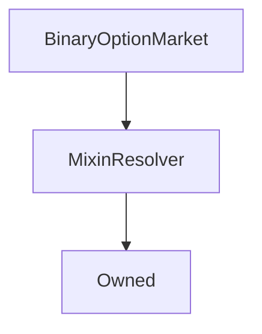

# BinaryOptionMarket

## Description

**Source:** [contracts/BinaryOptionMarket.sol](https://github.com/Synthetixio/synthetix/tree/v2.23.3-beta/contracts/BinaryOptionMarket.sol)

## Architecture

### Libraries

- [SafeMath](/contracts/source/libraries/SafeMath) for `uint`
- [SafeDecimalMath](/contracts/source/libraries/SafeDecimalMath) for `uint`

### Inheritance Graph

## Structs

### `Options`

[Source](https://github.com/Synthetixio/synthetix/tree/v2.23.3-beta/contracts/BinaryOptionMarket.sol#L27)

| Field   | Type                    | Description |
| ------- | ----------------------- | ----------- |
| `long`  | `contract BinaryOption` | TBA         |
| `short` | `contract BinaryOption` | TBA         |

### `OracleDetails`

[Source](https://github.com/Synthetixio/synthetix/tree/v2.23.3-beta/contracts/BinaryOptionMarket.sol#L43)

| Field         | Type      | Description |
| ------------- | --------- | ----------- |
| `key`         | `bytes32` | TBA         |
| `strikePrice` | `uint256` | TBA         |
| `finalPrice`  | `uint256` | TBA         |

### `Prices`

[Source](https://github.com/Synthetixio/synthetix/tree/v2.23.3-beta/contracts/BinaryOptionMarket.sol#L32)

| Field   | Type      | Description |
| ------- | --------- | ----------- |
| `long`  | `uint256` | TBA         |
| `short` | `uint256` | TBA         |

### `Times`

[Source](https://github.com/Synthetixio/synthetix/tree/v2.23.3-beta/contracts/BinaryOptionMarket.sol#L37)

| Field        | Type      | Description |
| ------------ | --------- | ----------- |
| `biddingEnd` | `uint256` | TBA         |
| `maturity`   | `uint256` | TBA         |
| `expiry`     | `uint256` | TBA         |

## Variables

### `creator`

[Source](https://github.com/Synthetixio/synthetix/tree/v2.23.3-beta/contracts/BinaryOptionMarket.sol#L61)

**Type:** `address`

### `creatorLimits`

[Source](https://github.com/Synthetixio/synthetix/tree/v2.23.3-beta/contracts/BinaryOptionMarket.sol#L56)

**Type:** `struct BinaryOptionMarketManager.CreatorLimits`

### `deposited`

[Source](https://github.com/Synthetixio/synthetix/tree/v2.23.3-beta/contracts/BinaryOptionMarket.sol#L60)

**Type:** `uint256`

### `fees`

[Source](https://github.com/Synthetixio/synthetix/tree/v2.23.3-beta/contracts/BinaryOptionMarket.sol#L55)

**Type:** `struct BinaryOptionMarketManager.Fees`

### `options`

[Source](https://github.com/Synthetixio/synthetix/tree/v2.23.3-beta/contracts/BinaryOptionMarket.sol#L51)

**Type:** `struct BinaryOptionMarket.Options`

### `oracleDetails`

[Source](https://github.com/Synthetixio/synthetix/tree/v2.23.3-beta/contracts/BinaryOptionMarket.sol#L54)

**Type:** `struct BinaryOptionMarket.OracleDetails`

### `prices`

[Source](https://github.com/Synthetixio/synthetix/tree/v2.23.3-beta/contracts/BinaryOptionMarket.sol#L52)

**Type:** `struct BinaryOptionMarket.Prices`

### `resolved`

[Source](https://github.com/Synthetixio/synthetix/tree/v2.23.3-beta/contracts/BinaryOptionMarket.sol#L62)

**Type:** `bool`

### `times`

[Source](https://github.com/Synthetixio/synthetix/tree/v2.23.3-beta/contracts/BinaryOptionMarket.sol#L53)

**Type:** `struct BinaryOptionMarket.Times`

## Constructor

### `constructor`

[Source](https://github.com/Synthetixio/synthetix/tree/v2.23.3-beta/contracts/BinaryOptionMarket.sol#L77)

??? example "Details"

    **Signature**

    `(address _owner, address _creator, uint256[2] _creatorLimits, bytes32 _oracleKey, uint256 _strikePrice, uint256[3] _times, uint256[2] _bids, uint256[3] _fees)`

    **Visibility**

    `public`

    **State Mutability**

    `nonpayable`

## Views

### `balancesOf`

[Source](https://github.com/Synthetixio/synthetix/tree/v2.23.3-beta/contracts/BinaryOptionMarket.sol#L323)

??? example "Details"

    **Signature**

    `balancesOf(address account) returns (uint256, uint256)`

    **Visibility**

    `external`

    **State Mutability**

    `view`

### `bidOrRefundForPrice`

[Source](https://github.com/Synthetixio/synthetix/tree/v2.23.3-beta/contracts/BinaryOptionMarket.sol#L252)

??? example "Details"

    **Signature**

    `bidOrRefundForPrice(enum IBinaryOptionMarket.Side bidSide, enum IBinaryOptionMarket.Side priceSide, uint256 price, bool refund) returns (uint256)`

    **Visibility**

    `external`

    **State Mutability**

    `view`

### `bidsOf`

[Source](https://github.com/Synthetixio/synthetix/tree/v2.23.3-beta/contracts/BinaryOptionMarket.sol#L295)

??? example "Details"

    **Signature**

    `bidsOf(address account) returns (uint256, uint256)`

    **Visibility**

    `external`

    **State Mutability**

    `view`

### `canResolve`

[Source](https://github.com/Synthetixio/synthetix/tree/v2.23.3-beta/contracts/BinaryOptionMarket.sol#L184)

??? example "Details"

    **Signature**

    `canResolve() returns (bool)`

    **Visibility**

    `external`

    **State Mutability**

    `view`

### `claimableBalancesOf`

[Source](https://github.com/Synthetixio/synthetix/tree/v2.23.3-beta/contracts/BinaryOptionMarket.sol#L311)

??? example "Details"

    **Signature**

    `claimableBalancesOf(address account) returns (uint256, uint256)`

    **Visibility**

    `external`

    **State Mutability**

    `view`

### `exercisableDeposits`

[Source](https://github.com/Synthetixio/synthetix/tree/v2.23.3-beta/contracts/BinaryOptionMarket.sol#L336)

??? example "Details"

    **Signature**

    `exercisableDeposits() returns (uint256)`

    **Visibility**

    `external`

    **State Mutability**

    `view`

### `oraclePriceAndTimestamp`

[Source](https://github.com/Synthetixio/synthetix/tree/v2.23.3-beta/contracts/BinaryOptionMarket.sol#L175)

??? example "Details"

    **Signature**

    `oraclePriceAndTimestamp() returns (uint256, uint256)`

    **Visibility**

    `external`

    **State Mutability**

    `view`

### `phase`

[Source](https://github.com/Synthetixio/synthetix/tree/v2.23.3-beta/contracts/BinaryOptionMarket.sol#L156)

??? example "Details"

    **Signature**

    `phase() returns (enum IBinaryOptionMarket.Phase)`

    **Visibility**

    `external`

    **State Mutability**

    `view`

### `pricesAfterBidOrRefund`

[Source](https://github.com/Synthetixio/synthetix/tree/v2.23.3-beta/contracts/BinaryOptionMarket.sol#L230)

??? example "Details"

    **Signature**

    `pricesAfterBidOrRefund(enum IBinaryOptionMarket.Side side, uint256 value, bool refund) returns (uint256, uint256)`

    **Visibility**

    `external`

    **State Mutability**

    `view`

### `requireActiveAndUnpaused`

[Source](https://github.com/Synthetixio/synthetix/tree/v2.23.3-beta/contracts/BinaryOptionMarket.sol#L391)

??? example "Details"

    **Signature**

    `requireActiveAndUnpaused()`

    **Visibility**

    `external`

    **State Mutability**

    `view`

    **Requires**

    * [_requireManagerNotPaused](https://github.com/Synthetixio/synthetix/tree/v2.23.3-beta/contracts/BinaryOptionMarket.sol#L393)

### `result`

[Source](https://github.com/Synthetixio/synthetix/tree/v2.23.3-beta/contracts/BinaryOptionMarket.sol#L200)

??? example "Details"

    **Signature**

    `result() returns (enum IBinaryOptionMarket.Side)`

    **Visibility**

    `external`

    **State Mutability**

    `view`

### `senderPriceAndExercisableDeposits`

[Source](https://github.com/Synthetixio/synthetix/tree/v2.23.3-beta/contracts/BinaryOptionMarket.sol#L219)

??? example "Details"

    **Signature**

    `senderPriceAndExercisableDeposits() returns (uint256, uint256)`

    **Visibility**

    `external`

    **State Mutability**

    `view`

### `totalBids`

[Source](https://github.com/Synthetixio/synthetix/tree/v2.23.3-beta/contracts/BinaryOptionMarket.sol#L303)

??? example "Details"

    **Signature**

    `totalBids() returns (uint256, uint256)`

    **Visibility**

    `external`

    **State Mutability**

    `view`

### `totalClaimableSupplies`

[Source](https://github.com/Synthetixio/synthetix/tree/v2.23.3-beta/contracts/BinaryOptionMarket.sol#L315)

??? example "Details"

    **Signature**

    `totalClaimableSupplies() returns (uint256, uint256)`

    **Visibility**

    `external`

    **State Mutability**

    `view`

### `totalSupplies`

[Source](https://github.com/Synthetixio/synthetix/tree/v2.23.3-beta/contracts/BinaryOptionMarket.sol#L327)

??? example "Details"

    **Signature**

    `totalSupplies() returns (uint256, uint256)`

    **Visibility**

    `external`

    **State Mutability**

    `view`

## Restricted Functions

### `expire`

[Source](https://github.com/Synthetixio/synthetix/tree/v2.23.3-beta/contracts/BinaryOptionMarket.sol#L539)

??? example "Details"

    **Signature**

    `expire(address payable beneficiary)`

    **Visibility**

    `external`

    **State Mutability**

    `nonpayable`

    **Requires**

    * [require(..., Unexpired options remaining)](https://github.com/Synthetixio/synthetix/tree/v2.23.3-beta/contracts/BinaryOptionMarket.sol#L540)

    **Modifiers**

    * [onlyOwner](#onlyowner)

### `resolve`

[Source](https://github.com/Synthetixio/synthetix/tree/v2.23.3-beta/contracts/BinaryOptionMarket.sol#L455)

??? example "Details"

    **Signature**

    `resolve()`

    **Visibility**

    `external`

    **State Mutability**

    `nonpayable`

    **Requires**

    * [require(..., Market already resolved)](https://github.com/Synthetixio/synthetix/tree/v2.23.3-beta/contracts/BinaryOptionMarket.sol#L456)

    * [require(..., Price is stale)](https://github.com/Synthetixio/synthetix/tree/v2.23.3-beta/contracts/BinaryOptionMarket.sol#L461)

    **Modifiers**

    * [onlyOwner](#onlyowner)

    * [afterMaturity](#aftermaturity)

    * [systemActive](#systemactive)

    * [managerNotPaused](#managernotpaused)

    **Emits**

    * [MarketResolved](#marketresolved)

## Internal Functions

### `_balancesOf`

[Source](https://github.com/Synthetixio/synthetix/tree/v2.23.3-beta/contracts/BinaryOptionMarket.sol#L319)

??? example "Details"

    **Signature**

    `_balancesOf(address account) returns (uint256, uint256)`

    **Visibility**

    `internal`

    **State Mutability**

    `view`

### `_biddingEnded`

[Source](https://github.com/Synthetixio/synthetix/tree/v2.23.3-beta/contracts/BinaryOptionMarket.sol#L144)

??? example "Details"

    **Signature**

    `_biddingEnded() returns (bool)`

    **Visibility**

    `internal`

    **State Mutability**

    `view`

### `_bidsOf`

[Source](https://github.com/Synthetixio/synthetix/tree/v2.23.3-beta/contracts/BinaryOptionMarket.sol#L291)

??? example "Details"

    **Signature**

    `_bidsOf(address account) returns (uint256, uint256)`

    **Visibility**

    `internal`

    **State Mutability**

    `view`

### `_checkCreatorLimits`

[Source](https://github.com/Synthetixio/synthetix/tree/v2.23.3-beta/contracts/BinaryOptionMarket.sol#L365)

??? example "Details"

    **Signature**

    `_checkCreatorLimits(uint256 longBid, uint256 shortBid)`

    **Visibility**

    `internal`

    **State Mutability**

    `view`

    **Requires**

    * [require(..., Insufficient capital)](https://github.com/Synthetixio/synthetix/tree/v2.23.3-beta/contracts/BinaryOptionMarket.sol#L367)

    * [require(..., Bids too skewed)](https://github.com/Synthetixio/synthetix/tree/v2.23.3-beta/contracts/BinaryOptionMarket.sol#L369)

### `_chooseSide`

[Source](https://github.com/Synthetixio/synthetix/tree/v2.23.3-beta/contracts/BinaryOptionMarket.sol#L342)

??? example "Details"

    **Signature**

    `_chooseSide(enum IBinaryOptionMarket.Side side, uint256 longValue, uint256 shortValue) returns (uint256)`

    **Visibility**

    `internal`

    **State Mutability**

    `pure`

### `_claimOptions`

[Source](https://github.com/Synthetixio/synthetix/tree/v2.23.3-beta/contracts/BinaryOptionMarket.sol#L483)

??? example "Details"

    **Signature**

    `_claimOptions() returns (uint256, uint256)`

    **Visibility**

    `internal`

    **State Mutability**

    `nonpayable`

    **Requires**

    * [require(..., Nothing to claim)](https://github.com/Synthetixio/synthetix/tree/v2.23.3-beta/contracts/BinaryOptionMarket.sol#L494)

    **Modifiers**

    * [systemActive](#systemactive)

    * [managerNotPaused](#managernotpaused)

    * [afterBidding](#afterbidding)

    **Emits**

    * [OptionsClaimed](#optionsclaimed)

### `_claimableBalancesOf`

[Source](https://github.com/Synthetixio/synthetix/tree/v2.23.3-beta/contracts/BinaryOptionMarket.sol#L307)

??? example "Details"

    **Signature**

    `_claimableBalancesOf(address account) returns (uint256, uint256)`

    **Visibility**

    `internal`

    **State Mutability**

    `view`

### `_computePrices`

[Source](https://github.com/Synthetixio/synthetix/tree/v2.23.3-beta/contracts/BinaryOptionMarket.sol#L206)

??? example "Details"

    **Signature**

    `_computePrices(uint256 longBids, uint256 shortBids, uint256 _deposited) returns (uint256, uint256)`

    **Visibility**

    `internal`

    **State Mutability**

    `view`

    **Requires**

    * [require(..., Bids must be nonzero)](https://github.com/Synthetixio/synthetix/tree/v2.23.3-beta/contracts/BinaryOptionMarket.sol#L211)

### `_decrementDeposited`

[Source](https://github.com/Synthetixio/synthetix/tree/v2.23.3-beta/contracts/BinaryOptionMarket.sol#L381)

??? example "Details"

    **Signature**

    `_decrementDeposited(uint256 value) returns (uint256)`

    **Visibility**

    `internal`

    **State Mutability**

    `nonpayable`

### `_exchangeRates`

[Source](https://github.com/Synthetixio/synthetix/tree/v2.23.3-beta/contracts/BinaryOptionMarket.sol#L126)

??? example "Details"

    **Signature**

    `_exchangeRates() returns (contract IExchangeRates)`

    **Visibility**

    `internal`

    **State Mutability**

    `view`

### `_exercisableDeposits`

[Source](https://github.com/Synthetixio/synthetix/tree/v2.23.3-beta/contracts/BinaryOptionMarket.sol#L331)

??? example "Details"

    **Signature**

    `_exercisableDeposits(uint256 _deposited) returns (uint256)`

    **Visibility**

    `internal`

    **State Mutability**

    `view`

### `_expired`

[Source](https://github.com/Synthetixio/synthetix/tree/v2.23.3-beta/contracts/BinaryOptionMarket.sol#L152)

??? example "Details"

    **Signature**

    `_expired() returns (bool)`

    **Visibility**

    `internal`

    **State Mutability**

    `view`

### `_feePool`

[Source](https://github.com/Synthetixio/synthetix/tree/v2.23.3-beta/contracts/BinaryOptionMarket.sol#L134)

??? example "Details"

    **Signature**

    `_feePool() returns (contract IFeePool)`

    **Visibility**

    `internal`

    **State Mutability**

    `view`

### `_incrementDeposited`

[Source](https://github.com/Synthetixio/synthetix/tree/v2.23.3-beta/contracts/BinaryOptionMarket.sol#L375)

??? example "Details"

    **Signature**

    `_incrementDeposited(uint256 value) returns (uint256)`

    **Visibility**

    `internal`

    **State Mutability**

    `nonpayable`

### `_isFreshPriceUpdateTime`

[Source](https://github.com/Synthetixio/synthetix/tree/v2.23.3-beta/contracts/BinaryOptionMarket.sol#L179)

??? example "Details"

    **Signature**

    `_isFreshPriceUpdateTime(uint256 timestamp) returns (bool)`

    **Visibility**

    `internal`

    **State Mutability**

    `view`

### `_manager`

[Source](https://github.com/Synthetixio/synthetix/tree/v2.23.3-beta/contracts/BinaryOptionMarket.sol#L138)

??? example "Details"

    **Signature**

    `_manager() returns (contract BinaryOptionMarketManager)`

    **Visibility**

    `internal`

    **State Mutability**

    `view`

### `_matured`

[Source](https://github.com/Synthetixio/synthetix/tree/v2.23.3-beta/contracts/BinaryOptionMarket.sol#L148)

??? example "Details"

    **Signature**

    `_matured() returns (bool)`

    **Visibility**

    `internal`

    **State Mutability**

    `view`

### `_option`

[Source](https://github.com/Synthetixio/synthetix/tree/v2.23.3-beta/contracts/BinaryOptionMarket.sol#L353)

??? example "Details"

    **Signature**

    `_option(enum IBinaryOptionMarket.Side side) returns (contract BinaryOption)`

    **Visibility**

    `internal`

    **State Mutability**

    `view`

### `_oraclePriceAndTimestamp`

[Source](https://github.com/Synthetixio/synthetix/tree/v2.23.3-beta/contracts/BinaryOptionMarket.sol#L171)

??? example "Details"

    **Signature**

    `_oraclePriceAndTimestamp() returns (uint256, uint256)`

    **Visibility**

    `internal`

    **State Mutability**

    `view`

### `_requireManagerNotPaused`

[Source](https://github.com/Synthetixio/synthetix/tree/v2.23.3-beta/contracts/BinaryOptionMarket.sol#L387)

??? example "Details"

    **Signature**

    `_requireManagerNotPaused()`

    **Visibility**

    `internal`

    **State Mutability**

    `view`

    **Requires**

    * [require(..., This action cannot be performed while the contract is paused)](https://github.com/Synthetixio/synthetix/tree/v2.23.3-beta/contracts/BinaryOptionMarket.sol#L388)

### `_result`

[Source](https://github.com/Synthetixio/synthetix/tree/v2.23.3-beta/contracts/BinaryOptionMarket.sol#L189)

??? example "Details"

    **Signature**

    `_result() returns (enum IBinaryOptionMarket.Side)`

    **Visibility**

    `internal`

    **State Mutability**

    `view`

### `_sUSD`

[Source](https://github.com/Synthetixio/synthetix/tree/v2.23.3-beta/contracts/BinaryOptionMarket.sol#L130)

??? example "Details"

    **Signature**

    `_sUSD() returns (contract IERC20)`

    **Visibility**

    `internal`

    **State Mutability**

    `view`

### `_subToZero`

[Source](https://github.com/Synthetixio/synthetix/tree/v2.23.3-beta/contracts/BinaryOptionMarket.sol#L361)

??? example "Details"

    **Signature**

    `_subToZero(uint256 a, uint256 b) returns (uint256)`

    **Visibility**

    `internal`

    **State Mutability**

    `pure`

### `_systemStatus`

[Source](https://github.com/Synthetixio/synthetix/tree/v2.23.3-beta/contracts/BinaryOptionMarket.sol#L122)

??? example "Details"

    **Signature**

    `_systemStatus() returns (contract ISystemStatus)`

    **Visibility**

    `internal`

    **State Mutability**

    `view`

### `_totalBids`

[Source](https://github.com/Synthetixio/synthetix/tree/v2.23.3-beta/contracts/BinaryOptionMarket.sol#L299)

??? example "Details"

    **Signature**

    `_totalBids() returns (uint256, uint256)`

    **Visibility**

    `internal`

    **State Mutability**

    `view`

### `_updatePrices`

[Source](https://github.com/Synthetixio/synthetix/tree/v2.23.3-beta/contracts/BinaryOptionMarket.sol#L400)

??? example "Details"

    **Signature**

    `_updatePrices(uint256 longBids, uint256 shortBids, uint256 _deposited)`

    **Visibility**

    `internal`

    **State Mutability**

    `nonpayable`

    **Emits**

    * [PricesUpdated](#pricesupdated)

## External Functions

### `bid`

[Source](https://github.com/Synthetixio/synthetix/tree/v2.23.3-beta/contracts/BinaryOptionMarket.sol#L410)

??? example "Details"

    **Signature**

    `bid(enum IBinaryOptionMarket.Side side, uint256 value)`

    **Visibility**

    `external`

    **State Mutability**

    `nonpayable`

    **Modifiers**

    * [duringBidding](#duringbidding)

    **Emits**

    * [Bid](#bid)

### `claimOptions`

[Source](https://github.com/Synthetixio/synthetix/tree/v2.23.3-beta/contracts/BinaryOptionMarket.sol#L499)

??? example "Details"

    **Signature**

    `claimOptions() returns (uint256, uint256)`

    **Visibility**

    `external`

    **State Mutability**

    `nonpayable`

### `exerciseOptions`

[Source](https://github.com/Synthetixio/synthetix/tree/v2.23.3-beta/contracts/BinaryOptionMarket.sol#L503)

??? example "Details"

    **Signature**

    `exerciseOptions() returns (uint256)`

    **Visibility**

    `external`

    **State Mutability**

    `nonpayable`

    **Requires**

    * [require(..., Nothing to exercise)](https://github.com/Synthetixio/synthetix/tree/v2.23.3-beta/contracts/BinaryOptionMarket.sol#L517)

    **Emits**

    * [OptionsExercised](#optionsexercised)

### `refund`

[Source](https://github.com/Synthetixio/synthetix/tree/v2.23.3-beta/contracts/BinaryOptionMarket.sol#L425)

??? example "Details"

    **Signature**

    `refund(enum IBinaryOptionMarket.Side side, uint256 value) returns (uint256)`

    **Visibility**

    `external`

    **State Mutability**

    `nonpayable`

    **Modifiers**

    * [duringBidding](#duringbidding)

    **Emits**

    * [Refund](#refund)

## Modifiers

### `afterBidding`

[Source](https://github.com/Synthetixio/synthetix/tree/v2.23.3-beta/contracts/BinaryOptionMarket.sol#L569)

### `afterMaturity`

[Source](https://github.com/Synthetixio/synthetix/tree/v2.23.3-beta/contracts/BinaryOptionMarket.sol#L574)

### `duringBidding`

[Source](https://github.com/Synthetixio/synthetix/tree/v2.23.3-beta/contracts/BinaryOptionMarket.sol#L564)

### `managerNotPaused`

[Source](https://github.com/Synthetixio/synthetix/tree/v2.23.3-beta/contracts/BinaryOptionMarket.sol#L584)

### `systemActive`

[Source](https://github.com/Synthetixio/synthetix/tree/v2.23.3-beta/contracts/BinaryOptionMarket.sol#L579)

## Events

### `Bid`

[Source](https://github.com/Synthetixio/synthetix/tree/v2.23.3-beta/contracts/BinaryOptionMarket.sol#L591)

**Signature**: `Bid(enum IBinaryOptionMarket.Side side, address account, uint256 value)`

### `MarketResolved`

[Source](https://github.com/Synthetixio/synthetix/tree/v2.23.3-beta/contracts/BinaryOptionMarket.sol#L594)

**Signature**: `MarketResolved(enum IBinaryOptionMarket.Side result, uint256 oraclePrice, uint256 oracleTimestamp, uint256 deposited, uint256 poolFees, uint256 creatorFees)`

### `OptionsClaimed`

[Source](https://github.com/Synthetixio/synthetix/tree/v2.23.3-beta/contracts/BinaryOptionMarket.sol#L602)

**Signature**: `OptionsClaimed(address account, uint256 longOptions, uint256 shortOptions)`

### `OptionsExercised`

[Source](https://github.com/Synthetixio/synthetix/tree/v2.23.3-beta/contracts/BinaryOptionMarket.sol#L603)

**Signature**: `OptionsExercised(address account, uint256 value)`

### `PricesUpdated`

[Source](https://github.com/Synthetixio/synthetix/tree/v2.23.3-beta/contracts/BinaryOptionMarket.sol#L593)

**Signature**: `PricesUpdated(uint256 longPrice, uint256 shortPrice)`

### `Refund`

[Source](https://github.com/Synthetixio/synthetix/tree/v2.23.3-beta/contracts/BinaryOptionMarket.sol#L592)

**Signature**: `Refund(enum IBinaryOptionMarket.Side side, address account, uint256 value, uint256 fee)`
