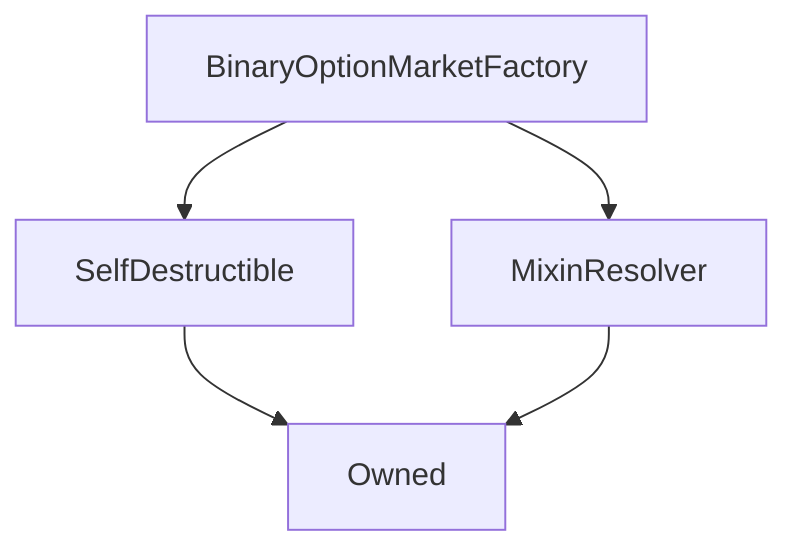

# BinaryOptionMarketFactory

## Description

**Source:** [contracts/BinaryOptionMarketFactory.sol](https://github.com/Synthetixio/synthetix/tree/v2.23.3-beta/contracts/BinaryOptionMarketFactory.sol)

## Architecture

### Inheritance Graph

## Constructor

### `constructor`

[Source](https://github.com/Synthetixio/synthetix/tree/v2.23.3-beta/contracts/BinaryOptionMarketFactory.sol#L23)

??? example "Details"

    **Signature**

    `(address _owner, address _resolver)`

    **Visibility**

    `public`

    **State Mutability**

    `nonpayable`

## Internal Functions

### `_manager`

[Source](https://github.com/Synthetixio/synthetix/tree/v2.23.3-beta/contracts/BinaryOptionMarketFactory.sol#L34)

??? example "Details"

    **Signature**

    `_manager() returns (address)`

    **Visibility**

    `internal`

    **State Mutability**

    `view`

## External Functions

### `createMarket`

[Source](https://github.com/Synthetixio/synthetix/tree/v2.23.3-beta/contracts/BinaryOptionMarketFactory.sol#L40)

??? example "Details"

    **Signature**

    `createMarket(address creator, uint256[2] creatorLimits, bytes32 oracleKey, uint256 strikePrice, uint256[3] times, uint256[2] bids, uint256[3] fees) returns (contract BinaryOptionMarket)`

    **Visibility**

    `external`

    **State Mutability**

    `nonpayable`

    **Requires**

    * [require(..., Only permitted by the manager.)](https://github.com/Synthetixio/synthetix/tree/v2.23.3-beta/contracts/BinaryOptionMarketFactory.sol#L50)
