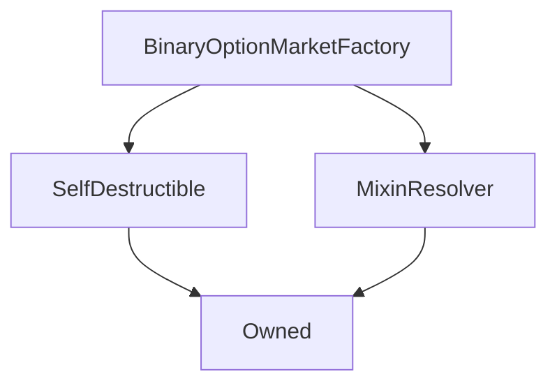
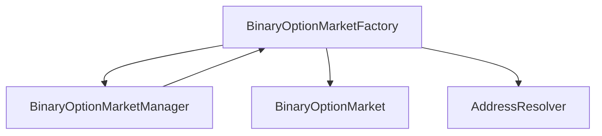

# BinaryOptionMarketFactory

## Description

This contract is strictly responsible for instantiating new
[`BinaryOptionMarket`](BinaryOptionMarket.md) instances on behalf of
the [`BinaryOptionMarketManager`](BinaryOptionMarketManager.md).

Market instantiation is delegated to this factory contract because,
as the deploying contract must contain the entire construction bytecode
of the contract to be deployed, the manager would be too large to
deploy ([EIP 170](https://eips.ethereum.org/EIPS/eip-170)).

Additionally, separating out the construction of markets into
a factory contract allows the manager and the markets to be upgraded
independently of one another.

**Source:** [contracts/BinaryOptionMarketFactory.sol](https://github.com/Synthetixio/synthetix/tree/v2.22.4/contracts/BinaryOptionMarketFactory.sol)

## Architecture

### Inheritance Graph

### Related Contracts

??? example "Details"

    - [`BinaryOptionMarketManager`](BinaryOptionMarketManager.md): The manager is the only contract permitted to create contracts from the factory.
    - [`BinaryOptionMarket`](BinaryOptionMarket.md): The factory creates market instances with the provided parameters.
    - [`AddressResolver`](AddressResolver.md): The factory uses the address resolver to retrieve the address of its manager, so if the manager is upgraded, this factory must be synchronised.

## Constructor

### `constructor`

The constructor simply initialises the inherited classes.

[Source](https://github.com/Synthetixio/synthetix/tree/v2.22.4/contracts/BinaryOptionMarketFactory.sol#L24)

??? example "Details"

    **Signature**

    `(address _owner, address _resolver)`

    **Visibility**

    `public`

    **State Mutability**

    `nonpayable`

## Internal Functions

### `_manager`

Returns the cached address of the
[`BinaryOptionMarketManager`](BinaryOptionMarketManager.md) instance
from the [`AddressResolver`](AddressResolver.md).

[Source](https://github.com/Synthetixio/synthetix/tree/v2.22.4/contracts/BinaryOptionMarketFactory.sol#L38)

??? example "Details"

    **Signature**

    `_manager()`

    **Visibility**

    `internal`

    **State Mutability**

    `view`

## External Functions

### `createMarket`

Simply creates a new [`BinaryOptionMarket`](BinaryOptionMarket.md) instance
with the given parameters.

As this is only intended to be called from
[`BinaryOptionMarketManager.createMarket`](BinaryOptionMarketManager.md#createmarket),
the transaction reverts if the message sender is not the [manager](#_manager).
See that function's documentation for further details.

Initial timestamps should be provided in the order `[biddingEnd, maturity, destruction]`, initial bids as
`[longBid, shortBid]`, and fees as `[poolFee, creatorFee, refundFee]`.

[Source](https://github.com/Synthetixio/synthetix/tree/v2.22.4/contracts/BinaryOptionMarketFactory.sol#L45)

??? example "Details"

    **Signature**

    `createMarket(address creator, uint256 capitalRequirement, bytes32 oracleKey, uint256 targetPrice, uint256[3] times, uint256[2] bids, uint256[3] fees)`

    **Visibility**

    `external`

    **State Mutability**

    `nonpayable`

    **Requires**

    * [require(..., Only permitted by the manager.)](https://github.com/Synthetixio/synthetix/tree/v2.22.4/contracts/BinaryOptionMarketFactory.sol#L57)
