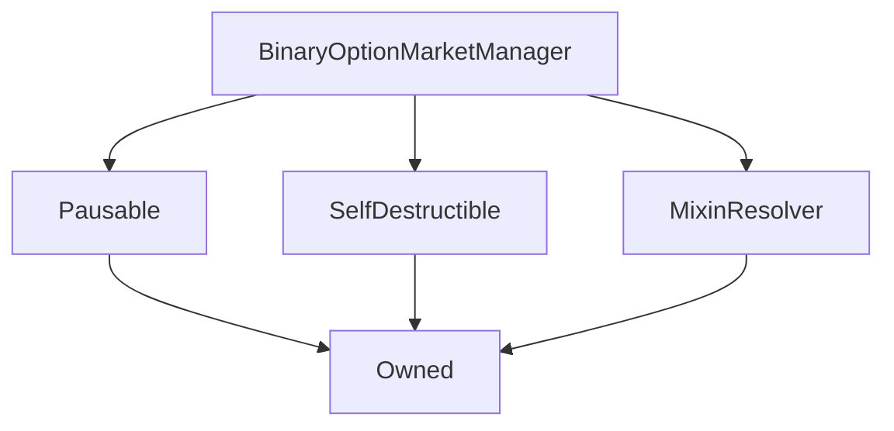
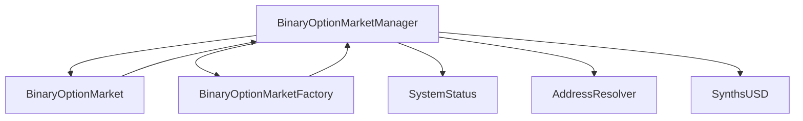

# BinaryOptionMarketManager

## Description

The `BinaryOptionMarketManager` contract is responsible for [creating](#createmarket) and [destroying](#destroymarket)
[`BinaryOptionMarket`](BinaryOptionMarket.md) instances, as well as
keeping track of the set of [currently-active markets](#markets) and the [total value of deposits](#totaldeposited)
across those markets.

In addition, various static market parameters such as the current fee levels,
are maintained in the manager, and these are inherited by new markets when they are
created.

The manager owner can disable the creation of new markets, or pause all binary option
markets altogether. The manager and its markets will also stop operating if the [system is suspended](SystemStatus.md).
These facilities are provided to allow upgrades to occur smoothly, for which purpose the manager contract
also provides functions to migrate its markets to a new manager instance.

This contract operates in a complex with [`BinaryOptionMarketFactory`](BinaryOptionMarketFactory.md), which is
responsible for actually instantiating new [`BinaryOptionMarket`](BinaryOptionMarket.md) instances. Since the factory 
must contain the entire bytecode of the market contract, we must separate the factory from the manager, as the combined
contract would otherwise exceed the maximum contract size specified in [EIP 170](https://eips.ethereum.org/EIPS/eip-170).

**Source:** [contracts/BinaryOptionMarketManager.sol](https://github.com/Synthetixio/synthetix/tree/v2.22.4/contracts/BinaryOptionMarketManager.sol)

## Architecture

### Libraries

- [SafeMath](/contracts/source/libraries/SafeMath) for `uint`

### Inheritance Graph

### Related Contracts

??? example "Details"

    - [`BinaryOptionMarketFactory`](BinaryOptionMarketFactory.md): The factory is responsible for actually instantiating new `BinaryOptionMarket` instances at the direction of the manager.
    - [`BinaryOptionMarket`](BinaryOptionMarket.md): The manager directs the factory to construct new `BinaryOptionMarket` instances, and keeps track of them in the [`_markets`](#_markets) array.
    - [`Synth (sUSD)`](Synth.md): As all bids and settlements are made in sUSD, the manager must know the sUSD address in order to accept initial bids.
    - [`SystemStatus`](SystemStatus.md): The manager pauses if the system is suspended on the SystemStatus contract.
    - [`AddressResolver`](AddressResolver.md): The addresses of SystemStatus and sUSD are retrieved from here.

## Structs

### `Durations`

This struct holds the current values of time periods governing the duration of various `BinaryOptionMarket` phases.
All durations are in seconds.

Note that unlike other parameters, varying `creatorDestructionDuration` or `oracleMaturityWindow` will affect
already-instantiated markets.

[Source](https://github.com/Synthetixio/synthetix/tree/v2.22.4/contracts/BinaryOptionMarketManager.sol#L33)

| Field                        | Type      | Description |
| ---------------------------- | --------- | ----------- |
| `oracleMaturityWindow`       | `uint256` | A market can still be resolved if the last oracle price was updated less than `maturityWindow` seconds before the maturity date. |
| `exerciseDuration`           | `uint256` | Matured binary options can be exercised for this period after the maturity date before they expire and the market can be destroyed. |
| `creatorDestructionDuration` | `uint256` | For this period, the creator of a given market is given the exclusive right to destroy it in exchange for a percentage of the turnover plus the value of any unclaimed options. After this time, anyone may destroy it for the same fee. |
| `maxTimeToMaturity`          | `uint256` | Markets cannot be created with a maturity date further in the future than this. |

### `Fees`

The global fee rates, which are inherited by new markets.
Note that the sum `poolFee + creatorFee` must be between 0 and 1 exclusive,
while `refundFee` must be no greater than 1.

This is similar to the [`BinaryOptionMarket.Fees`](BinaryOptionMarket.md#fees) struct.

[Source](https://github.com/Synthetixio/synthetix/tree/v2.22.4/contracts/BinaryOptionMarketManager.sol#L27)

| Field                  | Type                                       | Description |
| ---------------------- | ------------------------------------------ | ----------- |
| `poolFee`              | `uint256` | The portion of the sUSD deposited in the market at resolution that is collected by the [fee pool](FeePool.md). This is an [18-decimal](/contracts/source/libraries/SafeDecimalMath.md) fixed point number. |
| `creatorFee`           | `uint256` | The portion collected by the market's [creator](#creator) as a fee. This is an [18-decimal](/contracts/source/libraries/SafeDecimalMath.md) fixed point number. |
| `refundFee`            | `uint256` | When a bid is refunded, this portion of its value is retained in the market to be paid out at maturity. This fee is intended to compensate the market for the toxic price signal that the bidder has sent, by increasing the payoff of the remaining bidders, and to discourage excessive price volatility at the end of bidding. This is an [18-decimal](/contracts/source/libraries/SafeDecimalMath.md) fixed point number. |

## Variables

### `capitalRequirement`

New markets require the creator to provide at least this value of sUSD in initial bids.

[Source](https://github.com/Synthetixio/synthetix/tree/v2.22.4/contracts/BinaryOptionMarketManager.sol#L45)

**Type:** `uint256`

### `durations`

This holds the current values that new markets will inherit for several time-related parameters.

[Source](https://github.com/Synthetixio/synthetix/tree/v2.22.4/contracts/BinaryOptionMarketManager.sol#L43)

**Type:** `struct BinaryOptionMarketManager.Durations`

### `fees`

This holds the current values that new markets will inherit for their fee rates.
Once created, a market's fee rates are constant, so that if they are altered on the
manager contract they do not change in existing markets.

[Source](https://github.com/Synthetixio/synthetix/tree/v2.22.4/contracts/BinaryOptionMarketManager.sol#L42)

**Type:** `struct BinaryOptionMarketManager.Fees`

### `marketCreationEnabled`

New markets cannot be created if this is false.

[Source](https://github.com/Synthetixio/synthetix/tree/v2.22.4/contracts/BinaryOptionMarketManager.sol#L46)

**Type:** `bool`

### `totalDeposited`

This tracks the total of sUSD deposited across all binary option markets.
This is updated whenever bids are made or refunded, options exercised,
or a markets created or destroyed.

[Source](https://github.com/Synthetixio/synthetix/tree/v2.22.4/contracts/BinaryOptionMarketManager.sol#L47)

**Type:** `uint256`

## Variables (Internal)

### `_markets`

An unordered list of the currently-existing `BinaryOptionMarket` instances.
It can be queried with the [`markets`](#markets) function.

**Type:** `address[] internal`

### `_marketIndices`

This mapping keeps track of the index in the [`_markets`](#_markets) array belonging
to a particular market.

**Type:** `mapping(address => uint) internal`

### `_migratingManager`

When migrating [`BinaryOptionMarket`](BinaryOptionMarket.md) instances from one manager
to another, the receiving manager will only permit markets to be migrated from the
`_migratingManager` address. This is set by the [`setMigratingManager`](#setmigratingmanager) function.

See [`receiveMarkets`](#receivemarkets) and [`migrateMarkets`](#migratemarkets) for further details.

**Type:** `BinaryOptionMarketManager internal`

## Constructor

### `constructor`

The constructor initialises the inherited contracts and sets the initial values for fees, durations and other settings.
These parameters follow the constraints of the setter functions so that the various
parameters can't be set out of range.

[Source](https://github.com/Synthetixio/synthetix/tree/v2.22.4/contracts/BinaryOptionMarketManager.sol#L67)

??? example "Details"

    **Signature**

    `(address _owner, address _resolver, uint256 _oracleMaturityWindow, uint256 _exerciseDuration, uint256 _creatorDestructionDuration, uint256 _maxTimeToMaturity, uint256 _capitalRequirement, uint256 _poolFee, uint256 _creatorFee, uint256 _refundFee)`

    **Visibility**

    `public`

    **State Mutability**

    `nonpayable`

    **Requires**

    * [setCapitalRequirement](https://github.com/Synthetixio/synthetix/tree/v2.22.4/contracts/BinaryOptionMarketManager.sol#L89)

## Views

### `markets`

Returns a slice of the [`_markets`](#_markets) array, consisting of `pageSize` elements
starting at `index`. If the page would extend past the end of the array, the slice will
be shorter than `pageSize` elements long. The entire array can be retrieved
with `markets(0, numMarkets())`, or any larger page size.

[Source](https://github.com/Synthetixio/synthetix/tree/v2.22.4/contracts/BinaryOptionMarketManager.sol#L131)

??? example "Details"

    **Signature**

    `markets(uint256 index, uint256 pageSize)`

    **Visibility**

    `external`

    **State Mutability**

    `view`

### `numMarkets`

Returns the number of markets currently tracked in the [`_markets`](#_markets) array.

[Source](https://github.com/Synthetixio/synthetix/tree/v2.22.4/contracts/BinaryOptionMarketManager.sol#L127)

??? example "Details"

    **Signature**

    `numMarkets()`

    **Visibility**

    `external`

    **State Mutability**

    `view`

### `publiclyDestructibleTime`

Returns the timestamp at which a given market can be destroyed by anyone,
rather than exclusively the market creator.

[Source](https://github.com/Synthetixio/synthetix/tree/v2.22.4/contracts/BinaryOptionMarketManager.sol#L156)

??? example "Details"

    **Signature**

    `publiclyDestructibleTime(address market)`

    **Visibility**

    `external`

    **State Mutability**

    `view`

## Restricted Functions

### `decrementTotalDeposited`

Allows markets to decrease the tracked total deposit value.

The transaction reverts if the sender is not a [known market](#onlyknownmarkets),
or if the manager is [paused](Pausable.md), or if the [system is suspended](SystemStatus.md).

[Source](https://github.com/Synthetixio/synthetix/tree/v2.22.4/contracts/BinaryOptionMarketManager.sol#L218)

??? example "Details"

    **Signature**

    `decrementTotalDeposited(uint256 delta)`

    **Visibility**

    `external`

    **State Mutability**

    `nonpayable`

    **Modifiers**

    * [onlyKnownMarkets](#onlyknownmarkets)

    * [notPaused](#notpaused)

### `incrementTotalDeposited`

Allows markets to increase the tracked total deposit value.

The transaction reverts if the sender is not a [known market](#onlyknownmarkets),
or if the manager is [paused](Pausable.md), or if the [system is suspended](SystemStatus.md).

[Source](https://github.com/Synthetixio/synthetix/tree/v2.22.4/contracts/BinaryOptionMarketManager.sol#L213)

??? example "Details"

    **Signature**

    `incrementTotalDeposited(uint256 delta)`

    **Visibility**

    `external`

    **State Mutability**

    `nonpayable`

    **Modifiers**

    * [onlyKnownMarkets](#onlyknownmarkets)

    * [notPaused](#notpaused)

### `migrateMarkets`

Allows the contract owner to migrate a set of markets to a new manager instance, for example in case of upgrades.
This requires first [setting the migrating manager](#setmigratingmanager) in the receiving manager, so that the
[`receiveMarkets`](#receivemarkets) can be called from this function call.
This will also migrate the total value of deposits in the migrated markets between the factories.

The most efficient way of invoking this market is to provide the markets in the reverse order that they are
listed in [`_markets`](#_markets), so that they can be popped off the end without rewriting
any other parts of the array.

The transaction will revert if any of the markets provided is not known, or is a duplicate.

[Source](https://github.com/Synthetixio/synthetix/tree/v2.22.4/contracts/BinaryOptionMarketManager.sol#L321)

??? example "Details"

    **Signature**

    `migrateMarkets(contract BinaryOptionMarketManager receivingManager, contract BinaryOptionMarket[] marketsToMigrate)`

    **Visibility**

    `external`

    **State Mutability**

    `nonpayable`

    **Modifiers**

    * [onlyOwner](#onlyowner)

    **Emits**

    * [MarketsMigrated](#marketsmigrated)

### `setCapitalRequirement`

Allows the contract owner to set the [minimum sUSD value](#capitalrequirement) required to open a market.

[Source](https://github.com/Synthetixio/synthetix/tree/v2.22.4/contracts/BinaryOptionMarketManager.sol#L206)

??? example "Details"

    **Signature**

    `setCapitalRequirement(uint256 _capitalRequirement)`

    **Visibility**

    `public`

    **State Mutability**

    `nonpayable`

    **Modifiers**

    * [onlyOwner](#onlyowner)

    **Emits**

    * [CapitalRequirementUpdated](#capitalrequirementupdated)

### `setCreatorDestructionDuration`

Allows the contract owner to update [`durations.creatorDestructionDuration`](#durations).

[Source](https://github.com/Synthetixio/synthetix/tree/v2.22.4/contracts/BinaryOptionMarketManager.sol#L174)

??? example "Details"

    **Signature**

    `setCreatorDestructionDuration(uint256 _creatorDestructionDuration)`

    **Visibility**

    `public`

    **State Mutability**

    `nonpayable`

    **Modifiers**

    * [onlyOwner](#onlyowner)

    **Emits**

    * [CreatorDestructionDurationUpdated](#creatordestructiondurationupdated)

### `setCreatorFee`

Allows the contract owner to update [`fees.creatorFee`](#fees).

The transaction reverts if the sum of `fees.poolFee` and `fees.creatorFee` is not between 0 and 100%.

[Source](https://github.com/Synthetixio/synthetix/tree/v2.22.4/contracts/BinaryOptionMarketManager.sol#L192)

??? example "Details"

    **Signature**

    `setCreatorFee(uint256 _creatorFee)`

    **Visibility**

    `public`

    **State Mutability**

    `nonpayable`

    **Requires**

    * [require(..., Total fee must be less than 100%.)](https://github.com/Synthetixio/synthetix/tree/v2.22.4/contracts/BinaryOptionMarketManager.sol#L194)

    * [require(..., Total fee must be nonzero.)](https://github.com/Synthetixio/synthetix/tree/v2.22.4/contracts/BinaryOptionMarketManager.sol#L195)

    **Modifiers**

    * [onlyOwner](#onlyowner)

    **Emits**

    * [CreatorFeeUpdated](#creatorfeeupdated)

### `setExerciseDuration`

Allows the contract owner to update [`durations.exerciseDuration`](#durations).

[Source](https://github.com/Synthetixio/synthetix/tree/v2.22.4/contracts/BinaryOptionMarketManager.sol#L169)

??? example "Details"

    **Signature**

    `setExerciseDuration(uint256 _exerciseDuration)`

    **Visibility**

    `public`

    **State Mutability**

    `nonpayable`

    **Modifiers**

    * [onlyOwner](#onlyowner)

    **Emits**

    * [ExerciseDurationUpdated](#exercisedurationupdated)

### `setMarketCreationEnabled`

Allows the owner to toggle whether [market creation is enabled](#marketcreationenabled).

[Source](https://github.com/Synthetixio/synthetix/tree/v2.22.4/contracts/BinaryOptionMarketManager.sol#L310)

??? example "Details"

    **Signature**

    `setMarketCreationEnabled(bool enabled)`

    **Visibility**

    `public`

    **State Mutability**

    `nonpayable`

    **Modifiers**

    * [onlyOwner](#onlyowner)

### `setMaxTimeToMaturity`

Allows the contract owner to update [`durations.maxTimeToMaturity`](#durations).

[Source](https://github.com/Synthetixio/synthetix/tree/v2.22.4/contracts/BinaryOptionMarketManager.sol#L179)

??? example "Details"

    **Signature**

    `setMaxTimeToMaturity(uint256 _maxTimeToMaturity)`

    **Visibility**

    `public`

    **State Mutability**

    `nonpayable`

    **Modifiers**

    * [onlyOwner](#onlyowner)

    **Emits**

    * [MaxTimeToMaturityUpdated](#maxtimetomaturityupdated)

### `setMigratingManager`

Allows the owner to set the value of [`_migratingManager`](#_migratingmanager).

[Source](https://github.com/Synthetixio/synthetix/tree/v2.22.4/contracts/BinaryOptionMarketManager.sol#L317)

??? example "Details"

    **Signature**

    `setMigratingManager(contract BinaryOptionMarketManager manager)`

    **Visibility**

    `public`

    **State Mutability**

    `nonpayable`

    **Modifiers**

    * [onlyOwner](#onlyowner)

### `setOracleMaturityWindow`

Allows the contract owner to update [`durations.oracleMaturityWindow`](#durations).

[Source](https://github.com/Synthetixio/synthetix/tree/v2.22.4/contracts/BinaryOptionMarketManager.sol#L164)

??? example "Details"

    **Signature**

    `setOracleMaturityWindow(uint256 _oracleMaturityWindow)`

    **Visibility**

    `public`

    **State Mutability**

    `nonpayable`

    **Modifiers**

    * [onlyOwner](#onlyowner)

    **Emits**

    * [OracleMaturityWindowUpdated](#oraclematuritywindowupdated)

### `setPoolFee`

Allows the contract owner to update [`fees.poolFee`](#fees).

The transaction reverts if the sum of `fees.poolFee` and `fees.creatorFee` is not between 0 and 1.

[Source](https://github.com/Synthetixio/synthetix/tree/v2.22.4/contracts/BinaryOptionMarketManager.sol#L184)

??? example "Details"

    **Signature**

    `setPoolFee(uint256 _poolFee)`

    **Visibility**

    `public`

    **State Mutability**

    `nonpayable`

    **Requires**

    * [require(..., Total fee must be less than 100%.)](https://github.com/Synthetixio/synthetix/tree/v2.22.4/contracts/BinaryOptionMarketManager.sol#L186)

    * [require(..., Total fee must be nonzero.)](https://github.com/Synthetixio/synthetix/tree/v2.22.4/contracts/BinaryOptionMarketManager.sol#L187)

    **Modifiers**

    * [onlyOwner](#onlyowner)

    **Emits**

    * [PoolFeeUpdated](#poolfeeupdated)

### `setRefundFee`

Allows the contract owner to update [`fees.refundFee`](#fees).

The transaction reverts if the refund fee is greater than 100%.

[Source](https://github.com/Synthetixio/synthetix/tree/v2.22.4/contracts/BinaryOptionMarketManager.sol#L200)

??? example "Details"

    **Signature**

    `setRefundFee(uint256 _refundFee)`

    **Visibility**

    `public`

    **State Mutability**

    `nonpayable`

    **Requires**

    * [require(..., Refund fee must be no greater than 100%.)](https://github.com/Synthetixio/synthetix/tree/v2.22.4/contracts/BinaryOptionMarketManager.sol#L201)

    **Modifiers**

    * [onlyOwner](#onlyowner)

    **Emits**

    * [RefundFeeUpdated](#refundfeeupdated)

### `setResolverAndSyncCacheOnMarkets`

Calls [`setResolverAndSyncCache`](MixinResolver.md#setresolverandsynccache) on a given array of markets, updating their address caches.

[Source](https://github.com/Synthetixio/synthetix/tree/v2.22.4/contracts/BinaryOptionMarketManager.sol#L304)

??? example "Details"

    **Signature**

    `setResolverAndSyncCacheOnMarkets(contract AddressResolver _resolver, contract BinaryOptionMarket[] marketsToSync)`

    **Visibility**

    `external`

    **State Mutability**

    `nonpayable`

    **Modifiers**

    * [onlyOwner](#onlyowner)

## Internal Functions

### `_addMarket`

Adds an address to the [`_markets`](#_markets) array and stores its index.
No check is made that the address is not already present.

[Source](https://github.com/Synthetixio/synthetix/tree/v2.22.4/contracts/BinaryOptionMarketManager.sol#L228)

??? example "Details"

    **Signature**

    `_addMarket(address market)`

    **Visibility**

    `internal`

    **State Mutability**

    `nonpayable`

### `_factory`

Retrieves the [cached](MixinResolver.md) address of the [`BinaryOptionMarketFactory`](BinaryOptionMarketFactory.md) instance.

[Source](https://github.com/Synthetixio/synthetix/tree/v2.22.4/contracts/BinaryOptionMarketManager.sol#L108)

??? example "Details"

    **Signature**

    `_factory()`

    **Visibility**

    `internal`

    **State Mutability**

    `view`

### `_isKnownMarket`

Returns true if the provided address exists in the [`_markets`](#_markets) array and false otherwise.

[Source](https://github.com/Synthetixio/synthetix/tree/v2.22.4/contracts/BinaryOptionMarketManager.sol#L116)

??? example "Details"

    **Signature**

    `_isKnownMarket(address candidate)`

    **Visibility**

    `internal`

    **State Mutability**

    `view`

### `_publiclyDestructibleTime`

See [`publiclyDestructibleTime`](#publiclydestructibletime).

[Source](https://github.com/Synthetixio/synthetix/tree/v2.22.4/contracts/BinaryOptionMarketManager.sol#L151)

??? example "Details"

    **Signature**

    `_publiclyDestructibleTime(address market)`

    **Visibility**

    `internal`

    **State Mutability**

    `view`

### `_removeMarket`

Removes an address from the [`_markets`](#_markets) array and deletes its stored index.
Note that the order of the array is not necessarily preserved when an element is removed.

This function does not check that the provided element actually exists in the array;
if it does not, the element at index zero will be deleted, or else the transaction will
revert if the array is empty.

[Source](https://github.com/Synthetixio/synthetix/tree/v2.22.4/contracts/BinaryOptionMarketManager.sol#L233)

??? example "Details"

    **Signature**

    `_removeMarket(address market)`

    **Visibility**

    `internal`

    **State Mutability**

    `nonpayable`

### `_sUSD`

Retrieves the [cached](MixinResolver.md) address of the sUSD [`Synth`](Synth.md) instance.

[Source](https://github.com/Synthetixio/synthetix/tree/v2.22.4/contracts/BinaryOptionMarketManager.sol#L104)

??? example "Details"

    **Signature**

    `_sUSD()`

    **Visibility**

    `internal`

    **State Mutability**

    `view`

### `_systemStatus`

[Source](https://github.com/Synthetixio/synthetix/tree/v2.22.4/contracts/BinaryOptionMarketManager.sol#L100)

??? example "Details"

    **Signature**

    `_systemStatus()`

    **Visibility**

    `internal`

    **State Mutability**

    `view`

## External Functions

### `createMarket`

Calls out to [`BinaryOptionMarketFactory.createMarket`](BinaryOptionMarketFactory.md#createmarket) to create a new
[`BinaryOptionMarket`](BinaryOptionMarket.md) instance and adds its address to the [`_markets`](#_markets) array.

The creator (the message sender) must provide the following parameters:

| Field         | Type                                       | Description |
| ------------- | ------------------------------------------ | ----------- |
| `oracleKey`   | `bytes32`                                  | The key of the underlying asset of this market in the [`ExchangeRates`](ExchangeRates.md) contract. |
| `targetPrice` | `uint` ([18 decimals](/contracts/source/libraries/SafeDecimalMath.md)) | The target price of the underlying asset at maturity, in the same units as reported by the [ExchangeRates](ExchangeRates.md) contract. |
| `times`       | `uint[2] calldata`                         | The unix timestamps (seconds) of the bidding end date and the maturity date of the new market, in that order. |
| `bids`        | `uint[2] calldata` ([18 decimals](/contracts/source/libraries/SafeDecimalMath.md)) | The initial sUSD bids by the market creator on the long and short sides of the market, in that order. |

Upon creation, the manager transfers `bids[0] + bids[1]` sUSD from the creator to the
new market using an ERC20 `transferFrom` call, so the creator must have given sufficient transfer approval
to the manager. The initial bids will be reflected in the [total deposited quantity](#totaldeposited),
and the market creator will be credited `bids[0]` worth of bids on the long option,
and `bids[1]` worth on the short option. These bids, like any other user's, can be claimed and exercised
as options, but they cannot be [refunded](#refund) if such a refund would decrease the creator's bid total
to less than the [minimum liquidity requirement](#capitalrequirement).

The destruction time of the new market will be set to the provided maturity date (`times[1]`)
plus `durations.exerciseDuration`, while the fee rates will be set from the current values
in the manager. The [resolver](AddressResolver.md) address of the new market is inherited from
the address known to the [`BinaryOptionMarketFactory`](BinaryOptionMarketFactory.md) which performs the actual
instantiation.
The `BinaryOptionMarket` contract has no setters, so once constructed,
these values are fixed for the lifetime of the market.
The resolver cache of the new market is synchronised immediately after construction by the manager.

The transaction reverts if any of the following conditions is true:

* The manager is [paused](Pausable.md)
* The [system is suspended](SystemStatus.md)
* Market creation [has been disabled](#marketcreationenabled)
* The given maturity date is further than [`durations.maxTimeToMaturity`](#durations) in the future
* The provided maturity date is not after the provided bidding end date.
* The sum of `longBid` and `shortBid` is less than [`capitalRequirement`](#capitalrequirement)
* The creator has not approved the manager to transfer at least `longBid + shortBid` sUSD on their behalf.

[Source](https://github.com/Synthetixio/synthetix/tree/v2.22.4/contracts/BinaryOptionMarketManager.sol#L249)

??? example "Details"

    **Signature**

    `createMarket(bytes32 oracleKey, uint256 targetPrice, uint256[2] times, uint256[2] bids)`

    **Visibility**

    `external`

    **State Mutability**

    `nonpayable`

    **Requires**

    * [require(..., Market creation is disabled.)](https://github.com/Synthetixio/synthetix/tree/v2.22.4/contracts/BinaryOptionMarketManager.sol#L259)

    * [require(..., Maturity too far in the future.)](https://github.com/Synthetixio/synthetix/tree/v2.22.4/contracts/BinaryOptionMarketManager.sol#L260)

    **Modifiers**

    * [notPaused](#notpaused)

    **Emits**

    * [MarketCreated](#marketcreated)

### `destroyMarket`

[Source](https://github.com/Synthetixio/synthetix/tree/v2.22.4/contracts/BinaryOptionMarketManager.sol#L286)

??? example "Details"

    **Signature**

    `destroyMarket(address market)`

    **Visibility**

    `external`

    **State Mutability**

    `nonpayable`

    **Requires**

    * [require(..., Market unknown.)](https://github.com/Synthetixio/synthetix/tree/v2.22.4/contracts/BinaryOptionMarketManager.sol#L288)

    * [require(..., Market cannot be destroyed yet.)](https://github.com/Synthetixio/synthetix/tree/v2.22.4/contracts/BinaryOptionMarketManager.sol#L289)

    **Modifiers**

    * [notPaused](#notpaused)

    **Emits**

    * [MarketDestroyed](#marketdestroyed)

### `receiveMarkets`

This is called by a migrating manager once it has prepared its markets to be received to finalise the migration.
The value of deposits in the migrated markets will be added to the receiving manager's total.

The function reverts if the message sender is not the migrating manager,
which must previously [have been set](#setmigratingmanager), or if any provided market is already known to
the manager, or is a duplicate.

[Source](https://github.com/Synthetixio/synthetix/tree/v2.22.4/contracts/BinaryOptionMarketManager.sol#L347)

??? example "Details"

    **Signature**

    `receiveMarkets(contract BinaryOptionMarket[] marketsToReceive)`

    **Visibility**

    `external`

    **State Mutability**

    `nonpayable`

    **Requires**

    * [require(..., Only permitted for migrating manager.)](https://github.com/Synthetixio/synthetix/tree/v2.22.4/contracts/BinaryOptionMarketManager.sol#L348)

    **Emits**

    * [MarketsReceived](#marketsreceived)

## Modifiers

### `onlyKnownMarkets`

The transaction reverts if the message sender is not a [known market](#_isknownmarket)
in the [`_markets`](#_markets) array.

[Source](https://github.com/Synthetixio/synthetix/tree/v2.22.4/contracts/BinaryOptionMarketManager.sol#L371)

## Events

### `CapitalRequirementUpdated`

The [capital requirement](#capitalrequirement) was updated.

[Source](https://github.com/Synthetixio/synthetix/tree/v2.22.4/contracts/BinaryOptionMarketManager.sol#L387)

**Signature**: `CapitalRequirementUpdated(uint256 value)`

### `CreatorDestructionDurationUpdated`

The [creator destruction duration](#durations) was updated.

[Source](https://github.com/Synthetixio/synthetix/tree/v2.22.4/contracts/BinaryOptionMarketManager.sol#L385)

**Signature**: `CreatorDestructionDurationUpdated(uint256 duration)`

### `CreatorFeeUpdated`

The [creator fee](#fees) was updated.

[Source](https://github.com/Synthetixio/synthetix/tree/v2.22.4/contracts/BinaryOptionMarketManager.sol#L389)

**Signature**: `CreatorFeeUpdated(uint256 fee)`

### `ExerciseDurationUpdated`

The [exercise duration](#durations) was updated

[Source](https://github.com/Synthetixio/synthetix/tree/v2.22.4/contracts/BinaryOptionMarketManager.sol#L384)

**Signature**: `ExerciseDurationUpdated(uint256 duration)`

### `MarketCreated`

A new market was created, and its initial parameters.

[Source](https://github.com/Synthetixio/synthetix/tree/v2.22.4/contracts/BinaryOptionMarketManager.sol#L378)

**Signature**: `MarketCreated(address market, address creator, bytes32 oracleKey, uint256 targetPrice, uint256 biddingEndDate, uint256 maturityDate, uint256 destructionDate)`

### `MarketCreationEnabledUpdated`

[Market creation](#marketcreationenabled) was enabled or disabled.

[Source](https://github.com/Synthetixio/synthetix/tree/v2.22.4/contracts/BinaryOptionMarketManager.sol#L382)

**Signature**: `MarketCreationEnabledUpdated(bool enabled)`

### `MarketDestroyed`

An exiting market was destroyed, and which address destroyed it.

[Source](https://github.com/Synthetixio/synthetix/tree/v2.22.4/contracts/BinaryOptionMarketManager.sol#L379)

**Signature**: `MarketDestroyed(address market, address destroyer)`

### `MarketsMigrated`

A set of markets was migrated to a certain receiving manager.

[Source](https://github.com/Synthetixio/synthetix/tree/v2.22.4/contracts/BinaryOptionMarketManager.sol#L380)

**Signature**: `MarketsMigrated(contract BinaryOptionMarketManager receivingManager, contract BinaryOptionMarket[] markets)`

### `MarketsReceived`

A set of markets was migrated from a certain migrating manager.

[Source](https://github.com/Synthetixio/synthetix/tree/v2.22.4/contracts/BinaryOptionMarketManager.sol#L381)

**Signature**: `MarketsReceived(contract BinaryOptionMarketManager migratingManager, contract BinaryOptionMarket[] markets)`

### `MaxTimeToMaturityUpdated`

The [maximum time to maturity](#durations) was updated.

[Source](https://github.com/Synthetixio/synthetix/tree/v2.22.4/contracts/BinaryOptionMarketManager.sol#L386)

**Signature**: `MaxTimeToMaturityUpdated(uint256 duration)`

### `OracleMaturityWindowUpdated`

The [oracle maturity window](#durations) was updated.

[Source](https://github.com/Synthetixio/synthetix/tree/v2.22.4/contracts/BinaryOptionMarketManager.sol#L383)

**Signature**: `OracleMaturityWindowUpdated(uint256 duration)`

### `PoolFeeUpdated`

The [pool fee](#fees) was updated.

[Source](https://github.com/Synthetixio/synthetix/tree/v2.22.4/contracts/BinaryOptionMarketManager.sol#L388)

**Signature**: `PoolFeeUpdated(uint256 fee)`

### `RefundFeeUpdated`

The [refund fee](#fees) was updated.

[Source](https://github.com/Synthetixio/synthetix/tree/v2.22.4/contracts/BinaryOptionMarketManager.sol#L390)

**Signature**: `RefundFeeUpdated(uint256 fee)`
