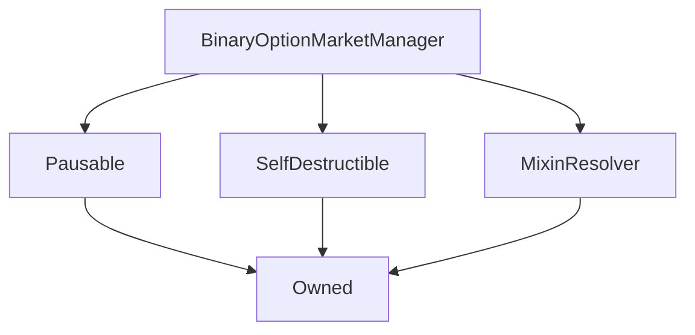

# BinaryOptionMarketManager

## Description

**Source:** [contracts/BinaryOptionMarketManager.sol](https://github.com/Synthetixio/synthetix/tree/v2.24.0/contracts/BinaryOptionMarketManager.sol)

## Architecture

### Libraries

- [SafeMath](/contracts/source/libraries/SafeMath) for `uint`
- [AddressListLib](/contracts/source/libraries/AddressListLib) for `AddressListLib.AddressList`

### Inheritance Graph

## Structs

### `CreatorLimits`

[Source](https://github.com/Synthetixio/synthetix/tree/v2.24.0/contracts/BinaryOptionMarketManager.sol#L43)

| Field                | Type      | Description |
| -------------------- | --------- | ----------- |
| `capitalRequirement` | `uint256` | TBA         |
| `skewLimit`          | `uint256` | TBA         |

### `Durations`

[Source](https://github.com/Synthetixio/synthetix/tree/v2.24.0/contracts/BinaryOptionMarketManager.sol#L37)

| Field               | Type      | Description |
| ------------------- | --------- | ----------- |
| `maxOraclePriceAge` | `uint256` | TBA         |
| `expiryDuration`    | `uint256` | TBA         |
| `maxTimeToMaturity` | `uint256` | TBA         |

### `Fees`

[Source](https://github.com/Synthetixio/synthetix/tree/v2.24.0/contracts/BinaryOptionMarketManager.sol#L31)

| Field        | Type      | Description |
| ------------ | --------- | ----------- |
| `poolFee`    | `uint256` | TBA         |
| `creatorFee` | `uint256` | TBA         |
| `refundFee`  | `uint256` | TBA         |

## Variables

### `creatorLimits`

[Source](https://github.com/Synthetixio/synthetix/tree/v2.24.0/contracts/BinaryOptionMarketManager.sol#L52)

**Type:** `struct BinaryOptionMarketManager.CreatorLimits`

### `durations`

[Source](https://github.com/Synthetixio/synthetix/tree/v2.24.0/contracts/BinaryOptionMarketManager.sol#L51)

**Type:** `struct BinaryOptionMarketManager.Durations`

### `fees`

[Source](https://github.com/Synthetixio/synthetix/tree/v2.24.0/contracts/BinaryOptionMarketManager.sol#L50)

**Type:** `struct BinaryOptionMarketManager.Fees`

### `marketCreationEnabled`

[Source](https://github.com/Synthetixio/synthetix/tree/v2.24.0/contracts/BinaryOptionMarketManager.sol#L54)

**Type:** `bool`

### `totalDeposited`

[Source](https://github.com/Synthetixio/synthetix/tree/v2.24.0/contracts/BinaryOptionMarketManager.sol#L55)

**Type:** `uint256`

## Constructor

### `constructor`

[Source](https://github.com/Synthetixio/synthetix/tree/v2.24.0/contracts/BinaryOptionMarketManager.sol#L78)

??? example "Details"

    **Signature**

    `(address _owner, address _resolver, uint256 _maxOraclePriceAge, uint256 _expiryDuration, uint256 _maxTimeToMaturity, uint256 _creatorCapitalRequirement, uint256 _creatorSkewLimit, uint256 _poolFee, uint256 _creatorFee, uint256 _refundFee)`

    **Visibility**

    `public`

    **State Mutability**

    `nonpayable`

    **Requires**

    * [setCreatorCapitalRequirement](https://github.com/Synthetixio/synthetix/tree/v2.24.0/contracts/BinaryOptionMarketManager.sol#L95)

## Views

### `activeMarkets`

[Source](https://github.com/Synthetixio/synthetix/tree/v2.24.0/contracts/BinaryOptionMarketManager.sol#L136)

??? example "Details"

    **Signature**

    `activeMarkets(uint256 index, uint256 pageSize) returns (address[])`

    **Visibility**

    `external`

    **State Mutability**

    `view`

### `maturedMarkets`

[Source](https://github.com/Synthetixio/synthetix/tree/v2.24.0/contracts/BinaryOptionMarketManager.sol#L144)

??? example "Details"

    **Signature**

    `maturedMarkets(uint256 index, uint256 pageSize) returns (address[])`

    **Visibility**

    `external`

    **State Mutability**

    `view`

### `numActiveMarkets`

[Source](https://github.com/Synthetixio/synthetix/tree/v2.24.0/contracts/BinaryOptionMarketManager.sol#L132)

??? example "Details"

    **Signature**

    `numActiveMarkets() returns (uint256)`

    **Visibility**

    `external`

    **State Mutability**

    `view`

### `numMaturedMarkets`

[Source](https://github.com/Synthetixio/synthetix/tree/v2.24.0/contracts/BinaryOptionMarketManager.sol#L140)

??? example "Details"

    **Signature**

    `numMaturedMarkets() returns (uint256)`

    **Visibility**

    `external`

    **State Mutability**

    `view`

## Restricted Functions

### `decrementTotalDeposited`

[Source](https://github.com/Synthetixio/synthetix/tree/v2.24.0/contracts/BinaryOptionMarketManager.sol#L229)

??? example "Details"

    **Signature**

    `decrementTotalDeposited(uint256 delta)`

    **Visibility**

    `external`

    **State Mutability**

    `nonpayable`

    **Modifiers**

    * [onlyKnownMarkets](#onlyknownmarkets)

    * [notPaused](#notpaused)

### `incrementTotalDeposited`

[Source](https://github.com/Synthetixio/synthetix/tree/v2.24.0/contracts/BinaryOptionMarketManager.sol#L224)

??? example "Details"

    **Signature**

    `incrementTotalDeposited(uint256 delta)`

    **Visibility**

    `external`

    **State Mutability**

    `nonpayable`

    **Modifiers**

    * [onlyActiveMarkets](#onlyactivemarkets)

    * [notPaused](#notpaused)

### `migrateMarkets`

[Source](https://github.com/Synthetixio/synthetix/tree/v2.24.0/contracts/BinaryOptionMarketManager.sol#L331)

??? example "Details"

    **Signature**

    `migrateMarkets(contract BinaryOptionMarketManager receivingManager, bool active, contract BinaryOptionMarket[] marketsToMigrate)`

    **Visibility**

    `external`

    **State Mutability**

    `nonpayable`

    **Modifiers**

    * [onlyOwner](#onlyowner)

    **Emits**

    * [MarketsMigrated](#marketsmigrated)

### `setCreatorCapitalRequirement`

[Source](https://github.com/Synthetixio/synthetix/tree/v2.24.0/contracts/BinaryOptionMarketManager.sol#L211)

??? example "Details"

    **Signature**

    `setCreatorCapitalRequirement(uint256 _creatorCapitalRequirement)`

    **Visibility**

    `public`

    **State Mutability**

    `nonpayable`

    **Modifiers**

    * [onlyOwner](#onlyowner)

    **Emits**

    * [CreatorCapitalRequirementUpdated](#creatorcapitalrequirementupdated)

### `setCreatorFee`

[Source](https://github.com/Synthetixio/synthetix/tree/v2.24.0/contracts/BinaryOptionMarketManager.sol#L197)

??? example "Details"

    **Signature**

    `setCreatorFee(uint256 _creatorFee)`

    **Visibility**

    `public`

    **State Mutability**

    `nonpayable`

    **Requires**

    * [require(..., Total fee must be less than 100%.)](https://github.com/Synthetixio/synthetix/tree/v2.24.0/contracts/BinaryOptionMarketManager.sol#L199)

    * [require(..., Total fee must be nonzero.)](https://github.com/Synthetixio/synthetix/tree/v2.24.0/contracts/BinaryOptionMarketManager.sol#L200)

    **Modifiers**

    * [onlyOwner](#onlyowner)

    **Emits**

    * [CreatorFeeUpdated](#creatorfeeupdated)

### `setCreatorSkewLimit`

[Source](https://github.com/Synthetixio/synthetix/tree/v2.24.0/contracts/BinaryOptionMarketManager.sol#L216)

??? example "Details"

    **Signature**

    `setCreatorSkewLimit(uint256 _creatorSkewLimit)`

    **Visibility**

    `public`

    **State Mutability**

    `nonpayable`

    **Requires**

    * [require(..., Creator skew limit must be no greater than 1.)](https://github.com/Synthetixio/synthetix/tree/v2.24.0/contracts/BinaryOptionMarketManager.sol#L217)

    **Modifiers**

    * [onlyOwner](#onlyowner)

    **Emits**

    * [CreatorSkewLimitUpdated](#creatorskewlimitupdated)

### `setExpiryDuration`

[Source](https://github.com/Synthetixio/synthetix/tree/v2.24.0/contracts/BinaryOptionMarketManager.sol#L179)

??? example "Details"

    **Signature**

    `setExpiryDuration(uint256 _expiryDuration)`

    **Visibility**

    `public`

    **State Mutability**

    `nonpayable`

    **Modifiers**

    * [onlyOwner](#onlyowner)

    **Emits**

    * [ExpiryDurationUpdated](#expirydurationupdated)

### `setMarketCreationEnabled`

[Source](https://github.com/Synthetixio/synthetix/tree/v2.24.0/contracts/BinaryOptionMarketManager.sol#L320)

??? example "Details"

    **Signature**

    `setMarketCreationEnabled(bool enabled)`

    **Visibility**

    `public`

    **State Mutability**

    `nonpayable`

    **Modifiers**

    * [onlyOwner](#onlyowner)

### `setMaxOraclePriceAge`

[Source](https://github.com/Synthetixio/synthetix/tree/v2.24.0/contracts/BinaryOptionMarketManager.sol#L174)

??? example "Details"

    **Signature**

    `setMaxOraclePriceAge(uint256 _maxOraclePriceAge)`

    **Visibility**

    `public`

    **State Mutability**

    `nonpayable`

    **Modifiers**

    * [onlyOwner](#onlyowner)

    **Emits**

    * [MaxOraclePriceAgeUpdated](#maxoraclepriceageupdated)

### `setMaxTimeToMaturity`

[Source](https://github.com/Synthetixio/synthetix/tree/v2.24.0/contracts/BinaryOptionMarketManager.sol#L184)

??? example "Details"

    **Signature**

    `setMaxTimeToMaturity(uint256 _maxTimeToMaturity)`

    **Visibility**

    `public`

    **State Mutability**

    `nonpayable`

    **Modifiers**

    * [onlyOwner](#onlyowner)

    **Emits**

    * [MaxTimeToMaturityUpdated](#maxtimetomaturityupdated)

### `setMigratingManager`

[Source](https://github.com/Synthetixio/synthetix/tree/v2.24.0/contracts/BinaryOptionMarketManager.sol#L327)

??? example "Details"

    **Signature**

    `setMigratingManager(contract BinaryOptionMarketManager manager)`

    **Visibility**

    `public`

    **State Mutability**

    `nonpayable`

    **Modifiers**

    * [onlyOwner](#onlyowner)

### `setPoolFee`

[Source](https://github.com/Synthetixio/synthetix/tree/v2.24.0/contracts/BinaryOptionMarketManager.sol#L189)

??? example "Details"

    **Signature**

    `setPoolFee(uint256 _poolFee)`

    **Visibility**

    `public`

    **State Mutability**

    `nonpayable`

    **Requires**

    * [require(..., Total fee must be less than 100%.)](https://github.com/Synthetixio/synthetix/tree/v2.24.0/contracts/BinaryOptionMarketManager.sol#L191)

    * [require(..., Total fee must be nonzero.)](https://github.com/Synthetixio/synthetix/tree/v2.24.0/contracts/BinaryOptionMarketManager.sol#L192)

    **Modifiers**

    * [onlyOwner](#onlyowner)

    **Emits**

    * [PoolFeeUpdated](#poolfeeupdated)

### `setRefundFee`

[Source](https://github.com/Synthetixio/synthetix/tree/v2.24.0/contracts/BinaryOptionMarketManager.sol#L205)

??? example "Details"

    **Signature**

    `setRefundFee(uint256 _refundFee)`

    **Visibility**

    `public`

    **State Mutability**

    `nonpayable`

    **Requires**

    * [require(..., Refund fee must be no greater than 100%.)](https://github.com/Synthetixio/synthetix/tree/v2.24.0/contracts/BinaryOptionMarketManager.sol#L206)

    **Modifiers**

    * [onlyOwner](#onlyowner)

    **Emits**

    * [RefundFeeUpdated](#refundfeeupdated)

### `setResolverAndSyncCacheOnMarkets`

[Source](https://github.com/Synthetixio/synthetix/tree/v2.24.0/contracts/BinaryOptionMarketManager.sol#L311)

??? example "Details"

    **Signature**

    `setResolverAndSyncCacheOnMarkets(contract AddressResolver _resolver, contract BinaryOptionMarket[] marketsToSync)`

    **Visibility**

    `external`

    **State Mutability**

    `nonpayable`

    **Modifiers**

    * [onlyOwner](#onlyowner)

## Internal Functions

### `_exchangeRates`

[Source](https://github.com/Synthetixio/synthetix/tree/v2.24.0/contracts/BinaryOptionMarketManager.sol#L115)

??? example "Details"

    **Signature**

    `_exchangeRates() returns (contract IExchangeRates)`

    **Visibility**

    `internal`

    **State Mutability**

    `view`

### `_factory`

[Source](https://github.com/Synthetixio/synthetix/tree/v2.24.0/contracts/BinaryOptionMarketManager.sol#L119)

??? example "Details"

    **Signature**

    `_factory() returns (contract BinaryOptionMarketFactory)`

    **Visibility**

    `internal`

    **State Mutability**

    `view`

### `_isKnownMarket`

[Source](https://github.com/Synthetixio/synthetix/tree/v2.24.0/contracts/BinaryOptionMarketManager.sol#L128)

??? example "Details"

    **Signature**

    `_isKnownMarket(address candidate) returns (bool)`

    **Visibility**

    `internal`

    **State Mutability**

    `view`

### `_isValidKey`

[Source](https://github.com/Synthetixio/synthetix/tree/v2.24.0/contracts/BinaryOptionMarketManager.sol#L148)

??? example "Details"

    **Signature**

    `_isValidKey(bytes32 oracleKey) returns (bool)`

    **Visibility**

    `internal`

    **State Mutability**

    `view`

### `_sUSD`

[Source](https://github.com/Synthetixio/synthetix/tree/v2.24.0/contracts/BinaryOptionMarketManager.sol#L111)

??? example "Details"

    **Signature**

    `_sUSD() returns (contract IERC20)`

    **Visibility**

    `internal`

    **State Mutability**

    `view`

### `_systemStatus`

[Source](https://github.com/Synthetixio/synthetix/tree/v2.24.0/contracts/BinaryOptionMarketManager.sol#L107)

??? example "Details"

    **Signature**

    `_systemStatus() returns (contract ISystemStatus)`

    **Visibility**

    `internal`

    **State Mutability**

    `view`

## External Functions

### `createMarket`

[Source](https://github.com/Synthetixio/synthetix/tree/v2.24.0/contracts/BinaryOptionMarketManager.sol#L239)

??? example "Details"

    **Signature**

    `createMarket(bytes32 oracleKey, uint256 strikePrice, uint256[2] times, uint256[2] bids) returns (contract IBinaryOptionMarket)`

    **Visibility**

    `external`

    **State Mutability**

    `nonpayable`

    **Requires**

    * [require(..., Market creation is disabled)](https://github.com/Synthetixio/synthetix/tree/v2.24.0/contracts/BinaryOptionMarketManager.sol#L252)

    * [require(..., Invalid key)](https://github.com/Synthetixio/synthetix/tree/v2.24.0/contracts/BinaryOptionMarketManager.sol#L253)

    * [require(..., Maturity too far in the future)](https://github.com/Synthetixio/synthetix/tree/v2.24.0/contracts/BinaryOptionMarketManager.sol#L256)

    * [require(..., End of bidding has passed)](https://github.com/Synthetixio/synthetix/tree/v2.24.0/contracts/BinaryOptionMarketManager.sol#L260)

    * [require(..., Maturity predates end of bidding)](https://github.com/Synthetixio/synthetix/tree/v2.24.0/contracts/BinaryOptionMarketManager.sol#L261)

    **Modifiers**

    * [notPaused](#notpaused)

    **Emits**

    * [MarketCreated](#marketcreated)

### `expireMarkets`

[Source](https://github.com/Synthetixio/synthetix/tree/v2.24.0/contracts/BinaryOptionMarketManager.sol#L294)

??? example "Details"

    **Signature**

    `expireMarkets(address[] markets)`

    **Visibility**

    `external`

    **State Mutability**

    `nonpayable`

    **Modifiers**

    * [notPaused](#notpaused)

### `receiveMarkets`

[Source](https://github.com/Synthetixio/synthetix/tree/v2.24.0/contracts/BinaryOptionMarketManager.sol#L362)

??? example "Details"

    **Signature**

    `receiveMarkets(bool active, contract BinaryOptionMarket[] marketsToReceive)`

    **Visibility**

    `external`

    **State Mutability**

    `nonpayable`

    **Requires**

    * [require(..., Only permitted for migrating manager.)](https://github.com/Synthetixio/synthetix/tree/v2.24.0/contracts/BinaryOptionMarketManager.sol#L363)

    **Emits**

    * [MarketsReceived](#marketsreceived)

### `resolveMarket`

[Source](https://github.com/Synthetixio/synthetix/tree/v2.24.0/contracts/BinaryOptionMarketManager.sol#L287)

??? example "Details"

    **Signature**

    `resolveMarket(address market)`

    **Visibility**

    `external`

    **State Mutability**

    `nonpayable`

    **Requires**

    * [require(..., Not an active market)](https://github.com/Synthetixio/synthetix/tree/v2.24.0/contracts/BinaryOptionMarketManager.sol#L288)

## Modifiers

### `onlyActiveMarkets`

[Source](https://github.com/Synthetixio/synthetix/tree/v2.24.0/contracts/BinaryOptionMarketManager.sol#L387)

### `onlyKnownMarkets`

[Source](https://github.com/Synthetixio/synthetix/tree/v2.24.0/contracts/BinaryOptionMarketManager.sol#L392)

## Events

### `CreatorCapitalRequirementUpdated`

[Source](https://github.com/Synthetixio/synthetix/tree/v2.24.0/contracts/BinaryOptionMarketManager.sol#L416)

**Signature**: `CreatorCapitalRequirementUpdated(uint256 value)`

### `CreatorFeeUpdated`

[Source](https://github.com/Synthetixio/synthetix/tree/v2.24.0/contracts/BinaryOptionMarketManager.sol#L419)

**Signature**: `CreatorFeeUpdated(uint256 fee)`

### `CreatorSkewLimitUpdated`

[Source](https://github.com/Synthetixio/synthetix/tree/v2.24.0/contracts/BinaryOptionMarketManager.sol#L417)

**Signature**: `CreatorSkewLimitUpdated(uint256 value)`

### `ExerciseDurationUpdated`

[Source](https://github.com/Synthetixio/synthetix/tree/v2.24.0/contracts/BinaryOptionMarketManager.sol#L413)

**Signature**: `ExerciseDurationUpdated(uint256 duration)`

### `ExpiryDurationUpdated`

[Source](https://github.com/Synthetixio/synthetix/tree/v2.24.0/contracts/BinaryOptionMarketManager.sol#L414)

**Signature**: `ExpiryDurationUpdated(uint256 duration)`

### `MarketCreated`

[Source](https://github.com/Synthetixio/synthetix/tree/v2.24.0/contracts/BinaryOptionMarketManager.sol#L399)

**Signature**: `MarketCreated(address market, address creator, bytes32 oracleKey, uint256 strikePrice, uint256 biddingEndDate, uint256 maturityDate, uint256 expiryDate)`

### `MarketCreationEnabledUpdated`

[Source](https://github.com/Synthetixio/synthetix/tree/v2.24.0/contracts/BinaryOptionMarketManager.sol#L411)

**Signature**: `MarketCreationEnabledUpdated(bool enabled)`

### `MarketExpired`

[Source](https://github.com/Synthetixio/synthetix/tree/v2.24.0/contracts/BinaryOptionMarketManager.sol#L408)

**Signature**: `MarketExpired(address market)`

### `MarketsMigrated`

[Source](https://github.com/Synthetixio/synthetix/tree/v2.24.0/contracts/BinaryOptionMarketManager.sol#L409)

**Signature**: `MarketsMigrated(contract BinaryOptionMarketManager receivingManager, contract BinaryOptionMarket[] markets)`

### `MarketsReceived`

[Source](https://github.com/Synthetixio/synthetix/tree/v2.24.0/contracts/BinaryOptionMarketManager.sol#L410)

**Signature**: `MarketsReceived(contract BinaryOptionMarketManager migratingManager, contract BinaryOptionMarket[] markets)`

### `MaxOraclePriceAgeUpdated`

[Source](https://github.com/Synthetixio/synthetix/tree/v2.24.0/contracts/BinaryOptionMarketManager.sol#L412)

**Signature**: `MaxOraclePriceAgeUpdated(uint256 duration)`

### `MaxTimeToMaturityUpdated`

[Source](https://github.com/Synthetixio/synthetix/tree/v2.24.0/contracts/BinaryOptionMarketManager.sol#L415)

**Signature**: `MaxTimeToMaturityUpdated(uint256 duration)`

### `PoolFeeUpdated`

[Source](https://github.com/Synthetixio/synthetix/tree/v2.24.0/contracts/BinaryOptionMarketManager.sol#L418)

**Signature**: `PoolFeeUpdated(uint256 fee)`

### `RefundFeeUpdated`

[Source](https://github.com/Synthetixio/synthetix/tree/v2.24.0/contracts/BinaryOptionMarketManager.sol#L420)

**Signature**: `RefundFeeUpdated(uint256 fee)`
