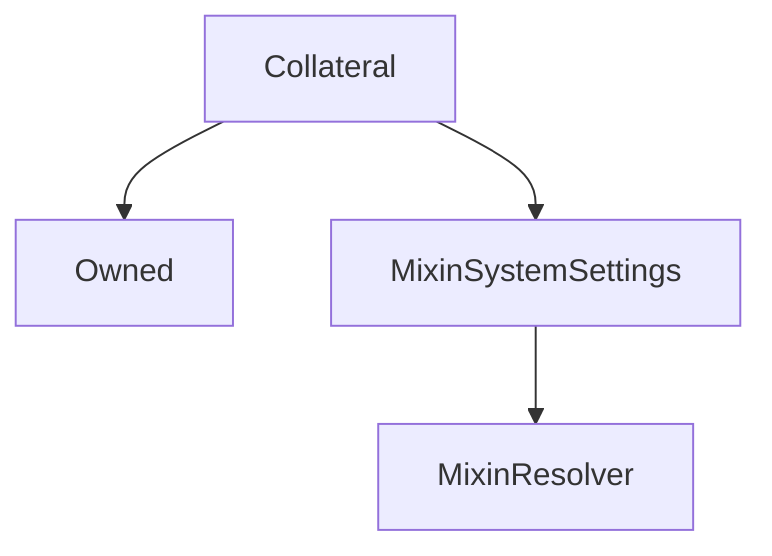

# Collateral

## Description

**Source:** [contracts/Collateral.sol](https://github.com/Synthetixio/synthetix/tree/v2.35.1-beta/contracts/Collateral.sol)

## Architecture

### Libraries

- [SafeMath](/contracts/source/libraries/SafeMath) for `uint`
- [SafeDecimalMath](/contracts/source/libraries/SafeDecimalMath) for `uint`

### Inheritance Graph

## Variables

### `canOpenLoans`

[Source](https://github.com/Synthetixio/synthetix/tree/v2.35.1-beta/contracts/Collateral.sol#L71)

**Type:** `bool`

### `collateralKey`

[Source](https://github.com/Synthetixio/synthetix/tree/v2.35.1-beta/contracts/Collateral.sol#L37)

**Type:** `bytes32`

### `interactionDelay`

[Source](https://github.com/Synthetixio/synthetix/tree/v2.35.1-beta/contracts/Collateral.sol#L69)

**Type:** `uint256`

### `issueFeeRate`

[Source](https://github.com/Synthetixio/synthetix/tree/v2.35.1-beta/contracts/Collateral.sol#L62)

**Type:** `uint256`

### `manager`

[Source](https://github.com/Synthetixio/synthetix/tree/v2.35.1-beta/contracts/Collateral.sol#L42)

**Type:** `address`

### `maxLoansPerAccount`

[Source](https://github.com/Synthetixio/synthetix/tree/v2.35.1-beta/contracts/Collateral.sol#L65)

**Type:** `uint256`

### `minCollateral`

[Source](https://github.com/Synthetixio/synthetix/tree/v2.35.1-beta/contracts/Collateral.sol#L59)

**Type:** `uint256`

### `minCratio`

[Source](https://github.com/Synthetixio/synthetix/tree/v2.35.1-beta/contracts/Collateral.sol#L56)

**Type:** `uint256`

### `shortingRewards`

[Source](https://github.com/Synthetixio/synthetix/tree/v2.35.1-beta/contracts/Collateral.sol#L51)

**Type:** `mapping(bytes32 => address)`

### `state`

[Source](https://github.com/Synthetixio/synthetix/tree/v2.35.1-beta/contracts/Collateral.sol#L40)

**Type:** `contract CollateralState`

### `synths`

[Source](https://github.com/Synthetixio/synthetix/tree/v2.35.1-beta/contracts/Collateral.sol#L45)

**Type:** `bytes32[]`

### `synthsByKey`

[Source](https://github.com/Synthetixio/synthetix/tree/v2.35.1-beta/contracts/Collateral.sol#L48)

**Type:** `mapping(bytes32 => bytes32)`

## Constructor

### `constructor`

[Source](https://github.com/Synthetixio/synthetix/tree/v2.35.1-beta/contracts/Collateral.sol#L83)

??? example "Details"

    **Signature**

    `(contract CollateralState _state, address _owner, address _manager, address _resolver, bytes32 _collateralKey, uint256 _minCratio, uint256 _minCollateral)`

    **Visibility**

    `public`

    **State Mutability**

    `nonpayable`

## Views

### `collateralRatio`

[Source](https://github.com/Synthetixio/synthetix/tree/v2.35.1-beta/contracts/Collateral.sol#L147)

??? example "Details"

    **Signature**

    `collateralRatio(struct ICollateralLoan.Loan loan) returns (uint256)`

    **Visibility**

    `public`

    **State Mutability**

    `view`

### `collateralRedeemed`

[Source](https://github.com/Synthetixio/synthetix/tree/v2.35.1-beta/contracts/Collateral.sol#L180)

??? example "Details"

    **Signature**

    `collateralRedeemed(bytes32 currency, uint256 amount) returns (uint256)`

    **Visibility**

    `public`

    **State Mutability**

    `view`

### `liquidationAmount`

[Source](https://github.com/Synthetixio/synthetix/tree/v2.35.1-beta/contracts/Collateral.sol#L165)

??? example "Details"

    **Signature**

    `liquidationAmount(struct ICollateralLoan.Loan loan) returns (uint256)`

    **Visibility**

    `public`

    **State Mutability**

    `view`

### `maxLoan`

[Source](https://github.com/Synthetixio/synthetix/tree/v2.35.1-beta/contracts/Collateral.sol#L154)

??? example "Details"

    **Signature**

    `maxLoan(uint256 amount, bytes32 currency) returns (uint256)`

    **Visibility**

    `public`

    **State Mutability**

    `view`

### `resolverAddressesRequired`

[Source](https://github.com/Synthetixio/synthetix/tree/v2.35.1-beta/contracts/Collateral.sol#L101)

??? example "Details"

    **Signature**

    `resolverAddressesRequired() returns (bytes32[])`

    **Visibility**

    `public`

    **State Mutability**

    `view`

## Restricted Functions

### `addRewardsContracts`

[Source](https://github.com/Synthetixio/synthetix/tree/v2.35.1-beta/contracts/Collateral.sol#L228)

??? example "Details"

    **Signature**

    `addRewardsContracts(address rewardsContract, bytes32 synth)`

    **Visibility**

    `external`

    **State Mutability**

    `nonpayable`

    **Modifiers**

    * [onlyOwner](#onlyowner)

### `addSynths`

[Source](https://github.com/Synthetixio/synthetix/tree/v2.35.1-beta/contracts/Collateral.sol#L212)

??? example "Details"

    **Signature**

    `addSynths(bytes32[] _synthNames)`

    **Visibility**

    `external`

    **State Mutability**

    `nonpayable`

    **Modifiers**

    * [onlyOwner](#onlyowner)

### `setCanOpenLoans`

[Source](https://github.com/Synthetixio/synthetix/tree/v2.35.1-beta/contracts/Collateral.sol#L257)

??? example "Details"

    **Signature**

    `setCanOpenLoans(bool _canOpenLoans)`

    **Visibility**

    `external`

    **State Mutability**

    `nonpayable`

    **Modifiers**

    * [onlyOwner](#onlyowner)

    **Emits**

    * [ManagerUpdated](#managerupdated)

### `setCurrencies`

[Source](https://github.com/Synthetixio/synthetix/tree/v2.35.1-beta/contracts/Collateral.sol#L219)

??? example "Details"

    **Signature**

    `setCurrencies()`

    **Visibility**

    `external`

    **State Mutability**

    `nonpayable`

    **Modifiers**

    * [onlyOwner](#onlyowner)

### `setInteractionDelay`

[Source](https://github.com/Synthetixio/synthetix/tree/v2.35.1-beta/contracts/Collateral.sol#L246)

??? example "Details"

    **Signature**

    `setInteractionDelay(uint256 _interactionDelay)`

    **Visibility**

    `external`

    **State Mutability**

    `nonpayable`

    **Requires**

    * [require(..., Max 1 hour)](https://github.com/Synthetixio/synthetix/tree/v2.35.1-beta/contracts/Collateral.sol#L247)

    **Modifiers**

    * [onlyOwner](#onlyowner)

    **Emits**

    * [InteractionDelayUpdated](#interactiondelayupdated)

### `setIssueFeeRate`

[Source](https://github.com/Synthetixio/synthetix/tree/v2.35.1-beta/contracts/Collateral.sol#L240)

??? example "Details"

    **Signature**

    `setIssueFeeRate(uint256 _issueFeeRate)`

    **Visibility**

    `external`

    **State Mutability**

    `nonpayable`

    **Requires**

    * [require(..., Must be greater than or equal to 0)](https://github.com/Synthetixio/synthetix/tree/v2.35.1-beta/contracts/Collateral.sol#L241)

    **Modifiers**

    * [onlyOwner](#onlyowner)

    **Emits**

    * [IssueFeeRateUpdated](#issuefeerateupdated)

### `setManager`

[Source](https://github.com/Synthetixio/synthetix/tree/v2.35.1-beta/contracts/Collateral.sol#L252)

??? example "Details"

    **Signature**

    `setManager(address _newManager)`

    **Visibility**

    `external`

    **State Mutability**

    `nonpayable`

    **Modifiers**

    * [onlyOwner](#onlyowner)

    **Emits**

    * [ManagerUpdated](#managerupdated)

### `setMinCratio`

[Source](https://github.com/Synthetixio/synthetix/tree/v2.35.1-beta/contracts/Collateral.sol#L234)

??? example "Details"

    **Signature**

    `setMinCratio(uint256 _minCratio)`

    **Visibility**

    `external`

    **State Mutability**

    `nonpayable`

    **Requires**

    * [require(..., Must be greater than 1)](https://github.com/Synthetixio/synthetix/tree/v2.35.1-beta/contracts/Collateral.sol#L235)

    **Modifiers**

    * [onlyOwner](#onlyowner)

    **Emits**

    * [MinCratioRatioUpdated](#mincratioratioupdated)

## Internal Functions

### `_checkLoanAvailable`

[Source](https://github.com/Synthetixio/synthetix/tree/v2.35.1-beta/contracts/Collateral.sol#L199)

??? example "Details"

    **Signature**

    `_checkLoanAvailable(struct ICollateralLoan.Loan _loan)`

    **Visibility**

    `internal`

    **State Mutability**

    `view`

    **Requires**

    * [require(..., Loan does not exist)](https://github.com/Synthetixio/synthetix/tree/v2.35.1-beta/contracts/Collateral.sol#L200)

    * [require(..., Loan recently interacted with)](https://github.com/Synthetixio/synthetix/tree/v2.35.1-beta/contracts/Collateral.sol#L201)

### `_checkSynthBalance`

[Source](https://github.com/Synthetixio/synthetix/tree/v2.35.1-beta/contracts/Collateral.sol#L190)

??? example "Details"

    **Signature**

    `_checkSynthBalance(address payer, bytes32 key, uint256 amount)`

    **Visibility**

    `internal`

    **State Mutability**

    `view`

    **Requires**

    * [require(..., Not enough synth balance)](https://github.com/Synthetixio/synthetix/tree/v2.35.1-beta/contracts/Collateral.sol#L195)

### `_exchangeRates`

[Source](https://github.com/Synthetixio/synthetix/tree/v2.35.1-beta/contracts/Collateral.sol#L129)

??? example "Details"

    **Signature**

    `_exchangeRates() returns (contract IExchangeRates)`

    **Visibility**

    `internal`

    **State Mutability**

    `view`

### `_exchanger`

[Source](https://github.com/Synthetixio/synthetix/tree/v2.35.1-beta/contracts/Collateral.sol#L133)

??? example "Details"

    **Signature**

    `_exchanger() returns (contract IExchanger)`

    **Visibility**

    `internal`

    **State Mutability**

    `view`

### `_feePool`

[Source](https://github.com/Synthetixio/synthetix/tree/v2.35.1-beta/contracts/Collateral.sol#L137)

??? example "Details"

    **Signature**

    `_feePool() returns (contract IFeePool)`

    **Visibility**

    `internal`

    **State Mutability**

    `view`

### `_manager`

[Source](https://github.com/Synthetixio/synthetix/tree/v2.35.1-beta/contracts/Collateral.sol#L141)

??? example "Details"

    **Signature**

    `_manager() returns (contract ICollateralManager)`

    **Visibility**

    `internal`

    **State Mutability**

    `view`

### `_payFees`

[Source](https://github.com/Synthetixio/synthetix/tree/v2.35.1-beta/contracts/Collateral.sol#L747)

??? example "Details"

    **Signature**

    `_payFees(uint256 amount, bytes32 synth)`

    **Visibility**

    `internal`

    **State Mutability**

    `nonpayable`

### `_processPayment`

[Source](https://github.com/Synthetixio/synthetix/tree/v2.35.1-beta/contracts/Collateral.sol#L718)

??? example "Details"

    **Signature**

    `_processPayment(struct ICollateralLoan.Loan loanBefore, uint256 payment) returns (struct ICollateralLoan.Loan)`

    **Visibility**

    `internal`

    **State Mutability**

    `nonpayable`

### `_synth`

[Source](https://github.com/Synthetixio/synthetix/tree/v2.35.1-beta/contracts/Collateral.sol#L121)

??? example "Details"

    **Signature**

    `_synth(bytes32 synthName) returns (contract ISynth)`

    **Visibility**

    `internal`

    **State Mutability**

    `view`

### `_synthsUSD`

[Source](https://github.com/Synthetixio/synthetix/tree/v2.35.1-beta/contracts/Collateral.sol#L125)

??? example "Details"

    **Signature**

    `_synthsUSD() returns (contract ISynth)`

    **Visibility**

    `internal`

    **State Mutability**

    `view`

### `_systemStatus`

[Source](https://github.com/Synthetixio/synthetix/tree/v2.35.1-beta/contracts/Collateral.sol#L117)

??? example "Details"

    **Signature**

    `_systemStatus() returns (contract ISystemStatus)`

    **Visibility**

    `internal`

    **State Mutability**

    `view`

### `accrueInterest`

[Source](https://github.com/Synthetixio/synthetix/tree/v2.35.1-beta/contracts/Collateral.sol#L682)

??? example "Details"

    **Signature**

    `accrueInterest(struct ICollateralLoan.Loan loan) returns (struct ICollateralLoan.Loan)`

    **Visibility**

    `internal`

    **State Mutability**

    `nonpayable`

    **Requires**

    * [require(..., Rates are invalid)](https://github.com/Synthetixio/synthetix/tree/v2.35.1-beta/contracts/Collateral.sol#L695)

### `closeByLiquidationInternal`

[Source](https://github.com/Synthetixio/synthetix/tree/v2.35.1-beta/contracts/Collateral.sol#L404)

??? example "Details"

    **Signature**

    `closeByLiquidationInternal(address borrower, address liquidator, struct ICollateralLoan.Loan loan) returns (uint256)`

    **Visibility**

    `internal`

    **State Mutability**

    `nonpayable`

    **Requires**

    * [require(..., Waiting or settlement owing)](https://github.com/Synthetixio/synthetix/tree/v2.35.1-beta/contracts/Collateral.sol#L419)

    **Emits**

    * [LoanClosedByLiquidation](#loanclosedbyliquidation)

### `closeInternal`

[Source](https://github.com/Synthetixio/synthetix/tree/v2.35.1-beta/contracts/Collateral.sol#L346)

??? example "Details"

    **Signature**

    `closeInternal(address borrower, uint256 id) returns (uint256)`

    **Visibility**

    `internal`

    **State Mutability**

    `nonpayable`

    **Requires**

    * [require(..., Collateral rate is invalid)](https://github.com/Synthetixio/synthetix/tree/v2.35.1-beta/contracts/Collateral.sol#L351)

    * [require(..., Waiting period or settlement owing)](https://github.com/Synthetixio/synthetix/tree/v2.35.1-beta/contracts/Collateral.sol#L369)

    **Emits**

    * [LoanClosed](#loanclosed)

### `depositInternal`

[Source](https://github.com/Synthetixio/synthetix/tree/v2.35.1-beta/contracts/Collateral.sol#L448)

??? example "Details"

    **Signature**

    `depositInternal(address account, uint256 id, uint256 amount)`

    **Visibility**

    `internal`

    **State Mutability**

    `nonpayable`

    **Requires**

    * [require(..., Collateral rate is invalid)](https://github.com/Synthetixio/synthetix/tree/v2.35.1-beta/contracts/Collateral.sol#L457)

    * [require(..., Deposit must be greater than 0)](https://github.com/Synthetixio/synthetix/tree/v2.35.1-beta/contracts/Collateral.sol#L460)

    **Emits**

    * [CollateralDeposited](#collateraldeposited)

### `drawInternal`

[Source](https://github.com/Synthetixio/synthetix/tree/v2.35.1-beta/contracts/Collateral.sol#L627)

??? example "Details"

    **Signature**

    `drawInternal(uint256 id, uint256 amount)`

    **Visibility**

    `internal`

    **State Mutability**

    `nonpayable`

    **Requires**

    * [require(..., Collateral rate is invalid)](https://github.com/Synthetixio/synthetix/tree/v2.35.1-beta/contracts/Collateral.sol#L632)

    * [require(..., Cannot draw this much)](https://github.com/Synthetixio/synthetix/tree/v2.35.1-beta/contracts/Collateral.sol#L647)

    **Emits**

    * [LoanDrawnDown](#loandrawndown)

### `issuanceRatio`

[Source](https://github.com/Synthetixio/synthetix/tree/v2.35.1-beta/contracts/Collateral.sol#L204)

??? example "Details"

    **Signature**

    `issuanceRatio() returns (uint256)`

    **Visibility**

    `internal`

    **State Mutability**

    `view`

### `liquidateInternal`

[Source](https://github.com/Synthetixio/synthetix/tree/v2.35.1-beta/contracts/Collateral.sol#L519)

??? example "Details"

    **Signature**

    `liquidateInternal(address borrower, uint256 id, uint256 payment) returns (uint256)`

    **Visibility**

    `internal`

    **State Mutability**

    `nonpayable`

    **Requires**

    * [require(..., Collateral rate is invalid)](https://github.com/Synthetixio/synthetix/tree/v2.35.1-beta/contracts/Collateral.sol#L528)

    * [require(..., Payment must be greater than 0)](https://github.com/Synthetixio/synthetix/tree/v2.35.1-beta/contracts/Collateral.sol#L531)

    * [require(..., Cratio above liquidation ratio)](https://github.com/Synthetixio/synthetix/tree/v2.35.1-beta/contracts/Collateral.sol#L546)

    * [require(..., Waiting or settlement owing)](https://github.com/Synthetixio/synthetix/tree/v2.35.1-beta/contracts/Collateral.sol#L573)

    **Emits**

    * [LoanPartiallyLiquidated](#loanpartiallyliquidated)

### `openInternal`

[Source](https://github.com/Synthetixio/synthetix/tree/v2.35.1-beta/contracts/Collateral.sol#L264)

??? example "Details"

    **Signature**

    `openInternal(uint256 collateral, uint256 amount, bytes32 currency, bool short) returns (uint256)`

    **Visibility**

    `internal`

    **State Mutability**

    `nonpayable`

    **Requires**

    * [require(..., Opening is disabled)](https://github.com/Synthetixio/synthetix/tree/v2.35.1-beta/contracts/Collateral.sol#L273)

    * [require(..., Collateral rate is invalid)](https://github.com/Synthetixio/synthetix/tree/v2.35.1-beta/contracts/Collateral.sol#L276)

    * [require(..., Not allowed to issue this synth)](https://github.com/Synthetixio/synthetix/tree/v2.35.1-beta/contracts/Collateral.sol#L279)

    * [require(..., Currency rate is invalid)](https://github.com/Synthetixio/synthetix/tree/v2.35.1-beta/contracts/Collateral.sol#L282)

    * [require(..., Not enough collateral to create a loan)](https://github.com/Synthetixio/synthetix/tree/v2.35.1-beta/contracts/Collateral.sol#L285)

    * [require(..., Max loans exceeded)](https://github.com/Synthetixio/synthetix/tree/v2.35.1-beta/contracts/Collateral.sol#L288)

    * [require(..., Debt limit or invalid rate)](https://github.com/Synthetixio/synthetix/tree/v2.35.1-beta/contracts/Collateral.sol#L293)

    * [require(..., Exceeds max borrowing power)](https://github.com/Synthetixio/synthetix/tree/v2.35.1-beta/contracts/Collateral.sol#L296)

    **Emits**

    * [LoanCreated](#loancreated)

### `repayInternal`

[Source](https://github.com/Synthetixio/synthetix/tree/v2.35.1-beta/contracts/Collateral.sol#L583)

??? example "Details"

    **Signature**

    `repayInternal(address borrower, address repayer, uint256 id, uint256 payment)`

    **Visibility**

    `internal`

    **State Mutability**

    `nonpayable`

    **Requires**

    * [require(..., Collateral rate is invalid)](https://github.com/Synthetixio/synthetix/tree/v2.35.1-beta/contracts/Collateral.sol#L593)

    * [require(..., Payment must be greater than 0)](https://github.com/Synthetixio/synthetix/tree/v2.35.1-beta/contracts/Collateral.sol#L596)

    * [require(..., Waiting or settlement owing)](https://github.com/Synthetixio/synthetix/tree/v2.35.1-beta/contracts/Collateral.sol#L617)

    **Emits**

    * [LoanRepaymentMade](#loanrepaymentmade)

### `withdrawInternal`

[Source](https://github.com/Synthetixio/synthetix/tree/v2.35.1-beta/contracts/Collateral.sol#L484)

??? example "Details"

    **Signature**

    `withdrawInternal(uint256 id, uint256 amount) returns (uint256)`

    **Visibility**

    `internal`

    **State Mutability**

    `nonpayable`

    **Requires**

    * [require(..., Collateral rate is invalid)](https://github.com/Synthetixio/synthetix/tree/v2.35.1-beta/contracts/Collateral.sol#L489)

    * [require(..., Cratio too low)](https://github.com/Synthetixio/synthetix/tree/v2.35.1-beta/contracts/Collateral.sol#L507)

    **Emits**

    * [CollateralWithdrawn](#collateralwithdrawn)

## Events

### `CollateralDeposited`

[Source](https://github.com/Synthetixio/synthetix/tree/v2.35.1-beta/contracts/Collateral.sol#L769)

**Signature**: `CollateralDeposited(address account, uint256 id, uint256 amountDeposited, uint256 collateralAfter)`

### `CollateralWithdrawn`

[Source](https://github.com/Synthetixio/synthetix/tree/v2.35.1-beta/contracts/Collateral.sol#L770)

**Signature**: `CollateralWithdrawn(address account, uint256 id, uint256 amountWithdrawn, uint256 collateralAfter)`

### `InteractionDelayUpdated`

[Source](https://github.com/Synthetixio/synthetix/tree/v2.35.1-beta/contracts/Collateral.sol#L763)

**Signature**: `InteractionDelayUpdated(uint256 interactionDelay)`

### `IssueFeeRateUpdated`

[Source](https://github.com/Synthetixio/synthetix/tree/v2.35.1-beta/contracts/Collateral.sol#L761)

**Signature**: `IssueFeeRateUpdated(uint256 issueFeeRate)`

### `LoanClosed`

[Source](https://github.com/Synthetixio/synthetix/tree/v2.35.1-beta/contracts/Collateral.sol#L768)

**Signature**: `LoanClosed(address account, uint256 id)`

### `LoanClosedByLiquidation`

[Source](https://github.com/Synthetixio/synthetix/tree/v2.35.1-beta/contracts/Collateral.sol#L780)

**Signature**: `LoanClosedByLiquidation(address account, uint256 id, address liquidator, uint256 amountLiquidated, uint256 collateralLiquidated)`

### `LoanCreated`

[Source](https://github.com/Synthetixio/synthetix/tree/v2.35.1-beta/contracts/Collateral.sol#L767)

**Signature**: `LoanCreated(address account, uint256 id, uint256 amount, uint256 collateral, bytes32 currency, uint256 issuanceFee)`

### `LoanDrawnDown`

[Source](https://github.com/Synthetixio/synthetix/tree/v2.35.1-beta/contracts/Collateral.sol#L772)

**Signature**: `LoanDrawnDown(address account, uint256 id, uint256 amount)`

### `LoanPartiallyLiquidated`

[Source](https://github.com/Synthetixio/synthetix/tree/v2.35.1-beta/contracts/Collateral.sol#L773)

**Signature**: `LoanPartiallyLiquidated(address account, uint256 id, address liquidator, uint256 amountLiquidated, uint256 collateralLiquidated)`

### `LoanRepaymentMade`

[Source](https://github.com/Synthetixio/synthetix/tree/v2.35.1-beta/contracts/Collateral.sol#L771)

**Signature**: `LoanRepaymentMade(address account, address repayer, uint256 id, uint256 amountRepaid, uint256 amountAfter)`

### `ManagerUpdated`

[Source](https://github.com/Synthetixio/synthetix/tree/v2.35.1-beta/contracts/Collateral.sol#L764)

**Signature**: `ManagerUpdated(address manager)`

### `MaxLoansPerAccountUpdated`

[Source](https://github.com/Synthetixio/synthetix/tree/v2.35.1-beta/contracts/Collateral.sol#L762)

**Signature**: `MaxLoansPerAccountUpdated(uint256 maxLoansPerAccount)`

### `MinCollateralUpdated`

[Source](https://github.com/Synthetixio/synthetix/tree/v2.35.1-beta/contracts/Collateral.sol#L760)

**Signature**: `MinCollateralUpdated(uint256 minCollateral)`

### `MinCratioRatioUpdated`

[Source](https://github.com/Synthetixio/synthetix/tree/v2.35.1-beta/contracts/Collateral.sol#L759)

**Signature**: `MinCratioRatioUpdated(uint256 minCratio)`
