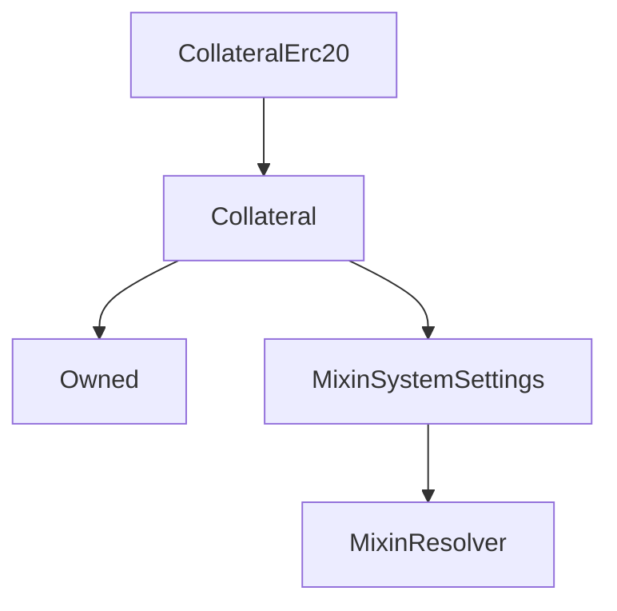

# CollateralErc20

## Description

**Source:** [contracts/CollateralErc20.sol](https://github.com/Synthetixio/synthetix/tree/v2.36.1/contracts/CollateralErc20.sol)

## Architecture

### Inheritance Graph

## Variables

### `underlyingContract`

[Source](https://github.com/Synthetixio/synthetix/tree/v2.36.1/contracts/CollateralErc20.sol#L17)

**Type:** `address`

### `underlyingContractDecimals`

[Source](https://github.com/Synthetixio/synthetix/tree/v2.36.1/contracts/CollateralErc20.sol#L19)

**Type:** `uint256`

## Constructor

### `constructor`

[Source](https://github.com/Synthetixio/synthetix/tree/v2.36.1/contracts/CollateralErc20.sol#L21)

??? example "Details"

    **Signature**

    `(contract CollateralState _state, address _owner, address _manager, address _resolver, bytes32 _collateralKey, uint256 _minCratio, uint256 _minCollateral, address _underlyingContract, uint256 _underlyingDecimals)`

    **Visibility**

    `public`

    **State Mutability**

    `nonpayable`

## Views

### `scaleDownCollateral`

[Source](https://github.com/Synthetixio/synthetix/tree/v2.36.1/contracts/CollateralErc20.sol#L120)

??? example "Details"

    **Signature**

    `scaleDownCollateral(uint256 collateral) returns (uint256)`

    **Visibility**

    `public`

    **State Mutability**

    `view`

### `scaleUpCollateral`

[Source](https://github.com/Synthetixio/synthetix/tree/v2.36.1/contracts/CollateralErc20.sol#L114)

??? example "Details"

    **Signature**

    `scaleUpCollateral(uint256 collateral) returns (uint256)`

    **Visibility**

    `public`

    **State Mutability**

    `view`

## External Functions

### `close`

[Source](https://github.com/Synthetixio/synthetix/tree/v2.36.1/contracts/CollateralErc20.sol#L53)

??? example "Details"

    **Signature**

    `close(uint256 id)`

    **Visibility**

    `external`

    **State Mutability**

    `nonpayable`

### `deposit`

[Source](https://github.com/Synthetixio/synthetix/tree/v2.36.1/contracts/CollateralErc20.sol#L62)

??? example "Details"

    **Signature**

    `deposit(address borrower, uint256 id, uint256 amount)`

    **Visibility**

    `external`

    **State Mutability**

    `nonpayable`

    **Requires**

    * [require(..., Allowance not high enough)](https://github.com/Synthetixio/synthetix/tree/v2.36.1/contracts/CollateralErc20.sol#L67)

### `draw`

[Source](https://github.com/Synthetixio/synthetix/tree/v2.36.1/contracts/CollateralErc20.sol#L97)

??? example "Details"

    **Signature**

    `draw(uint256 id, uint256 amount)`

    **Visibility**

    `external`

    **State Mutability**

    `nonpayable`

### `liquidate`

[Source](https://github.com/Synthetixio/synthetix/tree/v2.36.1/contracts/CollateralErc20.sol#L101)

??? example "Details"

    **Signature**

    `liquidate(address borrower, uint256 id, uint256 amount)`

    **Visibility**

    `external`

    **State Mutability**

    `nonpayable`

### `open`

[Source](https://github.com/Synthetixio/synthetix/tree/v2.36.1/contracts/CollateralErc20.sol#L37)

??? example "Details"

    **Signature**

    `open(uint256 collateral, uint256 amount, bytes32 currency)`

    **Visibility**

    `external`

    **State Mutability**

    `nonpayable`

    **Requires**

    * [require(..., Allowance not high enough)](https://github.com/Synthetixio/synthetix/tree/v2.36.1/contracts/CollateralErc20.sol#L42)

### `repay`

[Source](https://github.com/Synthetixio/synthetix/tree/v2.36.1/contracts/CollateralErc20.sol#L89)

??? example "Details"

    **Signature**

    `repay(address borrower, uint256 id, uint256 amount)`

    **Visibility**

    `external`

    **State Mutability**

    `nonpayable`

### `withdraw`

[Source](https://github.com/Synthetixio/synthetix/tree/v2.36.1/contracts/CollateralErc20.sol#L77)

??? example "Details"

    **Signature**

    `withdraw(uint256 id, uint256 amount)`

    **Visibility**

    `external`

    **State Mutability**

    `nonpayable`
