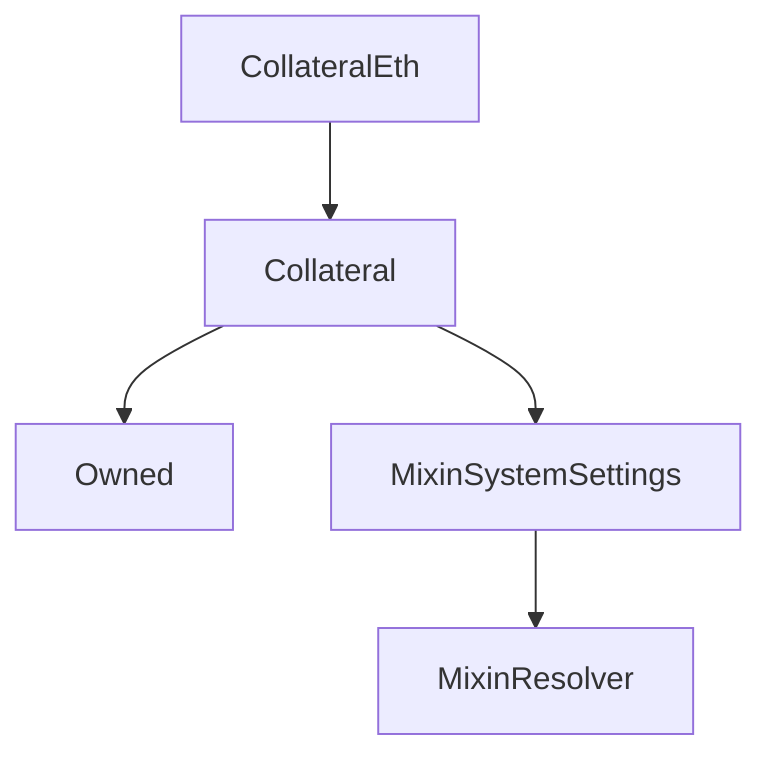

# CollateralEth

## Description

**Source:** [contracts/CollateralEth.sol](https://github.com/Synthetixio/synthetix/tree/v2.35.3/contracts/CollateralEth.sol)

## Architecture

### Inheritance Graph

## Variables

### `pendingWithdrawals`

[Source](https://github.com/Synthetixio/synthetix/tree/v2.35.3/contracts/CollateralEth.sol#L16)

**Type:** `mapping(address => uint256)`

## Constructor

### `constructor`

[Source](https://github.com/Synthetixio/synthetix/tree/v2.35.3/contracts/CollateralEth.sol#L18)

??? example "Details"

    **Signature**

    `(contract CollateralState _state, address _owner, address _manager, address _resolver, bytes32 _collateralKey, uint256 _minCratio, uint256 _minCollateral)`

    **Visibility**

    `public`

    **State Mutability**

    `nonpayable`

## External Functions

### `claim`

[Source](https://github.com/Synthetixio/synthetix/tree/v2.35.3/contracts/CollateralEth.sol#L70)

??? example "Details"

    **Signature**

    `claim(uint256 amount)`

    **Visibility**

    `external`

    **State Mutability**

    `nonpayable`

    **Requires**

    * [require(..., Transfer failed)](https://github.com/Synthetixio/synthetix/tree/v2.35.3/contracts/CollateralEth.sol#L75)

    **Modifiers**

    * [nonReentrant](#nonreentrant)

### `close`

[Source](https://github.com/Synthetixio/synthetix/tree/v2.35.3/contracts/CollateralEth.sol#L32)

??? example "Details"

    **Signature**

    `close(uint256 id)`

    **Visibility**

    `external`

    **State Mutability**

    `nonpayable`

### `deposit`

[Source](https://github.com/Synthetixio/synthetix/tree/v2.35.3/contracts/CollateralEth.sol#L38)

??? example "Details"

    **Signature**

    `deposit(address borrower, uint256 id)`

    **Visibility**

    `external`

    **State Mutability**

    `payable`

### `draw`

[Source](https://github.com/Synthetixio/synthetix/tree/v2.35.3/contracts/CollateralEth.sol#L56)

??? example "Details"

    **Signature**

    `draw(uint256 id, uint256 amount)`

    **Visibility**

    `external`

    **State Mutability**

    `nonpayable`

### `liquidate`

[Source](https://github.com/Synthetixio/synthetix/tree/v2.35.3/contracts/CollateralEth.sol#L60)

??? example "Details"

    **Signature**

    `liquidate(address borrower, uint256 id, uint256 amount)`

    **Visibility**

    `external`

    **State Mutability**

    `nonpayable`

### `open`

[Source](https://github.com/Synthetixio/synthetix/tree/v2.35.3/contracts/CollateralEth.sol#L28)

??? example "Details"

    **Signature**

    `open(uint256 amount, bytes32 currency)`

    **Visibility**

    `external`

    **State Mutability**

    `payable`

### `repay`

[Source](https://github.com/Synthetixio/synthetix/tree/v2.35.3/contracts/CollateralEth.sol#L48)

??? example "Details"

    **Signature**

    `repay(address account, uint256 id, uint256 amount)`

    **Visibility**

    `external`

    **State Mutability**

    `nonpayable`

### `withdraw`

[Source](https://github.com/Synthetixio/synthetix/tree/v2.35.3/contracts/CollateralEth.sol#L42)

??? example "Details"

    **Signature**

    `withdraw(uint256 id, uint256 withdrawAmount)`

    **Visibility**

    `external`

    **State Mutability**

    `nonpayable`
