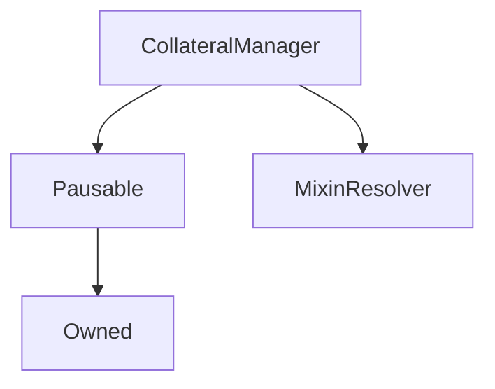

# CollateralManager

## Description

**Source:** [contracts/CollateralManager.sol](https://github.com/Synthetixio/synthetix/tree/v2.35.2-beta/contracts/CollateralManager.sol)

## Architecture

### Libraries

- [SafeMath](/contracts/source/libraries/SafeMath) for `uint`
- [SafeDecimalMath](/contracts/source/libraries/SafeDecimalMath) for `uint`
- [AddressSetLib](/contracts/source/libraries/AddressSetLib) for `AddressSetLib.AddressSet`
- [Bytes32SetLib](/contracts/source/libraries/Bytes32SetLib) for `Bytes32SetLib.Bytes32Set`

### Inheritance Graph

## Constants

### `CONTRACT_NAME`

[Source](https://github.com/Synthetixio/synthetix/tree/v2.35.2-beta/contracts/CollateralManager.sol#L38)

**Type:** `bytes32`

## Variables

### `baseBorrowRate`

[Source](https://github.com/Synthetixio/synthetix/tree/v2.35.2-beta/contracts/CollateralManager.sol#L67)

**Type:** `uint256`

### `baseShortRate`

[Source](https://github.com/Synthetixio/synthetix/tree/v2.35.2-beta/contracts/CollateralManager.sol#L70)

**Type:** `uint256`

### `maxDebt`

[Source](https://github.com/Synthetixio/synthetix/tree/v2.35.2-beta/contracts/CollateralManager.sol#L64)

**Type:** `uint256`

### `state`

[Source](https://github.com/Synthetixio/synthetix/tree/v2.35.2-beta/contracts/CollateralManager.sol#L44)

**Type:** `contract CollateralManagerState`

### `synthToInverseSynth`

[Source](https://github.com/Synthetixio/synthetix/tree/v2.35.2-beta/contracts/CollateralManager.sol#L58)

**Type:** `mapping(bytes32 => bytes32)`

### `synthsByKey`

[Source](https://github.com/Synthetixio/synthetix/tree/v2.35.2-beta/contracts/CollateralManager.sol#L53)

**Type:** `mapping(bytes32 => bytes32)`

### `utilisationMultiplier`

[Source](https://github.com/Synthetixio/synthetix/tree/v2.35.2-beta/contracts/CollateralManager.sol#L61)

**Type:** `uint256`

## Constructor

### `constructor`

[Source](https://github.com/Synthetixio/synthetix/tree/v2.35.2-beta/contracts/CollateralManager.sol#L81)

??? example "Details"

    **Signature**

    `(contract CollateralManagerState _state, address _owner, address _resolver, uint256 _maxDebt, uint256 _baseBorrowRate, uint256 _baseShortRate)`

    **Visibility**

    `public`

    **State Mutability**

    `nonpayable`

## Views

### `areShortableSynthsSet`

[Source](https://github.com/Synthetixio/synthetix/tree/v2.35.2-beta/contracts/CollateralManager.sol#L434)

??? example "Details"

    **Signature**

    `areShortableSynthsSet(bytes32[] requiredSynthNamesInResolver, bytes32[] synthKeys) returns (bool)`

    **Visibility**

    `external`

    **State Mutability**

    `view`

    **Requires**

    * [require(..., Input array length mismatch)](https://github.com/Synthetixio/synthetix/tree/v2.35.2-beta/contracts/CollateralManager.sol#L439)

### `areSynthsAndCurrenciesSet`

[Source](https://github.com/Synthetixio/synthetix/tree/v2.35.2-beta/contracts/CollateralManager.sol#L366)

??? example "Details"

    **Signature**

    `areSynthsAndCurrenciesSet(bytes32[] requiredSynthNamesInResolver, bytes32[] synthKeys) returns (bool)`

    **Visibility**

    `external`

    **State Mutability**

    `view`

### `exceedsDebtLimit`

[Source](https://github.com/Synthetixio/synthetix/tree/v2.35.2-beta/contracts/CollateralManager.sol#L287)

??? example "Details"

    **Signature**

    `exceedsDebtLimit(uint256 amount, bytes32 currency) returns (bool, bool)`

    **Visibility**

    `external`

    **State Mutability**

    `view`

### `getBorrowRate`

[Source](https://github.com/Synthetixio/synthetix/tree/v2.35.2-beta/contracts/CollateralManager.sol#L213)

??? example "Details"

    **Signature**

    `getBorrowRate() returns (uint256, bool)`

    **Visibility**

    `external`

    **State Mutability**

    `view`

### `getRatesAndTime`

[Source](https://github.com/Synthetixio/synthetix/tree/v2.35.2-beta/contracts/CollateralManager.sol#L261)

??? example "Details"

    **Signature**

    `getRatesAndTime(uint256 index) returns (uint256, uint256, uint256, uint256)`

    **Visibility**

    `external`

    **State Mutability**

    `view`

### `getShortRate`

[Source](https://github.com/Synthetixio/synthetix/tree/v2.35.2-beta/contracts/CollateralManager.sol#L235)

??? example "Details"

    **Signature**

    `getShortRate(bytes32 synth) returns (uint256, bool)`

    **Visibility**

    `external`

    **State Mutability**

    `view`

### `getShortRatesAndTime`

[Source](https://github.com/Synthetixio/synthetix/tree/v2.35.2-beta/contracts/CollateralManager.sol#L274)

??? example "Details"

    **Signature**

    `getShortRatesAndTime(bytes32 currency, uint256 index) returns (uint256, uint256, uint256, uint256)`

    **Visibility**

    `external`

    **State Mutability**

    `view`

### `hasAllCollaterals`

[Source](https://github.com/Synthetixio/synthetix/tree/v2.35.2-beta/contracts/CollateralManager.sol#L158)

??? example "Details"

    **Signature**

    `hasAllCollaterals(address[] collaterals) returns (bool)`

    **Visibility**

    `public`

    **State Mutability**

    `view`

### `hasCollateral`

[Source](https://github.com/Synthetixio/synthetix/tree/v2.35.2-beta/contracts/CollateralManager.sol#L154)

??? example "Details"

    **Signature**

    `hasCollateral(address collateral) returns (bool)`

    **Visibility**

    `public`

    **State Mutability**

    `view`

### `isSynthManaged`

[Source](https://github.com/Synthetixio/synthetix/tree/v2.35.2-beta/contracts/CollateralManager.sol#L130)

??? example "Details"

    **Signature**

    `isSynthManaged(bytes32 currencyKey) returns (bool)`

    **Visibility**

    `external`

    **State Mutability**

    `view`

### `long`

[Source](https://github.com/Synthetixio/synthetix/tree/v2.35.2-beta/contracts/CollateralManager.sol#L169)

??? example "Details"

    **Signature**

    `long(bytes32 synth) returns (uint256)`

    **Visibility**

    `external`

    **State Mutability**

    `view`

### `resolverAddressesRequired`

[Source](https://github.com/Synthetixio/synthetix/tree/v2.35.2-beta/contracts/CollateralManager.sol#L101)

??? example "Details"

    **Signature**

    `resolverAddressesRequired() returns (bytes32[])`

    **Visibility**

    `public`

    **State Mutability**

    `view`

### `short`

[Source](https://github.com/Synthetixio/synthetix/tree/v2.35.2-beta/contracts/CollateralManager.sol#L173)

??? example "Details"

    **Signature**

    `short(bytes32 synth) returns (uint256)`

    **Visibility**

    `external`

    **State Mutability**

    `view`

### `totalLong`

[Source](https://github.com/Synthetixio/synthetix/tree/v2.35.2-beta/contracts/CollateralManager.sol#L177)

??? example "Details"

    **Signature**

    `totalLong() returns (uint256, bool)`

    **Visibility**

    `public`

    **State Mutability**

    `view`

### `totalShort`

[Source](https://github.com/Synthetixio/synthetix/tree/v2.35.2-beta/contracts/CollateralManager.sol#L197)

??? example "Details"

    **Signature**

    `totalShort() returns (uint256, bool)`

    **Visibility**

    `public`

    **State Mutability**

    `view`

## Restricted Functions

### `addCollaterals`

[Source](https://github.com/Synthetixio/synthetix/tree/v2.35.2-beta/contracts/CollateralManager.sol#L331)

??? example "Details"

    **Signature**

    `addCollaterals(address[] collaterals)`

    **Visibility**

    `external`

    **State Mutability**

    `nonpayable`

    **Modifiers**

    * [onlyOwner](#onlyowner)

### `addShortableSynths`

[Source](https://github.com/Synthetixio/synthetix/tree/v2.35.2-beta/contracts/CollateralManager.sol#L403)

??? example "Details"

    **Signature**

    `addShortableSynths(bytes32[2][] requiredSynthAndInverseNamesInResolver, bytes32[] synthKeys)`

    **Visibility**

    `external`

    **State Mutability**

    `nonpayable`

    **Requires**

    * [require(..., Input array length mismatch)](https://github.com/Synthetixio/synthetix/tree/v2.35.2-beta/contracts/CollateralManager.sol#L409)

    **Modifiers**

    * [onlyOwner](#onlyowner)

### `addSynths`

[Source](https://github.com/Synthetixio/synthetix/tree/v2.35.2-beta/contracts/CollateralManager.sol#L353)

??? example "Details"

    **Signature**

    `addSynths(bytes32[] synthNamesInResolver, bytes32[] synthKeys)`

    **Visibility**

    `external`

    **State Mutability**

    `nonpayable`

    **Modifiers**

    * [onlyOwner](#onlyowner)

### `decrementLongs`

[Source](https://github.com/Synthetixio/synthetix/tree/v2.35.2-beta/contracts/CollateralManager.sol#L497)

??? example "Details"

    **Signature**

    `decrementLongs(bytes32 synth, uint256 amount)`

    **Visibility**

    `external`

    **State Mutability**

    `nonpayable`

    **Modifiers**

    * [onlyCollateral](#onlycollateral)

### `decrementShorts`

[Source](https://github.com/Synthetixio/synthetix/tree/v2.35.2-beta/contracts/CollateralManager.sol#L505)

??? example "Details"

    **Signature**

    `decrementShorts(bytes32 synth, uint256 amount)`

    **Visibility**

    `external`

    **State Mutability**

    `nonpayable`

    **Modifiers**

    * [onlyCollateral](#onlycollateral)

### `getNewLoanId`

[Source](https://github.com/Synthetixio/synthetix/tree/v2.35.2-beta/contracts/CollateralManager.sol#L325)

??? example "Details"

    **Signature**

    `getNewLoanId() returns (uint256)`

    **Visibility**

    `external`

    **State Mutability**

    `nonpayable`

    **Modifiers**

    * [onlyCollateral](#onlycollateral)

### `incrementLongs`

[Source](https://github.com/Synthetixio/synthetix/tree/v2.35.2-beta/contracts/CollateralManager.sol#L493)

??? example "Details"

    **Signature**

    `incrementLongs(bytes32 synth, uint256 amount)`

    **Visibility**

    `external`

    **State Mutability**

    `nonpayable`

    **Modifiers**

    * [onlyCollateral](#onlycollateral)

### `incrementShorts`

[Source](https://github.com/Synthetixio/synthetix/tree/v2.35.2-beta/contracts/CollateralManager.sol#L501)

??? example "Details"

    **Signature**

    `incrementShorts(bytes32 synth, uint256 amount)`

    **Visibility**

    `external`

    **State Mutability**

    `nonpayable`

    **Modifiers**

    * [onlyCollateral](#onlycollateral)

### `removeCollaterals`

[Source](https://github.com/Synthetixio/synthetix/tree/v2.35.2-beta/contracts/CollateralManager.sol#L342)

??? example "Details"

    **Signature**

    `removeCollaterals(address[] collaterals)`

    **Visibility**

    `external`

    **State Mutability**

    `nonpayable`

    **Modifiers**

    * [onlyOwner](#onlyowner)

### `removeShortableSynths`

[Source](https://github.com/Synthetixio/synthetix/tree/v2.35.2-beta/contracts/CollateralManager.sol#L463)

??? example "Details"

    **Signature**

    `removeShortableSynths(bytes32[] synths)`

    **Visibility**

    `external`

    **State Mutability**

    `nonpayable`

    **Modifiers**

    * [onlyOwner](#onlyowner)

### `removeSynths`

[Source](https://github.com/Synthetixio/synthetix/tree/v2.35.2-beta/contracts/CollateralManager.sol#L387)

??? example "Details"

    **Signature**

    `removeSynths(bytes32[] synths, bytes32[] synthKeys)`

    **Visibility**

    `external`

    **State Mutability**

    `nonpayable`

    **Modifiers**

    * [onlyOwner](#onlyowner)

### `setBaseBorrowRate`

[Source](https://github.com/Synthetixio/synthetix/tree/v2.35.2-beta/contracts/CollateralManager.sol#L313)

??? example "Details"

    **Signature**

    `setBaseBorrowRate(uint256 _baseBorrowRate)`

    **Visibility**

    `public`

    **State Mutability**

    `nonpayable`

    **Modifiers**

    * [onlyOwner](#onlyowner)

    **Emits**

    * [BaseBorrowRateUpdated](#baseborrowrateupdated)

### `setBaseShortRate`

[Source](https://github.com/Synthetixio/synthetix/tree/v2.35.2-beta/contracts/CollateralManager.sol#L318)

??? example "Details"

    **Signature**

    `setBaseShortRate(uint256 _baseShortRate)`

    **Visibility**

    `public`

    **State Mutability**

    `nonpayable`

    **Modifiers**

    * [onlyOwner](#onlyowner)

    **Emits**

    * [BaseShortRateUpdated](#baseshortrateupdated)

### `setMaxDebt`

[Source](https://github.com/Synthetixio/synthetix/tree/v2.35.2-beta/contracts/CollateralManager.sol#L307)

??? example "Details"

    **Signature**

    `setMaxDebt(uint256 _maxDebt)`

    **Visibility**

    `public`

    **State Mutability**

    `nonpayable`

    **Requires**

    * [require(..., Must be greater than 0)](https://github.com/Synthetixio/synthetix/tree/v2.35.2-beta/contracts/CollateralManager.sol#L308)

    **Modifiers**

    * [onlyOwner](#onlyowner)

    **Emits**

    * [MaxDebtUpdated](#maxdebtupdated)

### `setUtilisationMultiplier`

[Source](https://github.com/Synthetixio/synthetix/tree/v2.35.2-beta/contracts/CollateralManager.sol#L302)

??? example "Details"

    **Signature**

    `setUtilisationMultiplier(uint256 _utilisationMultiplier)`

    **Visibility**

    `public`

    **State Mutability**

    `nonpayable`

    **Requires**

    * [require(..., Must be greater than 0)](https://github.com/Synthetixio/synthetix/tree/v2.35.2-beta/contracts/CollateralManager.sol#L303)

    **Modifiers**

    * [onlyOwner](#onlyowner)

### `updateBorrowRates`

[Source](https://github.com/Synthetixio/synthetix/tree/v2.35.2-beta/contracts/CollateralManager.sol#L485)

??? example "Details"

    **Signature**

    `updateBorrowRates(uint256 rate)`

    **Visibility**

    `external`

    **State Mutability**

    `nonpayable`

    **Modifiers**

    * [onlyCollateral](#onlycollateral)

### `updateShortRates`

[Source](https://github.com/Synthetixio/synthetix/tree/v2.35.2-beta/contracts/CollateralManager.sol#L489)

??? example "Details"

    **Signature**

    `updateShortRates(bytes32 currency, uint256 rate)`

    **Visibility**

    `external`

    **State Mutability**

    `nonpayable`

    **Modifiers**

    * [onlyCollateral](#onlycollateral)

## Internal Functions

### `_exchangeRates`

[Source](https://github.com/Synthetixio/synthetix/tree/v2.35.2-beta/contracts/CollateralManager.sol#L144)

??? example "Details"

    **Signature**

    `_exchangeRates() returns (contract IExchangeRates)`

    **Visibility**

    `internal`

    **State Mutability**

    `view`

### `_issuer`

[Source](https://github.com/Synthetixio/synthetix/tree/v2.35.2-beta/contracts/CollateralManager.sol#L140)

??? example "Details"

    **Signature**

    `_issuer() returns (contract IIssuer)`

    **Visibility**

    `internal`

    **State Mutability**

    `view`

### `_synth`

[Source](https://github.com/Synthetixio/synthetix/tree/v2.35.2-beta/contracts/CollateralManager.sol#L148)

??? example "Details"

    **Signature**

    `_synth(bytes32 synthName) returns (contract ISynth)`

    **Visibility**

    `internal`

    **State Mutability**

    `view`

### `_systemStatus`

[Source](https://github.com/Synthetixio/synthetix/tree/v2.35.2-beta/contracts/CollateralManager.sol#L136)

??? example "Details"

    **Signature**

    `_systemStatus() returns (contract ISystemStatus)`

    **Visibility**

    `internal`

    **State Mutability**

    `view`

## Modifiers

### `onlyCollateral`

[Source](https://github.com/Synthetixio/synthetix/tree/v2.35.2-beta/contracts/CollateralManager.sol#L511)

## Events

### `BaseBorrowRateUpdated`

[Source](https://github.com/Synthetixio/synthetix/tree/v2.35.2-beta/contracts/CollateralManager.sol#L521)

**Signature**: `BaseBorrowRateUpdated(uint256 baseBorrowRate)`

### `BaseShortRateUpdated`

[Source](https://github.com/Synthetixio/synthetix/tree/v2.35.2-beta/contracts/CollateralManager.sol#L522)

**Signature**: `BaseShortRateUpdated(uint256 baseShortRate)`

### `CollateralAdded`

[Source](https://github.com/Synthetixio/synthetix/tree/v2.35.2-beta/contracts/CollateralManager.sol#L524)

**Signature**: `CollateralAdded(address collateral)`

### `CollateralRemoved`

[Source](https://github.com/Synthetixio/synthetix/tree/v2.35.2-beta/contracts/CollateralManager.sol#L525)

**Signature**: `CollateralRemoved(address collateral)`

### `LiquidationPenaltyUpdated`

[Source](https://github.com/Synthetixio/synthetix/tree/v2.35.2-beta/contracts/CollateralManager.sol#L520)

**Signature**: `LiquidationPenaltyUpdated(uint256 liquidationPenalty)`

### `MaxDebtUpdated`

[Source](https://github.com/Synthetixio/synthetix/tree/v2.35.2-beta/contracts/CollateralManager.sol#L519)

**Signature**: `MaxDebtUpdated(uint256 maxDebt)`

### `ShortableSynthAdded`

[Source](https://github.com/Synthetixio/synthetix/tree/v2.35.2-beta/contracts/CollateralManager.sol#L530)

**Signature**: `ShortableSynthAdded(bytes32 synth)`

### `ShortableSynthRemoved`

[Source](https://github.com/Synthetixio/synthetix/tree/v2.35.2-beta/contracts/CollateralManager.sol#L531)

**Signature**: `ShortableSynthRemoved(bytes32 synth)`

### `SynthAdded`

[Source](https://github.com/Synthetixio/synthetix/tree/v2.35.2-beta/contracts/CollateralManager.sol#L527)

**Signature**: `SynthAdded(bytes32 synth)`

### `SynthRemoved`

[Source](https://github.com/Synthetixio/synthetix/tree/v2.35.2-beta/contracts/CollateralManager.sol#L528)

**Signature**: `SynthRemoved(bytes32 synth)`
