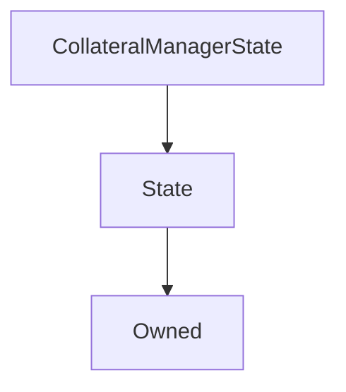

# CollateralManagerState

## Description

**Source:** [contracts/CollateralManagerState.sol](https://github.com/Synthetixio/synthetix/tree/v2.35.1-beta/contracts/CollateralManagerState.sol)

## Architecture

### Libraries

- [SafeMath](/contracts/source/libraries/SafeMath) for `uint`
- [SafeDecimalMath](/contracts/source/libraries/SafeDecimalMath) for `uint`

### Inheritance Graph

## Structs

### `Balance`

[Source](https://github.com/Synthetixio/synthetix/tree/v2.35.1-beta/contracts/CollateralManagerState.sol#L17)

| Field   | Type      | Description |
| ------- | --------- | ----------- |
| `long`  | `uint256` | TBA         |
| `short` | `uint256` | TBA         |

## Variables

### `borrowRates`

[Source](https://github.com/Synthetixio/synthetix/tree/v2.35.1-beta/contracts/CollateralManagerState.sol#L24)

**Type:** `uint256[]`

### `borrowRatesLastUpdated`

[Source](https://github.com/Synthetixio/synthetix/tree/v2.35.1-beta/contracts/CollateralManagerState.sol#L25)

**Type:** `uint256`

### `shortRates`

[Source](https://github.com/Synthetixio/synthetix/tree/v2.35.1-beta/contracts/CollateralManagerState.sol#L27)

**Type:** `mapping(bytes32 => uint256[])`

### `shortRatesLastUpdated`

[Source](https://github.com/Synthetixio/synthetix/tree/v2.35.1-beta/contracts/CollateralManagerState.sol#L28)

**Type:** `mapping(bytes32 => uint256)`

### `totalIssuedSynths`

[Source](https://github.com/Synthetixio/synthetix/tree/v2.35.1-beta/contracts/CollateralManagerState.sol#L31)

**Type:** `mapping(bytes32 => struct CollateralManagerState.Balance)`

### `totalLoans`

[Source](https://github.com/Synthetixio/synthetix/tree/v2.35.1-beta/contracts/CollateralManagerState.sol#L22)

**Type:** `uint256`

## Constructor

### `constructor`

[Source](https://github.com/Synthetixio/synthetix/tree/v2.35.1-beta/contracts/CollateralManagerState.sol#L33)

??? example "Details"

    **Signature**

    `(address _owner, address _associatedContract)`

    **Visibility**

    `public`

    **State Mutability**

    `nonpayable`

## Views

### `getRateAt`

[Source](https://github.com/Synthetixio/synthetix/tree/v2.35.1-beta/contracts/CollateralManagerState.sol#L69)

??? example "Details"

    **Signature**

    `getRateAt(uint256 index) returns (uint256)`

    **Visibility**

    `public`

    **State Mutability**

    `view`

### `getRatesAndTime`

[Source](https://github.com/Synthetixio/synthetix/tree/v2.35.1-beta/contracts/CollateralManagerState.sol#L86)

??? example "Details"

    **Signature**

    `getRatesAndTime(uint256 index) returns (uint256, uint256, uint256, uint256)`

    **Visibility**

    `external`

    **State Mutability**

    `view`

### `getRatesLength`

[Source](https://github.com/Synthetixio/synthetix/tree/v2.35.1-beta/contracts/CollateralManagerState.sol#L73)

??? example "Details"

    **Signature**

    `getRatesLength() returns (uint256)`

    **Visibility**

    `public`

    **State Mutability**

    `view`

### `getShortRatesAndTime`

[Source](https://github.com/Synthetixio/synthetix/tree/v2.35.1-beta/contracts/CollateralManagerState.sol#L132)

??? example "Details"

    **Signature**

    `getShortRatesAndTime(bytes32 currency, uint256 index) returns (uint256, uint256, uint256, uint256)`

    **Visibility**

    `external`

    **State Mutability**

    `view`

### `long`

[Source](https://github.com/Synthetixio/synthetix/tree/v2.35.1-beta/contracts/CollateralManagerState.sol#L43)

??? example "Details"

    **Signature**

    `long(bytes32 synth) returns (uint256)`

    **Visibility**

    `external`

    **State Mutability**

    `view`

    **Modifiers**

    * [onlyAssociatedContract](#onlyassociatedcontract)

### `ratesLastUpdated`

[Source](https://github.com/Synthetixio/synthetix/tree/v2.35.1-beta/contracts/CollateralManagerState.sol#L82)

??? example "Details"

    **Signature**

    `ratesLastUpdated() returns (uint256)`

    **Visibility**

    `public`

    **State Mutability**

    `view`

### `short`

[Source](https://github.com/Synthetixio/synthetix/tree/v2.35.1-beta/contracts/CollateralManagerState.sol#L47)

??? example "Details"

    **Signature**

    `short(bytes32 synth) returns (uint256)`

    **Visibility**

    `external`

    **State Mutability**

    `view`

    **Modifiers**

    * [onlyAssociatedContract](#onlyassociatedcontract)

## Restricted Functions

### `addShortCurrency`

[Source](https://github.com/Synthetixio/synthetix/tree/v2.35.1-beta/contracts/CollateralManagerState.sol#L104)

??? example "Details"

    **Signature**

    `addShortCurrency(bytes32 currency)`

    **Visibility**

    `external`

    **State Mutability**

    `nonpayable`

    **Modifiers**

    * [onlyAssociatedContract](#onlyassociatedcontract)

### `decrementLongs`

[Source](https://github.com/Synthetixio/synthetix/tree/v2.35.1-beta/contracts/CollateralManagerState.sol#L55)

??? example "Details"

    **Signature**

    `decrementLongs(bytes32 synth, uint256 amount)`

    **Visibility**

    `external`

    **State Mutability**

    `nonpayable`

    **Modifiers**

    * [onlyAssociatedContract](#onlyassociatedcontract)

### `decrementShorts`

[Source](https://github.com/Synthetixio/synthetix/tree/v2.35.1-beta/contracts/CollateralManagerState.sol#L63)

??? example "Details"

    **Signature**

    `decrementShorts(bytes32 synth, uint256 amount)`

    **Visibility**

    `external`

    **State Mutability**

    `nonpayable`

    **Modifiers**

    * [onlyAssociatedContract](#onlyassociatedcontract)

### `incrementLongs`

[Source](https://github.com/Synthetixio/synthetix/tree/v2.35.1-beta/contracts/CollateralManagerState.sol#L51)

??? example "Details"

    **Signature**

    `incrementLongs(bytes32 synth, uint256 amount)`

    **Visibility**

    `external`

    **State Mutability**

    `nonpayable`

    **Modifiers**

    * [onlyAssociatedContract](#onlyassociatedcontract)

### `incrementShorts`

[Source](https://github.com/Synthetixio/synthetix/tree/v2.35.1-beta/contracts/CollateralManagerState.sol#L59)

??? example "Details"

    **Signature**

    `incrementShorts(bytes32 synth, uint256 amount)`

    **Visibility**

    `external`

    **State Mutability**

    `nonpayable`

    **Modifiers**

    * [onlyAssociatedContract](#onlyassociatedcontract)

### `incrementTotalLoans`

[Source](https://github.com/Synthetixio/synthetix/tree/v2.35.1-beta/contracts/CollateralManagerState.sol#L38)

??? example "Details"

    **Signature**

    `incrementTotalLoans() returns (uint256)`

    **Visibility**

    `external`

    **State Mutability**

    `nonpayable`

    **Modifiers**

    * [onlyAssociatedContract](#onlyassociatedcontract)

### `long`

[Source](https://github.com/Synthetixio/synthetix/tree/v2.35.1-beta/contracts/CollateralManagerState.sol#L43)

??? example "Details"

    **Signature**

    `long(bytes32 synth) returns (uint256)`

    **Visibility**

    `external`

    **State Mutability**

    `view`

    **Modifiers**

    * [onlyAssociatedContract](#onlyassociatedcontract)

### `removeShortCurrency`

[Source](https://github.com/Synthetixio/synthetix/tree/v2.35.1-beta/contracts/CollateralManagerState.sol#L111)

??? example "Details"

    **Signature**

    `removeShortCurrency(bytes32 currency)`

    **Visibility**

    `external`

    **State Mutability**

    `nonpayable`

    **Modifiers**

    * [onlyAssociatedContract](#onlyassociatedcontract)

### `short`

[Source](https://github.com/Synthetixio/synthetix/tree/v2.35.1-beta/contracts/CollateralManagerState.sol#L47)

??? example "Details"

    **Signature**

    `short(bytes32 synth) returns (uint256)`

    **Visibility**

    `external`

    **State Mutability**

    `view`

    **Modifiers**

    * [onlyAssociatedContract](#onlyassociatedcontract)

### `updateBorrowRates`

[Source](https://github.com/Synthetixio/synthetix/tree/v2.35.1-beta/contracts/CollateralManagerState.sol#L77)

??? example "Details"

    **Signature**

    `updateBorrowRates(uint256 rate)`

    **Visibility**

    `external`

    **State Mutability**

    `nonpayable`

    **Modifiers**

    * [onlyAssociatedContract](#onlyassociatedcontract)

### `updateShortRates`

[Source](https://github.com/Synthetixio/synthetix/tree/v2.35.1-beta/contracts/CollateralManagerState.sol#L123)

??? example "Details"

    **Signature**

    `updateShortRates(bytes32 currency, uint256 rate)`

    **Visibility**

    `external`

    **State Mutability**

    `nonpayable`

    **Modifiers**

    * [onlyAssociatedContract](#onlyassociatedcontract)

## Internal Functions

### `getShortRateAt`

[Source](https://github.com/Synthetixio/synthetix/tree/v2.35.1-beta/contracts/CollateralManagerState.sol#L115)

??? example "Details"

    **Signature**

    `getShortRateAt(bytes32 currency, uint256 index) returns (uint256)`

    **Visibility**

    `internal`

    **State Mutability**

    `view`

### `getShortRatesLength`

[Source](https://github.com/Synthetixio/synthetix/tree/v2.35.1-beta/contracts/CollateralManagerState.sol#L119)

??? example "Details"

    **Signature**

    `getShortRatesLength(bytes32 currency) returns (uint256)`

    **Visibility**

    `internal`

    **State Mutability**

    `view`

### `shortRateLastUpdated`

[Source](https://github.com/Synthetixio/synthetix/tree/v2.35.1-beta/contracts/CollateralManagerState.sol#L128)

??? example "Details"

    **Signature**

    `shortRateLastUpdated(bytes32 currency) returns (uint256)`

    **Visibility**

    `internal`

    **State Mutability**

    `view`
