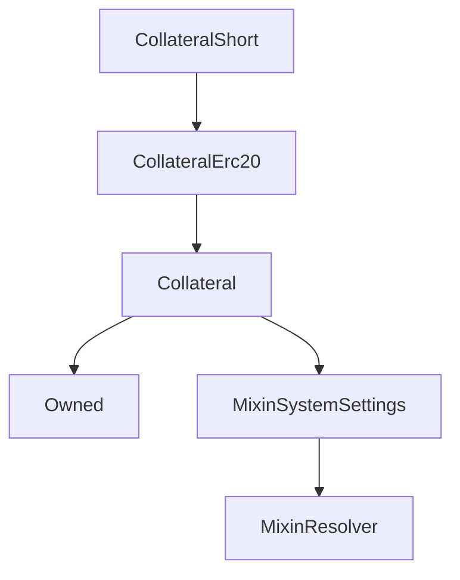

# CollateralShort

## Description

**Source:** [contracts/CollateralShort.sol](https://github.com/Synthetixio/synthetix/tree/v2.35.5/contracts/CollateralShort.sol)

## Architecture

### Inheritance Graph

## Constructor

### `constructor`

[Source](https://github.com/Synthetixio/synthetix/tree/v2.35.5/contracts/CollateralShort.sol#L13)

??? example "Details"

    **Signature**

    `(contract CollateralState _state, address _owner, address _manager, address _resolver, bytes32 _collateralKey, uint256 _minCratio, uint256 _minCollateral, address _underlyingContract, uint256 decimals)`

    **Visibility**

    `public`

    **State Mutability**

    `nonpayable`

## External Functions

### `getReward`

[Source](https://github.com/Synthetixio/synthetix/tree/v2.35.5/contracts/CollateralShort.sol#L50)

??? example "Details"

    **Signature**

    `getReward(bytes32 currency, address account)`

    **Visibility**

    `external`

    **State Mutability**

    `nonpayable`

### `open`

[Source](https://github.com/Synthetixio/synthetix/tree/v2.35.5/contracts/CollateralShort.sol#L38)

??? example "Details"

    **Signature**

    `open(uint256 collateral, uint256 amount, bytes32 currency)`

    **Visibility**

    `external`

    **State Mutability**

    `nonpayable`

    **Requires**

    * [require(..., Allowance not high enough)](https://github.com/Synthetixio/synthetix/tree/v2.35.5/contracts/CollateralShort.sol#L43)
