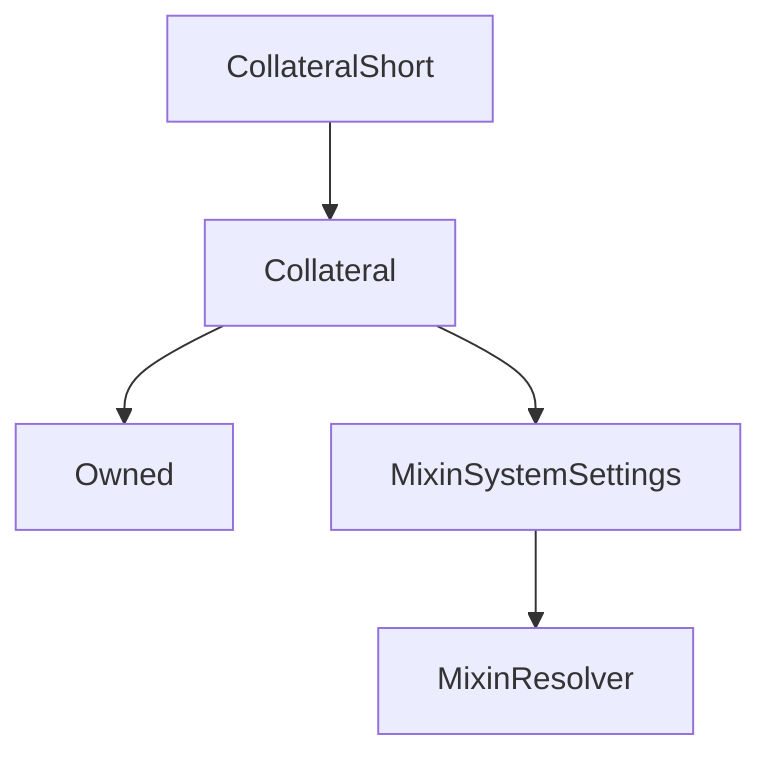

# CollateralShort

## Description

**Source:** [contracts/CollateralShort.sol](https://github.com/Synthetixio/synthetix/tree/v2.36.1/contracts/CollateralShort.sol)

## Architecture

### Inheritance Graph

## Constructor

### `constructor`

[Source](https://github.com/Synthetixio/synthetix/tree/v2.36.1/contracts/CollateralShort.sol#L13)

??? example "Details"

    **Signature**

    `(contract CollateralState _state, address _owner, address _manager, address _resolver, bytes32 _collateralKey, uint256 _minCratio, uint256 _minCollateral)`

    **Visibility**

    `public`

    **State Mutability**

    `nonpayable`

## External Functions

### `close`

[Source](https://github.com/Synthetixio/synthetix/tree/v2.36.1/contracts/CollateralShort.sol#L38)

??? example "Details"

    **Signature**

    `close(uint256 id)`

    **Visibility**

    `external`

    **State Mutability**

    `nonpayable`

### `deposit`

[Source](https://github.com/Synthetixio/synthetix/tree/v2.36.1/contracts/CollateralShort.sol#L44)

??? example "Details"

    **Signature**

    `deposit(address borrower, uint256 id, uint256 amount)`

    **Visibility**

    `external`

    **State Mutability**

    `nonpayable`

    **Requires**

    * [require(..., Allowance not high enough)](https://github.com/Synthetixio/synthetix/tree/v2.36.1/contracts/CollateralShort.sol#L49)

### `draw`

[Source](https://github.com/Synthetixio/synthetix/tree/v2.36.1/contracts/CollateralShort.sol#L70)

??? example "Details"

    **Signature**

    `draw(uint256 id, uint256 amount)`

    **Visibility**

    `external`

    **State Mutability**

    `nonpayable`

### `getReward`

[Source](https://github.com/Synthetixio/synthetix/tree/v2.36.1/contracts/CollateralShort.sol#L84)

??? example "Details"

    **Signature**

    `getReward(bytes32 currency, address account)`

    **Visibility**

    `external`

    **State Mutability**

    `nonpayable`

### `liquidate`

[Source](https://github.com/Synthetixio/synthetix/tree/v2.36.1/contracts/CollateralShort.sol#L74)

??? example "Details"

    **Signature**

    `liquidate(address borrower, uint256 id, uint256 amount)`

    **Visibility**

    `external`

    **State Mutability**

    `nonpayable`

### `open`

[Source](https://github.com/Synthetixio/synthetix/tree/v2.36.1/contracts/CollateralShort.sol#L23)

??? example "Details"

    **Signature**

    `open(uint256 collateral, uint256 amount, bytes32 currency)`

    **Visibility**

    `external`

    **State Mutability**

    `nonpayable`

    **Requires**

    * [require(..., Allowance not high enough)](https://github.com/Synthetixio/synthetix/tree/v2.36.1/contracts/CollateralShort.sol#L28)

### `repay`

[Source](https://github.com/Synthetixio/synthetix/tree/v2.36.1/contracts/CollateralShort.sol#L62)

??? example "Details"

    **Signature**

    `repay(address borrower, uint256 id, uint256 amount)`

    **Visibility**

    `external`

    **State Mutability**

    `nonpayable`

### `withdraw`

[Source](https://github.com/Synthetixio/synthetix/tree/v2.36.1/contracts/CollateralShort.sol#L56)

??? example "Details"

    **Signature**

    `withdraw(uint256 id, uint256 amount)`

    **Visibility**

    `external`

    **State Mutability**

    `nonpayable`
