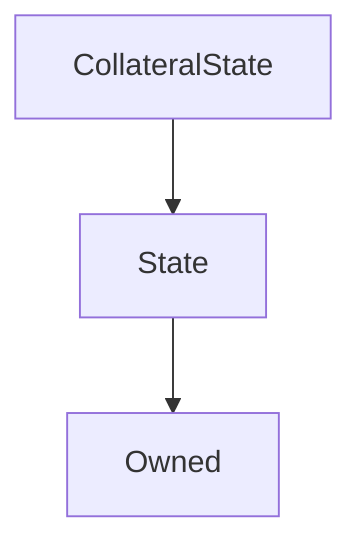

# CollateralState

## Description

**Source:** [contracts/CollateralState.sol](https://github.com/Synthetixio/synthetix/tree/v2.37.0/contracts/CollateralState.sol)

## Architecture

### Libraries

- [SafeMath](/contracts/source/libraries/SafeMath) for `uint`
- [SafeDecimalMath](/contracts/source/libraries/SafeDecimalMath) for `uint`

### Inheritance Graph

## Variables

### `loans`

[Source](https://github.com/Synthetixio/synthetix/tree/v2.37.0/contracts/CollateralState.sol#L18)

**Type:** `mapping(address => struct ICollateralLoan.Loan[])`

## Constructor

### `constructor`

[Source](https://github.com/Synthetixio/synthetix/tree/v2.37.0/contracts/CollateralState.sol#L20)

??? example "Details"

    **Signature**

    `(address _owner, address _associatedContract)`

    **Visibility**

    `public`

    **State Mutability**

    `nonpayable`

## Views

### `getLoan`

[Source](https://github.com/Synthetixio/synthetix/tree/v2.37.0/contracts/CollateralState.sol#L24)

??? example "Details"

    **Signature**

    `getLoan(address account, uint256 loanID) returns (struct ICollateralLoan.Loan)`

    **Visibility**

    `external`

    **State Mutability**

    `view`

### `getNumLoans`

[Source](https://github.com/Synthetixio/synthetix/tree/v2.37.0/contracts/CollateralState.sol#L33)

??? example "Details"

    **Signature**

    `getNumLoans(address account) returns (uint256)`

    **Visibility**

    `external`

    **State Mutability**

    `view`

## Restricted Functions

### `createLoan`

[Source](https://github.com/Synthetixio/synthetix/tree/v2.37.0/contracts/CollateralState.sol#L39)

??? example "Details"

    **Signature**

    `createLoan(struct ICollateralLoan.Loan loan)`

    **Visibility**

    `public`

    **State Mutability**

    `nonpayable`

    **Modifiers**

    * [onlyAssociatedContract](#onlyassociatedcontract)

### `updateLoan`

[Source](https://github.com/Synthetixio/synthetix/tree/v2.37.0/contracts/CollateralState.sol#L43)

??? example "Details"

    **Signature**

    `updateLoan(struct ICollateralLoan.Loan loan)`

    **Visibility**

    `public`

    **State Mutability**

    `nonpayable`

    **Modifiers**

    * [onlyAssociatedContract](#onlyassociatedcontract)
