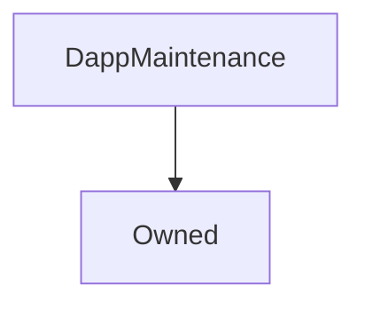

# DappMaintenance

## Description

**Source:** [contracts/DappMaintenance.sol](https://github.com/Synthetixio/synthetix/tree/v2.35.6/contracts/DappMaintenance.sol)

## Architecture

### Inheritance Graph

## Variables

### `isPausedSX`

[Source](https://github.com/Synthetixio/synthetix/tree/v2.35.6/contracts/DappMaintenance.sol#L16)

**Type:** `bool`

### `isPausedStaking`

[Source](https://github.com/Synthetixio/synthetix/tree/v2.35.6/contracts/DappMaintenance.sol#L15)

**Type:** `bool`

## Constructor

### `constructor`

[Source](https://github.com/Synthetixio/synthetix/tree/v2.35.6/contracts/DappMaintenance.sol#L21)

??? example "Details"

    **Signature**

    `(address _owner)`

    **Visibility**

    `public`

    **State Mutability**

    `nonpayable`

    **Requires**

    * [require(..., Owner address cannot be 0)](https://github.com/Synthetixio/synthetix/tree/v2.35.6/contracts/DappMaintenance.sol#L22)

    **Emits**

    * [OwnerChanged](#ownerchanged)

## Restricted Functions

### `setMaintenanceModeAll`

[Source](https://github.com/Synthetixio/synthetix/tree/v2.35.6/contracts/DappMaintenance.sol#L27)

??? example "Details"

    **Signature**

    `setMaintenanceModeAll(bool isPaused)`

    **Visibility**

    `external`

    **State Mutability**

    `nonpayable`

    **Modifiers**

    * [onlyOwner](#onlyowner)

    **Emits**

    * [StakingMaintenance](#stakingmaintenance)

    * [SXMaintenance](#sxmaintenance)

### `setMaintenanceModeSX`

[Source](https://github.com/Synthetixio/synthetix/tree/v2.35.6/contracts/DappMaintenance.sol#L39)

??? example "Details"

    **Signature**

    `setMaintenanceModeSX(bool isPaused)`

    **Visibility**

    `external`

    **State Mutability**

    `nonpayable`

    **Modifiers**

    * [onlyOwner](#onlyowner)

    **Emits**

    * [SXMaintenance](#sxmaintenance)

### `setMaintenanceModeStaking`

[Source](https://github.com/Synthetixio/synthetix/tree/v2.35.6/contracts/DappMaintenance.sol#L34)

??? example "Details"

    **Signature**

    `setMaintenanceModeStaking(bool isPaused)`

    **Visibility**

    `external`

    **State Mutability**

    `nonpayable`

    **Modifiers**

    * [onlyOwner](#onlyowner)

    **Emits**

    * [StakingMaintenance](#stakingmaintenance)

## Events

### `SXMaintenance`

[Source](https://github.com/Synthetixio/synthetix/tree/v2.35.6/contracts/DappMaintenance.sol#L45)

**Signature**: `SXMaintenance(bool isPaused)`

### `StakingMaintenance`

[Source](https://github.com/Synthetixio/synthetix/tree/v2.35.6/contracts/DappMaintenance.sol#L44)

**Signature**: `StakingMaintenance(bool isPaused)`
