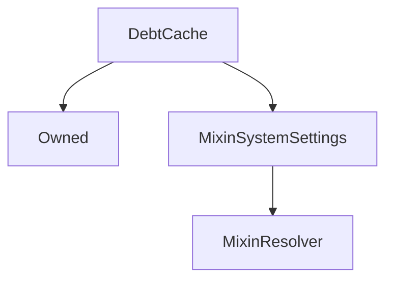

# DebtCache

## Description

**Source:** [contracts/DebtCache.sol](https://github.com/Synthetixio/synthetix/tree/v2.36.1/contracts/DebtCache.sol)

## Architecture

### Libraries

- [SafeMath](/contracts/source/libraries/SafeMath) for `uint`
- [SafeDecimalMath](/contracts/source/libraries/SafeDecimalMath) for `uint`

### Inheritance Graph

## Constructor

### `constructor`

[Source](https://github.com/Synthetixio/synthetix/tree/v2.36.1/contracts/DebtCache.sol#L48)

??? example "Details"

    **Signature**

    `(address _owner, address _resolver)`

    **Visibility**

    `public`

    **State Mutability**

    `nonpayable`

## Views

### `cacheInfo`

[Source](https://github.com/Synthetixio/synthetix/tree/v2.36.1/contracts/DebtCache.sol#L217)

??? example "Details"

    **Signature**

    `cacheInfo() returns (uint256, uint256, bool, bool)`

    **Visibility**

    `external`

    **State Mutability**

    `view`

### `cacheInvalid`

[Source](https://github.com/Synthetixio/synthetix/tree/v2.36.1/contracts/DebtCache.sol#L109)

??? example "Details"

    **Signature**

    `cacheInvalid() returns (bool)`

    **Visibility**

    `external`

    **State Mutability**

    `view`

### `cacheStale`

[Source](https://github.com/Synthetixio/synthetix/tree/v2.36.1/contracts/DebtCache.sol#L120)

??? example "Details"

    **Signature**

    `cacheStale() returns (bool)`

    **Visibility**

    `external`

    **State Mutability**

    `view`

### `cacheTimestamp`

[Source](https://github.com/Synthetixio/synthetix/tree/v2.36.1/contracts/DebtCache.sol#L105)

??? example "Details"

    **Signature**

    `cacheTimestamp() returns (uint256)`

    **Visibility**

    `external`

    **State Mutability**

    `view`

### `cachedDebt`

[Source](https://github.com/Synthetixio/synthetix/tree/v2.36.1/contracts/DebtCache.sol#L97)

??? example "Details"

    **Signature**

    `cachedDebt() returns (uint256)`

    **Visibility**

    `external`

    **State Mutability**

    `view`

### `cachedSynthDebt`

[Source](https://github.com/Synthetixio/synthetix/tree/v2.36.1/contracts/DebtCache.sol#L101)

??? example "Details"

    **Signature**

    `cachedSynthDebt(bytes32 currencyKey) returns (uint256)`

    **Visibility**

    `external`

    **State Mutability**

    `view`

### `cachedSynthDebts`

[Source](https://github.com/Synthetixio/synthetix/tree/v2.36.1/contracts/DebtCache.sol#L191)

??? example "Details"

    **Signature**

    `cachedSynthDebts(bytes32[] currencyKeys) returns (uint256[])`

    **Visibility**

    `external`

    **State Mutability**

    `view`

### `currentDebt`

[Source](https://github.com/Synthetixio/synthetix/tree/v2.36.1/contracts/DebtCache.sol#L213)

??? example "Details"

    **Signature**

    `currentDebt() returns (uint256, bool)`

    **Visibility**

    `external`

    **State Mutability**

    `view`

### `currentSynthDebts`

[Source](https://github.com/Synthetixio/synthetix/tree/v2.36.1/contracts/DebtCache.sol#L174)

??? example "Details"

    **Signature**

    `currentSynthDebts(bytes32[] currencyKeys) returns (uint256[], bool)`

    **Visibility**

    `external`

    **State Mutability**

    `view`

### `debtSnapshotStaleTime`

[Source](https://github.com/Synthetixio/synthetix/tree/v2.36.1/contracts/DebtCache.sol#L93)

??? example "Details"

    **Signature**

    `debtSnapshotStaleTime() returns (uint256)`

    **Visibility**

    `external`

    **State Mutability**

    `view`

### `resolverAddressesRequired`

[Source](https://github.com/Synthetixio/synthetix/tree/v2.36.1/contracts/DebtCache.sol#L52)

??? example "Details"

    **Signature**

    `resolverAddressesRequired() returns (bytes32[])`

    **Visibility**

    `public`

    **State Mutability**

    `view`

## Restricted Functions

### `purgeCachedSynthDebt`

[Source](https://github.com/Synthetixio/synthetix/tree/v2.36.1/contracts/DebtCache.sol#L234)

??? example "Details"

    **Signature**

    `purgeCachedSynthDebt(bytes32 currencyKey)`

    **Visibility**

    `external`

    **State Mutability**

    `nonpayable`

    **Requires**

    * [require(..., Synth exists)](https://github.com/Synthetixio/synthetix/tree/v2.36.1/contracts/DebtCache.sol#L235)

    **Modifiers**

    * [onlyOwner](#onlyowner)

### `updateCachedSynthDebtWithRate`

[Source](https://github.com/Synthetixio/synthetix/tree/v2.36.1/contracts/DebtCache.sol#L267)

??? example "Details"

    **Signature**

    `updateCachedSynthDebtWithRate(bytes32 currencyKey, uint256 currencyRate)`

    **Visibility**

    `external`

    **State Mutability**

    `nonpayable`

    **Modifiers**

    * [onlyIssuer](#onlyissuer)

### `updateCachedSynthDebtsWithRates`

[Source](https://github.com/Synthetixio/synthetix/tree/v2.36.1/contracts/DebtCache.sol#L275)

??? example "Details"

    **Signature**

    `updateCachedSynthDebtsWithRates(bytes32[] currencyKeys, uint256[] currencyRates)`

    **Visibility**

    `external`

    **State Mutability**

    `nonpayable`

    **Modifiers**

    * [onlyIssuerOrExchanger](#onlyissuerorexchanger)

### `updateDebtCacheValidity`

[Source](https://github.com/Synthetixio/synthetix/tree/v2.36.1/contracts/DebtCache.sol#L282)

??? example "Details"

    **Signature**

    `updateDebtCacheValidity(bool currentlyInvalid)`

    **Visibility**

    `external`

    **State Mutability**

    `nonpayable`

    **Modifiers**

    * [onlyIssuer](#onlyissuer)

## Internal Functions

### `_cacheStale`

[Source](https://github.com/Synthetixio/synthetix/tree/v2.36.1/contracts/DebtCache.sol#L113)

??? example "Details"

    **Signature**

    `_cacheStale(uint256 timestamp) returns (bool)`

    **Visibility**

    `internal`

    **State Mutability**

    `view`

### `_cachedSynthDebts`

[Source](https://github.com/Synthetixio/synthetix/tree/v2.36.1/contracts/DebtCache.sol#L182)

??? example "Details"

    **Signature**

    `_cachedSynthDebts(bytes32[] currencyKeys) returns (uint256[])`

    **Visibility**

    `internal`

    **State Mutability**

    `view`

### `_currentDebt`

[Source](https://github.com/Synthetixio/synthetix/tree/v2.36.1/contracts/DebtCache.sol#L195)

??? example "Details"

    **Signature**

    `_currentDebt() returns (uint256, bool)`

    **Visibility**

    `internal`

    **State Mutability**

    `view`

### `_currentSynthDebts`

[Source](https://github.com/Synthetixio/synthetix/tree/v2.36.1/contracts/DebtCache.sol#L165)

??? example "Details"

    **Signature**

    `_currentSynthDebts(bytes32[] currencyKeys) returns (uint256[], bool)`

    **Visibility**

    `internal`

    **State Mutability**

    `view`

### `_issuedSynthValues`

[Source](https://github.com/Synthetixio/synthetix/tree/v2.36.1/contracts/DebtCache.sol#L124)

??? example "Details"

    **Signature**

    `_issuedSynthValues(bytes32[] currencyKeys, uint256[] rates) returns (uint256[])`

    **Visibility**

    `internal`

    **State Mutability**

    `view`

### `_onlyIssuer`

[Source](https://github.com/Synthetixio/synthetix/tree/v2.36.1/contracts/DebtCache.sol#L346)

??? example "Details"

    **Signature**

    `_onlyIssuer()`

    **Visibility**

    `internal`

    **State Mutability**

    `view`

    **Requires**

    * [require(..., Sender is not Issuer)](https://github.com/Synthetixio/synthetix/tree/v2.36.1/contracts/DebtCache.sol#L347)

### `_onlyIssuerOrExchanger`

[Source](https://github.com/Synthetixio/synthetix/tree/v2.36.1/contracts/DebtCache.sol#L355)

??? example "Details"

    **Signature**

    `_onlyIssuerOrExchanger()`

    **Visibility**

    `internal`

    **State Mutability**

    `view`

    **Requires**

    * [require(..., Sender is not Issuer or Exchanger)](https://github.com/Synthetixio/synthetix/tree/v2.36.1/contracts/DebtCache.sol#L356)

### `_requireSystemActiveIfNotOwner`

[Source](https://github.com/Synthetixio/synthetix/tree/v2.36.1/contracts/DebtCache.sol#L335)

??? example "Details"

    **Signature**

    `_requireSystemActiveIfNotOwner()`

    **Visibility**

    `internal`

    **State Mutability**

    `view`

### `_updateCachedSynthDebtsWithRates`

[Source](https://github.com/Synthetixio/synthetix/tree/v2.36.1/contracts/DebtCache.sol#L295)

??? example "Details"

    **Signature**

    `_updateCachedSynthDebtsWithRates(bytes32[] currencyKeys, uint256[] currentRates, bool anyRateIsInvalid)`

    **Visibility**

    `internal`

    **State Mutability**

    `nonpayable`

    **Requires**

    * [require(..., Input array lengths differ)](https://github.com/Synthetixio/synthetix/tree/v2.36.1/contracts/DebtCache.sol#L301)

### `_updateDebtCacheValidity`

[Source](https://github.com/Synthetixio/synthetix/tree/v2.36.1/contracts/DebtCache.sol#L288)

??? example "Details"

    **Signature**

    `_updateDebtCacheValidity(bool currentlyInvalid)`

    **Visibility**

    `internal`

    **State Mutability**

    `nonpayable`

### `collateralManager`

[Source](https://github.com/Synthetixio/synthetix/tree/v2.36.1/contracts/DebtCache.sol#L89)

??? example "Details"

    **Signature**

    `collateralManager() returns (contract ICollateralManager)`

    **Visibility**

    `internal`

    **State Mutability**

    `view`

### `etherCollateral`

[Source](https://github.com/Synthetixio/synthetix/tree/v2.36.1/contracts/DebtCache.sol#L81)

??? example "Details"

    **Signature**

    `etherCollateral() returns (contract IEtherCollateral)`

    **Visibility**

    `internal`

    **State Mutability**

    `view`

### `etherCollateralsUSD`

[Source](https://github.com/Synthetixio/synthetix/tree/v2.36.1/contracts/DebtCache.sol#L85)

??? example "Details"

    **Signature**

    `etherCollateralsUSD() returns (contract IEtherCollateralsUSD)`

    **Visibility**

    `internal`

    **State Mutability**

    `view`

### `exchangeRates`

[Source](https://github.com/Synthetixio/synthetix/tree/v2.36.1/contracts/DebtCache.sol#L73)

??? example "Details"

    **Signature**

    `exchangeRates() returns (contract IExchangeRates)`

    **Visibility**

    `internal`

    **State Mutability**

    `view`

### `exchanger`

[Source](https://github.com/Synthetixio/synthetix/tree/v2.36.1/contracts/DebtCache.sol#L69)

??? example "Details"

    **Signature**

    `exchanger() returns (contract IExchanger)`

    **Visibility**

    `internal`

    **State Mutability**

    `view`

### `issuer`

[Source](https://github.com/Synthetixio/synthetix/tree/v2.36.1/contracts/DebtCache.sol#L65)

??? example "Details"

    **Signature**

    `issuer() returns (contract IIssuer)`

    **Visibility**

    `internal`

    **State Mutability**

    `view`

### `systemStatus`

[Source](https://github.com/Synthetixio/synthetix/tree/v2.36.1/contracts/DebtCache.sol#L77)

??? example "Details"

    **Signature**

    `systemStatus() returns (contract ISystemStatus)`

    **Visibility**

    `internal`

    **State Mutability**

    `view`

## External Functions

### `takeDebtSnapshot`

[Source](https://github.com/Synthetixio/synthetix/tree/v2.36.1/contracts/DebtCache.sol#L239)

??? example "Details"

    **Signature**

    `takeDebtSnapshot()`

    **Visibility**

    `external`

    **State Mutability**

    `nonpayable`

    **Modifiers**

    * [requireSystemActiveIfNotOwner](#requiresystemactiveifnotowner)

    **Emits**

    * [DebtCacheUpdated](#debtcacheupdated)

    * [DebtCacheSnapshotTaken](#debtcachesnapshottaken)

### `updateCachedSynthDebts`

[Source](https://github.com/Synthetixio/synthetix/tree/v2.36.1/contracts/DebtCache.sol#L262)

??? example "Details"

    **Signature**

    `updateCachedSynthDebts(bytes32[] currencyKeys)`

    **Visibility**

    `external`

    **State Mutability**

    `nonpayable`

    **Modifiers**

    * [requireSystemActiveIfNotOwner](#requiresystemactiveifnotowner)

## Modifiers

### `onlyIssuer`

[Source](https://github.com/Synthetixio/synthetix/tree/v2.36.1/contracts/DebtCache.sol#L350)

### `onlyIssuerOrExchanger`

[Source](https://github.com/Synthetixio/synthetix/tree/v2.36.1/contracts/DebtCache.sol#L359)

### `requireSystemActiveIfNotOwner`

[Source](https://github.com/Synthetixio/synthetix/tree/v2.36.1/contracts/DebtCache.sol#L341)

## Events

### `DebtCacheSnapshotTaken`

[Source](https://github.com/Synthetixio/synthetix/tree/v2.36.1/contracts/DebtCache.sol#L367)

**Signature**: `DebtCacheSnapshotTaken(uint256 timestamp)`

### `DebtCacheUpdated`

[Source](https://github.com/Synthetixio/synthetix/tree/v2.36.1/contracts/DebtCache.sol#L366)

**Signature**: `DebtCacheUpdated(uint256 cachedDebt)`

### `DebtCacheValidityChanged`

[Source](https://github.com/Synthetixio/synthetix/tree/v2.36.1/contracts/DebtCache.sol#L368)

**Signature**: `DebtCacheValidityChanged(bool isInvalid)`
