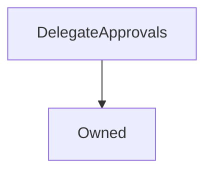

# DelegateApprovals

## Description

Implemented in [SIP 10: Upgrade Delegate Powers](https://sips.synthetix.io/sips/sip-10) & [SIP 14: Allow delegation of Synthetix Exchange function to another address](https://sips.synthetix.io/sips/sip-14)

This contract is used by [`FeePool`](FeePool.md), [`Synthetix`](Synthetix.md), to enable SNX holders (the delegator) to permit other addresses (the delegate) to perform actions on their befhalf including;

1. Claim fees & rewards for them,
2. Burn Synths on behalf or Burn to Target c-ratio on behalf
3. Issue or IssueMax Synths on behalf
4. Exchange Synths

In Synthetix this was intended to allow mobile or hot wallets such as metamask to claim fees for a cold storage wallet which can be done via the [delegatr mobile dapp](https://delegatr.synthetix.io/)

In principle it is generic, as the approver just marks a number of delegates as authorised to perform some action on their behalf, with no reference to what that action is, or who the delegates are.

[User guide to delegation](https://blog.synthetix.io/a-guide-to-delegation/)

**Source:** [contracts/DelegateApprovals.sol](https://github.com/Synthetixio/synthetix/tree/v2.30.0-beta/contracts/DelegateApprovals.sol)

## Architecture

### Inheritance Graph

### Related Contracts

<centered-image>
    
</centered-image>

??? example "Details"

    * [`FeePool`](FeePool.md): This contract allows the fee pool to delegate fee withdrawals.

    * [`Synthetix`](Synthetix.md): This contract allows Synthetix to delegate issuing Synths, Burning Synths and exchanging Synths.

## Constants

### `APPROVE_ALL`

[Source](https://github.com/Synthetixio/synthetix/tree/v2.30.0-beta/contracts/DelegateApprovals.sol#L17)

**Type:** `bytes32`

### `BURN_FOR_ADDRESS`

[Source](https://github.com/Synthetixio/synthetix/tree/v2.30.0-beta/contracts/DelegateApprovals.sol#L13)

**Type:** `bytes32`

### `CLAIM_FOR_ADDRESS`

[Source](https://github.com/Synthetixio/synthetix/tree/v2.30.0-beta/contracts/DelegateApprovals.sol#L15)

**Type:** `bytes32`

### `EXCHANGE_FOR_ADDRESS`

[Source](https://github.com/Synthetixio/synthetix/tree/v2.30.0-beta/contracts/DelegateApprovals.sol#L16)

**Type:** `bytes32`

### `ISSUE_FOR_ADDRESS`

[Source](https://github.com/Synthetixio/synthetix/tree/v2.30.0-beta/contracts/DelegateApprovals.sol#L14)

**Type:** `bytes32`

## Variables

### `eternalStorage`

[Source](https://github.com/Synthetixio/synthetix/tree/v2.30.0-beta/contracts/DelegateApprovals.sol#L28)

**Type:** `contract EternalStorage`

## Constructor

### `constructor`

[Source](https://github.com/Synthetixio/synthetix/tree/v2.30.0-beta/contracts/DelegateApprovals.sol#L30)

Initialises the inherited [`State`](State.md) instance.

??? example "Details"

    **Signature**

    `(address _owner, contract EternalStorage _eternalStorage)`

    **Visibility**

    `public`

    **State Mutability**

    `nonpayable`

## Views

### `approvedAll`

[Source](https://github.com/Synthetixio/synthetix/tree/v2.30.0-beta/contracts/DelegateApprovals.sol#L64)

??? example "Details"

    **Signature**

    `approvedAll(address authoriser, address delegate) returns (bool)`

    **Visibility**

    `public`

    **State Mutability**

    `view`

### `canBurnFor`

[Source](https://github.com/Synthetixio/synthetix/tree/v2.30.0-beta/contracts/DelegateApprovals.sol#L48)

??? example "Details"

    **Signature**

    `canBurnFor(address authoriser, address delegate) returns (bool)`

    **Visibility**

    `external`

    **State Mutability**

    `view`

### `canClaimFor`

[Source](https://github.com/Synthetixio/synthetix/tree/v2.30.0-beta/contracts/DelegateApprovals.sol#L56)

??? example "Details"

    **Signature**

    `canClaimFor(address authoriser, address delegate) returns (bool)`

    **Visibility**

    `external`

    **State Mutability**

    `view`

### `canExchangeFor`

[Source](https://github.com/Synthetixio/synthetix/tree/v2.30.0-beta/contracts/DelegateApprovals.sol#L60)

??? example "Details"

    **Signature**

    `canExchangeFor(address authoriser, address delegate) returns (bool)`

    **Visibility**

    `external`

    **State Mutability**

    `view`

### `canIssueFor`

[Source](https://github.com/Synthetixio/synthetix/tree/v2.30.0-beta/contracts/DelegateApprovals.sol#L52)

??? example "Details"

    **Signature**

    `canIssueFor(address authoriser, address delegate) returns (bool)`

    **Visibility**

    `external`

    **State Mutability**

    `view`

## Restricted Functions

### `setEternalStorage`

[Source](https://github.com/Synthetixio/synthetix/tree/v2.30.0-beta/contracts/DelegateApprovals.sol#L153)

??? example "Details"

    **Signature**

    `setEternalStorage(contract EternalStorage _eternalStorage)`

    **Visibility**

    `external`

    **State Mutability**

    `nonpayable`

    **Requires**

    * [require(..., Can't set eternalStorage to address(0))](https://github.com/Synthetixio/synthetix/tree/v2.30.0-beta/contracts/DelegateApprovals.sol#L154)

    **Modifiers**

    * [onlyOwner](#onlyowner)

    **Emits**

    * [EternalStorageUpdated](#eternalstorageupdated)

## Internal Functions

### `_checkApproval`

[Source](https://github.com/Synthetixio/synthetix/tree/v2.30.0-beta/contracts/DelegateApprovals.sol#L71)

??? example "Details"

    **Signature**

    `_checkApproval(bytes32 action, address authoriser, address delegate) returns (bool)`

    **Visibility**

    `internal`

    **State Mutability**

    `view`

### `_getKey`

[Source](https://github.com/Synthetixio/synthetix/tree/v2.30.0-beta/contracts/DelegateApprovals.sol#L39)

??? example "Details"

    **Signature**

    `_getKey(bytes32 _action, address _authoriser, address _delegate) returns (bytes32)`

    **Visibility**

    `internal`

    **State Mutability**

    `pure`

### `_setApproval`

[Source](https://github.com/Synthetixio/synthetix/tree/v2.30.0-beta/contracts/DelegateApprovals.sol#L131)

??? example "Details"

    **Signature**

    `_setApproval(bytes32 action, address authoriser, address delegate)`

    **Visibility**

    `internal`

    **State Mutability**

    `nonpayable`

    **Requires**

    * [require(..., Can't delegate to address(0))](https://github.com/Synthetixio/synthetix/tree/v2.30.0-beta/contracts/DelegateApprovals.sol#L136)

    **Emits**

    * [Approval](#approval)

### `_withdrawApproval`

[Source](https://github.com/Synthetixio/synthetix/tree/v2.30.0-beta/contracts/DelegateApprovals.sol#L141)

??? example "Details"

    **Signature**

    `_withdrawApproval(bytes32 action, address authoriser, address delegate)`

    **Visibility**

    `internal`

    **State Mutability**

    `nonpayable`

## External Functions

### `approveAllDelegatePowers`

[Source](https://github.com/Synthetixio/synthetix/tree/v2.30.0-beta/contracts/DelegateApprovals.sol#L84)

??? example "Details"

    **Signature**

    `approveAllDelegatePowers(address delegate)`

    **Visibility**

    `external`

    **State Mutability**

    `nonpayable`

### `approveBurnOnBehalf`

[Source](https://github.com/Synthetixio/synthetix/tree/v2.30.0-beta/contracts/DelegateApprovals.sol#L96)

??? example "Details"

    **Signature**

    `approveBurnOnBehalf(address delegate)`

    **Visibility**

    `external`

    **State Mutability**

    `nonpayable`

### `approveClaimOnBehalf`

[Source](https://github.com/Synthetixio/synthetix/tree/v2.30.0-beta/contracts/DelegateApprovals.sol#L114)

??? example "Details"

    **Signature**

    `approveClaimOnBehalf(address delegate)`

    **Visibility**

    `external`

    **State Mutability**

    `nonpayable`

### `approveExchangeOnBehalf`

[Source](https://github.com/Synthetixio/synthetix/tree/v2.30.0-beta/contracts/DelegateApprovals.sol#L123)

??? example "Details"

    **Signature**

    `approveExchangeOnBehalf(address delegate)`

    **Visibility**

    `external`

    **State Mutability**

    `nonpayable`

### `approveIssueOnBehalf`

[Source](https://github.com/Synthetixio/synthetix/tree/v2.30.0-beta/contracts/DelegateApprovals.sol#L105)

??? example "Details"

    **Signature**

    `approveIssueOnBehalf(address delegate)`

    **Visibility**

    `external`

    **State Mutability**

    `nonpayable`

### `removeAllDelegatePowers`

[Source](https://github.com/Synthetixio/synthetix/tree/v2.30.0-beta/contracts/DelegateApprovals.sol#L89)

??? example "Details"

    **Signature**

    `removeAllDelegatePowers(address delegate)`

    **Visibility**

    `external`

    **State Mutability**

    `nonpayable`

### `removeBurnOnBehalf`

[Source](https://github.com/Synthetixio/synthetix/tree/v2.30.0-beta/contracts/DelegateApprovals.sol#L100)

??? example "Details"

    **Signature**

    `removeBurnOnBehalf(address delegate)`

    **Visibility**

    `external`

    **State Mutability**

    `nonpayable`

### `removeClaimOnBehalf`

[Source](https://github.com/Synthetixio/synthetix/tree/v2.30.0-beta/contracts/DelegateApprovals.sol#L118)

??? example "Details"

    **Signature**

    `removeClaimOnBehalf(address delegate)`

    **Visibility**

    `external`

    **State Mutability**

    `nonpayable`

### `removeExchangeOnBehalf`

[Source](https://github.com/Synthetixio/synthetix/tree/v2.30.0-beta/contracts/DelegateApprovals.sol#L127)

??? example "Details"

    **Signature**

    `removeExchangeOnBehalf(address delegate)`

    **Visibility**

    `external`

    **State Mutability**

    `nonpayable`

### `removeIssueOnBehalf`

[Source](https://github.com/Synthetixio/synthetix/tree/v2.30.0-beta/contracts/DelegateApprovals.sol#L109)

??? example "Details"

    **Signature**

    `removeIssueOnBehalf(address delegate)`

    **Visibility**

    `external`

    **State Mutability**

    `nonpayable`

## Events

### `Approval`

[Source](https://github.com/Synthetixio/synthetix/tree/v2.30.0-beta/contracts/DelegateApprovals.sol#L160)

The delegate was approved to act on the authoriser's behalf for the given action.

**Signature**: `Approval(address authoriser, address delegate, bytes32 action)`

### `EternalStorageUpdated`

[Source](https://github.com/Synthetixio/synthetix/tree/v2.30.0-beta/contracts/DelegateApprovals.sol#L162)

The address of the eternal storage contract has changed.

**Signature**: `EternalStorageUpdated(address newEternalStorage)`

### `WithdrawApproval`

[Source](https://github.com/Synthetixio/synthetix/tree/v2.30.0-beta/contracts/DelegateApprovals.sol#L161)

The delegate was disapproved to act on the authoriser's behalf.

**Signature**: `WithdrawApproval(address authoriser, address delegate, bytes32 action)`
