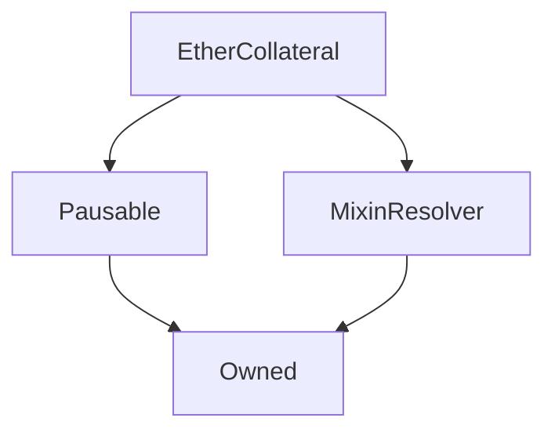

# EtherCollateral

## Description

Implemented in [SIP 35: Skinny Ether Collateral](https://sips.synthetix.io/sips/sip-35)

Beyond the fact that many people in the Ethereum community asked for ETH to be introduced as collateral, there are many positive implications for adding it to the system. Firstly, it makes it easier for a newcomer to start trading on Synthetix.Exchange. If they have ETH, they can try it out without selling their ETH for Synths.

Adding Ether as collateral also contributes to the Synth supply, and thus trading fees, while diversifying the collateral. This increases the system’s scalability while also protecting it from potential SNX price shocks, without diluting the value of SNX.

This was an understandable concern from SNX stakers once the community began discussing adding ETH — that it would need to be implemented in a way that didn’t dilute the value of SNX. in this model, ETH stakers don’t receive fees or rewards as they take no risk for the debt pool.

By locking collateral, ETH stakers will create a debt they need to repay if they want to withdraw their ETH and leave the system. This is similar to the debt that SNX stakers create when they lock their SNX as collateral, but the difference is that ETH stakers will not take on risk of debt pool fluctuations. In other words, ETH stakers are not participating in the ‘pooled debt’ aspect of the system — their debt will be denominated in ETH, and will be the same when they leave as when they enter.

For example, if Alice locks 150 ETH as collateral, she can borrow 100 sETH. Even if she uses that sETH to make a series of trades that allow her to increase that 100 sETH to 200 sETH, she only needs to pay back 100 sETH to unstake her 150 ETH. That profit is instead added to the SNX stakers’ pooled debt (see page 2 of the litepaper for more details). Of course, because they do not take on the same risk as SNX stakers, ETH stakers do not receive sUSD trading fees or SNX staking rewards.

The final few details you should know are that the minting fee and interest rate paid by ETH stakers is also paid to SNX stakers and the minimum position size is 1 ETH. At the end of the three month trial period, all outstanding loans must be paid back. There will be a one week grace period, after which anyone will be able to send sETH to close the position and claim the outstanding ETH.

**Source:** [contracts/EtherCollateral.sol](https://github.com/Synthetixio/synthetix/tree/v2.24.1/contracts/EtherCollateral.sol)

## Architecture

### Libraries

- [SafeMath](/contracts/source/libraries/SafeMath) for `uint256`
- [SafeDecimalMath](/contracts/source/libraries/SafeDecimalMath) for `uint256`

### Inheritance Graph

### Related Contracts

- [MultiCollateralSynth](MultiCollateralSynth.md)

## Structs

### `SynthLoanStruct`

[Source](https://github.com/Synthetixio/synthetix/tree/v2.24.1/contracts/EtherCollateral.sol#L75)

| Field              | Type      | Description                          |
| ------------------ | --------- | ------------------------------------ |
| `account`          | `address` | Address of the loan creator          |
| `collateralAmount` | `uint256` | Amount of ETH locked as collateral   |
| `loanAmount`       | `uint256` | Amount of sETH issued for the loan   |
| `timeCreated`      | `uint256` | Timestamp of the loan creation       |
| `loanID`           | `uint256` | Unique ID number of the loan         |
| `timeClosed`       | `uint256` | Timestamp of when the loan is closed |

## Variables

### `accountLoanLimit`

[Source](https://github.com/Synthetixio/synthetix/tree/v2.24.1/contracts/EtherCollateral.sol#L55)

**Type:** `uint256`

### `accountOpenLoanCounter`

[Source](https://github.com/Synthetixio/synthetix/tree/v2.24.1/contracts/EtherCollateral.sol#L94)

**Type:** `mapping(address => uint256)`

### `accountsSynthLoans`

[Source](https://github.com/Synthetixio/synthetix/tree/v2.24.1/contracts/EtherCollateral.sol#L91)

**Type:** `mapping(address => struct EtherCollateral.SynthLoanStruct[])`

### `collateralizationRatio`

[Source](https://github.com/Synthetixio/synthetix/tree/v2.24.1/contracts/EtherCollateral.sol#L39)

**Type:** `uint256`

### `interestPerSecond`

[Source](https://github.com/Synthetixio/synthetix/tree/v2.24.1/contracts/EtherCollateral.sol#L43)

**Type:** `uint256`

### `interestRate`

[Source](https://github.com/Synthetixio/synthetix/tree/v2.24.1/contracts/EtherCollateral.sol#L42)

**Type:** `uint256`

### `issueFeeRate`

[Source](https://github.com/Synthetixio/synthetix/tree/v2.24.1/contracts/EtherCollateral.sol#L46)

**Type:** `uint256`

### `issueLimit`

[Source](https://github.com/Synthetixio/synthetix/tree/v2.24.1/contracts/EtherCollateral.sol#L49)

**Type:** `uint256`

### `liquidationDeadline`

[Source](https://github.com/Synthetixio/synthetix/tree/v2.24.1/contracts/EtherCollateral.sol#L61)

**Type:** `uint256`

### `loanLiquidationOpen`

[Source](https://github.com/Synthetixio/synthetix/tree/v2.24.1/contracts/EtherCollateral.sol#L58)

**Type:** `bool`

### `minLoanSize`

[Source](https://github.com/Synthetixio/synthetix/tree/v2.24.1/contracts/EtherCollateral.sol#L52)

**Type:** `uint256`

### `totalIssuedSynths`

[Source](https://github.com/Synthetixio/synthetix/tree/v2.24.1/contracts/EtherCollateral.sol#L66)

**Type:** `uint256`

### `totalLoansCreated`

[Source](https://github.com/Synthetixio/synthetix/tree/v2.24.1/contracts/EtherCollateral.sol#L69)

**Type:** `uint256`

### `totalOpenLoanCount`

[Source](https://github.com/Synthetixio/synthetix/tree/v2.24.1/contracts/EtherCollateral.sol#L72)

**Type:** `uint256`

## Constructor

### `constructor`

[Source](https://github.com/Synthetixio/synthetix/tree/v2.24.1/contracts/EtherCollateral.sol#L113)

??? example "Details"

    **Signature**

    `(address _owner, address _resolver)`

    **Visibility**

    `public`

    **State Mutability**

    `nonpayable`

## Views

### `accruedInterestOnLoan`

[Source](https://github.com/Synthetixio/synthetix/tree/v2.24.1/contracts/EtherCollateral.sol#L227)

??? example "Details"

    **Signature**

    `accruedInterestOnLoan(uint256 _loanAmount, uint256 _seconds) returns (uint256)`

    **Visibility**

    `public`

    **State Mutability**

    `view`

### `calculateMintingFee`

[Source](https://github.com/Synthetixio/synthetix/tree/v2.24.1/contracts/EtherCollateral.sol#L233)

??? example "Details"

    **Signature**

    `calculateMintingFee(address _account, uint256 _loanID) returns (uint256)`

    **Visibility**

    `external`

    **State Mutability**

    `view`

### `collateralAmountForLoan`

[Source](https://github.com/Synthetixio/synthetix/tree/v2.24.1/contracts/EtherCollateral.sol#L216)

??? example "Details"

    **Signature**

    `collateralAmountForLoan(uint256 loanAmount) returns (uint256)`

    **Visibility**

    `external`

    **State Mutability**

    `view`

### `currentInterestOnLoan`

[Source](https://github.com/Synthetixio/synthetix/tree/v2.24.1/contracts/EtherCollateral.sol#L220)

??? example "Details"

    **Signature**

    `currentInterestOnLoan(address _account, uint256 _loanID) returns (uint256)`

    **Visibility**

    `external`

    **State Mutability**

    `view`

### `getContractInfo`

[Source](https://github.com/Synthetixio/synthetix/tree/v2.24.1/contracts/EtherCollateral.sol#L169)

??? example "Details"

    **Signature**

    `getContractInfo() returns (uint256, uint256, uint256, uint256, uint256, uint256, uint256, uint256, uint256, uint256, uint256, uint256, bool)`

    **Visibility**

    `external`

    **State Mutability**

    `view`

### `getLoan`

[Source](https://github.com/Synthetixio/synthetix/tree/v2.24.1/contracts/EtherCollateral.sol#L262)

??? example "Details"

    **Signature**

    `getLoan(address _account, uint256 _loanID) returns (address, uint256, uint256, uint256, uint256, uint256, uint256, uint256)`

    **Visibility**

    `external`

    **State Mutability**

    `view`

### `issuanceRatio`

[Source](https://github.com/Synthetixio/synthetix/tree/v2.24.1/contracts/EtherCollateral.sol#L206)

??? example "Details"

    **Signature**

    `issuanceRatio() returns (uint256)`

    **Visibility**

    `public`

    **State Mutability**

    `view`

### `loanAmountFromCollateral`

[Source](https://github.com/Synthetixio/synthetix/tree/v2.24.1/contracts/EtherCollateral.sol#L212)

??? example "Details"

    **Signature**

    `loanAmountFromCollateral(uint256 collateralAmount) returns (uint256)`

    **Visibility**

    `public`

    **State Mutability**

    `view`

### `loanLifeSpan`

[Source](https://github.com/Synthetixio/synthetix/tree/v2.24.1/contracts/EtherCollateral.sol#L287)

??? example "Details"

    **Signature**

    `loanLifeSpan(address _account, uint256 _loanID) returns (uint256)`

    **Visibility**

    `external`

    **State Mutability**

    `view`

### `openLoanIDsByAccount`

[Source](https://github.com/Synthetixio/synthetix/tree/v2.24.1/contracts/EtherCollateral.sol#L239)

??? example "Details"

    **Signature**

    `openLoanIDsByAccount(address _account) returns (uint256[])`

    **Visibility**

    `external`

    **State Mutability**

    `view`

## Restricted Functions

### `setAccountLoanLimit`

[Source](https://github.com/Synthetixio/synthetix/tree/v2.24.1/contracts/EtherCollateral.sol#L154)

??? example "Details"

    **Signature**

    `setAccountLoanLimit(uint256 _loanLimit)`

    **Visibility**

    `external`

    **State Mutability**

    `nonpayable`

    **Requires**

    * [require(..., Owner cannot set higher than HARD_CAP)](https://github.com/Synthetixio/synthetix/tree/v2.24.1/contracts/EtherCollateral.sol#L156)

    **Modifiers**

    * [onlyOwner](#onlyowner)

    **Emits**

    * [AccountLoanLimitUpdated](#accountloanlimitupdated)

### `setCollateralizationRatio`

[Source](https://github.com/Synthetixio/synthetix/tree/v2.24.1/contracts/EtherCollateral.sol#L124)

??? example "Details"

    **Signature**

    `setCollateralizationRatio(uint256 ratio)`

    **Visibility**

    `external`

    **State Mutability**

    `nonpayable`

    **Requires**

    * [require(..., Too high)](https://github.com/Synthetixio/synthetix/tree/v2.24.1/contracts/EtherCollateral.sol#L125)

    * [require(..., Too low)](https://github.com/Synthetixio/synthetix/tree/v2.24.1/contracts/EtherCollateral.sol#L126)

    **Modifiers**

    * [onlyOwner](#onlyowner)

    **Emits**

    * [CollateralizationRatioUpdated](#collateralizationratioupdated)

### `setInterestRate`

[Source](https://github.com/Synthetixio/synthetix/tree/v2.24.1/contracts/EtherCollateral.sol#L131)

??? example "Details"

    **Signature**

    `setInterestRate(uint256 _interestRate)`

    **Visibility**

    `external`

    **State Mutability**

    `nonpayable`

    **Requires**

    * [require(..., Interest rate cannot be less that the SECONDS_IN_A_YEAR)](https://github.com/Synthetixio/synthetix/tree/v2.24.1/contracts/EtherCollateral.sol#L132)

    * [require(..., Interest cannot be more than 100% APR)](https://github.com/Synthetixio/synthetix/tree/v2.24.1/contracts/EtherCollateral.sol#L133)

    **Modifiers**

    * [onlyOwner](#onlyowner)

    **Emits**

    * [InterestRateUpdated](#interestrateupdated)

### `setIssueFeeRate`

[Source](https://github.com/Synthetixio/synthetix/tree/v2.24.1/contracts/EtherCollateral.sol#L139)

??? example "Details"

    **Signature**

    `setIssueFeeRate(uint256 _issueFeeRate)`

    **Visibility**

    `external`

    **State Mutability**

    `nonpayable`

    **Modifiers**

    * [onlyOwner](#onlyowner)

    **Emits**

    * [IssueFeeRateUpdated](#issuefeerateupdated)

### `setIssueLimit`

[Source](https://github.com/Synthetixio/synthetix/tree/v2.24.1/contracts/EtherCollateral.sol#L144)

??? example "Details"

    **Signature**

    `setIssueLimit(uint256 _issueLimit)`

    **Visibility**

    `external`

    **State Mutability**

    `nonpayable`

    **Modifiers**

    * [onlyOwner](#onlyowner)

    **Emits**

    * [IssueLimitUpdated](#issuelimitupdated)

### `setLoanLiquidationOpen`

[Source](https://github.com/Synthetixio/synthetix/tree/v2.24.1/contracts/EtherCollateral.sol#L161)

??? example "Details"

    **Signature**

    `setLoanLiquidationOpen(bool _loanLiquidationOpen)`

    **Visibility**

    `external`

    **State Mutability**

    `nonpayable`

    **Requires**

    * [require(..., Before liquidation deadline)](https://github.com/Synthetixio/synthetix/tree/v2.24.1/contracts/EtherCollateral.sol#L162)

    **Modifiers**

    * [onlyOwner](#onlyowner)

    **Emits**

    * [LoanLiquidationOpenUpdated](#loanliquidationopenupdated)

### `setMinLoanSize`

[Source](https://github.com/Synthetixio/synthetix/tree/v2.24.1/contracts/EtherCollateral.sol#L149)

??? example "Details"

    **Signature**

    `setMinLoanSize(uint256 _minLoanSize)`

    **Visibility**

    `external`

    **State Mutability**

    `nonpayable`

    **Modifiers**

    * [onlyOwner](#onlyowner)

    **Emits**

    * [MinLoanSizeUpdated](#minloansizeupdated)

## Internal Functions

### `depot`

[Source](https://github.com/Synthetixio/synthetix/tree/v2.24.1/contracts/EtherCollateral.sol#L454)

??? example "Details"

    **Signature**

    `depot() returns (contract IDepot)`

    **Visibility**

    `internal`

    **State Mutability**

    `view`

### `exchangeRates`

[Source](https://github.com/Synthetixio/synthetix/tree/v2.24.1/contracts/EtherCollateral.sol#L458)

??? example "Details"

    **Signature**

    `exchangeRates() returns (contract IExchangeRates)`

    **Visibility**

    `internal`

    **State Mutability**

    `view`

### `synthsETH`

[Source](https://github.com/Synthetixio/synthetix/tree/v2.24.1/contracts/EtherCollateral.sol#L446)

??? example "Details"

    **Signature**

    `synthsETH() returns (contract ISynth)`

    **Visibility**

    `internal`

    **State Mutability**

    `view`

### `synthsUSD`

[Source](https://github.com/Synthetixio/synthetix/tree/v2.24.1/contracts/EtherCollateral.sol#L450)

??? example "Details"

    **Signature**

    `synthsUSD() returns (contract ISynth)`

    **Visibility**

    `internal`

    **State Mutability**

    `view`

### `systemStatus`

[Source](https://github.com/Synthetixio/synthetix/tree/v2.24.1/contracts/EtherCollateral.sol#L442)

??? example "Details"

    **Signature**

    `systemStatus() returns (contract ISystemStatus)`

    **Visibility**

    `internal`

    **State Mutability**

    `view`

## External Functions

### `closeLoan`

[Source](https://github.com/Synthetixio/synthetix/tree/v2.24.1/contracts/EtherCollateral.sol#L338)

??? example "Details"

    **Signature**

    `closeLoan(uint256 loanID)`

    **Visibility**

    `external`

    **State Mutability**

    `nonpayable`

    **Modifiers**

    * [nonReentrant](#nonreentrant)

    * [sETHRateNotStale](#sethratenotstale)

### `liquidateUnclosedLoan`

[Source](https://github.com/Synthetixio/synthetix/tree/v2.24.1/contracts/EtherCollateral.sol#L343)

??? example "Details"

    **Signature**

    `liquidateUnclosedLoan(address _loanCreatorsAddress, uint256 _loanID)`

    **Visibility**

    `external`

    **State Mutability**

    `nonpayable`

    **Requires**

    * [require(..., Liquidation is not open)](https://github.com/Synthetixio/synthetix/tree/v2.24.1/contracts/EtherCollateral.sol#L344)

    **Modifiers**

    * [nonReentrant](#nonreentrant)

    * [sETHRateNotStale](#sethratenotstale)

    **Emits**

    * [LoanLiquidated](#loanliquidated)

### `openLoan`

[Source](https://github.com/Synthetixio/synthetix/tree/v2.24.1/contracts/EtherCollateral.sol#L294)

??? example "Details"

    **Signature**

    `openLoan() returns (uint256)`

    **Visibility**

    `external`

    **State Mutability**

    `payable`

    **Requires**

    * [require(..., Not enough ETH to create this loan. Please see the minLoanSize)](https://github.com/Synthetixio/synthetix/tree/v2.24.1/contracts/EtherCollateral.sol#L298)

    * [require(..., Loans are now being liquidated)](https://github.com/Synthetixio/synthetix/tree/v2.24.1/contracts/EtherCollateral.sol#L301)

    * [require(..., Each account is limted to 50 loans)](https://github.com/Synthetixio/synthetix/tree/v2.24.1/contracts/EtherCollateral.sol#L304)

    * [require(..., Loan Amount exceeds the supply cap.)](https://github.com/Synthetixio/synthetix/tree/v2.24.1/contracts/EtherCollateral.sol#L310)

    **Modifiers**

    * [notPaused](#notpaused)

    * [nonReentrant](#nonreentrant)

    * [sETHRateNotStale](#sethratenotstale)

    **Emits**

    * [LoanCreated](#loancreated)

## Modifiers

### `sETHRateNotStale`

[Source](https://github.com/Synthetixio/synthetix/tree/v2.24.1/contracts/EtherCollateral.sol#L464)

## Events

### `AccountLoanLimitUpdated`

[Source](https://github.com/Synthetixio/synthetix/tree/v2.24.1/contracts/EtherCollateral.sol#L476)

**Signature**: `AccountLoanLimitUpdated(uint256 loanLimit)`

### `CollateralizationRatioUpdated`

[Source](https://github.com/Synthetixio/synthetix/tree/v2.24.1/contracts/EtherCollateral.sol#L471)

**Signature**: `CollateralizationRatioUpdated(uint256 ratio)`

### `InterestRateUpdated`

[Source](https://github.com/Synthetixio/synthetix/tree/v2.24.1/contracts/EtherCollateral.sol#L472)

**Signature**: `InterestRateUpdated(uint256 interestRate)`

### `IssueFeeRateUpdated`

[Source](https://github.com/Synthetixio/synthetix/tree/v2.24.1/contracts/EtherCollateral.sol#L473)

**Signature**: `IssueFeeRateUpdated(uint256 issueFeeRate)`

### `IssueLimitUpdated`

[Source](https://github.com/Synthetixio/synthetix/tree/v2.24.1/contracts/EtherCollateral.sol#L474)

**Signature**: `IssueLimitUpdated(uint256 issueLimit)`

### `LoanClosed`

[Source](https://github.com/Synthetixio/synthetix/tree/v2.24.1/contracts/EtherCollateral.sol#L479)

**Signature**: `LoanClosed(address account, uint256 loanID, uint256 feesPaid)`

### `LoanCreated`

[Source](https://github.com/Synthetixio/synthetix/tree/v2.24.1/contracts/EtherCollateral.sol#L478)

**Signature**: `LoanCreated(address account, uint256 loanID, uint256 amount)`

### `LoanLiquidated`

[Source](https://github.com/Synthetixio/synthetix/tree/v2.24.1/contracts/EtherCollateral.sol#L480)

**Signature**: `LoanLiquidated(address account, uint256 loanID, address liquidator)`

### `LoanLiquidationOpenUpdated`

[Source](https://github.com/Synthetixio/synthetix/tree/v2.24.1/contracts/EtherCollateral.sol#L477)

**Signature**: `LoanLiquidationOpenUpdated(bool loanLiquidationOpen)`

### `MinLoanSizeUpdated`

[Source](https://github.com/Synthetixio/synthetix/tree/v2.24.1/contracts/EtherCollateral.sol#L475)

**Signature**: `MinLoanSizeUpdated(uint256 minLoanSize)`
