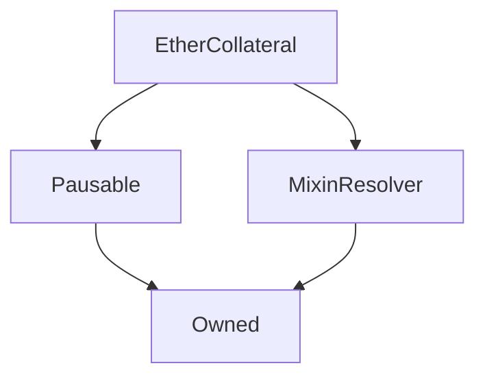

# EtherCollateral

## Description

... todo.

**Source:** [contracts/EtherCollateral.sol](https://github.com/Synthetixio/synthetix/tree/v2.21.15/contracts/EtherCollateral.sol)

## Architecture

### Libraries

- [SafeMath](/contracts/source/libraries/SafeMath) for `uint256`
- [SafeDecimalMath](/contracts/source/libraries/SafeDecimalMath) for `uint256`

### Inheritance Graph

### Related Contracts

- ?

## Structs

### `SynthLoanStruct`

[Source](https://github.com/Synthetixio/synthetix/tree/v2.21.15/contracts/EtherCollateral.sol#L74)

| Field              | Type      | Description |
| ------------------ | --------- | ----------- |
| `account`          | `address` | TBA         |
| `collateralAmount` | `uint256` | TBA         |
| `loanAmount`       | `uint256` | TBA         |
| `timeCreated`      | `uint256` | TBA         |
| `loanID`           | `uint256` | TBA         |
| `timeClosed`       | `uint256` | TBA         |

## Variables

### `accountLoanLimit`

[Source](https://github.com/Synthetixio/synthetix/tree/v2.21.15/contracts/EtherCollateral.sol#L54)

**Type:** `uint256`

### `accountOpenLoanCounter`

[Source](https://github.com/Synthetixio/synthetix/tree/v2.21.15/contracts/EtherCollateral.sol#L93)

**Type:** `mapping(address => uint256)`

### `accountsSynthLoans`

[Source](https://github.com/Synthetixio/synthetix/tree/v2.21.15/contracts/EtherCollateral.sol#L90)

**Type:** `mapping(address => struct EtherCollateral.SynthLoanStruct[])`

### `collateralizationRatio`

[Source](https://github.com/Synthetixio/synthetix/tree/v2.21.15/contracts/EtherCollateral.sol#L38)

**Type:** `uint256`

### `interestPerSecond`

[Source](https://github.com/Synthetixio/synthetix/tree/v2.21.15/contracts/EtherCollateral.sol#L42)

**Type:** `uint256`

### `interestRate`

[Source](https://github.com/Synthetixio/synthetix/tree/v2.21.15/contracts/EtherCollateral.sol#L41)

**Type:** `uint256`

### `issueFeeRate`

[Source](https://github.com/Synthetixio/synthetix/tree/v2.21.15/contracts/EtherCollateral.sol#L45)

**Type:** `uint256`

### `issueLimit`

[Source](https://github.com/Synthetixio/synthetix/tree/v2.21.15/contracts/EtherCollateral.sol#L48)

**Type:** `uint256`

### `liquidationDeadline`

[Source](https://github.com/Synthetixio/synthetix/tree/v2.21.15/contracts/EtherCollateral.sol#L60)

**Type:** `uint256`

### `loanLiquidationOpen`

[Source](https://github.com/Synthetixio/synthetix/tree/v2.21.15/contracts/EtherCollateral.sol#L57)

**Type:** `bool`

### `minLoanSize`

[Source](https://github.com/Synthetixio/synthetix/tree/v2.21.15/contracts/EtherCollateral.sol#L51)

**Type:** `uint256`

### `totalIssuedSynths`

[Source](https://github.com/Synthetixio/synthetix/tree/v2.21.15/contracts/EtherCollateral.sol#L65)

**Type:** `uint256`

### `totalLoansCreated`

[Source](https://github.com/Synthetixio/synthetix/tree/v2.21.15/contracts/EtherCollateral.sol#L68)

**Type:** `uint256`

### `totalOpenLoanCount`

[Source](https://github.com/Synthetixio/synthetix/tree/v2.21.15/contracts/EtherCollateral.sol#L71)

**Type:** `uint256`

## Constructor

### `constructor`

[Source](https://github.com/Synthetixio/synthetix/tree/v2.21.15/contracts/EtherCollateral.sol#L105)

??? example "Details"

    **Signature**

    `(address _owner, address _resolver)`

    **Visibility**

    `public`

    **State Mutability**

    `nonpayable`

## Views

### `accruedInterestOnLoan`

[Source](https://github.com/Synthetixio/synthetix/tree/v2.21.15/contracts/EtherCollateral.sol#L219)

??? example "Details"

    **Signature**

    `accruedInterestOnLoan(uint256 _loanAmount, uint256 _seconds)`

    **Visibility**

    `public`

    **State Mutability**

    `view`

### `calculateMintingFee`

[Source](https://github.com/Synthetixio/synthetix/tree/v2.21.15/contracts/EtherCollateral.sol#L225)

??? example "Details"

    **Signature**

    `calculateMintingFee(address _account, uint256 _loanID)`

    **Visibility**

    `external`

    **State Mutability**

    `view`

### `collateralAmountForLoan`

[Source](https://github.com/Synthetixio/synthetix/tree/v2.21.15/contracts/EtherCollateral.sol#L208)

??? example "Details"

    **Signature**

    `collateralAmountForLoan(uint256 loanAmount)`

    **Visibility**

    `external`

    **State Mutability**

    `view`

### `currentInterestOnLoan`

[Source](https://github.com/Synthetixio/synthetix/tree/v2.21.15/contracts/EtherCollateral.sol#L212)

??? example "Details"

    **Signature**

    `currentInterestOnLoan(address _account, uint256 _loanID)`

    **Visibility**

    `external`

    **State Mutability**

    `view`

### `getContractInfo`

[Source](https://github.com/Synthetixio/synthetix/tree/v2.21.15/contracts/EtherCollateral.sol#L161)

??? example "Details"

    **Signature**

    `getContractInfo()`

    **Visibility**

    `external`

    **State Mutability**

    `view`

### `getLoan`

[Source](https://github.com/Synthetixio/synthetix/tree/v2.21.15/contracts/EtherCollateral.sol#L254)

??? example "Details"

    **Signature**

    `getLoan(address _account, uint256 _loanID)`

    **Visibility**

    `external`

    **State Mutability**

    `view`

### `issuanceRatio`

[Source](https://github.com/Synthetixio/synthetix/tree/v2.21.15/contracts/EtherCollateral.sol#L198)

??? example "Details"

    **Signature**

    `issuanceRatio()`

    **Visibility**

    `public`

    **State Mutability**

    `view`

### `loanAmountFromCollateral`

[Source](https://github.com/Synthetixio/synthetix/tree/v2.21.15/contracts/EtherCollateral.sol#L204)

??? example "Details"

    **Signature**

    `loanAmountFromCollateral(uint256 collateralAmount)`

    **Visibility**

    `public`

    **State Mutability**

    `view`

### `loanLifeSpan`

[Source](https://github.com/Synthetixio/synthetix/tree/v2.21.15/contracts/EtherCollateral.sol#L279)

??? example "Details"

    **Signature**

    `loanLifeSpan(address _account, uint256 _loanID)`

    **Visibility**

    `external`

    **State Mutability**

    `view`

### `openLoanIDsByAccount`

[Source](https://github.com/Synthetixio/synthetix/tree/v2.21.15/contracts/EtherCollateral.sol#L231)

??? example "Details"

    **Signature**

    `openLoanIDsByAccount(address _account)`

    **Visibility**

    `external`

    **State Mutability**

    `view`

## Restricted Functions

### `setAccountLoanLimit`

[Source](https://github.com/Synthetixio/synthetix/tree/v2.21.15/contracts/EtherCollateral.sol#L146)

??? example "Details"

    **Signature**

    `setAccountLoanLimit(uint256 _loanLimit)`

    **Visibility**

    `external`

    **State Mutability**

    `nonpayable`

    **Requires**

    * [require(..., Owner cannot set higher than HARD_CAP)](https://github.com/Synthetixio/synthetix/tree/v2.21.15/contracts/EtherCollateral.sol#L148)

    **Modifiers**

    * [onlyOwner](#onlyowner)

    **Emits**

    * [AccountLoanLimitUpdated](#accountloanlimitupdated)

### `setCollateralizationRatio`

[Source](https://github.com/Synthetixio/synthetix/tree/v2.21.15/contracts/EtherCollateral.sol#L116)

??? example "Details"

    **Signature**

    `setCollateralizationRatio(uint256 ratio)`

    **Visibility**

    `external`

    **State Mutability**

    `nonpayable`

    **Requires**

    * [require(..., Too high)](https://github.com/Synthetixio/synthetix/tree/v2.21.15/contracts/EtherCollateral.sol#L117)

    * [require(..., Too low)](https://github.com/Synthetixio/synthetix/tree/v2.21.15/contracts/EtherCollateral.sol#L118)

    **Modifiers**

    * [onlyOwner](#onlyowner)

    **Emits**

    * [CollateralizationRatioUpdated](#collateralizationratioupdated)

### `setInterestRate`

[Source](https://github.com/Synthetixio/synthetix/tree/v2.21.15/contracts/EtherCollateral.sol#L123)

??? example "Details"

    **Signature**

    `setInterestRate(uint256 _interestRate)`

    **Visibility**

    `external`

    **State Mutability**

    `nonpayable`

    **Requires**

    * [require(..., Interest rate cannot be less that the SECONDS_IN_A_YEAR)](https://github.com/Synthetixio/synthetix/tree/v2.21.15/contracts/EtherCollateral.sol#L124)

    * [require(..., Interest cannot be more than 100% APR)](https://github.com/Synthetixio/synthetix/tree/v2.21.15/contracts/EtherCollateral.sol#L125)

    **Modifiers**

    * [onlyOwner](#onlyowner)

    **Emits**

    * [InterestRateUpdated](#interestrateupdated)

### `setIssueFeeRate`

[Source](https://github.com/Synthetixio/synthetix/tree/v2.21.15/contracts/EtherCollateral.sol#L131)

??? example "Details"

    **Signature**

    `setIssueFeeRate(uint256 _issueFeeRate)`

    **Visibility**

    `external`

    **State Mutability**

    `nonpayable`

    **Modifiers**

    * [onlyOwner](#onlyowner)

    **Emits**

    * [IssueFeeRateUpdated](#issuefeerateupdated)

### `setIssueLimit`

[Source](https://github.com/Synthetixio/synthetix/tree/v2.21.15/contracts/EtherCollateral.sol#L136)

??? example "Details"

    **Signature**

    `setIssueLimit(uint256 _issueLimit)`

    **Visibility**

    `external`

    **State Mutability**

    `nonpayable`

    **Modifiers**

    * [onlyOwner](#onlyowner)

    **Emits**

    * [IssueLimitUpdated](#issuelimitupdated)

### `setLoanLiquidationOpen`

[Source](https://github.com/Synthetixio/synthetix/tree/v2.21.15/contracts/EtherCollateral.sol#L153)

??? example "Details"

    **Signature**

    `setLoanLiquidationOpen(bool _loanLiquidationOpen)`

    **Visibility**

    `external`

    **State Mutability**

    `nonpayable`

    **Requires**

    * [require(..., Before liquidation deadline)](https://github.com/Synthetixio/synthetix/tree/v2.21.15/contracts/EtherCollateral.sol#L154)

    **Modifiers**

    * [onlyOwner](#onlyowner)

    **Emits**

    * [LoanLiquidationOpenUpdated](#loanliquidationopenupdated)

### `setMinLoanSize`

[Source](https://github.com/Synthetixio/synthetix/tree/v2.21.15/contracts/EtherCollateral.sol#L141)

??? example "Details"

    **Signature**

    `setMinLoanSize(uint256 _minLoanSize)`

    **Visibility**

    `external`

    **State Mutability**

    `nonpayable`

    **Modifiers**

    * [onlyOwner](#onlyowner)

    **Emits**

    * [MinLoanSizeUpdated](#minloansizeupdated)

## Internal Functions

### `depot`

[Source](https://github.com/Synthetixio/synthetix/tree/v2.21.15/contracts/EtherCollateral.sol#L446)

??? example "Details"

    **Signature**

    `depot()`

    **Visibility**

    `internal`

    **State Mutability**

    `view`

### `synthsETH`

[Source](https://github.com/Synthetixio/synthetix/tree/v2.21.15/contracts/EtherCollateral.sol#L438)

??? example "Details"

    **Signature**

    `synthsETH()`

    **Visibility**

    `internal`

    **State Mutability**

    `view`

### `synthsUSD`

[Source](https://github.com/Synthetixio/synthetix/tree/v2.21.15/contracts/EtherCollateral.sol#L442)

??? example "Details"

    **Signature**

    `synthsUSD()`

    **Visibility**

    `internal`

    **State Mutability**

    `view`

### `systemStatus`

[Source](https://github.com/Synthetixio/synthetix/tree/v2.21.15/contracts/EtherCollateral.sol#L434)

??? example "Details"

    **Signature**

    `systemStatus()`

    **Visibility**

    `internal`

    **State Mutability**

    `view`

## External Functions

### `closeLoan`

[Source](https://github.com/Synthetixio/synthetix/tree/v2.21.15/contracts/EtherCollateral.sol#L330)

??? example "Details"

    **Signature**

    `closeLoan(uint256 loanID)`

    **Visibility**

    `external`

    **State Mutability**

    `nonpayable`

    **Modifiers**

    * [nonReentrant](#nonreentrant)

### `liquidateUnclosedLoan`

[Source](https://github.com/Synthetixio/synthetix/tree/v2.21.15/contracts/EtherCollateral.sol#L335)

??? example "Details"

    **Signature**

    `liquidateUnclosedLoan(address _loanCreatorsAddress, uint256 _loanID)`

    **Visibility**

    `external`

    **State Mutability**

    `nonpayable`

    **Requires**

    * [require(..., Liquidation is not open)](https://github.com/Synthetixio/synthetix/tree/v2.21.15/contracts/EtherCollateral.sol#L336)

    **Modifiers**

    * [nonReentrant](#nonreentrant)

    **Emits**

    * [LoanLiquidated](#loanliquidated)

### `openLoan`

[Source](https://github.com/Synthetixio/synthetix/tree/v2.21.15/contracts/EtherCollateral.sol#L286)

??? example "Details"

    **Signature**

    `openLoan()`

    **Visibility**

    `external`

    **State Mutability**

    `payable`

    **Requires**

    * [require(..., Not enough ETH to create this loan. Please see the minLoanSize)](https://github.com/Synthetixio/synthetix/tree/v2.21.15/contracts/EtherCollateral.sol#L290)

    * [require(..., Loans are now being liquidated)](https://github.com/Synthetixio/synthetix/tree/v2.21.15/contracts/EtherCollateral.sol#L293)

    * [require(..., Each account is limted to 50 loans)](https://github.com/Synthetixio/synthetix/tree/v2.21.15/contracts/EtherCollateral.sol#L296)

    * [require(..., Loan Amount exceeds the supply cap.)](https://github.com/Synthetixio/synthetix/tree/v2.21.15/contracts/EtherCollateral.sol#L302)

    **Modifiers**

    * [notPaused](#notpaused)

    * [nonReentrant](#nonreentrant)

    **Emits**

    * [LoanCreated](#loancreated)

## Events

### `AccountLoanLimitUpdated`

[Source](https://github.com/Synthetixio/synthetix/tree/v2.21.15/contracts/EtherCollateral.sol#L457)

**Signature**: `AccountLoanLimitUpdated(uint256 loanLimit)`

### `CollateralizationRatioUpdated`

[Source](https://github.com/Synthetixio/synthetix/tree/v2.21.15/contracts/EtherCollateral.sol#L452)

**Signature**: `CollateralizationRatioUpdated(uint256 ratio)`

### `InterestRateUpdated`

[Source](https://github.com/Synthetixio/synthetix/tree/v2.21.15/contracts/EtherCollateral.sol#L453)

**Signature**: `InterestRateUpdated(uint256 interestRate)`

### `IssueFeeRateUpdated`

[Source](https://github.com/Synthetixio/synthetix/tree/v2.21.15/contracts/EtherCollateral.sol#L454)

**Signature**: `IssueFeeRateUpdated(uint256 issueFeeRate)`

### `IssueLimitUpdated`

[Source](https://github.com/Synthetixio/synthetix/tree/v2.21.15/contracts/EtherCollateral.sol#L455)

**Signature**: `IssueLimitUpdated(uint256 issueLimit)`

### `LoanClosed`

[Source](https://github.com/Synthetixio/synthetix/tree/v2.21.15/contracts/EtherCollateral.sol#L460)

**Signature**: `LoanClosed(address account, uint256 loanID, uint256 feesPaid)`

### `LoanCreated`

[Source](https://github.com/Synthetixio/synthetix/tree/v2.21.15/contracts/EtherCollateral.sol#L459)

**Signature**: `LoanCreated(address account, uint256 loanID, uint256 amount)`

### `LoanLiquidated`

[Source](https://github.com/Synthetixio/synthetix/tree/v2.21.15/contracts/EtherCollateral.sol#L461)

**Signature**: `LoanLiquidated(address account, uint256 loanID, address liquidator)`

### `LoanLiquidationOpenUpdated`

[Source](https://github.com/Synthetixio/synthetix/tree/v2.21.15/contracts/EtherCollateral.sol#L458)

**Signature**: `LoanLiquidationOpenUpdated(bool loanLiquidationOpen)`

### `MinLoanSizeUpdated`

[Source](https://github.com/Synthetixio/synthetix/tree/v2.21.15/contracts/EtherCollateral.sol#L456)

**Signature**: `MinLoanSizeUpdated(uint256 minLoanSize)`
